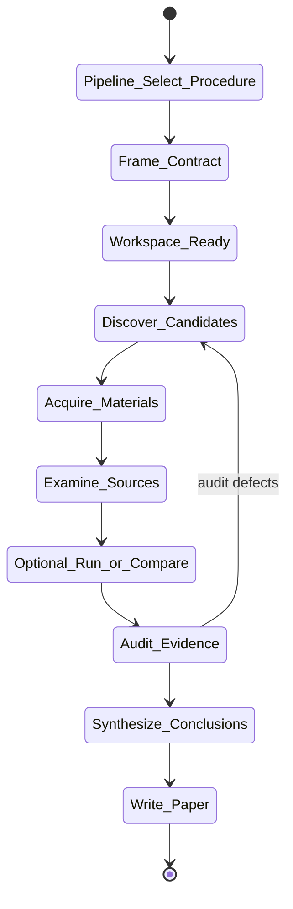
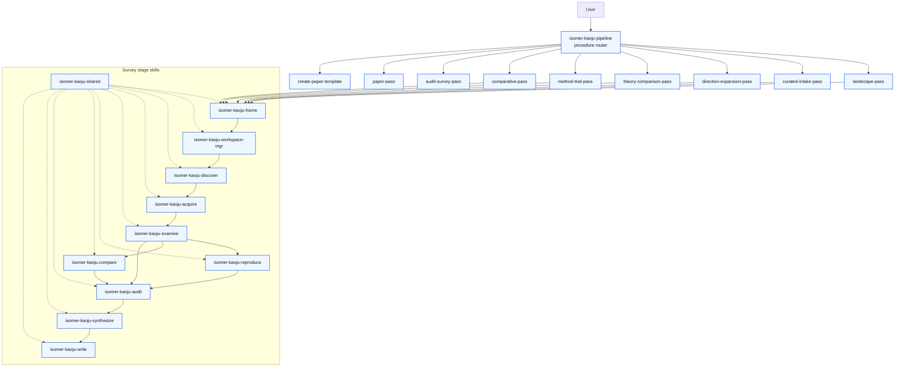

# Kaoju Research Skills Suite Analysis

Source skill: [src/isomer_labs/assets/system_skills/research-paradigm/kaoju/README.md](../../../src/isomer_labs/assets/system_skills/research-paradigm/kaoju/README.md)

Parent skill: none (suite-level analysis)

Report unit: entrypoint

Role: Evidence-led survey extension for Isomer Labs

Purpose: Define how an evidence-led survey is framed, discovered, acquired, examined, audited, synthesized, and written into a publication-facing paper.

## Per-Part Reports

- [kaoju-pipeline.md](kaoju-pipeline.md): Public procedure router and macro orchestrator.
- [kaoju-frame.md](kaoju-frame.md): Survey Contract and Comparison Intent Document freezing.
- [kaoju-workspace-mgr.md](kaoju-workspace-mgr.md): Topic Workspace readiness and binding index.
- [kaoju-shared.md](kaoju-shared.md): Evidence, identity, lineage, and terminal-status contracts.
- [kaoju-discover.md](kaoju-discover.md): Field discovery and curated intake.
- [kaoju-acquire.md](kaoju-acquire.md): Governed material acquisition and dataset registration.
- [kaoju-examine.md](kaoju-examine.md): Full-text/source inspection and Source Digests.
- [kaoju-reproduce.md](kaoju-reproduce.md): Single-method trials and capability probes.
- [kaoju-compare.md](kaoju-compare.md): Theory comparison and controlled empirical comparison.
- [kaoju-audit.md](kaoju-audit.md): Coverage, identity, provenance, and fairness audit.
- [kaoju-synthesize.md](kaoju-synthesize.md): Field Summary, Claim Status Table, and Kaoju Dossier.
- [kaoju-write.md](kaoju-write.md): Manuscript, build, validation, and publication bundle.

## Workflow Overview

The Kaoju suite separates survey work into bounded stages. The pipeline entrypoint selects one procedure; each procedure invokes the stage skills in a fixed order and requires an audit before synthesis. Paper writing happens only after accepted audit and synthesis records exist.

## Step Explanation

| Step | Meaning | Evidence |
| --- | --- | --- |
| `Pipeline_Select_Procedure` | Choose one of nine public procedures based on user intent. | `isomer-kaoju-pipeline/SKILL.md` subcommand table |
| `Frame_Contract` | Freeze the Survey Contract or Comparison Intent Document before execution. | `isomer-kaoju-frame/SKILL.md` workflow step 5 |
| `Workspace_Ready` | Check Topic Workspace readiness, binding index, and dataset posture. | `isomer-kaoju-workspace-mgr/SKILL.md` workflow steps 3–7 |
| `Discover_Candidates` | Find and select version-aware works across five source classes. | `isomer-kaoju-discover/SKILL.md` workflow steps 3–5 |
| `Acquire_Materials` | Pin immutable identities and acquire needed materials. | `isomer-kaoju-acquire/SKILL.md` workflow steps 3–6 |
| `Examine_Sources` | Inspect sources at exact locators and produce Source Digests. | `isomer-kaoju-examine/SKILL.md` workflow steps 3–5 |
| `Optional_Run_or_Compare` | Run a single-method trial or controlled comparison when required. | `isomer-kaoju-reproduce/SKILL.md`, `isomer-kaoju-compare/SKILL.md` |
| `Audit_Evidence` | Diagnose coverage, identity, provenance, and fairness before synthesis. | `isomer-kaoju-audit/SKILL.md` workflow steps 3–6 |
| `Synthesize_Conclusions` | Write Field Summary, Claim Status Table, and Kaoju Dossier from accepted evidence. | `isomer-kaoju-synthesize/SKILL.md` workflow steps 3–5 |
| `Write_Paper` | Transform audited synthesis into a LaTeX manuscript and publication bundle. | `isomer-kaoju-write/SKILL.md` workflow steps 3–8 |

## Durable Outputs

| Artifact | Path or Destination | Triggering Step | Evidence | Certainty |
| --- | --- | --- | --- | --- |
| Survey Contract / Comparison Intent | `kaoju:survey-contract` / `kaoju:comparison-intent` | Frame_Contract | `isomer-kaoju-frame/SKILL.md` | Explicit |
| Workspace Readiness Artifact | `kaoju:workspace-readiness` | Workspace_Ready | `isomer-kaoju-workspace-mgr/SKILL.md` | Explicit |
| Binding Index | `kaoju:binding-index` | Workspace_Ready | `isomer-kaoju-workspace-mgr/SKILL.md` | Explicit |
| Discovery Ledger | `kaoju:discovery-ledger` | Discover_Candidates | `isomer-kaoju-discover/SKILL.md` | Explicit |
| Related-Work Catalog / delta | `kaoju:related-work-catalog` | Synthesize_Conclusions | `isomer-kaoju-synthesize/SKILL.md` | Explicit |
| Source Digests | `kaoju:source-digest` | Examine_Sources | `isomer-kaoju-examine/SKILL.md` | Explicit |
| Claim-Evidence Ledger | `kaoju:claim-evidence-ledger` | Examine_Sources | `isomer-kaoju-examine/SKILL.md` | Explicit |
| Audit Report | `kaoju:audit-report` | Audit_Evidence | `isomer-kaoju-audit/SKILL.md` | Explicit |
| Field Summary | `kaoju:field-summary` | Synthesize_Conclusions | `isomer-kaoju-synthesize/SKILL.md` | Explicit |
| Claim Status Table | `kaoju:claim-status-table` | Synthesize_Conclusions | `isomer-kaoju-synthesize/SKILL.md` | Explicit |
| Kaoju Dossier | `kaoju:kaoju-dossier` | Synthesize_Conclusions | `isomer-kaoju-synthesize/SKILL.md` | Explicit |
| Paper Contract | `kaoju:paper-contract` | Write_Paper | `isomer-kaoju-write/SKILL.md` | Explicit |
| Survey Manuscript (.tex tree) | `kaoju:survey-manuscript` | Write_Paper | `isomer-kaoju-write/SKILL.md` | Explicit |
| Build Run record | `kaoju:paper-build-run` | Write_Paper | `isomer-kaoju-write/SKILL.md` | Explicit |
| Validation Report | `kaoju:paper-validation-report` | Write_Paper | `isomer-kaoju-write/SKILL.md` | Explicit |
| Publication Bundle | `kaoju:publication-bundle` | Write_Paper | `isomer-kaoju-write/SKILL.md` | Explicit |

## Skill Routing Callgraph

## Inner Workings

The Kaoju suite is organized as a pipeline of single-responsibility stage skills plus a public router. `isomer-kaoju-pipeline` exposes nine procedures and two helper managers; each procedure is a bounded recipe that calls stage skills in order. The router never chains procedures autonomously: it returns a terminal report after one pass and lets the caller decide the next move.

Every stage skill begins and ends with `project skill-callbacks resolve` calls, reads `isomer-kaoju-shared` for contracts, and writes canonical managed records with exact semantic ids such as `kaoju:survey-contract`, `kaoju:audit-report`, and `kaoju:publication-bundle`. The records are stored as structured JSON payloads under `topic.records.artifacts` rather than ad-hoc Markdown files.

The survey process enforces two hard boundaries. First, an audit must accept the evidence before synthesis can run. Second, paper writing requires an accepted Audit Report plus the exact synthesis records named in the paper contract. These boundaries prevent a compiled PDF from being mistaken for verified evidence.

Paper writing is split into contract locking, manuscript drafting, Tectonic-first building, validation, and bundle assembly. The writer produces `.tex` source, not Markdown-to-PDF, and validation checks structural, citation, survey-quality, and visual criteria in addition to compilation success.

## Key Constraints

- Audit must accept evidence before synthesis (`isomer-kaoju-pipeline/SKILL.md` step 7).
- Paper-pass requires accepted Audit Report and accepted synthesis records (`isomer-kaoju-write/SKILL.md` step 1).
- One procedure per user intent; do not autonomously chain passes (`isomer-kaoju-pipeline/SKILL.md` Foundational Principle).
- Writing communicates accepted evidence; it does not repair or invent evidence (`isomer-kaoju-write/SKILL.md` Foundational Principle).
- Generated-data capability probes never become reproduction evidence (`isomer-kaoju-shared/SKILL.md` Evidence Invariants).
