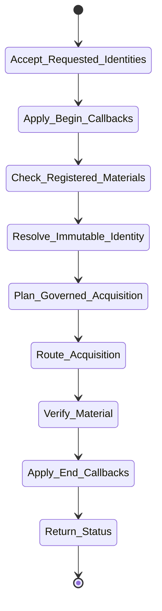

# isomer-kaoju-acquire Skill Analysis

Source skill: [src/isomer_labs/assets/system_skills/research-paradigm/kaoju/isomer-kaoju-acquire/SKILL.md](../../../src/isomer_labs/assets/system_skills/research-paradigm/kaoju/isomer-kaoju-acquire/SKILL.md)

Parent skill: Kaoju Research Skills Suite

Report unit: entrypoint

Role: Governed material acquisition

Purpose: Acquire only the material needed for the accepted evidence purpose, pin its identity, and route governed state changes through existing owners.

## Workflow Overview



## Step Explanation

| Step | Meaning | Evidence |
| --- | --- | --- |
| `Accept_Requested_Identities` | Read Survey Contract, Discovery Ledger, material purpose, and resource boundary. | `SKILL.md` workflow step 1 |
| `Apply_Begin_Callbacks` | Run `project skill-callbacks resolve --skill isomer-kaoju-acquire --stage begin`. | `SKILL.md` workflow step 2 |
| `Check_Registered_Materials` | Query repository registrations and Topic Dataset Manifest first. | `SKILL.md` workflow step 3 |
| `Resolve_Immutable_Identity` | Pin paper version, repository revision, dataset version/fingerprint, model revision/digest. | `SKILL.md` workflow step 4 |
| `Plan_Governed_Acquisition` | State size, storage, network, credentials, license, build, and accelerator implications. | `SKILL.md` workflow step 5 |
| `Route_Acquisition` | Use provider, workspace owner, environment owner, or execution adapter. | `SKILL.md` workflow step 6 |
| `Verify_Material` | Confirm identity, access posture, license, integrity, and deviations. | `SKILL.md` workflow step 7 |
| `Apply_End_Callbacks` | Run `project skill-callbacks resolve --skill isomer-kaoju-acquire --stage end`. | `SKILL.md` workflow step 8 |
| `Return_Status` | Produce Material Acquisition Artifact or governed blocker. | `SKILL.md` workflow step 9 |

## Durable Outputs

| Artifact | Path or Destination | Triggering Step | Evidence | Certainty |
| --- | --- | --- | --- | --- |
| Material Acquisition Artifact | `kaoju:material-acquisition-manifest` | Return_Status | `SKILL.md` Acquisition Contract | Explicit |
| Topic Dataset Manifest update | `kaoju:topic-dataset-manifest` | Check_Registered_Materials | `SKILL.md` Acquisition Contract | Explicit |

## Skill Routing Callgraph

```mermaid
flowchart TD
    classDef skill fill:#eef6ff,stroke:#2563eb,stroke-width:1.5px,color:#111827

    Acquire["isomer-kaoju-acquire"]:::skill
    Shared["isomer-kaoju-shared"]:::skill
    WSMgr["isomer-kaoju-workspace-mgr"]:::skill
    TopicMgr["isomer-op-topic-mgr"]:::skill

    Acquire -.-> Shared
    Acquire -.-> WSMgr
    Acquire --> TopicMgr : managed-link mutation
```

## Inner Workings

`isomer-kaoju-acquire` sits between discovery and examination. It checks registered materials before downloading anything new, pins immutable identities, plans resource and license implications, and routes the actual acquisition to the appropriate owner. For datasets, it registers a managed link through the Topic Workspace owner rather than copying external data.

The skill separates acquisition from evidence acceptance: it verifies the material but does not grade its claims. Any deviation between requested and observed material is recorded so later audit can assess fidelity.

## Key Constraints

- Acquisition is not evidence acceptance.
- Check the Topic Dataset Manifest before downloading.
- Record both canonical external locator and immutable identity, not just a local path.
- Large or restricted downloads require Gates.
- Do not modify external datasets during registration.
