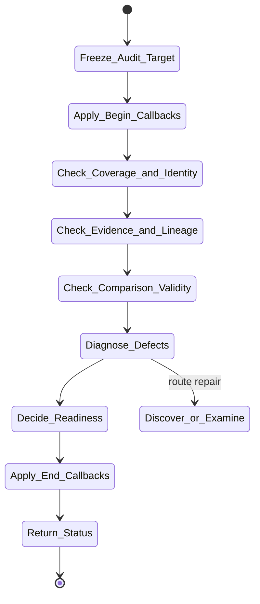

# isomer-kaoju-audit Skill Analysis

Source skill: [src/isomer_labs/assets/system_skills/research-paradigm/kaoju/isomer-kaoju-audit/SKILL.md](../../../src/isomer_labs/assets/system_skills/research-paradigm/kaoju/isomer-kaoju-audit/SKILL.md)

Parent skill: Kaoju Research Skills Suite

Report unit: entrypoint

Role: Evidence diagnostician

Purpose: Diagnose whether requested survey conclusions are supported by accepted evidence without repairing or rewriting evidence silently.

## Workflow Overview



## Step Explanation

| Step | Meaning | Evidence |
| --- | --- | --- |
| `Freeze_Audit_Target` | Record Survey Contract, target Artifact refs, accepted evidence, intended claims, and audit boundary. | `SKILL.md` workflow step 1 |
| `Apply_Begin_Callbacks` | Run `project skill-callbacks resolve --skill isomer-kaoju-audit --stage begin`. | `SKILL.md` workflow step 2 |
| `Check_Coverage_and_Identity` | Inspect source-class coverage, inclusion records, work families, identities, drift, access blockers, and `searched_through` limits. | `SKILL.md` workflow step 3 |
| `Check_Evidence_and_Lineage` | Inspect exact locators, Evidence Item linkage, depth, verdict, Run purpose, fidelity, inputs, patches, failures, and Provenance Records. | `SKILL.md` workflow step 4 |
| `Check_Comparison_Validity` | Inspect dimension bases, metric traceability, candidate eligibility, fairness, variability, adaptations, and non-comparability decisions. | `SKILL.md` workflow step 5 |
| `Diagnose_Defects` | Record severity, affected claims and outputs, partial evidence, and bounded repair routes without changing the target. | `SKILL.md` workflow step 6 |
| `Decide_Readiness` | Mark `ready`, `ready-with-narrowed-claims`, or `not-ready`. | `SKILL.md` workflow step 7 |
| `Apply_End_Callbacks` | Run `project skill-callbacks resolve --skill isomer-kaoju-audit --stage end`. | `SKILL.md` workflow step 8 |
| `Return_Status` | Report Audit Report ref, readiness decision, blockers, and resume point. | `SKILL.md` workflow step 9 |

## Durable Outputs

| Artifact | Path or Destination | Triggering Step | Evidence | Certainty |
| --- | --- | --- | --- | --- |
| Audit Report | `kaoju:audit-report` | Return_Status | `SKILL.md` Audit Report Contract | Explicit |

## Skill Routing Callgraph

```mermaid
flowchart TD
    classDef skill fill:#eef6ff,stroke:#2563eb,stroke-width:1.5px,color:#111827

    Audit["isomer-kaoju-audit"]:::skill
    Shared["isomer-kaoju-shared"]:::skill
    Discover["isomer-kaoju-discover"]:::skill
    Examine["isomer-kaoju-examine"]:::skill
    Reproduce["isomer-kaoju-reproduce"]:::skill

    Audit -.-> Shared
    Audit --> Discover : coverage defect
    Audit --> Examine : missing locator
    Audit --> Reproduce : failed Run repair
```

## Inner Workings

`isomer-kaoju-audit` is a non-mutating diagnostic stage. It freezes the target, checks coverage/identity/lineage/comparison validity, records defects with severity, and decides readiness. It never repairs evidence itself; instead it routes bounded repairs back to the owning stage skill (discover, examine, reproduce, etc.).

The Audit Report becomes the gate for synthesis. Only `ready` or `ready-with-narrowed-claims` can feed into `isomer-kaoju-synthesize`, and narrowed claims must be explicit.

## Key Constraints

- Audit must not change evidence while checking it.
- Readiness decisions are `ready`, `ready-with-narrowed-claims`, or `not-ready`.
- Blocked access must be reported as a coverage gap, not exclusion.
- Defects must include affected claims and bounded repair routes.
