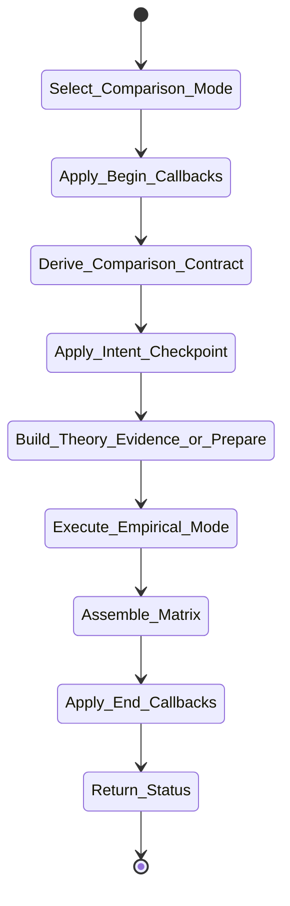

# isomer-kaoju-compare Skill Analysis

Source skill: [src/isomer_labs/assets/system_skills/research-paradigm/kaoju/isomer-kaoju-compare/SKILL.md](../../../src/isomer_labs/assets/system_skills/research-paradigm/kaoju/isomer-kaoju-compare/SKILL.md)

Parent skill: Kaoju Research Skills Suite

Report unit: entrypoint

Role: Comparison builder and executor

Purpose: Compare named works only on dimensions or measurements whose definitions and evidence are explicit, in either theory mode or empirical mode.

## Workflow Overview



## Step Explanation

| Step | Meaning | Evidence |
| --- | --- | --- |
| `Select_Comparison_Mode` | Require named candidate Source Identities, target question, accepted evidence, and theory or empirical intent. | `SKILL.md` workflow step 1 |
| `Apply_Begin_Callbacks` | Run `project skill-callbacks resolve --skill isomer-kaoju-compare --stage begin`. | `SKILL.md` workflow step 2 |
| `Derive_Comparison_Contract` | Define dimensions/metrics, rationale, applicability, evaluator semantics, fairness rules, exclusions, and depth. | `SKILL.md` workflow step 3 |
| `Apply_Intent_Checkpoint` | For empirical mode, present readiness, prior evidence, acquisition, environment, datasets, metrics, resources, Gates, and unresolved choices; wait for Proceed Decision. | `SKILL.md` workflow step 4 |
| `Build_Theory_Evidence_or_Prepare` | In theory mode inspect exact locators; in empirical mode query registered datasets and route governed preparation. | `SKILL.md` workflow step 5 |
| `Execute_Empirical_Mode` | Run eligible candidates under the accepted Comparison Contract. | `SKILL.md` workflow step 6 |
| `Assemble_Matrix` | Report source cells or measurements, variability, contradictions, missing states, and `not-comparable` entries. | `SKILL.md` workflow step 7 |
| `Apply_End_Callbacks` | Run `project skill-callbacks resolve --skill isomer-kaoju-compare --stage end`. | `SKILL.md` workflow step 8 |
| `Return_Status` | Produce Theory Comparison Artifact or empirical Comparison Matrix. | `SKILL.md` workflow step 9 |

## Durable Outputs

| Artifact | Path or Destination | Triggering Step | Evidence | Certainty |
| --- | --- | --- | --- | --- |
| Theory Comparison Artifact | `kaoju:theory-comparison` | Return_Status | `SKILL.md` Comparison Modes | Explicit |
| Comparison Matrix | `kaoju:comparison-matrix` | Return_Status | `SKILL.md` Comparison Modes | Explicit |
| Comparison Run | `kaoju:comparison-run` | Execute_Empirical_Mode | `SKILL.md` workflow step 6 | Explicit |

## Skill Routing Callgraph

```mermaid
flowchart TD
    classDef skill fill:#eef6ff,stroke:#2563eb,stroke-width:1.5px,color:#111827

    Compare["isomer-kaoju-compare"]:::skill
    Shared["isomer-kaoju-shared"]:::skill
    Examine["isomer-kaoju-examine"]:::skill
    Reproduce["isomer-kaoju-reproduce"]:::skill

    Compare -.-> Shared
    Compare --> Examine : missing source bases
    Compare --> Reproduce : single-candidate readiness
```

## Inner Workings

`isomer-kaoju-compare` supports three modes. Theory mode compares works on source-grounded dimensions; each cell cites an exact locator or records `not stated`, `not applicable`, `unclear`, or `disputed`. Empirical intent mode produces a Comparison Intent Document and waits for a Proceed Decision. Empirical results mode runs candidates under the accepted Comparison Contract and records measurements with dispersion, adaptations, and `not-comparable` entries.

The skill starts from the domain question and accepted source basis, not from source availability. It refuses to normalize incompatible candidates when normalization would erase meaningful task or quality differences.

## Key Constraints

- Empirical work begins only after a Proceed Decision.
- Theory cells never receive empirical `compared` verification depth.
- A single number must have a variability statement or a reason it is unavailable.
- Use `not-comparable` when fair normalization changes the studied task or quality.
- Do not rank unclear or disputed cells.
