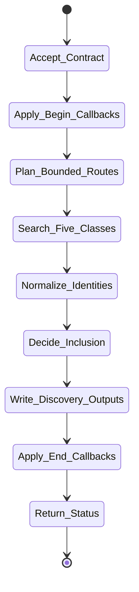

# isomer-kaoju-discover Skill Analysis

Source skill: [src/isomer_labs/assets/system_skills/research-paradigm/kaoju/isomer-kaoju-discover/SKILL.md](../../../src/isomer_labs/assets/system_skills/research-paradigm/kaoju/isomer-kaoju-discover/SKILL.md)

Parent skill: Kaoju Research Skills Suite

Report unit: entrypoint

Role: Field discovery and candidate selection

Purpose: Find relevant works through recorded routes and preserve the difference between conceptual works, their versions, and linked implementation materials.

## Workflow Overview



## Step Explanation

| Step | Meaning | Evidence |
| --- | --- | --- |
| `Accept_Contract` | Require Survey Contract, seeds, source classes, coverage bounds, and output purpose. | `SKILL.md` workflow step 1 |
| `Apply_Begin_Callbacks` | Run `project skill-callbacks resolve --skill isomer-kaoju-discover --stage begin`. | `SKILL.md` workflow step 2 |
| `Plan_Bounded_Routes` | Choose landscape, curated intake, or direction-expansion routes. | `SKILL.md` workflow step 3 |
| `Search_Five_Classes` | Search papers, technical reports, repositories, datasets, and models. | `SKILL.md` workflow step 4 |
| `Normalize_Identities` | Group version families and record immutable identities. | `SKILL.md` workflow step 5 |
| `Decide_Inclusion` | Record query/parent seed, route, relevance, decision, and reason for each candidate. | `SKILL.md` workflow step 6 |
| `Write_Discovery_Outputs` | Produce Discovery Ledger and candidate Related-Work Catalog or delta. | `SKILL.md` workflow step 7 |
| `Apply_End_Callbacks` | Run `project skill-callbacks resolve --skill isomer-kaoju-discover --stage end`. | `SKILL.md` workflow step 8 |
| `Return_Status` | Report refs, blockers, and the acquire/examine handoff. | `SKILL.md` workflow step 9 |

## Durable Outputs

| Artifact | Path or Destination | Triggering Step | Evidence | Certainty |
| --- | --- | --- | --- | --- |
| Discovery Ledger | `kaoju:discovery-ledger` | Write_Discovery_Outputs | `SKILL.md` workflow step 7 | Explicit |
| Related-Work Catalog / delta | `kaoju:related-work-delta` | Write_Discovery_Outputs | `SKILL.md` workflow step 7 | Explicit |
| Curated Intake Delta | `kaoju:curated-intake-delta` | Write_Discovery_Outputs | `SKILL.md` workflow step 7 | Explicit |

## Skill Routing Callgraph

```mermaid
flowchart TD
    classDef skill fill:#eef6ff,stroke:#2563eb,stroke-width:1.5px,color:#111827

    Discover["isomer-kaoju-discover"]:::skill
    Shared["isomer-kaoju-shared"]:::skill
    Acquire["isomer-kaoju-acquire"]:::skill
    Examine["isomer-kaoju-examine"]:::skill

    Discover -.-> Shared
    Discover --> Acquire : access/checkout needed
    Discover --> Examine : claim-bearing inspection
```

## Inner Workings

`isomer-kaoju-discover` operates in three modes: landscape, curated intake, and direction expansion. In landscape mode it runs multiple bounded queries across terminology variants. In curated intake mode it gives every user-nominated item a stable intake id and resolved identity attempt without automatic inclusion. In direction expansion mode it traces seed works backward, neighboring, forward, and post-seed.

The skill treats papers and technical reports as primary related works, while repositories, datasets, and models are typed linked materials. It records query provenance and inclusion decisions so the audit stage can verify coverage. A candidate ends as included, excluded, duplicate, or blocked, with reasons retained for all outcomes.

## Key Constraints

- Discovery proves a candidate was found; it does not prove claims, quality, or reproducibility.
- Search rank, date, and citation count inform but do not decide inclusion.
- Mutable release labels must not be treated as immutable identity.
- Excluded items must be retained with reasons.
