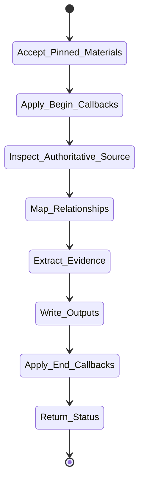

# isomer-kaoju-examine Skill Analysis

Source skill: [src/isomer_labs/assets/system_skills/research-paradigm/kaoju/isomer-kaoju-examine/SKILL.md](../../../src/isomer_labs/assets/system_skills/research-paradigm/kaoju/isomer-kaoju-examine/SKILL.md)

Parent skill: Kaoju Research Skills Suite

Report unit: entrypoint

Role: Full-text and source inspection

Purpose: Inspect accepted materials at exact, repeatable locators and separate what the source states from what the agent infers.

## Workflow Overview



## Step Explanation

| Step | Meaning | Evidence |
| --- | --- | --- |
| `Accept_Pinned_Materials` | Require Source Identities, material refs, target questions, and desired depth. | `SKILL.md` workflow step 1 |
| `Apply_Begin_Callbacks` | Run `project skill-callbacks resolve --skill isomer-kaoju-examine --stage begin`. | `SKILL.md` workflow step 2 |
| `Inspect_Authoritative_Source` | Read paper, report, source tree, dataset docs, or model metadata at exact locators. | `SKILL.md` workflow step 3 |
| `Map_Relationships` | Record paper-to-code, code-to-data, model-to-config, claim-to-experiment links only with evidence. | `SKILL.md` workflow step 4 |
| `Extract_Evidence` | Record stated claims, assumptions, methods, limitations, contradictions, and inference boundaries. | `SKILL.md` workflow step 5 |
| `Write_Outputs` | Produce Source Digest or Source Access Blocker and update Claim-Evidence Ledger. | `SKILL.md` workflow step 6 |
| `Apply_End_Callbacks` | Run `project skill-callbacks resolve --skill isomer-kaoju-examine --stage end`. | `SKILL.md` workflow step 7 |
| `Return_Status` | Report depth, unresolved claims, refs, blockers, and next handoff. | `SKILL.md` workflow step 8 |

## Durable Outputs

| Artifact | Path or Destination | Triggering Step | Evidence | Certainty |
| --- | --- | --- | --- | --- |
| Source Digest | `kaoju:source-digest` | Write_Outputs | `SKILL.md` Source Digest Contract | Explicit |
| Source Access Blocker | `kaoju:source-access-blocker` | Write_Outputs | `SKILL.md` Source Access Blocker section | Explicit |
| Claim-Evidence Ledger | `kaoju:claim-evidence-ledger` | Write_Outputs | `SKILL.md` workflow step 6 | Explicit |

## Skill Routing Callgraph

```mermaid
flowchart TD
    classDef skill fill:#eef6ff,stroke:#2563eb,stroke-width:1.5px,color:#111827

    Examine["isomer-kaoju-examine"]:::skill
    Shared["isomer-kaoju-shared"]:::skill
    Reproduce["isomer-kaoju-reproduce"]:::skill
    Compare["isomer-kaoju-compare"]:::skill
    Acquire["isomer-kaoju-acquire"]:::skill

    Examine -.-> Shared
    Examine --> Reproduce : executable questions
    Examine --> Compare : comparison-ready evidence
    Examine --> Acquire : unverified material needs
```

## Inner Workings

`isomer-kaoju-examine` raises evidence depth only to the level actually achieved. It requires exact locators (page, section, symbol, file, line, revision) so observations remain auditable. It separates source-stated claims from agent inferences, records contradictions, and creates Source Access Blockers when material cannot be reached.

The Claim-Evidence Ledger links each claim to Evidence Items with depth and verdict. This ledger becomes the primary input to audit and synthesis.

## Key Constraints

- An exact locator is required for auditable observation.
- Abstract-only observation cannot be described as full-text inspection.
- Inaccessible material becomes a Source Access Blocker, not an exclusion.
- Paper and code identities must not be merged without relationship evidence.
