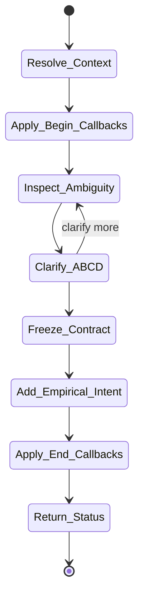
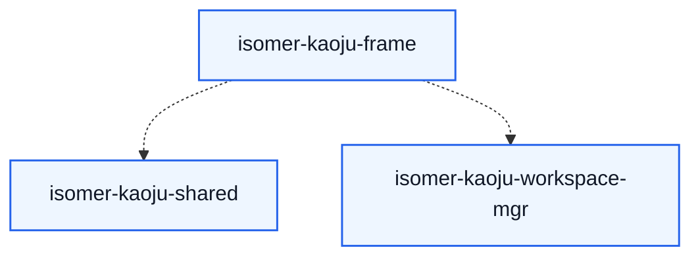

# isomer-kaoju-frame Skill Analysis

Source skill: [src/isomer_labs/assets/system_skills/research-paradigm/kaoju/isomer-kaoju-frame/SKILL.md](../../../src/isomer_labs/assets/system_skills/research-paradigm/kaoju/isomer-kaoju-frame/SKILL.md)

Parent skill: Kaoju Research Skills Suite

Report unit: entrypoint

Role: Scope freezer and contract writer

Purpose: Turn the user's survey question into an explicit Survey Contract or Comparison Intent Document before discovery or execution changes the scope.

## Workflow Overview

## Step Explanation

| Step | Meaning | Evidence |
| --- | --- | --- |
| `Resolve_Context` | Read topic, inquiry, prior refs, and workspace readiness. | `SKILL.md` workflow step 1 |
| `Apply_Begin_Callbacks` | Run `project skill-callbacks resolve --skill isomer-kaoju-frame --stage begin`. | `SKILL.md` workflow step 2 |
| `Inspect_Ambiguity` | Identify unclear boundaries, source classes, depth, resources, and Gates. | `SKILL.md` workflow step 3 |
| `Clarify_ABCD` | Present one A/B/C/D choice, mark a suggestion, and ask whether to clarify or proceed. | `SKILL.md` workflow step 4 |
| `Freeze_Contract` | Record question, boundary, source classes, coverage date, rules, outputs, and stop conditions. | `SKILL.md` workflow step 5 |
| `Add_Empirical_Intent` | For actual-run comparison, create Comparison Intent Document and wait for Proceed Decision. | `SKILL.md` workflow step 6 |
| `Apply_End_Callbacks` | Run `project skill-callbacks resolve --skill isomer-kaoju-frame --stage end`. | `SKILL.md` workflow step 7 |
| `Return_Status` | Report contract ref and next allowed stage. | `SKILL.md` workflow step 8 |

## Durable Outputs

| Artifact | Path or Destination | Triggering Step | Evidence | Certainty |
| --- | --- | --- | --- | --- |
| Survey Contract | `kaoju:survey-contract` | Freeze_Contract | `SKILL.md` Survey Contract section | Explicit |
| Comparison Intent Document | `kaoju:comparison-intent` | Add_Empirical_Intent | `SKILL.md` workflow step 6 | Explicit |
| Proceed Decision | `kaoju:proceed-decision` | Add_Empirical_Intent | `SKILL.md` workflow step 6 | Explicit |

## Skill Routing Callgraph

## Inner Workings

`isomer-kaoju-frame` is the first stage skill in every survey procedure. It converts an ambiguous user request into a frozen contract. The contract must include the research question, audience, boundary, primary and linked source classes, seeds, coverage date, `searched_through` policy, inclusion/exclusion rules, verification depth, comparison mode, deliverables, resource envelope, Gate requirements, clarification mode, stop conditions, and accepted prior refs.

When the request involves empirical comparison, the skill produces a Comparison Intent Document that records candidate identities, readiness, reusable evidence, acquisition needs, environment needs, reimplementation routes, datasets, metrics, evaluators, fairness rules, repetitions, uncertainty plan, resources, Gates, unresolved decisions, and the Proceed Decision. No empirical preparation may begin until the Proceed Decision is accepted.

## Key Constraints

- A vague request is not an execution contract; do not spend resources beyond the accepted boundary.
- Every material ambiguity must become a user-visible A/B/C/D decision.
- Empirical candidates cannot start preparation before a Proceed Decision.
- "Latest" must be paired with a `searched_through` boundary.
