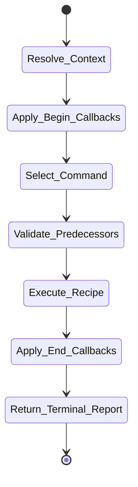

# isomer-kaoju-pipeline Skill Analysis

Source skill: [src/isomer_labs/assets/system_skills/research-paradigm/kaoju/isomer-kaoju-pipeline/SKILL.md](../../../src/isomer_labs/assets/system_skills/research-paradigm/kaoju/isomer-kaoju-pipeline/SKILL.md)

Parent skill: Kaoju Research Skills Suite

Report unit: entrypoint

Role: Public procedure router and bounded recipe executor

Purpose: Select and run one survey procedure, paper-writing procedure, or grouped management action while preserving stage handoffs and audit-before-synthesis ordering.

## Workflow Overview

## Step Explanation

| Step | Meaning | Evidence |
| --- | --- | --- |
| `Resolve_Context` | Identify topic, inquiry, workspace, prior refs, and requested start stage. | `SKILL.md` workflow step 1 |
| `Apply_Begin_Callbacks` | Run `project skill-callbacks resolve --skill isomer-kaoju-pipeline --stage begin`. | `SKILL.md` workflow step 2 |
| `Select_Command` | Match user intent to one of nine procedures or two helper managers. | `SKILL.md` subcommand tables |
| `Validate_Predecessors` | Require accepted input refs and verify identity/lineage/audit state. | `SKILL.md` workflow step 5 |
| `Execute_Recipe` | Invoke focused Kaoju stage skills in the order defined by the selected command page. | `SKILL.md` workflow step 6 |
| `Apply_End_Callbacks` | Run `project skill-callbacks resolve --skill isomer-kaoju-pipeline --stage end`. | `SKILL.md` workflow step 8 |
| `Return_Terminal_Report` | Report `complete`, `paused`, or `blocked` with refs, blockers, and resume point. | `SKILL.md` workflow step 9 |

## Durable Outputs

| Artifact | Path or Destination | Triggering Step | Evidence | Certainty |
| --- | --- | --- | --- | --- |
| Terminal report | Chat session | Return_Terminal_Report | `SKILL.md` Output Contract | Explicit |
| Intermediate stage records | `topic.records.artifacts` via stage skills | Execute_Recipe | `SKILL.md` workflow step 6 | Explicit |

## Skill Routing Callgraph

```mermaid
flowchart TD
    classDef skill fill:#eef6ff,stroke:#2563eb,stroke-width:1.5px,color:#111827

    Pipeline["isomer-kaoju-pipeline"]:::skill
    Pipeline --> Landscape["landscape-pass"]:::skill
    Pipeline --> Curated["curated-intake-pass"]:::skill
    Pipeline --> Direction["direction-expansion-pass"]:::skill
    Pipeline --> Theory["theory-comparison-pass"]:::skill
    Pipeline --> Method["method-trial-pass"]:::skill
    Pipeline --> Comparative["comparative-pass"]:::skill
    Pipeline --> AuditPass["audit-survey-pass"]:::skill
    Pipeline --> PaperPass["paper-pass"]:::skill
    Pipeline --> Template["create-paper-template"]:::skill
    Pipeline --> ManageSurvey["manage-survey"]:::skill
    Pipeline --> ManageDataset["manage-dataset"]:::skill

    Landscape --> Frame["isomer-kaoju-frame"]:::skill
    Curated --> Frame
    Direction --> Frame
    Theory --> Frame
    Method --> Frame
    Comparative --> Frame

    Landscape --> Discover["isomer-kaoju-discover"]:::skill
    Curated --> Discover
    Direction --> Discover
    Theory --> Discover

    Landscape --> Acquire["isomer-kaoju-acquire"]:::skill
    Curated --> Acquire
    Direction --> Acquire

    Landscape --> Examine["isomer-kaoju-examine"]:::skill
    Curated --> Examine
    Direction --> Examine
    Theory --> Examine

    Method --> Reproduce["isomer-kaoju-reproduce"]:::skill
    Comparative --> Compare["isomer-kaoju-compare"]:::skill

    Landscape --> Audit["isomer-kaoju-audit"]:::skill
    Curated --> Audit
    Direction --> Audit
    Theory --> Audit
    Method --> Audit
    Comparative --> Audit

    Audit --> Synthesize["isomer-kaoju-synthesize"]:::skill
    PaperPass --> Write["isomer-kaoju-write"]:::skill
```

## Inner Workings

`isomer-kaoju-pipeline` is a thin router. It does not perform survey work itself; it selects a procedure and delegates each step to the appropriate stage skill. Every procedure follows the same macro pattern: frame the contract, prepare the workspace, discover candidates, acquire materials, examine sources, optionally reproduce or compare, audit, synthesize, and (for paper procedures) write. The router enforces the audit-before-synthesis rule by invoking `isomer-kaoju-audit` before `isomer-kaoju-synthesize` in every normal survey recipe.

The skill uses clarification-first mode through `isomer-kaoju-shared` when material ambiguity exists, and it validates accepted prior refs before resuming from an explicit stage. It also applies begin/end skill callbacks at the procedure boundaries, allowing project-specific hooks to run before and after a pass.

## Key Constraints

- One command per user intent; do not chain passes autonomously.
- Audit before synthesis for every normal survey procedure.
- `paper-pass` requires accepted audit and synthesis records.
- `create-paper-template` preview PDF is not the final paper PDF.
- Helpers (`manage-survey`, `manage-dataset`) are lower-level object operations, not primary user entrypoints.
