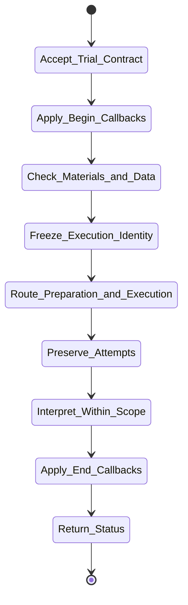

# isomer-kaoju-reproduce Skill Analysis

Source skill: [src/isomer_labs/assets/system_skills/research-paradigm/kaoju/isomer-kaoju-reproduce/SKILL.md](../../../src/isomer_labs/assets/system_skills/research-paradigm/kaoju/isomer-kaoju-reproduce/SKILL.md)

Parent skill: Kaoju Research Skills Suite

Report unit: entrypoint

Role: Single-method trial runner

Purpose: Run one bounded paper-method trial while preserving faithful, adapted, repaired, failed, and generated-input evidence as different outcomes.

## Workflow Overview



## Step Explanation

| Step | Meaning | Evidence |
| --- | --- | --- |
| `Accept_Trial_Contract` | Require paper/code identities, route, target claim, inputs, evaluator, metrics, resources, and stop conditions. | `SKILL.md` workflow step 1 |
| `Apply_Begin_Callbacks` | Run `project skill-callbacks resolve --skill isomer-kaoju-reproduce --stage begin`. | `SKILL.md` workflow step 2 |
| `Check_Materials_and_Data` | Query Topic Dataset Manifest; verify code, data, model, evaluator, environment, license, access, and Gate posture. | `SKILL.md` workflow step 3 |
| `Freeze_Execution_Identity` | Pin paper, code revision, dataset or Generated Dataset Artifact, model, evaluator, environment, command, seeds, resources, and expected outputs. | `SKILL.md` workflow step 4 |
| `Route_Preparation_and_Execution` | Use environment, provider, execution, and Gate owners; apply bounded-run guidance. | `SKILL.md` workflow step 5 |
| `Preserve_Attempts` | Record upstream-faithful, adapted, repaired, failed, blocked, and probe Runs separately. | `SKILL.md` workflow step 6 |
| `Interpret_Within_Scope` | Compare intended-data results to compatible paper claims; label generated-data results as `capability-probe`. | `SKILL.md` workflow step 7 |
| `Apply_End_Callbacks` | Run `project skill-callbacks resolve --skill isomer-kaoju-reproduce --stage end`. | `SKILL.md` workflow step 8 |
| `Return_Status` | Produce Method Trial Artifact, Run and Finding refs, failures, limitations, and resume point. | `SKILL.md` workflow step 9 |

## Durable Outputs

| Artifact | Path or Destination | Triggering Step | Evidence | Certainty |
| --- | --- | --- | --- | --- |
| Generated Dataset Artifact | `kaoju:generated-dataset` | Freeze_Execution_Identity | `SKILL.md` Trial Routes | Explicit |
| Method Trial Artifact | `kaoju:method-trial` | Return_Status | `SKILL.md` workflow step 9 | Explicit |
| Method Trial Run | `kaoju:method-trial-run` | Route_Preparation_and_Execution | `SKILL.md` workflow step 6 | Explicit |

## Skill Routing Callgraph

```mermaid
flowchart TD
    classDef skill fill:#eef6ff,stroke:#2563eb,stroke-width:1.5px,color:#111827

    Reproduce["isomer-kaoju-reproduce"]:::skill
    Shared["isomer-kaoju-shared"]:::skill
    Acquire["isomer-kaoju-acquire"]:::skill

    Reproduce -.-> Shared
    Reproduce --> Acquire : pinned materials
```

## Inner Workings

`isomer-kaoju-reproduce` runs a single paper method under controlled conditions. It supports two routes: intended data (using the paper's task, data, split, evaluator, and metrics) and generated data (a rough capability probe with synthetic inputs). Each attempt—upstream-faithful, adapted, repaired, failed, or blocked—is recorded separately with patches, logs, outputs, purpose, fidelity, input basis, and quality checks.

An authorized patch creates a new repaired or adapted Run; it does not change the verdict of the upstream-faithful attempt. Generated-data results are explicitly labeled as `capability-probe` evidence and never become reproduction or benchmark evidence.

## Key Constraints

- Numbers carry the identity of code, inputs, evaluator, environment, and execution route.
- A Run must have immutable code, input, evaluator, and environment identity.
- Generated inputs are labeled and limited to capability-probe claims.
- One successful output does not prove reproduction; check accepted metric, evaluator, quality, and paper-claim compatibility.
- Ask for dataset only after checking registered data.
