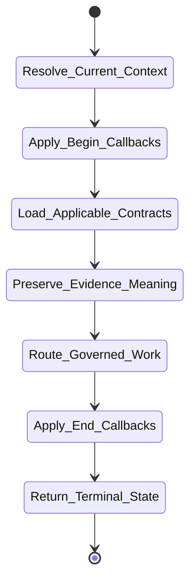

# isomer-kaoju-shared Skill Analysis

Source skill: [src/isomer_labs/assets/system_skills/research-paradigm/kaoju/isomer-kaoju-shared/SKILL.md](../../../src/isomer_labs/assets/system_skills/research-paradigm/kaoju/isomer-kaoju-shared/SKILL.md)

Parent skill: Kaoju Research Skills Suite

Report unit: entrypoint

Role: Cross-cutting evidence and interaction contracts

Purpose: Preserve what was inspected, what was executed, and how strongly each claim is supported across all Kaoju stages.

## Workflow Overview

## Step Explanation

| Step | Meaning | Evidence |
| --- | --- | --- |
| `Resolve_Current_Context` | Identify topic, inquiry, effective context, runtime state, active procedure, accepted refs, and intended evidence use. | `SKILL.md` workflow step 1 |
| `Apply_Begin_Callbacks` | Run `project skill-callbacks resolve --skill isomer-kaoju-shared --stage begin`. | `SKILL.md` workflow step 2 |
| `Load_Applicable_Contracts` | Read evidence, artifact, identity, lineage, interaction, owner-routing, and terminal contract pages as needed. | `SKILL.md` workflow step 3 |
| `Preserve_Evidence_Meaning` | Record identity, locator, verification depth, evidence verdict, Run purpose, execution fidelity, input basis, and Provenance Record. | `SKILL.md` workflow step 4 |
| `Route_Governed_Work` | Apply worker output policy and route to owners for workspace mutation, environment, provider access, execution, Gates, and recording. | `SKILL.md` workflow step 5 |
| `Apply_End_Callbacks` | Run `project skill-callbacks resolve --skill isomer-kaoju-shared --stage end`. | `SKILL.md` workflow step 6 |
| `Return_Terminal_State` | Report `complete`, `paused`, or `blocked` with durable refs and resume point. | `SKILL.md` workflow step 7 |

## Durable Outputs

| Artifact | Path or Destination | Triggering Step | Evidence | Certainty |
| --- | --- | --- | --- | --- |
| Evidence semantics and invariants | Used by all stage skills | Preserve_Evidence_Meaning | `SKILL.md` Evidence Invariants | Explicit |
| Clarification/Gate decisions | `kaoju:proceed-decision` | Route_Governed_Work | `SKILL.md` Reference Routing | Inferred |

## Skill Routing Callgraph

```mermaid
flowchart TD
    classDef skill fill:#eef6ff,stroke:#2563eb,stroke-width:1.5px,color:#111827

    Shared["isomer-kaoju-shared"]:::skill
    Frame["isomer-kaoju-frame"]:::skill
    WSMgr["isomer-kaoju-workspace-mgr"]:::skill
    Discover["isomer-kaoju-discover"]:::skill
    Acquire["isomer-kaoju-acquire"]:::skill
    Examine["isomer-kaoju-examine"]:::skill
    Reproduce["isomer-kaoju-reproduce"]:::skill
    Compare["isomer-kaoju-compare"]:::skill
    Audit["isomer-kaoju-audit"]:::skill
    Synthesize["isomer-kaoju-synthesize"]:::skill
    Write["isomer-kaoju-write"]:::skill

    Shared -.-> Frame
    Shared -.-> WSMgr
    Shared -.-> Discover
    Shared -.-> Acquire
    Shared -.-> Examine
    Shared -.-> Reproduce
    Shared -.-> Compare
    Shared -.-> Audit
    Shared -.-> Synthesize
    Shared -.-> Write
```

## Inner Workings

`isomer-kaoju-shared` is not a stage skill but a contract library used by every stage. It defines evidence invariants (e.g., provider output becomes claim-bearing only after acceptance as an Evidence Item; source-only inspection never gets empirical `compared` depth; generated-data results remain `capability-probe` evidence). It also provides the A/B/C/D clarification contract, Proceed Decision semantics, Gate behavior, owner-routing rules, and terminal report fields.

Stage skills invoke it implicitly by loading its reference pages and explicitly through shared callback resolution. It ensures that evidence labels are preserved across stage handoffs so that later audit and synthesis can trace every claim.

## Key Constraints

- Evidence labels are part of the evidence; violating them violates the evidence purpose.
- Provider output must be deliberately accepted as an Evidence Item before becoming claim-bearing.
- Generated-data results are capability probes, never reproduction or benchmark evidence.
- An audit diagnoses evidence; it does not silently repair, delete, relabel, or invent it.
- A terminal response must include blockers, failures, and accepted output refs.
