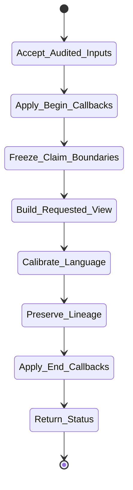

# isomer-kaoju-synthesize Skill Analysis

Source skill: [src/isomer_labs/assets/system_skills/research-paradigm/kaoju/isomer-kaoju-synthesize/SKILL.md](../../../src/isomer_labs/assets/system_skills/research-paradigm/kaoju/isomer-kaoju-synthesize/SKILL.md)

Parent skill: Kaoju Research Skills Suite

Report unit: entrypoint

Role: Audited-evidence summarizer

Purpose: Write the strongest survey conclusion supported by accepted evidence and no stronger, preserving contradictions, failures, limitations, uncertainty, and unresolved questions.

## Workflow Overview



## Step Explanation

| Step | Meaning | Evidence |
| --- | --- | --- |
| `Accept_Audited_Inputs` | Require accepted Audit Report, Survey Contract, Artifact/Evidence refs, and requested output view. | `SKILL.md` workflow step 1 |
| `Apply_Begin_Callbacks` | Run `project skill-callbacks resolve --skill isomer-kaoju-synthesize --stage begin`. | `SKILL.md` workflow step 2 |
| `Freeze_Claim_Boundaries` | Map each conclusion to accepted evidence, depth, verdict, contradictions, and audit limits. | `SKILL.md` workflow step 3 |
| `Build_Requested_View` | Produce Related-Work Catalog, Field Summary, Claim Status Table, or Kaoju Dossier. | `SKILL.md` workflow step 4 |
| `Calibrate_Language` | Distinguish source-stated, source-supported, executed, compared, inconclusive, contradicted, blocked, and not-comparable. | `SKILL.md` workflow step 5 |
| `Preserve_Lineage` | Link every derived section to source Artifacts, Evidence Items, Runs, Findings, Decisions, and Provenance Records. | `SKILL.md` workflow step 6 |
| `Apply_End_Callbacks` | Run `project skill-callbacks resolve --skill isomer-kaoju-synthesize --stage end`. | `SKILL.md` workflow step 7 |
| `Return_Status` | Report refs, coverage limits, unresolved questions, and resume point. | `SKILL.md` workflow step 8 |

## Durable Outputs

| Artifact | Path or Destination | Triggering Step | Evidence | Certainty |
| --- | --- | --- | --- | --- |
| Related-Work Catalog | `kaoju:related-work-catalog` | Build_Requested_View | `SKILL.md` Output Contract | Explicit |
| Field Summary | `kaoju:field-summary` | Build_Requested_View | `SKILL.md` Output Contract | Explicit |
| Claim Status Table | `kaoju:claim-status-table` | Build_Requested_View | `SKILL.md` Output Contract | Explicit |
| Kaoju Dossier | `kaoju:kaoju-dossier` | Build_Requested_View | `SKILL.md` Output Contract | Explicit |

## Skill Routing Callgraph

```mermaid
flowchart TD
    classDef skill fill:#eef6ff,stroke:#2563eb,stroke-width:1.5px,color:#111827

    Synthesize["isomer-kaoju-synthesize"]:::skill
    Shared["isomer-kaoju-shared"]:::skill
    Audit["isomer-kaoju-audit"]:::skill

    Synthesize -.-> Shared
    Synthesize --> Audit : not-ready audit
```

## Inner Workings

`isomer-kaoju-synthesize` turns accepted evidence into structured survey views. It is strictly downstream of audit: if the Audit Report is not accepted, synthesis routes back to audit. The skill calibrates language so that readers can tell whether a conclusion is source-stated, source-supported, executed, compared, inconclusive, contradicted, blocked, or not-comparable.

The Claim Status Table is the central artifact: each conclusion gets a status, depth, verdict, supporting and challenging evidence refs, locators, and limitations. The Kaoju Dossier assembles the catalog, field model, comparisons, findings, failures, limitations, unresolved questions, and reading path.

## Key Constraints

- Synthesis organizes accepted evidence; it does not manufacture or erase evidence.
- Use only after audit accepts the evidence or narrows claims explicitly.
- Every final claim must have an entry in the Claim Status Table.
- Audited limitations must remain visible wherever the affected claim appears.
- State bounded search and remaining frontier; do not claim the field is complete.
