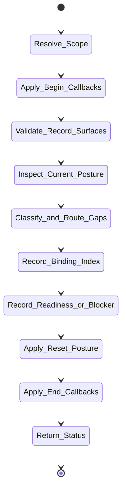

# isomer-kaoju-workspace-mgr Skill Analysis

Source skill: [src/isomer_labs/assets/system_skills/research-paradigm/kaoju/isomer-kaoju-workspace-mgr/SKILL.md](../../../src/isomer_labs/assets/system_skills/research-paradigm/kaoju/isomer-kaoju-workspace-mgr/SKILL.md)

Parent skill: Kaoju Research Skills Suite

Report unit: entrypoint

Role: Readiness checker and binding index maintainer

Purpose: Prepare a trustworthy starting context for survey work without taking ownership of Topic Workspace mutation.

## Workflow Overview



## Step Explanation

| Step | Meaning | Evidence |
| --- | --- | --- |
| `Resolve_Scope` | Resolve effective topic context, runtime state, selected procedure, actors, and worker output policy. | `SKILL.md` workflow step 1 |
| `Apply_Begin_Callbacks` | Run `project skill-callbacks resolve --skill isomer-kaoju-workspace-mgr --stage begin`. | `SKILL.md` workflow step 2 |
| `Validate_Record_Surfaces` | Resolve `topic.records.artifacts`, `topic.records.views`, `topic.records.runs`, provider, profiles, and semantic registry. | `SKILL.md` workflow step 3 |
| `Inspect_Current_Posture` | Query candidates with `--artifact-family kaoju` filters; inspect duplicates, supersession, dataset manifest, repos, access, licenses, storage, compute, time, actor posture, Gates, and reset checkpoint. | `SKILL.md` workflow step 4 |
| `Classify_and_Route_Gaps` | Separate missing context from governed mutations, environment work, credentials, private data, acquisition, builds, accelerator Runs, owner actions, and reset decisions. | `SKILL.md` workflow step 5 |
| `Record_Binding_Index` | Write `kaoju:binding-index` with selected skills, semantic ids, profiles, labels, status, owner, and blockers. | `SKILL.md` workflow step 6 |
| `Record_Readiness_or_Blocker` | Write `kaoju:workspace-readiness` with reusable inputs, dataset posture, identities, resource boundaries, blockers, and next stage. | `SKILL.md` workflow step 7 |
| `Apply_Reset_Posture` | Update reset checkpoint for bootstrap records and selected survey refs if needed. | `SKILL.md` workflow step 8 |
| `Apply_End_Callbacks` | Run `project skill-callbacks resolve --skill isomer-kaoju-workspace-mgr --stage end`. | `SKILL.md` workflow step 9 |
| `Return_Status` | Report binding-index and readiness refs, reset posture, next stage, and resume point. | `SKILL.md` workflow step 10 |

## Durable Outputs

| Artifact | Path or Destination | Triggering Step | Evidence | Certainty |
| --- | --- | --- | --- | --- |
| Binding Index | `kaoju:binding-index` | Record_Binding_Index | `SKILL.md` Readiness Contract | Explicit |
| Workspace Readiness Artifact | `kaoju:workspace-readiness` | Record_Readiness_or_Blocker | `SKILL.md` Readiness Contract | Explicit |
| Reset checkpoint update | Project reset checkpoint | Apply_Reset_Posture | `SKILL.md` Reset Contract | Explicit |

## Skill Routing Callgraph

```mermaid
flowchart TD
    classDef skill fill:#eef6ff,stroke:#2563eb,stroke-width:1.5px,color:#111827

    WSMgr["isomer-kaoju-workspace-mgr"]:::skill
    Shared["isomer-kaoju-shared"]:::skill
    TopicMgr["isomer-op-topic-mgr"]:::skill

    WSMgr -.-> Shared
    WSMgr --> TopicMgr : workspace mutation
```

## Inner Workings

`isomer-kaoju-workspace-mgr` performs read-only or minimally invasive posture checks before a survey procedure runs. It validates that the record surfaces needed by Kaoju (artifacts, views, runs) are available, inspects existing survey state for staleness or ambiguity, and writes a binding index plus workspace readiness record. It does not mutate the Topic Workspace directly; it routes governed mutations to `isomer-op-topic-mgr`.

The Binding Index maps each semantic id the procedure will use to its profile, label, owner, and blocker. The Workspace Readiness Artifact records reusable inputs, dataset posture, verified identities, resource boundaries, and the accepted next stage.

## Key Constraints

- Workspace visibility is not mutation authority.
- Missing owner evidence is a blocker, not permission to improvise state changes.
- Dataset compatibility requires availability, fingerprint, access, task, schema, split, evaluator, and license compatibility.
- A managed link proves neither identity nor suitability.
- Preserve only bootstrap records and selected survey refs across reset.
