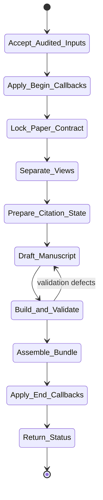
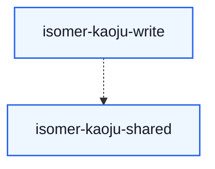

# isomer-kaoju-write Skill Analysis

Source skill: [src/isomer_labs/assets/system_skills/research-paradigm/kaoju/isomer-kaoju-write/SKILL.md](../../../src/isomer_labs/assets/system_skills/research-paradigm/kaoju/isomer-kaoju-write/SKILL.md)

Parent skill: Kaoju Research Skills Suite

Report unit: entrypoint

Role: Publication-facing manuscript producer

Purpose: Transform audited, synthesized survey knowledge into a publication-ready LaTeX manuscript and bundle.

## Workflow Overview

## Step Explanation

| Step | Meaning | Evidence |
| --- | --- | --- |
| `Accept_Audited_Inputs` | Require accepted Audit Report, exact accepted synthesis records, and resolved template ref. | `SKILL.md` workflow step 1 |
| `Apply_Begin_Callbacks` | Run `project skill-callbacks resolve --skill isomer-kaoju-write --stage begin`. | `SKILL.md` workflow step 2 |
| `Lock_Paper_Contract` | Record target reader/venue, questions, scope, contribution posture, evidence boundary, template ref, quality metrics, thresholds, and validation requirements. | `SKILL.md` workflow step 3 |
| `Separate_Views` | Build reader-facing paper view and separate evidence view. | `SKILL.md` workflow step 4 |
| `Prepare_Citation_State` | Resolve citation identities and bibliography entries from accepted Source Identities. | `SKILL.md` workflow step 5 |
| `Draft_Manuscript` | Produce `.tex` source tree with compiler-owned numbering and verified citations. | `SKILL.md` workflow step 6 |
| `Build_and_Validate` | Compile Tectonic-first, apply structural/textual/survey-quality/visual validation. | `SKILL.md` workflow step 7 |
| `Assemble_Bundle` | Reference contract, manuscript, build Run, validation report, sources, bibliography, PDF, limitations, and Provenance Records. | `SKILL.md` workflow step 8 |
| `Apply_End_Callbacks` | Run `project skill-callbacks resolve --skill isomer-kaoju-write --stage end`. | `SKILL.md` workflow step 9 |
| `Return_Status` | Report `complete`, `paused`, or `blocked` with refs and resume point. | `SKILL.md` workflow step 10 |

## Durable Outputs

| Artifact | Path or Destination | Triggering Step | Evidence | Certainty |
| --- | --- | --- | --- | --- |
| Paper Contract | `kaoju:paper-contract` | Lock_Paper_Contract | `SKILL.md` Output Contract | Explicit |
| Survey Manuscript | `kaoju:survey-manuscript` | Draft_Manuscript | `SKILL.md` Output Contract | Explicit |
| Build Run record | `kaoju:paper-build-run` | Build_and_Validate | `SKILL.md` Output Contract | Explicit |
| Validation Report | `kaoju:paper-validation-report` | Build_and_Validate | `SKILL.md` Output Contract | Explicit |
| Publication Bundle | `kaoju:publication-bundle` | Assemble_Bundle | `SKILL.md` Output Contract | Explicit |

## Skill Routing Callgraph

## Inner Workings

`isomer-kaoju-write` is the final stage of the paper-pass procedure. It locks the paper contract, separates the reader-facing narrative from the evidence view, prepares citations, drafts `.tex` source, builds with Tectonic first, validates beyond compilation success, and assembles a publication bundle. The skill refuses Markdown-to-PDF conversion and compiler-owned numbering.

Validation includes structural, textual, survey-quality, and visual checks. A successful compile alone does not make the paper ready. The bundle is a navigable assembly of refs, not new evidence.

## Key Constraints

- Requires accepted Audit Report and exact accepted synthesis records.
- Writing communicates accepted evidence; it does not repair, strengthen, or invent evidence.
- Reject Markdown-to-PDF; produce and validate `.tex` source.
- Use compiler-owned numbering; remove authored numeric section prefixes.
- Compilation success alone is not readiness.
- Every manuscript claim must map to an accepted record.
- Limitations and contradictions from the Audit Report must remain visible.
