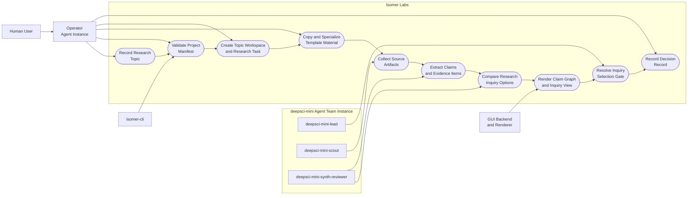
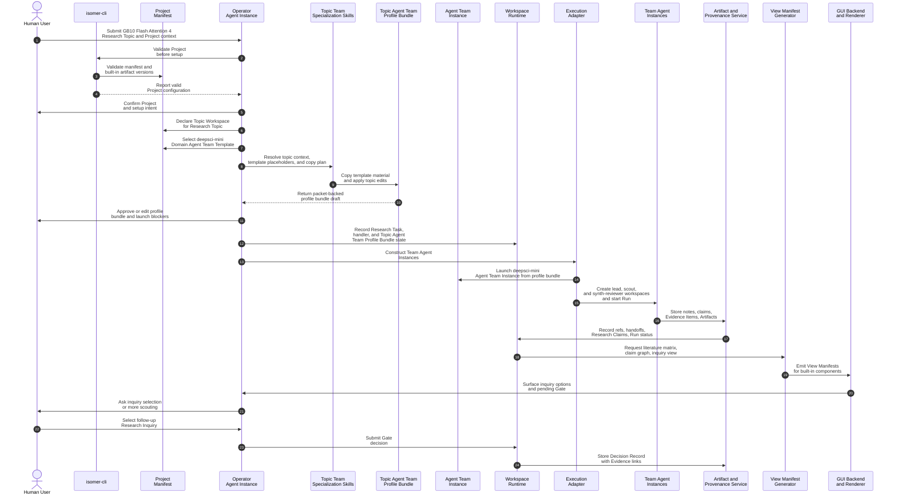

# Use Case 1: Explore a New Research Direction

## User Story

As a GPU systems researcher entering the Flash Attention 4 on DGX Spark GB10 topic, I want Isomer Labs to organize literature scouting, evidence synthesis, and direction selection so that I can choose a defensible follow-up Research Inquiry before investing in experiments.

## Scenario

The user has the Research Topic `flash-attention-gb10-peak-performance-optimization`: understand which DGX Spark GB10 and Blackwell execution-system features may make Flash Attention 4 faster, and identify promising intervention directions before running expensive kernel experiments. The user supplies the topic as a prompt or file, plus seed papers, Flash Attention 4 or related attention-kernel code, GB10 access constraints, candidate shape families, correctness tolerances, and a rough question. A Project Operator Session becomes project-aware, creates or confirms the Topic Workspace, reads the `deepsci-mini` Domain Agent Team Template, and uses Topic Team Specialization skills to copy template material into `<topic-workspace>/team-profile/` and edit placeholders, profile text, workflow instructions, or code-like template material for the concrete topic. Isomer Labs then creates an initial Research Inquiry named `gb10-flash-attention-4-direction-selection` under that topic and decomposes the work into one Research Task for literature, feature, and factor mapping.

## Step-by-Step Description

1. The user asks a Project Operator Session or Operator Agent to open a Project, understand the supplied topic prompt or topic file, record Research Topic `flash-attention-gb10-peak-performance-optimization`, and create initial Research Inquiry `gb10-flash-attention-4-direction-selection`.
2. The Project Operator Session uses `isomer-cli` to validate the Project Manifest and available Isomer built-in artifacts.
3. The Project Operator Session creates or confirms the Topic Workspace for the Research Topic before writing topic-team material.
4. The Project Operator Session selects, inspects, and validates the `deepsci-mini` Domain Agent Team Template as reusable template material rather than a launchable team.
5. The Project Operator Session performs Topic Team Specialization, optionally through a Topic Service Agent or deterministic fixture: it resolves topic context, reads template placeholders, copies required template material into `<topic-workspace>/team-profile/`, and edits placeholders, profile text, workflow instructions, or code-like template material for the GB10 Flash Attention 4 topic.
6. The Project Operator Session validates the Topic Team Instantiation Packet and asks the user to approve or edit the Topic Agent Team Profile Bundle, Workflow Stages, task handler, constraints, unresolved placeholders, and launch blockers; deterministic tests use packet-shaped approval provenance instead of a separate approval shortcut.
7. After approval, the Project Operator Session materializes the Topic Agent Team Profile Bundle under `<topic-workspace>/team-profile/`, records bundle-local approval provenance with `approval_ref`, and registers only its profile ref in the Project Manifest.
8. The Operator Agent creates a Research Task named `map-gb10-flash-attention-optimization-directions`.
9. Workspace Runtime records the Research Task, task handler, selected Topic Agent Team Profile Bundle, packet provenance, and launch-facing readiness state.
10. A Run starts; the Execution Adapter launches or simulates a `deepsci-mini` Agent Team Instance from the approved Topic Agent Team Profile Bundle and constructs the lead, scout, and synthesis-reviewer Agent Instances and their Agent Workspaces.
11. The `deepsci-mini-scout` Agent Instance collects seed sources, Flash Attention implementation notes, GB10 or Blackwell feature references, benchmark notes, shape-family constraints, and correctness constraints as Artifacts.
12. The `deepsci-mini-synth-reviewer` extracts Research Claims, Evidence Items, limitations, and disagreement points about attention-kernel bottlenecks, Tensor Core precision modes, memory hierarchy, asynchronous copy, warp specialization, cluster cooperation, and tiling choices.
13. The `deepsci-mini-synth-reviewer` clusters Evidence Items into candidate optimization factors and follow-up Research Inquiry options, such as baseline measurement design, precision-mode investigation, tile or pipeline search, and cluster-level cooperation experiments.
14. The `deepsci-mini-synth-reviewer` checks whether proposed inquiries are supported by Evidence Items, whether claims stay within recorded GB10 evidence, and whether weak or generic CUDA tuning claims are flagged.
15. The engine emits View Manifests for a literature matrix, claim graph, and inquiry-comparison view, all rendered with Built-in GUI Components.
16. The `deepsci-mini-lead` presents a Gate asking the user to choose a follow-up Research Inquiry for the GB10 Flash Attention 4 topic or request more scouting.
17. The Operator Agent stores the selected inquiry and rationale as a Decision Record with Evidence Item links.

## Mermaid Use Case Diagram

## Mermaid System Sequence Diagram

## Durable Outputs

- Research Topic `flash-attention-gb10-peak-performance-optimization` with initial Research Inquiry `gb10-flash-attention-4-direction-selection`
- Research Task `map-gb10-flash-attention-optimization-directions` for literature, feature, and factor mapping
- Topic prompt or topic file interpretation evidence for `flash-attention-gb10-peak-performance-optimization`
- Topic Workspace declared in the Project Manifest
- Topic Team Instantiation Packet recording `deepsci-mini` placeholder reconciliation, copied material choices, deferrals, bundle-local approval provenance, and provenance
- Topic Agent Team Profile Bundle under `<topic-workspace>/team-profile/`, with `profile.toml`, copied topic-specialized `deepsci-mini` material, and `deepsci-mini-lead`, `deepsci-mini-scout`, and `deepsci-mini-synth-reviewer` role bindings
- `deepsci-mini` Agent Team Instance launched or simulated from the approved Topic Agent Team Profile Bundle
- Agent Workspaces for the lead, scout, and synthesis-reviewer Agent Instances
- Literature notes, source summaries, GB10 or Blackwell feature notes, attention-kernel bottleneck notes, claim graph, inquiry comparison, and review notes as Artifacts
- Evidence Items linked to Research Claims
- Decision Record for selected follow-up Research Inquiry
- View Manifests for literature matrix, claim graph, and inquiry decision
- Built-in GUI Component Instances for literature matrix, claim graph, inquiry comparison, and pending Gate views

## Pass Criteria

UC-01 passes only when the Topic Workspace records the pinned Research Topic, packet-backed Topic Team Specialization output, approved Topic Agent Team Profile Bundle with copied topic-specialized `deepsci-mini` material, initial Research Inquiry, Research Task, Evidence Items, inquiry-comparison Artifacts, pending Gate, and selected follow-up Decision Record without requiring a GB10 measurement run. The selected follow-up inquiry must be traceable to Evidence Items and must identify whether UC-07-style measured optimization, more scouting, or a different Flash Attention 4 investigation should happen next.
