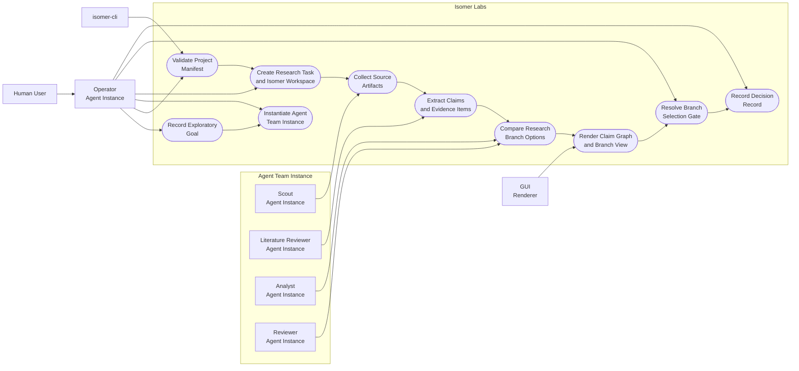
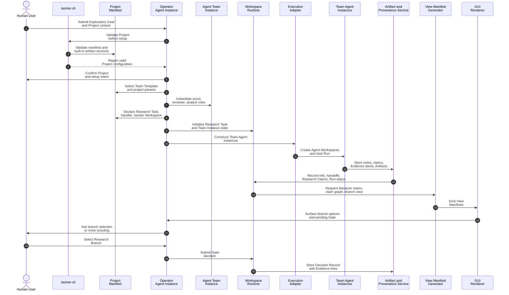

# Use Case 1: Explore a New Research Direction

## User Story

As a researcher entering an unfamiliar topic, I want Isomer Labs to organize literature scouting, evidence synthesis, and direction selection so that I can choose a defensible Research Branch before investing in experiments.

## Scenario

The user has an Exploratory Goal: understand why a model family fails on a target data regime and identify promising intervention directions. The user supplies seed papers, a code repository, data constraints, and a rough question. Isomer Labs creates a Research Thread and decomposes the work into one Research Task for literature and factor mapping.

## Step-by-Step Description

1. The user asks the Operator Agent to open a Project and record an Exploratory Goal in a new Research Thread.
2. The Operator Agent uses `isomer-cli` to validate the Project Manifest and available Isomer built-in artifacts.
3. The Operator Agent selects an Agent Team Template and instantiates an Agent Team Instance with scout, literature reviewer, analyst, and reviewer roles.
4. The Operator Agent asks the user to approve or edit the Agent Team Instance, Workflow Stages, task handler, and constraints.
5. The Operator Agent creates a Research Task named `map-failure-factors-and-directions`.
6. The Project Manifest declares one Isomer Workspace for that Research Task, the task handler, and the selected Agent Team Instance.
7. A Run starts; the Execution Adapter constructs the Agent Team Instance's scout, literature reviewer, analyst, and reviewer Agent Instances and their Agent Workspaces.
8. The scout Agent Instance collects seed sources, related papers, datasets, and benchmark notes as Artifacts.
9. The literature reviewer extracts Research Claims, Evidence Items, limitations, and disagreement points.
10. The analyst clusters Evidence Items into candidate causal factors and Research Branch options.
11. The reviewer checks whether proposed branches are supported by Evidence Items and flags weak claims.
12. The engine emits View Manifests for a literature matrix, claim graph, and branch-comparison view.
13. The Operator Agent presents a Gate asking the user to choose a Research Branch or request more scouting.
14. The Operator Agent stores the selected branch and rationale as a Decision Record with Evidence Item links.

## Mermaid Use Case Diagram

## Mermaid System Sequence Diagram

## Durable Outputs

- Research Thread with an Exploratory Goal
- Research Task for literature and factor mapping
- Agent Team Instance instantiated from an Agent Team Template, with scout, literature reviewer, analyst, and reviewer members
- Isomer Workspace declared in the Project Manifest
- Agent Workspaces for the Agent Team Instance's scout, literature reviewer, analyst, and reviewer Agent Instances
- Literature notes, source summaries, claim graph, branch comparison, and review notes as Artifacts
- Evidence Items linked to Research Claims
- Decision Record for selected Research Branch
- View Manifests for literature matrix, claim graph, and branch decision
