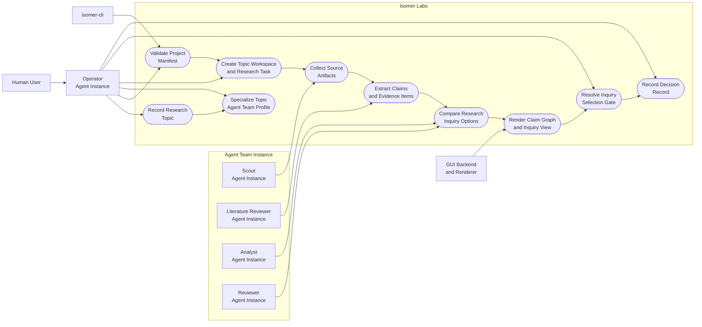
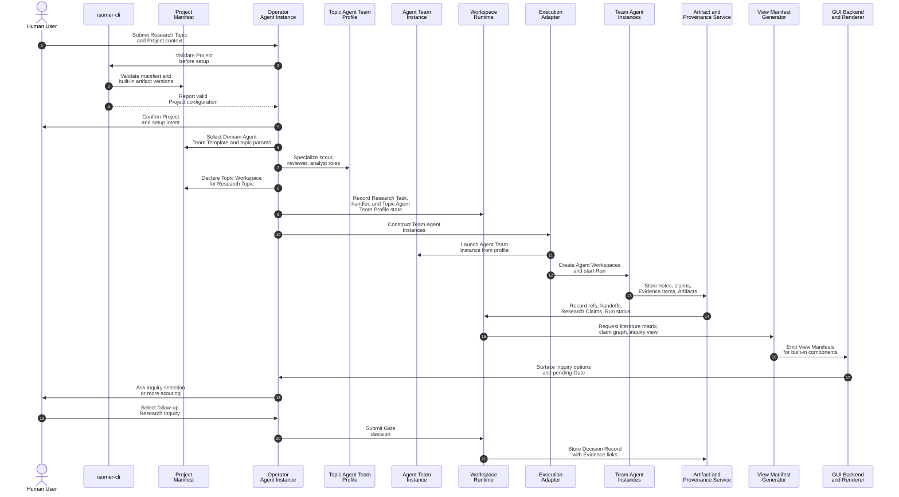

# Use Case 1: Explore a New Research Direction

## User Story

As a researcher entering an unfamiliar topic, I want Isomer Labs to organize literature scouting, evidence synthesis, and direction selection so that I can choose a defensible follow-up Research Inquiry before investing in experiments.

## Scenario

The user has a Research Topic: understand why a model family fails on a target data regime and identify promising intervention directions. The user supplies seed papers, a code repository, data constraints, and a rough question. Isomer Labs creates an initial Research Inquiry under that topic and decomposes the work into one Research Task for literature and factor mapping.

## Step-by-Step Description

1. The user asks the Operator Agent to open a Project, record a Research Topic, and create an initial Research Inquiry.
2. The Operator Agent uses `isomer-cli` to validate the Project Manifest and available Isomer built-in artifacts.
3. The Operator Agent selects a Domain Agent Team Template and specializes a Topic Agent Team Profile with scout, literature reviewer, analyst, and reviewer roles.
4. The Operator Agent asks the user to approve or edit the Topic Agent Team Profile, Workflow Stages, task handler, and constraints.
5. The Operator Agent creates a Research Task named `map-failure-factors-and-directions`.
6. The Project Manifest declares one Topic Workspace for the Research Topic and records the Research Task, task handler, and selected Topic Agent Team Profile in Workspace Runtime.
7. A Run starts; the Execution Adapter launches an Agent Team Instance from the Topic Agent Team Profile and constructs the scout, literature reviewer, analyst, and reviewer Agent Instances and their Agent Workspaces.
8. The scout Agent Instance collects seed sources, related papers, datasets, and benchmark notes as Artifacts.
9. The literature reviewer extracts Research Claims, Evidence Items, limitations, and disagreement points.
10. The analyst clusters Evidence Items into candidate causal factors and follow-up Research Inquiry options.
11. The reviewer checks whether proposed inquiries are supported by Evidence Items and flags weak claims.
12. The engine emits View Manifests for a literature matrix, claim graph, and inquiry-comparison view, all rendered with Built-in GUI Components.
13. The Operator Agent presents a Gate asking the user to choose a follow-up Research Inquiry or request more scouting.
14. The Operator Agent stores the selected inquiry and rationale as a Decision Record with Evidence Item links.

## Mermaid Use Case Diagram

## Mermaid System Sequence Diagram

## Durable Outputs

- Research Topic with an initial Research Inquiry
- Research Task for literature and factor mapping
- Topic Agent Team Profile specialized from a Domain Agent Team Template, with scout, literature reviewer, analyst, and reviewer roles
- Agent Team Instance launched from the Topic Agent Team Profile
- Topic Workspace declared in the Project Manifest
- Agent Workspaces for the scout, literature reviewer, analyst, and reviewer Agent Instances
- Literature notes, source summaries, claim graph, inquiry comparison, and review notes as Artifacts
- Evidence Items linked to Research Claims
- Decision Record for selected follow-up Research Inquiry
- View Manifests for literature matrix, claim graph, and inquiry decision
- Built-in GUI Component Instances for literature matrix, claim graph, inquiry comparison, and pending Gate views
