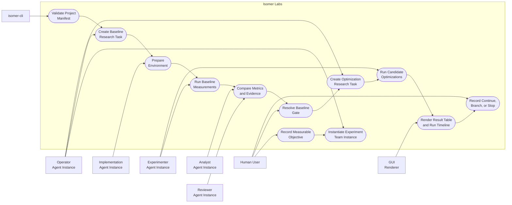
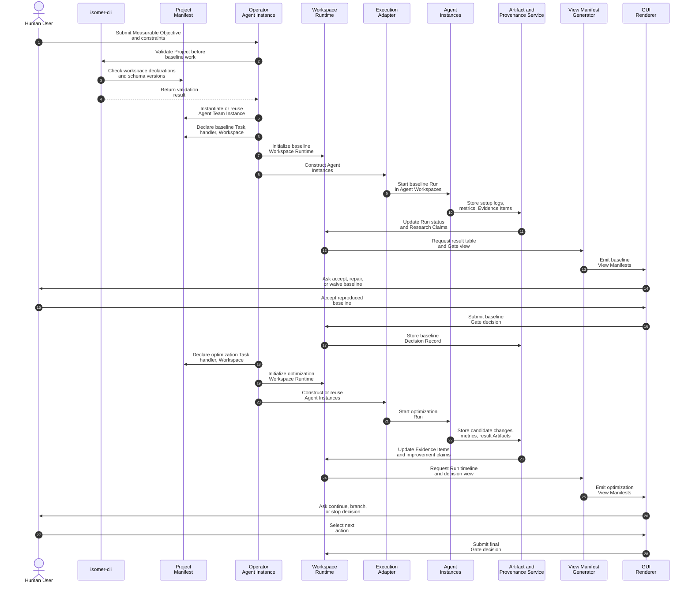

# Use Case 2: Reproduce a Baseline and Optimize It

## User Story

As a researcher improving an existing method, I want Isomer Labs to reproduce the baseline, run controlled optimization experiments, and preserve evidence so that I can trust any reported improvement.

## Scenario

The user has a Measurable Objective: improve inference latency as much as possible while preserving baseline accuracy within an accepted tolerance. The Project already contains code, data-loading scripts, and previous notes. Isomer Labs creates a Research Thread with two Research Tasks: one for baseline reproduction and one for the first optimization pass.

## Step-by-Step Description

1. The user records the Measurable Objective, metric, tolerance, available hardware, and runtime constraints.
2. `isomer-cli` validates the Project Manifest and rejects undeclared workspace paths.
3. The Operator Agent instantiates or reuses an Agent Team Instance with implementation, experimenter, analyst, and reviewer roles.
4. The user approves the team, task handler, and a Gate requiring human approval before accepting or waiving the baseline.
5. The Operator Agent creates the Research Task `reproduce-baseline`.
6. The Project Manifest declares an Isomer Workspace for `reproduce-baseline`, its task handler, and the selected Agent Team Instance.
7. A Run starts; Agent Instances receive separate Agent Workspaces.
8. The implementation Agent Instance prepares the environment and records setup commands.
9. The experimenter Agent Instance runs the baseline and writes metrics, logs, and result tables as Artifacts.
10. The analyst compares observed metrics with expected metrics and creates Evidence Items.
11. The reviewer checks repeatability, missing controls, and unsupported Research Claims.
12. A Gate asks the user to accept the reproduced baseline, request repair, or record a waiver.
13. After acceptance, the Operator Agent creates a second Research Task named `first-optimization-pass`.
14. A new Isomer Workspace is declared for the optimization Research Task.
15. The team runs candidate optimizations, records tool calls and outputs, and updates Research Claims.
16. The GUI renders a Run timeline, result table, and Gate for continue, branch, or stop.
17. The user selects the next action; Isomer records the choice as a Decision Record.

## Mermaid Use Case Diagram

## Mermaid System Sequence Diagram

## Durable Outputs

- Research Thread with a Measurable Objective
- Research Tasks for baseline reproduction and optimization
- Agent Team Instance instantiated from an Agent Team Template
- Two Isomer Workspaces, each scoped to one Research Task, one task handler, and the selected Agent Team Instance
- Environment setup logs, baseline metrics, optimization metrics, result tables, and reviewer notes as Artifacts
- Evidence Items supporting or contradicting improvement claims
- Research Claims about baseline reproduction and optimization gains
- Gate result for baseline acceptance or waiver
- Decision Record for continue, branch, or stop
- View Manifests for Run timeline, result table, and experiment decision view
