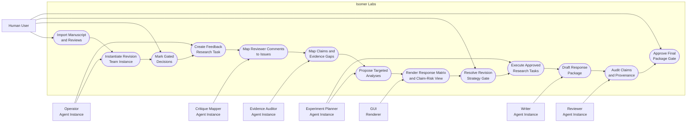
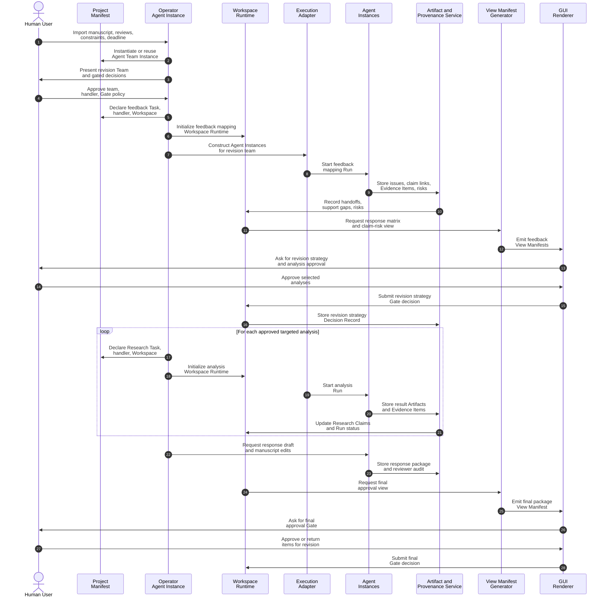

# Use Case 3: Plan and Execute a Paper Revision

## User Story

As a researcher revising a paper, I want Isomer Labs to map reviewer feedback to claims, evidence gaps, and revision tasks so that I can produce a focused response package without losing provenance.

## Scenario

The user imports a draft manuscript, reviewer comments, figure files, experiment logs, and prior notes. The Research Goal is to decide how to revise the paper and produce a supported response plan. Isomer Labs creates a Research Thread with Research Tasks for feedback mapping and targeted revision work.

## Step-by-Step Description

1. The user creates a Research Thread and supplies the manuscript, reviews, constraints, and deadline.
2. The Operator Agent instantiates or reuses an Agent Team Instance with critique mapper, evidence auditor, experiment planner, writer, and reviewer roles.
3. The user edits the Agent Team Instance, task handler, and marks claim strengthening, new experiments, and final response text as gated decisions.
4. The Operator Agent creates the Research Task `map-review-feedback`.
5. The Project Manifest declares an Isomer Workspace for that Research Task, its task handler, and the selected Agent Team Instance.
6. A Run starts; Agent Instances receive Agent Workspaces with advisory Workspace Boundaries.
7. The critique mapper turns reviewer comments into issue Artifacts and links them to manuscript sections.
8. The evidence auditor maps each issue to Research Claims, Evidence Items, missing support, and contradiction risks.
9. The experiment planner proposes targeted Research Tasks for missing analyses or robustness checks.
10. The GUI renders a reviewer-response matrix, claim-risk view, and pending Gate list.
11. A Gate asks the user to approve the revision strategy and choose which targeted analyses to run.
12. The Operator Agent records the approved plan as a Decision Record.
13. For each approved analysis, Isomer creates a new Research Task with its own Isomer Workspace.
14. The team executes Runs, records result Artifacts, and updates Evidence Items.
15. The writer drafts response text and manuscript edits only for claims with enough support.
16. The reviewer audits claim strength, unsupported wording, and missing provenance.
17. A final Gate asks the user to approve the response package or send selected items back for revision.

## Mermaid Use Case Diagram

## Mermaid System Sequence Diagram

## Durable Outputs

- Research Thread for paper revision
- Research Tasks for feedback mapping and approved targeted analyses
- Agent Team Instance instantiated from an Agent Team Template
- Isomer Workspaces scoped to each Research Task, task handler, and selected Agent Team Instance
- Reviewer-response matrix, issue list, claim-risk map, experiment plan, result summaries, and response draft as Artifacts
- Evidence Items linked to revised Research Claims
- Gates for revision strategy, claim strengthening, new analyses, and final package approval
- Decision Records for approved revision strategy and final response package
- View Manifests for response matrix, claim-risk view, Run timeline, and final approval view
