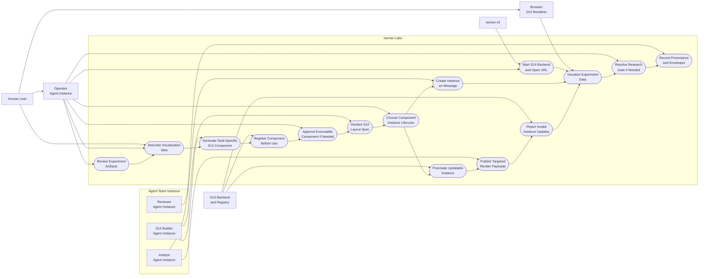
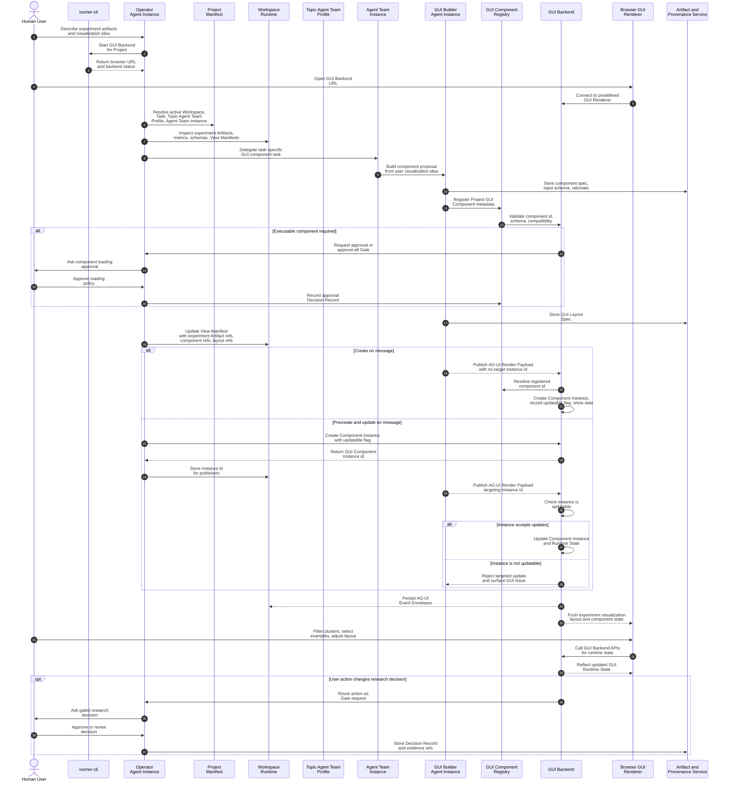

# Use Case 4: Generate a Task-Specific GUI Component

## User Story

As a researcher reviewing experiment artifacts, I want to describe a task-specific visualization idea to the Operator Agent so that Isomer Labs can generate a GUI component and use it to inspect the experiment data.

## Scenario

The user is analyzing experiment Artifacts from many Runs: nested metrics, failure tags, example-level outputs, logs, and notes. After looking at the available Artifacts, the user forms a visualization idea: an error-cluster explorer that links metrics, examples, notes, and candidate fixes. The user directs the Operator Agent to generate a task-specific GUI component for that view. Isomer Labs uses the Operator Agent and an Agent Team Instance created from a Topic Agent Team Profile to create a Project GUI Component, register it, arrange it with a GUI Layout Spec, and feed it experiment data through AG-UI Render Payloads.

The component instance lifecycle has two supported paths. In create-on-message mode, an AG-UI Render Payload arrives without a target GUI Component Instance id; the GUI Backend selects the registered component, creates a new GUI Component Instance, and shows the payload data. In targeted-update mode, the GUI Component Instance is created beforehand with an instance id, and later publishers send AG-UI Render Payloads that target that id. Not every GUI Component Instance is updatable. The creation request must declare whether the instance accepts updates, and the GUI Backend must reject targeted updates for instances that were created as non-updatable.

## Step-by-Step Description

1. The user reviews existing experiment Artifacts in an active Research Inquiry and notices that built-in tables do not expose the error patterns clearly.
2. The user tells the Operator Agent the visualization idea: group failed examples by cluster, link each cluster to metrics, notes, candidate fixes, and source Artifacts, and keep a Run timeline beside the view.
3. The Operator Agent uses `isomer-cli` to start the built-in GUI Backend, which reports a browser URL for the predefined GUI Renderer.
4. The user opens the GUI Backend URL in a browser.
5. The Operator Agent inspects the target Artifacts, data schemas, and existing Built-in GUI Components to decide whether a task-specific component is needed.
6. The Operator Agent creates a bounded Research Task named `build-error-cluster-view` and delegates it to a GUI-capable Agent Instance from the selected Agent Team Instance created from the selected Topic Agent Team Profile.
7. The Agent Instance proposes a Declarative GUI Component Spec for the error-cluster explorer, including expected input schema, component id, display behavior, and required Artifact refs.
8. The GUI Backend validates and registers the task-specific Project GUI Component in the GUI Component Registry.
9. If the component requires executable UI code, the Operator Agent presents a Gate for per-component approval or project-scoped approve-all before the GUI Backend loads it.
10. The Agent Instance writes a GUI Layout Spec that places the error-cluster explorer beside built-in Run timeline, result table, and Artifact preview components.
11. The engine emits or updates a View Manifest that references the registered component id, experiment Artifacts, and the GUI Layout Spec.
12. The Operator Agent chooses a GUI Component Instance lifecycle for the view. For a one-off static visualization, it can use create-on-message mode. For a live dashboard or repeated experiment stream, it can create an instance beforehand and mark it updatable.
13. In create-on-message mode, the Agent Instance publishes an AG-UI Render Payload with experiment metrics, cluster labels, example refs, Artifact refs, and component hints but no target instance id.
14. The GUI Backend resolves the AG-UI Render Payload to the registered GUI Component, creates a new GUI Component Instance, records whether it is updatable, and shows the data.
15. In targeted-update mode, the Operator Agent or GUI Backend API creates a GUI Component Instance first, declares `updatable = true`, records its instance id, and places it in the GUI Layout Spec.
16. Later publishers send AG-UI Render Payloads targeting that GUI Component Instance id. The GUI Backend checks the instance's updatable flag before applying the update.
17. If a publisher targets a non-updatable GUI Component Instance, the GUI Backend rejects the update, records an AG-UI Event Envelope with rejection status, and surfaces a GUI issue instead of mutating the instance.
18. The GUI Renderer reflects accepted backend state changes immediately, showing the task-specific explorer over the experiment data in the browser.
19. The user filters clusters, selects examples, and changes layout state through the GUI; these interactions update GUI Runtime State through GUI Backend APIs.
20. If the user action would change research direction, accept a claim, or approve downstream work, the GUI routes that action through the Operator Agent as a Gate.
21. The Operator Agent records any gated decision as a Decision Record, and the Artifact and Provenance Service records component registration, component instance creation, update policy, payload refs, layout refs, and AG-UI Event Envelopes.

## Mermaid Use Case Diagram

## Mermaid System Sequence Diagram

## Durable Outputs

- Research Task for generating and using the task-specific GUI component
- Project GUI Component registration entry, with Built-in versus Project origin recorded clearly
- Declarative GUI Component Spec or Executable GUI Component manifest
- Approval Decision Record when an Executable GUI Component is loaded or approve-all is enabled
- GUI Layout Spec for arranging the task-specific explorer with built-in components
- View Manifest referencing the registered component id, experiment Artifact refs, and layout refs
- AG-UI Render Payloads for experiment metrics, clusters, examples, and Artifact refs
- GUI Component Instances with declared lifecycle mode, instance id when pre-created, and `updatable` flag
- GUI Runtime State records where retained by policy
- AG-UI Event Envelopes for live payload and GUI state updates
- Rejection AG-UI Event Envelopes for invalid targeted updates to non-updatable instances
- Provenance Records linking the component, payloads, layout, Artifacts, and gated decisions
