# Use Case 5: Mix Manual and Automatic Runs

## User Story

As a researcher running a fragile experiment workflow, I want to manually direct selected Agent Instances while letting routine team work run automatically so that I can keep control over risky steps without losing durable state, provenance, or recovery.

## Scenario

The user has a Measurable Objective: improve a model's robustness on a new evaluation set. The Project already has a baseline implementation and a partially working evaluation script. The user wants automatic team execution for routine baseline, experiment, analysis, and review work, but wants Manual Mode for a fragile environment-repair step routed through the Service Team and a custom error-analysis pass.

This use case is split into substages so each transition is easier to inspect:

1. Setup and automatic baseline validation.
2. Single-stage Manual Mode environment repair.
3. Automatic candidate experiment Runs.
4. Multi-step Manual Mode error analysis.
5. Next-action Gate and durable closeout.

## Substage Map

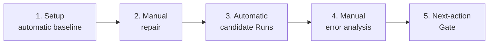

## Substage 1: Setup and Automatic Baseline Validation

### Purpose

Create the Research Thread, approve the team profile and watcher defaults, then run baseline validation automatically.

### User Activity Diagram

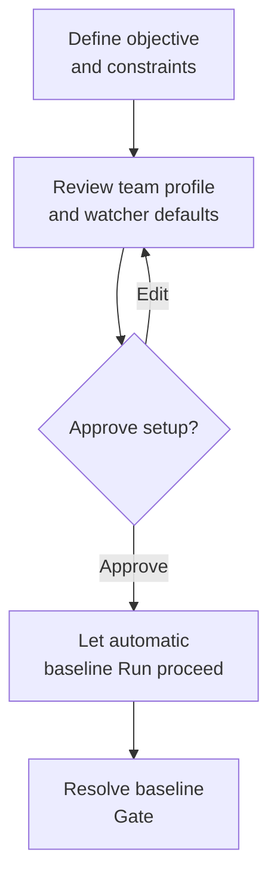

### Steps

1. The user asks the Operator Agent to create a Research Thread with a Measurable Objective, robustness metric, expected baseline behavior, and a constraint that fragile environment repair should stay under manual control.
2. The Operator Agent validates the Project Manifest, selected Isomer Workspaces, and available built-in artifacts through `isomer-cli`.
3. The Operator Agent specializes or reuses a Topic Agent Team Profile with implementation, experimenter, analyst, and reviewer roles.
4. The Operator Agent asks the user to approve the Topic Agent Team Profile, Workflow Stages, Gate policy, and Coordination Policy defaults for Manual Mode Completion Watcher Contracts.
5. The Operator Agent creates a `validate-baseline` Research Task and declares an Isomer Workspace for it in the Project Manifest.
6. An automatic Run starts with `control_mode = automatic`; the Execution Adapter launches or resolves the Agent Team Instance and its Agent Instances.
7. The experimenter Agent Instance runs the baseline validation automatically and records logs, metrics, and result tables as Artifacts.
8. The analyst Agent Instance compares baseline metrics with expected values and creates Evidence Items for the baseline Gate.
9. The Operator Agent presents a Gate asking the user to accept, repair, or waive the baseline.

### Mermaid Sequence

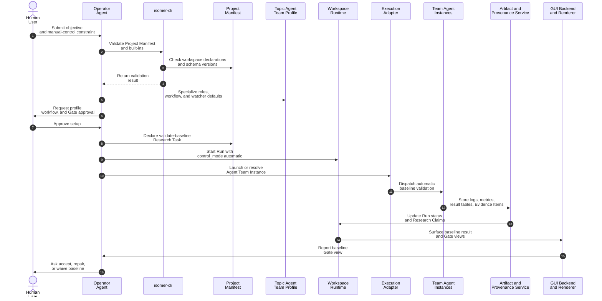

## Substage 2: Single-Stage Manual Mode Environment Repair

### Purpose

Run one manually controlled repair step after baseline acceptance. This demonstrates a Manual Mode Run with `prompt_scope_kind = single_stage`.

### User Activity Diagram

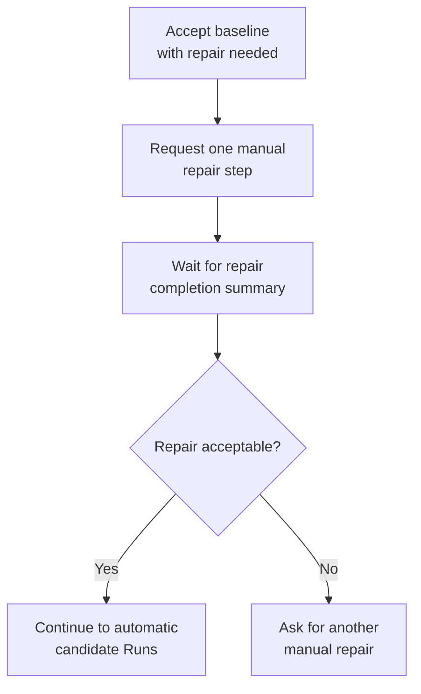

### Steps

1. The user accepts the baseline but asks for a manual environment-repair operation before candidate experiments because the evaluation script has unstable local dependencies.
2. The Operator Agent starts a manual Run with `control_mode = manual`, `prompt_scope_kind = single_stage`, and a prompt ref that records the user's repair instruction.
3. The Operator Agent opens a Service Request for the Service Team, targeting the experimenter Agent Workspace and the evaluation-script tech stack.
4. The Operator Agent selects a Service Dispatch Form. It can use `tool_native_subagent` if its execution surface has native subagent tooling, or `launched_service_agent` if the Execution Adapter should launch or resolve a service agent and dispatch the request.
5. Before messaging the Service Agent Instance, the Operator Agent opens a manual handoff in Workspace Runtime with `dispatch_mode = manual_direct`.
6. The Watcher Resolver copies a resolved Completion Watcher Contract from Coordination Policy onto the handoff. For this Service Request, the contract watches a `repair-report.md` file and a channel reply that carries the handoff id.
7. The Operator Agent sends the direct repair instruction through the selected service dispatch form.
8. The Service Agent Instance inspects and repairs the target Agent Workspace environment setup, writes `repair-report.md`, and replies on the configured channel with the handoff id.
9. Signal Observations record the file observation and channel reply.
10. The Completion Normalizer validates the repair report, links setup Artifacts, and records handoff completion in Workspace Runtime.
11. Because the manual prompt was single-stage, the Operator Agent summarizes the repair result and waits for the user's next instruction.

### Mermaid Sequence

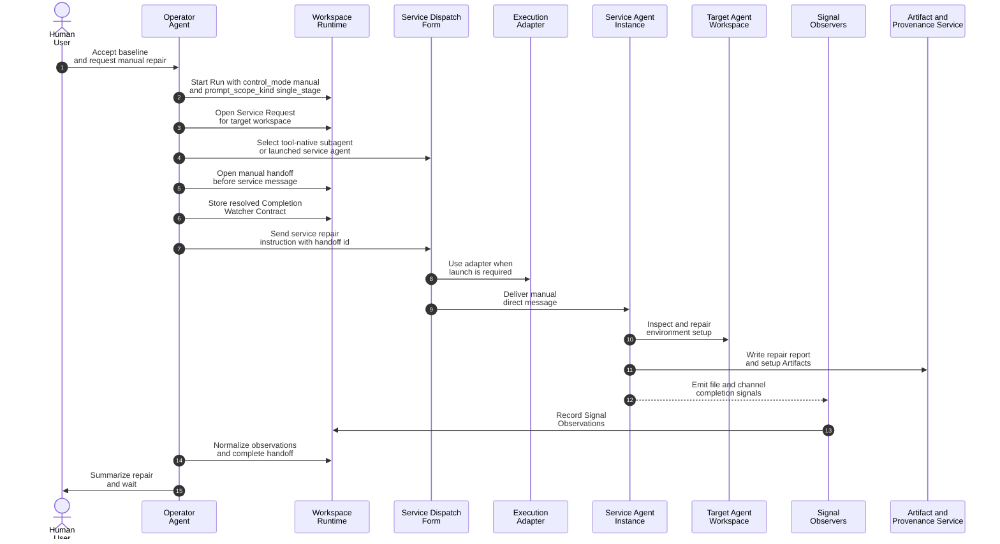

## Substage 3: Automatic Candidate Experiment Runs

### Purpose

Resume automatic execution after the single-stage manual repair completes.

### User Activity Diagram

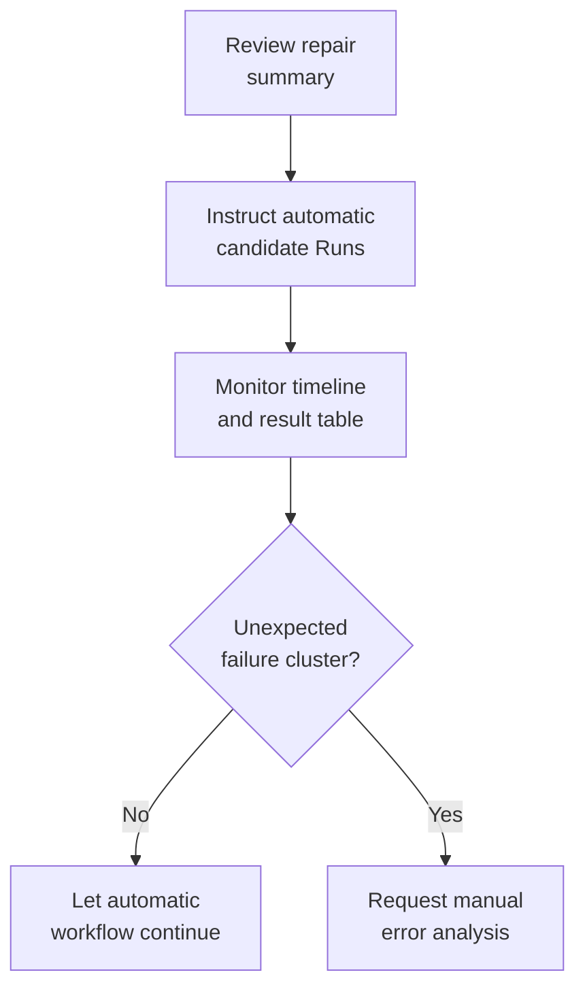

### Steps

1. The user instructs the Operator Agent to continue automatically with two candidate experiment Runs.
2. The Operator Agent creates or resumes the `candidate-robustness-experiments` Research Task.
3. The Operator Agent starts automatic Runs for the candidate experiments with `control_mode = automatic`.
4. The experimenter Agent Instance runs the candidate experiments automatically.
5. The analyst Agent Instance records measurements, Evidence Items, and Research Claims about robustness changes.
6. The GUI Backend and Renderer show a Run timeline, result table, open Research Claims, and experiment comparison View Manifests.

### Mermaid Sequence

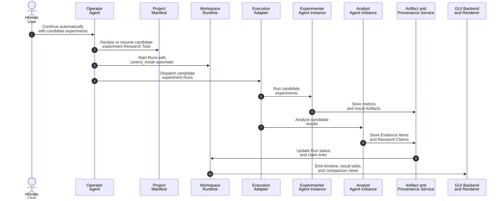

## Substage 4: Multi-Step Manual Mode Error Analysis

### Purpose

Use Manual Mode for a two-step analysis requested in one user prompt. The Operator Agent may continue from analyst to reviewer because both steps are inside the user's declared prompt scope.

### User Activity Diagram

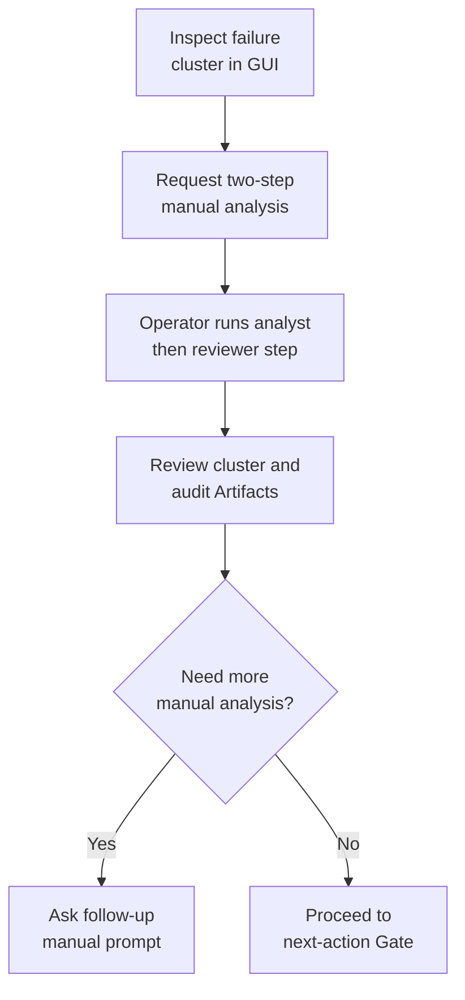

### Steps

1. The user notices an unexpected failure cluster in the GUI and asks the Operator Agent to manually run a two-step error-analysis pass: first ask the analyst to cluster failures, then ask the reviewer to audit the cluster explanations.
2. The Operator Agent starts a manual Run with `control_mode = manual`, `prompt_scope_kind = multi_step`, and a manual plan ref that names the analyst clustering step and reviewer audit step.
3. The Operator Agent opens a manual handoff for the analyst before sending the direct clustering message.
4. The analyst Agent Instance produces the cluster Artifact and returns a channel reply with the handoff id.
5. Signal Observations record the analyst completion signals, and the Operator Agent records analyst handoff completion in Workspace Runtime.
6. Because the prompt defined a second in-scope step, the Operator Agent automatically opens a second manual handoff for the reviewer.
7. The reviewer Agent Instance audits the cluster explanations, writes a review Artifact, and returns a channel reply with the handoff id.
8. The Operator Agent records Signal Observations, validates the review Artifact, records reviewer handoff completion, and stops because the user-declared multi-step prompt is complete.

### Mermaid Sequence

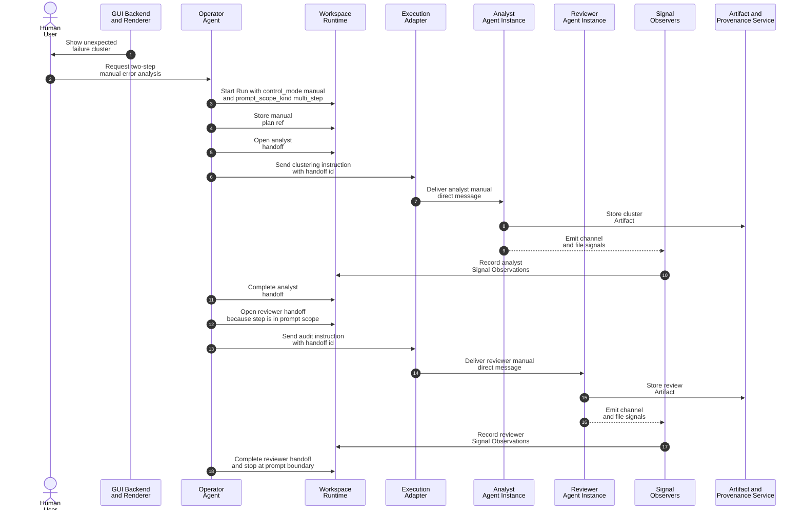

## Substage 5: Next-Action Gate and Durable Closeout

### Purpose

Convert the mixed automatic and manual work into an explicit research decision.

### User Activity Diagram

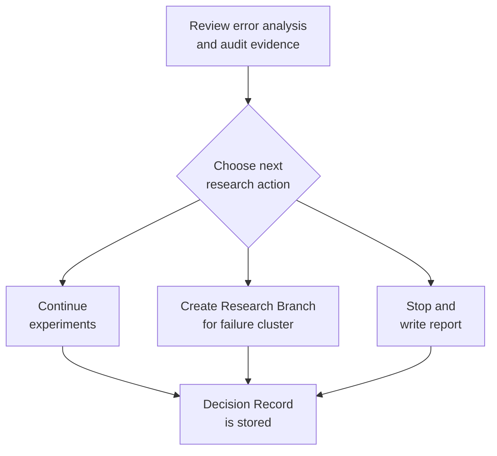

### Steps

1. The Operator Agent emits or updates View Manifests for the error-cluster summary, reviewer audit, manual handoff status, and next-action Gate.
2. The Operator Agent presents a Gate asking the user whether to continue experiments, create a Research Branch for the failure cluster, or stop and write a report.
3. The user's decision is recorded as a Decision Record with links to the manual Run handoffs, Signal Observations, Artifacts, Evidence Items, and Research Claims.

### Mermaid Sequence

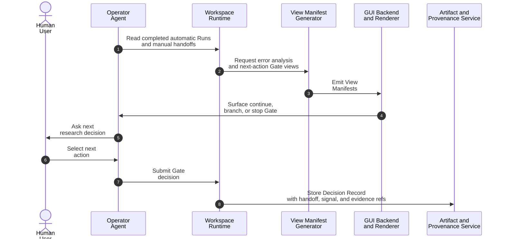

## Durable Outputs

- Research Thread with a Measurable Objective for robustness improvement
- Topic Agent Team Profile with implementation, experimenter, analyst, and reviewer roles
- Coordination Policy defaults for Manual Mode Completion Watcher Contracts
- Agent Team Instance launched or resolved from the Topic Agent Team Profile
- Isomer Workspaces for baseline validation, candidate experiments, manual environment repair, and manual error analysis as needed
- Automatic Runs for baseline validation and candidate experiments with `control_mode = automatic`
- Manual Runs for environment repair and error analysis with `control_mode = manual`
- Manual Run prompt-scope metadata for `single_stage` repair and `multi_step` error analysis
- Service Request for fragile environment repair by the built-in Service Team
- Service Dispatch Form for the repair request, either `tool_native_subagent` or `launched_service_agent`
- Manual handoffs opened before direct messages to the Service Agent Instance, analyst Agent Instance, and reviewer Agent Instance
- Resolved Completion Watcher Contracts stored on each manual handoff
- Signal Observations from file observation, channel replies, and Agent Instance inspection when used
- Repair report, setup logs, metrics, result tables, failure clusters, analyst notes, and reviewer audit as Artifacts
- Evidence Items linked to baseline and robustness Research Claims
- View Manifests for Run timeline, result table, failure clusters, manual handoff status, and next-action Gate
- Decision Record for the next research action, linked to manual handoffs, Signal Observations, Artifacts, Evidence Items, and Research Claims
