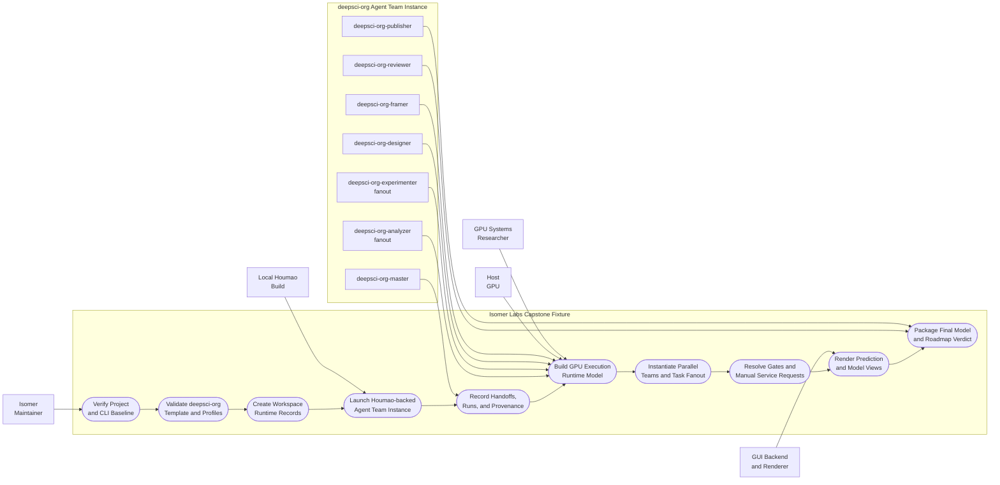
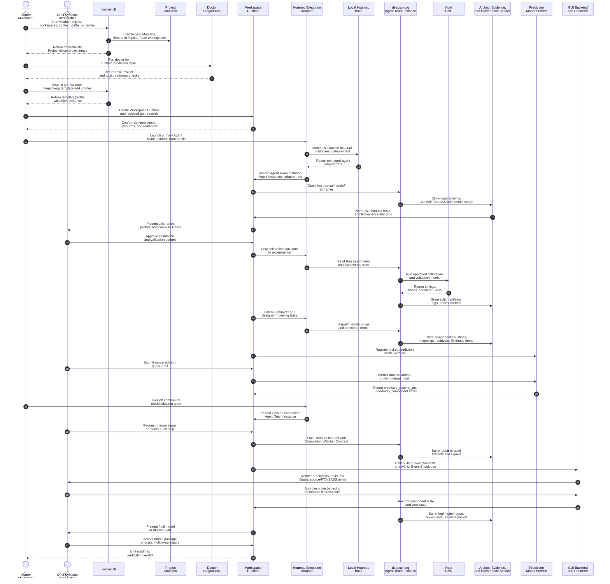

# Use Case 6: Capstone Roadmap Verification with Flash Attention 4 Runtime Prediction on the Host GPU

## User Story

As the Isomer Labs maintainer and GPU systems researcher, I want one real, demanding research scenario where `deepsci-org` builds a white-box GPU execution-system performance model for Flash Attention 4 on the GPU discovered from the host during topic materialization, so that ROADMAP.md can be verified against a practical end-to-end system test and the user can predict runtime in milliseconds from the Flash Attention 4 input, CUDA kernel source code, PTX, and SASS without directly running and measuring the queried input.

## Scenario

The practical Research Topic is: "how to predict the Flash Attention 4 runtime in milliseconds, without running it and measuring directly, by discovering the host GPU during topic materialization, binding it to `{host_gpu_model}`, and building a white-box performance model of that materialized GPU execution system from the Flash Attention 4 input, CUDA kernel source code, PTX, and SASS." The model should approximate how each execution-system part consumes time and how those parts compose into total runtime. This topic is intentionally chosen as the capstone because it is concrete, hardware-bound, evidence-heavy, model-driven, and visually inspectable. It also forces Isomer Labs to coordinate Project discovery, Pixi readiness, host GPU discovery, `deepsci-org` specialization, Workspace Runtime, Houmao-backed team execution, calibration and validation records, source-to-PTX-to-SASS modeling Artifacts, Gates, Research Claims, and GUI inspection inside one Project.

UC-06 is the final acceptance path for ROADMAP.md. Earlier use cases still test focused slices, but UC-06 must eventually run as the real practical system verification that proves all major Isomer Labs functionality works together inside one Project.

## Capstone Verification Contract

UC-06 is not just a research example. It is the system acceptance fixture that should become runnable as ROADMAP.md milestones mature.

- It starts from a user-owned Project and uses only Project Manifest-declared Research Topics, Topic Workspaces, Domain Agent Team Templates, Topic Agent Team Profiles, and Pixi environment bindings.
- It uses `teams/deepsci-org` as the Domain Agent Team Template and specializes it into one Topic Agent Team Profile per Research Topic.
- It uses local Houmao as the underlying implementation layer through a Houmao Execution Adapter, while keeping Houmao-specific terms inside adapter records rather than Isomer core schema fields.
- It creates Workspace Runtime state, Agent Team Instance records, Agent Instance records, Agent Workspaces, Runs, handoffs, Service Requests, Gates, Artifacts, Provenance Records, Evidence Items, Findings, Research Claims, Decision Records, View Manifests, and GUI Component records.
- It verifies both topic-level parallel execution across multiple Research Topics with different dedicated Agent Team Instances and task-level fanout for scalable `deepsci-org-experimenter` and `deepsci-org-analyzer` roles.
- It produces a final white-box prediction model that accepts a Flash Attention 4 input description plus CUDA source, PTX, and SASS references, then returns predicted runtime in milliseconds, uncertainty or validity scope, and an additive or compositional explanation of which materialized host GPU execution-system terms dominate the prediction.

## Assumptions and Scope

- "Flash Attention 4", `{host_gpu_model}`, and `{host_gpu_architecture}` are treated as topic terms whose GPU values are unresolved until topic materialization records host GPU discovery evidence. The use case does not assert hardware facts, internal architecture facts, or model accuracy before the team records evidence.
- "Without running it and measuring directly" means the system must not run the exact target input after receiving a prediction query in order to answer that query. Calibration and held-out validation Runs are allowed when they are recorded separately and do not leak measured target results into the prediction.
- "White-box performance modeling" means the model must expose explicit GPU execution-system terms, such as source-level kernel phases, PTX instruction classes, SASS instruction mix, issue and dependency constraints, memory hierarchy effects, scheduler and occupancy constraints, tensor or matrix pipeline terms, launch overhead, data movement, synchronization, shape-specific resource pressure, and kernel configuration assumptions. A pure black-box regression is insufficient for final acceptance.
- CUDA kernel source code, PTX, and SASS are required modeling inputs. They may come from checked-in source, generated build Artifacts, disassembly commands, or user-provided files, but UC-06 must record their identity, compiler flags, target architecture, hashes, and provenance before the model can make accepted predictions.
- The accepted model should be compositional: it should estimate time consumed by named execution-system parts and record how those parts add, overlap, serialize, or form a critical path. A single fitted equation with no source-to-PTX-to-SASS traceability is insufficient.
- The primary Research Topic is named `flash-attention-host-gpu-runtime-prediction`. A companion Research Topic or strategy topic, such as `flash-attention-host-gpu-blackbox-baseline` or `flash-attention-host-gpu-model-ablation`, verifies multi-topic and multi-team isolation.
- Each Research Topic resolves to a Topic Workspace Pixi workspace through either an explicit `topic_standalone_pixi_bindings.manifest_path_or_dir` target or the implicit registered Topic Workspace directory default. The Topic Workspace for `flash-attention-host-gpu-runtime-prediction` contains its own Pixi manifest and lockfile. The companion topics each have their own Topic Workspace Pixi workspaces, so dependencies do not leak across topics. Isomer never infers the binding from names.
- Manual Mode is required for credentialed, destructive, expensive, private, or long-running hardware actions. Automatic mode is allowed for bounded analysis, validation, report drafting, replay, and prediction-model checks.

## Roadmap Verification Matrix

| Roadmap Area | UC-06 Verification Requirement | Observable Pass Evidence |
| --- | --- | --- |
| Milestone 1: Platform Skeleton and Project Discovery | The fixture Project can be initialized, discovered, validated, and inspected with CLI commands, and Effective Topic Context resolves for all UC-06 topics. | `isomer-cli validate`, `topics list`, `workspaces list`, `context show`, `paths preview`, and `schemas list` succeed with deterministic JSON and no undeclared workspace scans. |
| Milestone 2: `deepsci-org` Template Registration and Validation | The Project can list, inspect, and validate `teams/deepsci-org` as a Domain Agent Team Template before topic specialization. | Template CLI output reports the seven roles, stage routes, generated package artifacts, and no concrete Research Topic, launch, mailbox, credential, or runtime truth in the template layer. |
| Milestone 3: Topic Agent Team Profile Specialization | UC-06 creates different Topic Agent Team Profiles from the same `deepsci-org` template for the runtime-prediction topic and companion validation or ablation topics. | Profile validation proves topic refs, Agent Workspace refs, policy refs, expected Artifacts, fanout policy, and reviewer access do not leak across topics. |
| Milestone 4: Workspace Runtime for Multi-Team Instantiation | Each Topic Workspace can create, reopen, inspect, and validate Workspace Runtime records for Research Inquiries, Research Tasks, Runs, Agent Team Instances, Agent Instances, Agent Workspaces, handoffs, Artifacts, model records, and Views. | Restarting the process preserves and validates all runtime records, and broken refs or cross-topic leaks are rejected. |
| Milestone 5: Houmao Execution Adapter and First Real Team Launch | Isomer launches a manual-mode `deepsci-org` Agent Team Instance through local Houmao, records adapter refs, dispatches one master-to-specialist handoff, and normalizes the result into Workspace Runtime. | A Run contains an Agent Team Instance, Agent Instances, adapter refs, handoff state, produced Artifacts, and Provenance Records without exposing Houmao terms as core Isomer fields. |
| Milestone 6: UC-01 Headless Vertical Slice | UC-06 begins with a headless research-direction slice that frames the prediction-model inquiry, records initial Evidence Items, and opens a follow-up Research Inquiry Gate. | The first headless slice leaves Research Topic, Research Inquiry, Research Task, Run, Gate, Decision Record, Artifacts, Evidence Items, and Provenance Records. |
| Milestone 7: Parallel Topics and Repeated Team Instantiation | The Project launches or simulates separate `deepsci-org` Agent Team Instances for the primary runtime-prediction topic and companion topic, and also fans out experimenter/analyzer tasks inside the primary topic. | Listing, stopping, parking, resuming, or repairing one team does not corrupt another team's Workspace Runtime state, Agent Workspaces, mailbox refs, Run ids, Artifact refs, Gate refs, model refs, or provider refs. |
| Milestone 8: Operator Control Loop, Research Records, and Built-In Views | UC-06 records manual and automatic Runs, Completion Watcher Contracts, Signal Observations, completion normalization, Gates, Artifacts, Evidence Items, Findings, Research Claims, model validity claims, source/PTX/SASS provenance, and built-in View Manifests. | CLI or GUI inspection shows Run timelines, handoff queues, Artifact lists, source-to-PTX-to-SASS model records, Research Claim graphs, decision queues, pending Gates, and Agent Team Instance status. |
| Milestone 9: UC-02 and UC-03 Workflow Verification | UC-06 includes calibration baseline setup, execution-system model validation, model-ablation Research Tasks, component timing tables, error tables, Evidence Items, Research Claims, reviewer audit, technical report drafting, and final approval Gates. | Calibration acceptance or waiver, locked prediction records, held-out validation results, residual analysis, component-time attribution, claim-evidence map, audit records, and final package Gate all survive validation and replay. |
| Milestone 10: UC-04 and UC-05 Interactive Operation Verification | UC-06 loads built-in and project-specific GUI views, exercises executable component Gates when needed, mixes Manual Mode hardware/profiler/source-disassembly setup with automatic model analysis, and records Service Requests and manual completion signals. | The GUI path renders prediction queries, predicted-vs-measured validation plots, residual slices, CUDA/PTX/SASS mappings, execution-system term breakdowns, claim graph, Gate queue, and a project-specific prediction dashboard with persisted AG-UI Event Envelopes. |
| Cross-Cutting Work | Domain language, Pixi readiness, Houmao boundary, OpenSpec-to-test promotion, skillset validation, and user-owned Project posture stay intact during the full capstone. | Validation logs show canonical Isomer terms, explicit Pixi bindings, Houmao adapter encapsulation, passing research skill validation, and no hidden platform-only workspace assumptions. |

## Substage Map

```mermaid
flowchart LR
  S1["1. Project fixture<br/>and CLI baseline"]
  S2["2. Template and<br/>profile readiness"]
  S3["3. Workspace Runtime<br/>and topic isolation"]
  S4["4. Houmao launch<br/>and handoff loop"]
  S5["5. Prediction inquiry<br/>and input contract"]
  S6["6. Calibration and<br/>execution model"]
  S7["7. Validation,<br/>claims, and views"]
  S8["8. GUI component<br/>and mixed control"]
  S9["9. Final model<br/>and roadmap verdict"]

  S1 --> S2 --> S3 --> S4 --> S5 --> S6 --> S7 --> S8 --> S9
```

## Main Success Scenario

1. The maintainer checks out a user-owned Isomer Project fixture for UC-06 and verifies that it contains a `.isomer-labs/` Project Config Directory, Project Manifest, primary Research Topic, companion Research Topic, Topic Workspaces, and a Topic Workspace Pixi manifest and lockfile inside each Topic Workspace.
2. The Operator Agent runs the Milestone 1 CLI path: `isomer-cli validate`, `topics list`, `workspaces list`, `context show --topic flash-attention-host-gpu-runtime-prediction`, `paths preview --topic flash-attention-host-gpu-runtime-prediction`, and `schemas list`.
3. The Operator Agent runs `isomer-cli doctor --topic flash-attention-host-gpu-runtime-prediction --json` and confirms that Pixi is available, the Topic Workspace Pixi manifest exists, a matching `pixi.lock` is present, and explicit topic Pixi bindings are valid.
4. The Operator Agent lists, inspects, and validates the `deepsci-org` Domain Agent Team Template and checks that the template remains topic-neutral.
5. The Operator Agent specializes or loads Topic Agent Team Profiles for `flash-attention-host-gpu-runtime-prediction` and the companion topic, then validates both profiles and confirms that topic-specific refs, Agent Workspace refs, policy refs, and expected Artifacts do not cross.
6. The Operator Agent creates or opens Workspace Runtime in each Topic Workspace, records schema version, resolved paths, path sources, default runtime directories, and a readiness record for the bound Pixi environments.
7. The Operator Agent creates the first Research Inquiry `host-gpu-flash-attention-runtime-prediction-model`, plus initial Research Tasks for input schema, CUDA/PTX/SASS artifact inventory, calibration design, host GPU execution-system model intake, and artifact readiness.
8. Through the Houmao Execution Adapter, the Operator Agent launches a manual-mode `deepsci-org` Agent Team Instance from the primary Topic Agent Team Profile.
9. The master Agent Instance dispatches a first handoff to the framer Agent Instance, receives a result through Houmao mail or gateway surfaces, and the Operator Agent normalizes the handoff into Workspace Runtime with produced Artifacts and Provenance Records.
10. The framer Agent Instance records the prediction input schema, including attention shape parameters, precision or dtype, causal or masking mode, kernel variant, hardware target statement, CUDA source ref, PTX ref, SASS ref, compiler flags, target architecture, source identity, validity constraints, and target output `predicted_runtime_ms`.
11. The framer creates a calibration and held-out validation plan. The plan explicitly separates calibration inputs, model-selection inputs, held-out validation inputs, and future prediction-query inputs so direct measurement leakage is detectable.
12. The Operator Agent opens a Gate for calibration Runs, profiler access, and host GPU compute budget. The user accepts, requests repair, or records a waiver or blocker.
13. The experimenter Agent Instance runs the approved calibration and validation matrix on `{host_gpu_model}`, preserving commands, environment refs, CUDA source snapshots, PTX outputs, SASS disassembly, compiler flags, raw timings, profiler traces, kernel configs, input descriptors, correctness outputs, and data-split manifests as Artifacts.
14. The analyzer Agent Instances fan out across execution-system model slices, such as source-level algorithm phases, PTX instruction classes, SASS instruction mix, dependency and issue model, memory traffic model, compute pipeline model, scheduler and occupancy model, launch and synchronization model, data movement model, shape-family model, and uncertainty model.
15. The designer Agent Instance creates candidate compositional model forms and a model refinement frontier. Each candidate names equations, source-to-PTX-to-SASS mappings, component time terms, additivity or overlap rules, hardware assumptions, input features, fitted constants if any, validity scope, and expected failure modes.
16. The master Agent Instance opens a model-selection Decision Record and asks the user to approve which model families may spend further validation budget.
17. After approval, scalable experimenter Agent Instances run only the held-out validation inputs, not arbitrary prediction-query inputs, while analyzer Agent Instances compute prediction errors, residual slices, calibration leakage checks, and uncertainty coverage.
18. The reviewer Agent Instance audits whether the model is genuinely white-box, whether CUDA source, PTX, and SASS support the model terms, whether materialized host GPU execution-system assumptions are supported, whether direct measurement leakage was avoided, and whether the runtime-in-ms accuracy claim is bounded to the tested scope.
19. The Project launches or simulates a separate Agent Team Instance for the companion topic, such as a black-box baseline or model-ablation topic, proving that repeated team instantiation and topic-level isolation work while the primary topic continues.
20. The user requests one new prediction query input for a recorded CUDA/PTX/SASS artifact set. The Operator Agent records the query, routes it to the prediction model, and returns `predicted_runtime_ms`, uncertainty or validity status, and a component-time explanation without running that exact input on `{host_gpu_model}`.
21. The user switches one fragile setup, profiler repair, or model-audit step into Manual Mode. The Operator Agent creates a Service Request, selects a Service Dispatch Form, opens a manual handoff, records a Completion Watcher Contract, observes file and channel completion signals, and normalizes the result.
22. The GUI Backend reads Workspace Runtime and emits built-in View Manifests for Agent Team Instance status, Run timeline, handoff queue, Artifact list, prediction query list, model version list, Research Claim graph, decision queue, pending Gates, residual plot, source/PTX/SASS mapping, and execution-system component-time breakdown.
23. A project-specific GUI Component is generated or loaded for the host GPU prediction dashboard. If executable, the component passes a Gate before it is registered, loaded, and rendered.
24. The publisher Agent Instance drafts a technical report from accepted Evidence Items only, including scope, input schema, CUDA/PTX/SASS provenance, source-to-PTX-to-SASS mappings, GPU execution-system assumptions, component timing equations, composition rules, calibration plan, held-out validation results, prediction examples, residual analysis, uncertainty treatment, caveats, and next-step recommendations.
25. The reviewer Agent Instance audits the final report for unsupported host GPU internal claims, missing source/PTX/SASS traceability, missing caveats, black-box leakage, misleading accuracy language, and failure to separate measured validation inputs from unmeasured prediction-query inputs.
26. The master Agent Instance opens a final Gate asking the user to accept the prediction model, request more evidence, branch to a follow-up Research Inquiry, or park the team with a resume packet.
27. The Operator Agent records the final Decision Record, validates both Topic Workspaces, reopens the Project after process restart, and emits a roadmap verification verdict with pass/fail evidence for every milestone.

## Mermaid Use Case Diagram

## Mermaid System Sequence Diagram

## Alternative and Exception Flows

### A1: Doctor Readiness Failure

If `isomer-cli doctor` reports missing Pixi, missing Project Pixi manifest, missing topic binding, missing standalone manifest, or a failed `requires-pixi` check, UC-06 does not proceed to launch. The Operator Agent records a blocker, opens a Gate for repair or pause, and optionally creates a Service Request. Passing evidence is a later doctor report with the same `mutated: false` read-only contract.

### A2: Direct Measurement Leakage

If the team runs the exact target prediction input and uses that measured runtime to answer the prediction query, the model answer is invalid. The Operator Agent records a validation failure, marks the affected Evidence Items as contaminated, and requires a new held-out split or a new prediction query.

### A3: White-Box Model Insufficient

If the best model is a pure black-box regression, lacks source-to-PTX-to-SASS traceability, or cannot explain its runtime prediction through materialized host GPU execution-system terms, UC-06 cannot pass. The designer must either propose a more explicit compositional model form or the master must record a blocker explaining which materialized GPU mechanisms remain unknown.

### A4: Missing Kernel Artifact Inputs

If CUDA source, PTX, SASS, compiler flags, target architecture, or artifact provenance are missing for the queried kernel, UC-06 cannot produce an accepted prediction. The Operator Agent records a blocker or Service Request for build reproduction, disassembly, or user-provided artifacts.

### A5: Houmao Launch Failure

If the Houmao Execution Adapter cannot launch or inspect managed agents, UC-06 records adapter diagnostics, parks the Agent Team Instance, and creates a repair task scoped to `extern/orphan/houmao` or the local Houmao build. The repair is complete only when Houmao's own validation and Isomer adapter tests pass.

### A6: Cross-Topic Leak

If any Agent Workspace, mailbox ref, Run id, Artifact ref, Gate ref, provider ref, credential ref, calibration split, or model ref from one UC-06 topic appears in another topic without an explicit allowed relationship, validation rejects the state and the capstone fails. The recovery path repairs the offending records and replays validation.

### A7: Accuracy or Validity Claim Unsupported

If the analyzer or reviewer finds that the runtime-in-ms accuracy claim is unsupported, uncertainty is miscalibrated, or scope is too broad, UC-06 must not produce an accepted prediction model. The Operator Agent records the claim as blocked, opens a Gate for more evidence or scope reduction, and updates the final package with the blocker.

### A8: GUI Component Gate Rejection

If the user rejects an executable project-specific GUI Component, UC-06 continues with built-in View Manifests and records the rejection Decision Record. The capstone still verifies GUI Backend reads, built-in components, and Gate persistence.

### A9: Manual Completion Signal Ambiguity

If Manual Mode completion signals disagree, such as a channel reply without the expected file Artifact or a stale file without the handoff id, the Completion Watcher Contract keeps the handoff open. The Operator Agent records Signal Observations and asks for repair or explicit user decision.

## Durable Outputs

- UC-06 fixture Project with primary and companion Research Topics, Project Manifest entries, Topic Workspaces, explicit Pixi environment bindings, `deepsci-org` Domain Agent Team Template registration, and Topic Agent Team Profiles
- CLI evidence for Project discovery, validation, topic listing, workspace listing, Effective Topic Context, Workspace Path Resolution, schema listing, template inspection, template validation, profile generation, and profile validation
- Doctor diagnostics showing Pixi, Project, and topic readiness checks with `mutated: false`
- Workspace Runtime records for Research Topics, Research Inquiries, Research Tasks, Runs, Workflow Stage Cursors, Topic Agent Team Profiles, Agent Team Instances, Agent Instances, Agent Workspaces, resolved paths, handoffs, readiness state, and schema version
- Houmao Execution Adapter records for launch, inspection, mail or gateway routing, managed-agent refs, and stop or park operations, stored as adapter refs rather than core Isomer schema terms
- Research Inquiry `host-gpu-flash-attention-runtime-prediction-model`
- Prediction input schema, output schema with `predicted_runtime_ms`, hardware target statement, CUDA source refs, PTX refs, SASS refs, compiler flags, target architecture, source identity, kernel variant assumptions, attention shape families, correctness tolerance, and validity scope
- Calibration plan, held-out validation plan, split manifests, leakage checks, baseline predictor records, and model-selection Decision Records
- Benchmark logs, profiler traces, counter tables, CUDA source snapshots, PTX outputs, SASS disassembly, compiler and disassembly commands, kernel config records, correctness reports, run manifests, and environment setup Artifacts used for calibration and validation
- White-box performance model Artifacts: source-to-PTX-to-SASS mappings, execution-system component equations, component-time tables, composition or overlap rules, dependency graph, materialized host GPU internal-workings assumptions, fitted constants when used, term-level explanation rules, uncertainty treatment, and model version records
- Evidence Items, Findings, and Research Claims for model accuracy, model validity scope, residual patterns, direct-measurement leakage absence, white-box support, and shape-family caveats
- Prediction query records with input descriptors, CUDA/PTX/SASS artifact refs, predicted runtime in milliseconds, uncertainty or validity status, component-time estimates, and explanation Artifacts
- Service Requests, Service Dispatch Forms, Completion Watcher Contracts, Signal Observations, manual handoff records, and normalized completion records
- Gates and Decision Records for calibration budget, profiler access, credential use, cost, private data, long-running compute, executable GUI component approval, claim strengthening, final model approval, and follow-up inquiry selection
- View Manifests, GUI Layout Specs, GUI Component Registry records, GUI Component Instances, AG-UI Render Payloads, and persisted AG-UI Event Envelopes for built-in and project-specific views
- Final model report, reviewer audit, claim-evidence map, model card, prediction API notes, resume packet, and roadmap verification verdict

## Capstone Pass Criteria

UC-06 passes only when all of the following are true:

1. The Project can be validated, reopened, and inspected after process restart without losing or corrupting Workspace Runtime records.
2. The same `deepsci-org` Domain Agent Team Template can support multiple Research Topics, with one Topic Agent Team Profile and one dedicated Agent Team Instance lineage per topic, without topic-specific leakage.
3. At least one Houmao-backed manual handoff round is launched, observed, normalized, and recorded through Workspace Runtime.
4. The primary Flash Attention 4 on the materialized host GPU Research Topic records input-schema, CUDA source, PTX, SASS, calibration, validation, white-box execution-system modeling, analysis, review, and final model Artifacts with Provenance Records.
5. Task-level fanout occurs for at least one experimenter or analyzer Research Task, and topic-level parallel execution occurs for at least one companion Research Topic with its own dedicated Agent Team Instance.
6. Manual Mode and automatic mode both occur in the same Topic Workspace without bypassing Gate Policy or completion normalization.
7. Built-in views and at least one project-specific GUI path are exercised, with Gate handling for executable component behavior when applicable.
8. A new prediction query can produce `predicted_runtime_ms` from an input descriptor and recorded CUDA/PTX/SASS artifacts without directly running and measuring the queried Flash Attention 4 input.
9. The accepted model is white-box and compositional: it exposes materialized host GPU execution-system assumptions, source-to-PTX-to-SASS traceability, named component-time terms, additivity or overlap rules, validity scope, and uncertainty or residual evidence.
10. Every ROADMAP.md milestone from Milestone 1 through Milestone 10 has concrete pass/fail evidence linked to the UC-06 run.

## Postconditions

- The maintainer can point to UC-06 as the practical acceptance test for ROADMAP.md.
- The user has a supported white-box performance prediction model that predicts Flash Attention 4 runtime in milliseconds from input descriptors and recorded CUDA/PTX/SASS artifacts within the accepted host GPU validity scope.
- The user can inspect why a prediction was produced, which source/PTX/SASS-derived execution-system terms dominated it, how those terms combine into total time, and which caveats or uncertainty bounds apply.
- The Topic Workspaces contain enough Artifacts, Evidence Items, Decision Records, Provenance Records, View Manifests, model records, and adapter refs to resume modeling, reproduce calibration and validation, replay views, or branch into follow-up Research Inquiries.
- No unapproved environment mutation, credential use, long-running compute, executable GUI behavior, claim strengthening, direct-measurement leakage, or publication-facing final claim bypasses Gate Policy.

## Relationship to Existing Use Cases

- UC-06 subsumes the roadmap verification role while preserving UC-01 through UC-05 as focused milestone acceptance slices.
- It extends UC-01 by using the first headless research-direction slice as the opening path for a real GPU execution-system performance-modeling investigation.
- It extends UC-02 by replacing generic baseline optimization with calibration, held-out validation, and prediction-model acceptance.
- It extends UC-03 by requiring final model report drafting, reviewer audit, claim-risk handling, model-card style caveats, and final approval Gates.
- It extends UC-04 by requiring built-in and project-specific GUI views over prediction queries, residuals, source/PTX/SASS-derived execution-system terms, validation evidence, and claim data.
- It extends UC-05 by requiring mixed Manual Mode and automatic mode, Service Requests, Completion Watcher Contracts, Signal Observations, and durable closeout inside the same practical run.

## Evidence Sources Used to Define This Use Case

- `ROADMAP.md` defines the use-case verification plan and milestones that UC-06 must cover.
- `.imsight-arts/project-explore/domain-concepts/dc-isomer-platform-language.md` defines the canonical Isomer terms used here.
- `teams/deepsci-org/README.md` and `teams/deepsci-org/source/team-design.md` define the `deepsci-org` Domain Agent Team Template boundary and role responsibilities.
- `.imsight-arts/project-explore/adrs/0020-topic-specific-pixi-environments.md`, `0024-doctor-is-read-only.md`, `0025-project-manifest-owns-topic-pixi-env-bindings.md`, and `0026-standalone-pixi-isolation-uses-separate-bindings.md` define Pixi readiness and doctor boundaries.
