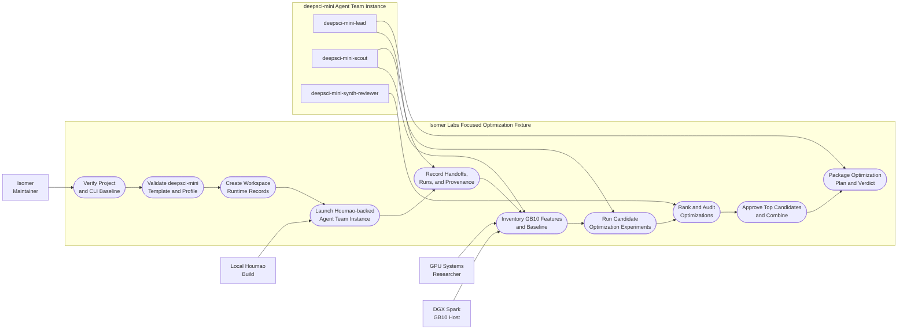
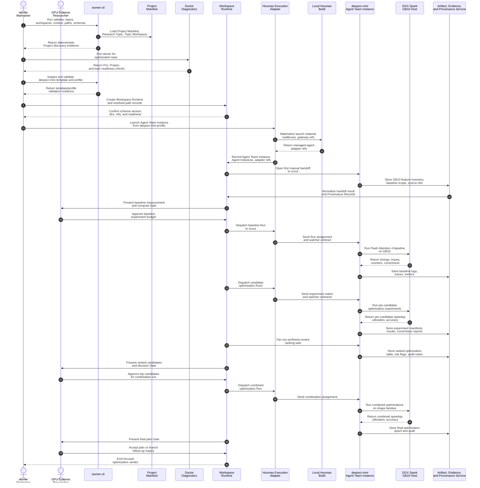

# Use Case 7: GB10 Feature-Driven Flash Attention 4 Optimization with deepsci-mini

## User Story

As the Isomer Labs maintainer and GPU systems researcher, I want a compact, feature-driven optimization scenario where `deepsci-mini` identifies concrete DGX Spark GB10 capabilities that speed up Flash Attention 4, so that the team returns a ranked, measured optimization plan with traceable kernel decisions rather than a generic list of CUDA tuning tips.

## Scenario

The practical Research Topic is: "how to make Flash Attention 4 run as fast as possible on DGX Spark GB10 by exploiting GB10-specific architectural features." The investigation starts from a measured baseline on GB10, explores candidate optimizations that map to Blackwell features, and produces a ranked decision procedure with speedup evidence and accuracy checks. This use case is intentionally smaller than UC-06: it uses the `deepsci-mini` Domain Agent Team Template, focuses on executable kernel experiments rather than white-box prediction modeling, and validates Milestone 6-style end-to-end research recording with only three Agent Roles.

UC-07 is a focused research-direction slice that demonstrates how a smaller team can still produce durable, evidence-backed optimization decisions without the operational weight of a seven-role organization.

## Scope and Assumptions

- "Flash Attention 4", "DGX Spark", "GB10", and "Blackwell" are treated as user-supplied topic terms. The use case does not assert hardware facts before the team records evidence.
- The goal is measured speedup on GB10, not a theoretical performance model. The team may use lightweight modeling to rank candidates, but every accepted recommendation must be tied to a measured or modeled performance delta on GB10.
- The investigation is bounded to GB10-specific features: Tensor Core precision modes, shared memory and L2 hierarchy, asynchronous copy and warp specialization, cluster-level cooperation, and tile/pipeline choices that match GB10 capacity.
- Numerical correctness must be checked when precision or kernel layout changes; speedup without accuracy validation is insufficient.
- Manual Mode is required for credentialed, destructive, expensive, private, or long-running hardware actions. Automatic mode is allowed for bounded analysis, ranking-table updates, report drafting, and replay.

## Main Success Scenario

1. The maintainer checks out a user-owned Isomer Project fixture for UC-07 and verifies that it contains a `.isomer-labs/` Project Config Directory, Project Manifest, Research Topic `flash-attention-gb10-peak-performance-optimization`, Topic Workspace, and a Topic Workspace Pixi manifest and lockfile inside the Topic Workspace.
2. The Operator Agent runs the CLI baseline: `isomer-cli validate`, `topics list`, `workspaces list`, `context show --topic flash-attention-gb10-peak-performance-optimization`, `paths preview --topic flash-attention-gb10-peak-performance-optimization`, and `schemas list`.
3. The Operator Agent runs `isomer-cli doctor --topic flash-attention-gb10-peak-performance-optimization --json` and confirms that Pixi is available, the Topic Workspace Pixi manifest exists, a matching `pixi.lock` is present, and explicit topic Pixi bindings are valid.
4. The Operator Agent lists, inspects, and validates the `deepsci-mini` Domain Agent Team Template and checks that the template remains topic-neutral.
5. The Operator Agent creates or loads a Topic Agent Team Profile for `flash-attention-gb10-peak-performance-optimization`, validates that topic-specific refs, Agent Workspace refs, policy refs, and expected Artifacts do not leak into other topics.
6. The Operator Agent creates or opens Workspace Runtime in the Topic Workspace, records schema version, resolved paths, path sources, default runtime directories, and a readiness record for the bound Pixi environment.
7. The Operator Agent creates the first Research Inquiry `gb10-flash-attention-4-peak-performance-optimization`, plus initial Research Tasks for GB10 feature inventory, baseline measurement, candidate optimization design, and accuracy validation plan.
8. Through the Houmao Execution Adapter, the Operator Agent launches a manual-mode `deepsci-mini` Agent Team Instance from the Topic Agent Team Profile.
9. The `deepsci-mini-lead` Agent Instance dispatches a first handoff to the `deepsci-mini-scout` Agent Instance, receives a result through Houmao mail or gateway surfaces, and the Operator Agent normalizes the handoff into Workspace Runtime with produced Artifacts and Provenance Records.
10. The `deepsci-mini-scout` records a GB10 feature inventory and Flash Attention 4 baseline Artifact, including attention shape parameters, precision or dtype, causal or masking mode, kernel variant, hardware target statement, compiler flags, target architecture, source identity, and measured baseline runtime.
11. The `deepsci-mini-scout` proposes a shortlist of candidate optimizations mapped to GB10 features, such as FP4/FP8 Tensor Core accumulation, shared-memory tile sizing, async copy staging, warp-group specialization, cluster multicast, and split-k or split-seq strategies.
12. The `deepsci-mini-lead` opens a Gate for the baseline measurement run and GB10 compute budget. The user accepts, requests repair, or records a waiver or blocker.
13. The `deepsci-mini-scout` runs the approved baseline measurement on GB10, preserving commands, environment refs, raw timings, profiler traces, kernel configs, input descriptors, and correctness outputs as Artifacts.
14. The `deepsci-mini-lead` dispatches candidate optimization experiments to the `deepsci-mini-scout`. Each experiment varies one GB10-relevant knob, measures runtime, records utilization counters, and checks attention correctness against the baseline.
15. The `deepsci-mini-synth-reviewer` Agent Instance analyzes the experiment Artifacts, clusters results by GB10 feature, estimates speedup and risk for each candidate, and produces a ranked optimization table.
16. The `deepsci-mini-synth-reviewer` flags candidates where the speedup claim is unsupported, where accuracy tolerance is violated, or where the optimization is generic rather than GB10-specific.
17. The `deepsci-mini-lead` opens a decision Gate asking the user to approve the top-ranked optimization candidates for a final combination run or further investigation.
18. After approval, the `deepsci-mini-scout` runs the recommended combination of optimizations on representative shape families and records combined speedup, utilization, and accuracy Artifacts.
19. The `deepsci-mini-synth-reviewer` audits the combined results for unsupported GB10 internal claims, missing accuracy validation, and generic advice, then produces a final optimization report.
20. The `deepsci-mini-lead` opens a final Gate asking the user to accept the optimization plan, request more experiments, branch to a follow-up Research Inquiry, or park the team with a resume packet.
21. The Operator Agent records the final Decision Record, validates the Topic Workspace, reopens the Project after process restart, and emits a pass/fail verdict for the focused optimization slice.

## Mermaid Use Case Diagram

## Mermaid System Sequence Diagram

## Alternative and Exception Flows

### A1: Doctor Readiness Failure

If `isomer-cli doctor` reports missing Pixi, missing Project Pixi manifest, missing topic binding, or a failed `requires-pixi` check, UC-07 does not proceed to launch. The Operator Agent records a blocker, opens a Gate for repair or pause, and optionally creates a Service Request. Passing evidence is a later doctor report with the same `mutated: false` read-only contract.

### A2: Baseline Measurement Failure

If the GB10 baseline cannot be measured because of missing hardware access, build failure, or incorrect kernel configuration, the `deepsci-mini-scout` records the failure Artifact and the `deepsci-mini-lead` opens a repair Gate. The use case cannot proceed to candidate experiments until a valid baseline exists.

### A3: Accuracy Regression Without Recovery

If a candidate optimization reduces precision or changes kernel layout and the accuracy check fails beyond the topic's tolerance, the `deepsci-mini-synth-reviewer` rejects the candidate. The `deepsci-mini-scout` may repair the candidate or drop it from the ranked table.

### A4: Generic Optimization Claim

If the `deepsci-mini-synth-reviewer` finds that a candidate's speedup is not justified by a GB10-specific feature, the candidate is demoted or removed. Passing evidence requires each accepted recommendation to name a concrete GB10 execution-system term that explains the gain.

### A5: Houmao Launch Failure

If the Houmao Execution Adapter cannot launch or inspect managed agents, UC-07 records adapter diagnostics, parks the Agent Team Instance, and creates a repair task scoped to `extern/orphan/houmao` or the local Houmao build. The repair is complete only when Houmao's own validation and Isomer adapter tests pass.

### A6: Cross-Topic Leak

If any Agent Workspace, mailbox ref, Run id, Artifact ref, Gate ref, provider ref, credential ref, or experiment result from UC-07 appears in another topic without an explicit allowed relationship, validation rejects the state. The recovery path repairs the offending records and replays validation.

### A7: User Rejects All Top Candidates

If the user rejects every top-ranked optimization, the `deepsci-mini-lead` records the rejection Decision Record and the team either returns to the candidate-generation step or parks with a resume packet.

### A8: Manual Completion Signal Ambiguity

If Manual Mode completion signals disagree, such as a channel reply without the expected file Artifact or a stale file without the handoff id, the Completion Watcher Contract keeps the handoff open. The Operator Agent records Signal Observations and asks for repair or explicit user decision.

## Durable Outputs

- UC-07 fixture Project with Research Topic `flash-attention-gb10-peak-performance-optimization`, Project Manifest entry, Topic Workspace, explicit Pixi environment binding, `deepsci-mini` Domain Agent Team Template registration, and Topic Agent Team Profile
- CLI evidence for Project discovery, validation, topic listing, workspace listing, Effective Topic Context, Workspace Path Resolution, schema listing, template inspection, template validation, profile generation, and profile validation
- Doctor diagnostics showing Pixi, Project, and topic readiness checks with `mutated: false`
- Workspace Runtime records for Research Topic, Research Inquiry `gb10-flash-attention-4-peak-performance-optimization`, Research Tasks, Runs, Workflow Stage Cursors, Topic Agent Team Profile, Agent Team Instance, Agent Instances, Agent Workspaces, resolved paths, handoffs, readiness state, and schema version
- Houmao Execution Adapter records for launch, inspection, mail or gateway routing, managed-agent refs, and stop or park operations, stored as adapter refs rather than core Isomer schema terms
- GB10 feature inventory Artifact listing relevant Blackwell features and their expected relevance to Flash Attention 4
- Flash Attention 4 baseline measurement Artifact with input shape, precision, kernel variant, compiler flags, target architecture, measured runtime, utilization counters, and correctness output
- Candidate optimization experiment Artifacts with per-candidate configuration, measured runtime, speedup vs. baseline, utilization delta, and accuracy check
- Ranked optimization table Artifact grouping candidates by GB10 feature, estimated speedup, risk, accuracy impact, and implementation effort
- Decision Records for baseline approval, top-candidate selection, and final plan acceptance
- Service Requests, Service Dispatch Forms, Completion Watcher Contracts, Signal Observations, manual handoff records, and normalized completion records when Manual Mode is used
- Final optimization plan report with recommended kernel choices, ranked decision procedure, measured evidence, accuracy validation, caveats, and next-step recommendations
- View Manifests for the ranked optimization table, baseline-to-optimized comparison, and experiment result browser

## Pass Criteria

UC-07 passes only when all of the following are true:

1. The Project can be validated, reopened, and inspected after process restart without losing or corrupting Workspace Runtime records.
2. The `deepsci-mini` Domain Agent Team Template can be specialized into a Topic Agent Team Profile for the optimization topic without topic-specific leakage.
3. At least one Houmao-backed manual handoff round is launched, observed, normalized, and recorded through Workspace Runtime.
4. The Flash Attention 4 on GB10 optimization topic records baseline measurement, candidate optimization experiments, synthesis-review ranking, and final plan Artifacts with Provenance Records.
5. Manual Mode and automatic mode can both occur in the same Topic Workspace without bypassing Gate Policy or completion normalization.
6. Every accepted optimization recommendation is traceable to a GB10-specific feature and supported by measured speedup or a validated lightweight model.
7. Numerical correctness is checked for every candidate that changes precision or kernel layout, and failing candidates are rejected or repaired.
8. The final optimization plan includes a ranked decision procedure that can be reused for new Flash Attention 4 input shapes within the validated scope.

## Postconditions

- The maintainer can point to UC-07 as a focused, small-team acceptance test for research-direction optimization work.
- The user has a ranked, GB10-specific optimization plan with measured speedup evidence and accuracy validation.
- The user can inspect why each recommendation was made, which GB10 feature it exploits, and what accuracy or shape-family caveats apply.
- The Topic Workspace contains enough Artifacts, Evidence Items, Decision Records, Provenance Records, View Manifests, and adapter refs to resume optimization work, reproduce experiments, or branch into follow-up Research Inquiries.
- No unapproved environment mutation, credential use, long-running compute, claim strengthening, or publication-facing final claim bypasses Gate Policy.

## Relationship to Existing Use Cases

- UC-07 is a focused sibling to UC-06. It reuses the same GB10/Flash Attention 4 domain but swaps the capstone `deepsci-org` runtime-prediction objective for a smaller `deepsci-mini` optimization objective.
- It extends UC-01 by showing that the three-role `deepsci-mini` template can handle a concrete hardware-bound optimization topic, not just open research-direction exploration.
- It extends UC-02 by making the baseline-to-optimization loop explicit and tying each candidate to a GB10-specific feature.
- It is intentionally narrower than UC-03 because it does not require paper revision or publication review; it stops at a technical optimization plan.
- It can feed UC-04 if the user later asks for a project-specific GUI Component that renders the ranked optimization table or baseline-to-optimized comparison; UC-07 itself does not exercise a GUI path.
- It can feed UC-05 if any GB10 setup, profiler repair, or accuracy-debug step requires Manual Mode handoffs.
- It complements UC-06 by providing a lower-cost path to validate the same GB10/Flash Attention 4 topic area before committing to the full white-box prediction capstone.

## Evidence Sources Used to Define This Use Case

- `tests/topics/flash-attention-gb10-peak-performance-optimization.md` defines the Research Topic and its do's and don'ts.
- `teams/deepsci-mini/README.md` and `teams/deepsci-mini/source/team-design.md` define the `deepsci-mini` Domain Agent Team Template boundary and the three Agent Roles.
- `.imsight-arts/project-explore/use-cases/uc-06-flash-attention-gb10-runtime-prediction.md` provides the capstone-style use-case structure adapted here for a smaller team and a simpler topic.
- `.imsight-arts/project-explore/domain-concepts/dc-isomer-platform-language.md` defines the canonical Isomer terms used here.
