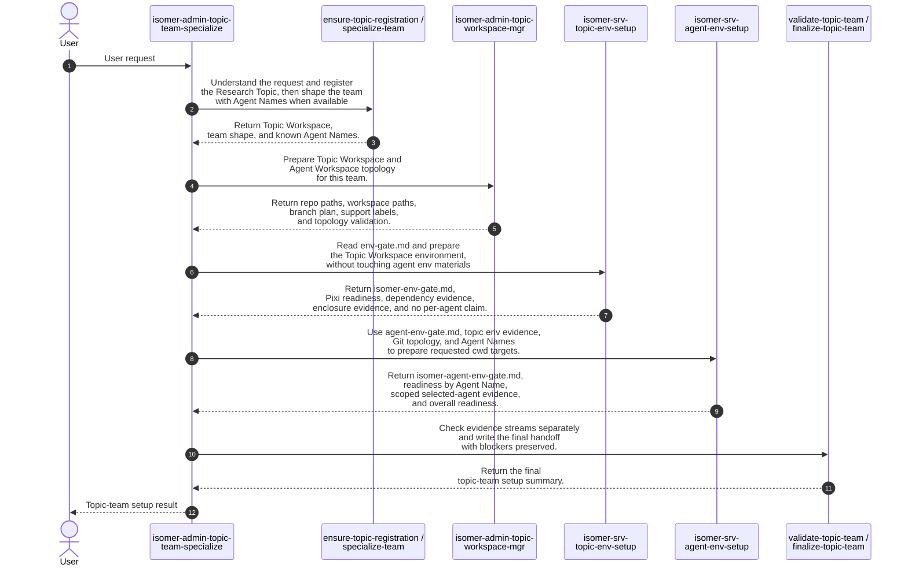

# Team Specialization Skill Process

## Purpose

This note records the intended process for Topic Team Specialization skill orchestration. It is a design-level process contract for aligning `isomer-admin-topic-team-specialize`, `isomer-admin-topic-workspace-mgr`, `isomer-srv-topic-env-setup`, `isomer-srv-agent-env-setup`, and `skillset/callgraph.md`.

The key rule is that `isomer-admin-topic-team-specialize` is the only orchestrator across topic workspace setup, topic environment setup, and agent environment setup. Service skills and workspace-manager skills return bounded evidence; they do not decide the next cross-skill process step.

## High Level Process



## Python-like Process Sketch

This sketch uses the Agent-Primitive Python vocabulary from `context/design/skill-pseudo-lang/definitions.md`. Python handles exact control flow and file checks. The `agent_*` calls mark semantic work, qualitative checks, and explicit cross-skill calls.

```python
from pathlib import Path


# Entry point: this operator skill owns the whole setup decision sequence.
# Example input: topic_root=Path("topics/user-intent"), user_request="Set up this topic team through agent env readiness."
# Example output: StageResult(status="ready", evidence=["topic-team finalized"])
@skill(
    name="isomer-admin-topic-team-specialize",
    description="Specialize a Research Topic team and orchestrate topic workspace, topic env, and agent env setup.",
)
def specialize_topic_team(topic_root: Path, user_request: str) -> StageResult:
    # Interpret user intent semantically, but keep the resulting route as exact Python data.
    # Example input: user_request="Set up agent env from agent-env-gate.md after topic env is ready."
    # Example output: "setup-agent-env"
    requested_route = agent_select(
        [
            "specialize-team",
            "setup-topic-workspace",
            "setup-topic-env",
            "setup-agent-env",
            "full-topic-team-setup",
        ],
        criterion="Choose the narrowest route that satisfies the user's requested topic-team setup proof.",
        context={"user_request": user_request, "topic_root": topic_root},
    )

    # Resolve the topic-team foundation before any workspace or environment setup can run.
    # Example output: StageResult(status="ready", evidence=["registered Topic Workspace", "Agent Names: planner, analyst"])
    topic = agent_do(
        "Resolve or create the registered Research Topic and Topic Workspace, then specialize the selected Domain Agent Team Template.",
        context={"topic_root": topic_root, "user_request": user_request, "requested_route": requested_route},
        returns=StageResult,
        constraints=[
            "Produce authoritative Agent Names when available.",
            "Do not launch runtime teams.",
        ],
    )
    if topic.status in {"blocked", "failed"}:
        # Condition matched when topic registration or specialization cannot complete.
        return topic

    if requested_route == "specialize-team":
        # Condition matched when the selected route stops at static topic-team specialization.
        # Stop after specialization when the user did not ask for setup evidence.
        # Example output: StageResult(status="ready", evidence=["topic-team specialized"], next_action="Run setup-topic-workspace when needed.")
        return agent_do(
            "Write a topic-team specialization summary with deferred setup evidence clearly marked.",
            context={"topic": topic},
            returns=StageResult,
        )

    # Cross-skill call: workspace manager owns filesystem and Git topology evidence only.
    # Example output: StageResult(status="ready", evidence=["Topic Main Repository", "Agent Workspace paths", "branch plan"])
    workspace = agent_invoke(
        "isomer-admin-topic-workspace-mgr",
        task="Prepare Topic Workspace and Agent Workspace filesystem or Git topology for the specialized topic team.",
        context={"topic": topic, "user_request": user_request},
        returns=StageResult,
        params={
            "subcommand": "setup-topic-workspace",
            "expect": [
                "Topic Main Repository",
                "Agent Workspace paths",
                "branch plan",
                "support labels",
                "Git topology validation evidence",
            ],
            "must_not_call": ["isomer-srv-agent-env-setup"],
        },
    )
    if workspace.status in {"blocked", "failed"}:
        # Condition matched when workspace topology setup is blocked or failed.
        return workspace

    env_gate = topic_root / "user-intent/src/env-gate.md"
    topic_env_routes = {"setup-topic-env", "setup-agent-env", "full-topic-team-setup"}

    if env_gate.exists() and requested_route in topic_env_routes:
        # Condition matched when topic env setup is requested and env-gate.md exists.
        # Cross-skill call: topic env setup owns env-gate.md and must not inspect agent env gates.
        # Example input: env_gate=Path("user-intent/src/env-gate.md"), workspace.evidence=["Topic Main Repository", "Agent Workspace paths"]
        # Example output: StageResult(status="ready", evidence=["isomer-env-gate.md", "Topic Workspace Pixi readiness"])
        topic_env = agent_invoke(
            "isomer-srv-topic-env-setup",
            task="Set up the Topic Workspace environment from env-gate.md.",
            context={"topic": topic, "workspace": workspace, "env_gate": env_gate},
            returns=StageResult,
            params={
                "subcommand": "setup-topic-env",
                "expect": [
                    "user-intent/derived/isomer-env-gate.md",
                    "Topic Workspace Pixi readiness",
                    "dependency and enclosure evidence",
                    "Topic Workspace predecessor evidence",
                ],
                "must_not_read": ["user-intent/src/agent-env-gate.md"],
                "must_not_write": ["user-intent/derived/isomer-agent-env-gate.md"],
                "must_not_call": ["isomer-srv-agent-env-setup"],
                "per_agent_readiness_status": "not_checked",
            },
        )
        if topic_env.status in {"blocked", "failed"}:
            # Condition matched when topic env setup reports blocked or failed evidence.
            return topic_env
    else:
        # Condition matched when topic env setup is not requested or env-gate.md does not exist.
        topic_env = StageResult(
            status="not_checked",
            evidence=["Topic env setup was outside the requested route or no env-gate.md exists."],
        )

    if requested_route == "setup-topic-env":
        # Condition matched when the selected route stops after topic env setup.
        # Return after topic env setup, explicitly preserving that per-agent readiness was out of scope.
        # Example output: StageResult(status="ready", evidence=["topic env ready", "per_agent_readiness_status: not_checked"])
        return agent_do(
            "Write a topic env setup handoff. Include workspace evidence and state that agent env readiness was not checked.",
            context={"topic": topic, "workspace": workspace, "topic_env": topic_env},
            returns=StageResult,
        )

    agent_env_gate = topic_root / "user-intent/src/agent-env-gate.md"
    agent_env_routes = {"setup-agent-env", "full-topic-team-setup"}

    if agent_env_gate.exists() and requested_route in agent_env_routes:
        # Condition matched when agent env setup is requested and agent-env-gate.md exists.
        # Semantic prerequisite check: the exact file exists, but evidence sufficiency is qualitative.
        # Example input: topic_env.status="ready", workspace.evidence=["Agent Workspace paths"], agent_env_gate=Path("user-intent/src/agent-env-gate.md")
        # Example output: True
        agent_env_inputs_ready = agent_check(
            "Do the existing topic-team, workspace topology, topic env evidence, and agent-env-gate.md satisfy the prerequisites for agent env setup?",
            context={
                "topic": topic,
                "workspace": workspace,
                "topic_env": topic_env,
                "agent_env_gate": agent_env_gate,
            },
            returns=bool,
            rubric="True only when Git topology evidence exists, authoritative Agent Names are known, agent-env-gate.md defines per-Agent Workspace cwd requirements, and Topic Workspace predecessor evidence is ready or explicitly deferred.",
        )
        if not agent_env_inputs_ready:
            # Condition matched when existing evidence is insufficient for safe agent env setup.
            return StageResult(
                status="blocked",
                blockers=["Agent env setup prerequisites are not satisfied."],
                evidence=[str(agent_env_gate)],
                next_action="Repair missing topic env, workspace topology, or Agent Name evidence before setup-agent-env.",
            )

        # Cross-skill call: agent env setup owns per-Agent Workspace cwd readiness.
        # Example input: agent_env_gate=Path("user-intent/src/agent-env-gate.md"), topic_env.evidence=["isomer-env-gate.md"], workspace.evidence=["Agent Workspace paths"]
        # Example output: StageResult(status="ready", evidence=["isomer-agent-env-gate.md", "overall agent readiness"])
        agent_env = agent_invoke(
            "isomer-srv-agent-env-setup",
            task="Set up and verify Agent Workspace cwd readiness from agent-env-gate.md using existing topic env and workspace evidence.",
            context={
                "topic": topic,
                "workspace": workspace,
                "topic_env": topic_env,
                "agent_env_gate": agent_env_gate,
            },
            returns=StageResult,
            params={
                "subcommand": "setup-agent-env",
                "expect": [
                    "user-intent/derived/isomer-agent-env-gate.md",
                    "readiness by Agent Name",
                    "selected-agent partial evidence when scoped",
                    "overall agent readiness",
                ],
                "must_not_call": ["isomer-srv-topic-env-setup"],
            },
        )
        if agent_env.status in {"blocked", "failed"}:
            # Condition matched when agent env setup reports blocked or failed evidence.
            return agent_env
    else:
        # Condition matched when agent env setup is not requested or agent-env-gate.md does not exist.
        agent_env = StageResult(
            status="not_checked",
            evidence=["Agent env setup was outside the requested route or no agent-env-gate.md exists."],
        )

    # Final semantic write-up: validate the evidence streams without changing ownership boundaries.
    # Example output: StageResult(status="ready", evidence=["workspace topology", "topic env", "agent env"])
    return agent_do(
        "Validate the separate evidence streams and write the topic-team finalization summary.",
        context={
            "topic": topic,
            "workspace": workspace,
            "topic_env": topic_env,
            "agent_env": agent_env,
        },
        returns=StageResult,
        constraints=[
            "Preserve missing or deferred evidence as explicit blockers.",
            "Do not launch runtime teams.",
        ],
    )
```

## Process Stages

### 1. User Calls Team Specialization

The user enters through `isomer-admin-topic-team-specialize`, either directly or through `isomer-admin-project-mgr specialize-team`. This operator skill owns the process state and decides which setup stages are needed.

This stage resolves or creates enough topic material to know the Research Topic, registered Topic Workspace, selected Domain Agent Team Template, and specialized topic-team shape. If Agent Workspace topology is needed, specialization should provide or derive authoritative Agent Names before workspace setup.

### 2. Set Up Topic Workspace

`isomer-admin-topic-team-specialize` calls `isomer-admin-topic-workspace-mgr` for Topic Workspace and Agent Workspace filesystem or Git topology.

The workspace manager owns Git-only and filesystem-topology evidence: `topic.repos.main`, `agent.workspace`, branch plan, generated links, local tmp posture, support labels, and workspace boundary material. It must not call `isomer-srv-agent-env-setup`. If the caller later needs agent environment proof, the workspace manager reports its topology evidence and returns control to `isomer-admin-topic-team-specialize`.

### 3. Set Up Topic Environment from `env-gate.md`

After topic workspace prerequisites are available, `isomer-admin-topic-team-specialize` calls `isomer-srv-topic-env-setup` through its `setup-topic-env` stage when `env-gate.md` exists or the user supplied a clear topic-level runnable target.

`isomer-srv-topic-env-setup` owns `env-gate.md`, `isomer-env-gate.md`, Topic Workspace Pixi mutation, dependency enclosure, package source evidence, topic-root or repo-specific command verification, and Topic Workspace predecessor evidence.

It must not read `agent-env-gate.md`, write `isomer-agent-env-gate.md`, prepare Agent Workspace worktrees, or call agent env setup. If the caller asks whether every Agent Workspace cwd is ready, topic env setup reports `per_agent_readiness_status: not checked` and returns Topic Workspace predecessor evidence.

### 4. Set Up Agent Environment from `agent-env-gate.md`

`isomer-admin-topic-team-specialize` calls `isomer-srv-agent-env-setup` through a distinct agent-env setup stage after all required inputs exist:

- `agent-env-gate.md` as the source contract for per-Agent Workspace cwd requirements.
- Existing Topic Workspace env evidence from `isomer-srv-topic-env-setup`.
- Git topology evidence from `isomer-admin-topic-workspace-mgr`.
- Authoritative Agent Names from topic-team material.

`isomer-srv-agent-env-setup` owns `agent-env-gate.md`, `isomer-agent-env-gate.md`, per-Agent Workspace cwd verification, selected-agent partial evidence, readiness by Agent Name, and overall agent readiness. If Topic Workspace env evidence is missing or stale, it should report a blocker or repair need to the operator; it should not directly orchestrate topic env setup.

### 5. Validate and Finalize

`isomer-admin-topic-team-specialize` validates the evidence streams separately:

- Topic Workspace topology evidence from `isomer-admin-topic-workspace-mgr`.
- Topic Workspace env evidence from `isomer-srv-topic-env-setup`.
- Agent Workspace env evidence from `isomer-srv-agent-env-setup`, only when per-agent cwd proof was requested.

Finalization writes a topic-team summary that preserves missing or deferred evidence as explicit blockers. Runtime launch, Agent Team Instance creation, Houmao launch, and Execution Adapter work remain later boundaries.

## Evidence Handoffs

| Producing skill | Evidence | Consuming stage |
| --- | --- | --- |
| `isomer-admin-topic-workspace-mgr` | Topic Main Repository, Agent Workspace paths, branch plan, support labels, Git topology validation | `isomer-admin-topic-team-specialize setup-topic-env`, `setup-agent-env`, validation, finalization |
| `isomer-srv-topic-env-setup` | `env-gate.md`, `isomer-env-gate.md`, Pixi binding, dependency/enclosure evidence, topic-root verification, `per_agent_readiness_status: not checked` when relevant | `isomer-admin-topic-team-specialize setup-agent-env`, validation, finalization |
| `isomer-srv-agent-env-setup` | `agent-env-gate.md`, `isomer-agent-env-gate.md`, readiness by Agent Name, selected-agent partial evidence, overall readiness | `isomer-admin-topic-team-specialize validate-topic-team`, finalization, later runtime handoff |

## Call Graph Implications

The call graph should show these process edges:

```text
isomer-admin-topic-team-specialize -> isomer-admin-topic-workspace-mgr
isomer-admin-topic-team-specialize -> isomer-srv-topic-env-setup
isomer-admin-topic-team-specialize -> isomer-srv-agent-env-setup
```

The call graph should not show these edges:

```text
isomer-admin-topic-workspace-mgr -> isomer-srv-agent-env-setup
isomer-srv-topic-env-setup -> isomer-srv-agent-env-setup
isomer-srv-agent-env-setup -> isomer-srv-topic-env-setup
```

Those relationships can exist as reported blockers, missing-evidence notes, or next-action suggestions, but not as direct orchestration edges. The operator specialization skill decides whether to run the next setup stage.

## Naming Implication

`setup-agent-workspace` currently mixes two concerns: Git-backed Agent Workspace topology and per-agent environment proof. The target process is clearer if the operator surface distinguishes:

- `setup-topic-workspace`: orchestrates workspace manager work.
- `setup-topic-env`: orchestrates topic env setup from `env-gate.md`.
- `setup-agent-env`: orchestrates agent env setup from `agent-env-gate.md` after workspace and topic env evidence exist.

This split keeps each stage aligned with one source contract and one evidence stream.
