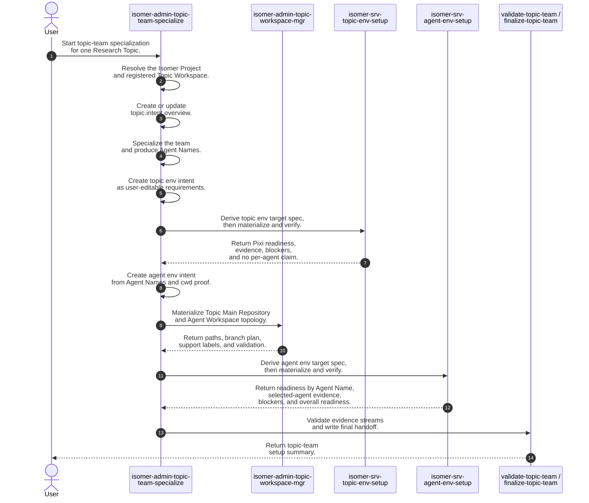
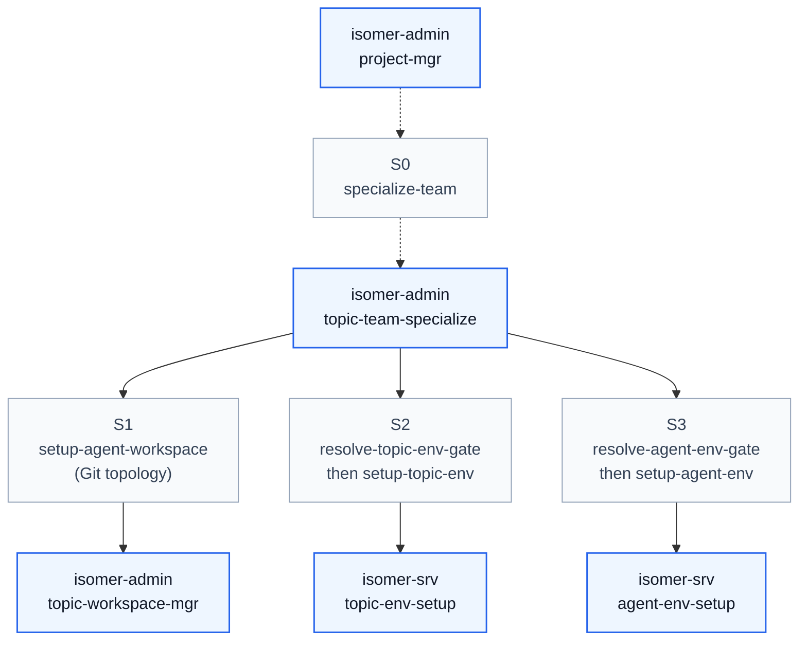

# Team Specialization Skill Process

## Purpose

This note records the intended process for **Topic Team Specialization** skill orchestration. It is a design-level process contract for aligning `isomer-admin-topic-team-specialize`, `isomer-admin-topic-workspace-mgr`, `isomer-srv-topic-env-setup`, `isomer-srv-agent-env-setup`, and `skillset/callgraph.md`.

The key rule is that `isomer-admin-topic-team-specialize` is the only orchestrator across topic workspace setup, topic environment setup, and agent environment setup. Service skills and workspace-manager skills return bounded evidence; they do not decide the next cross-skill process step.

## Concepts

- **Research Topic**: the root research problem or investigation intent that drives **Topic Team Specialization**.
- **Topic Workspace**: the project-local work area for one **Research Topic**. It owns topic runtime material, the **Topic Main Repository**, **Agent Workspaces**, and topic-local records.
- **Domain Agent Team Template**: the reusable research-field or method-specific team design that gets adapted for one **Research Topic**.
- **Topic Team Specialization**: the design-time process that adapts one **Domain Agent Team Template** into a topic-specific team profile. It ends before runtime launch.
- **Topic Agent Team Profile**: the topic-specific design-time team produced by **Topic Team Specialization**. It is not a running team.
- **Topic Agent Team Profile Bundle**: the fixed **Topic Workspace** directory that stores the authoritative **Topic Agent Team Profile** and related editable specialization material.
- **Topic Intent Overview**: the user-editable topic summary resolved by semantic label `topic.intent.overview`.
- **Topic Env Requirements**: the concise user-editable topic environment intent resolved by semantic label `topic.intent.topic_env_requirements`.
- **Topic Env Target Spec**: the operational topic environment setup spec resolved by semantic label `topic.env.topic_setup_target_spec`.
- **Agent Env Requirements**: the concise user-editable per-agent cwd intent resolved by semantic label `topic.intent.agent_env_requirements`.
- **Agent Env Target Spec**: the operational per-agent cwd verification spec resolved by semantic label `topic.env.agent_setup_target_spec`.
- **Topic Main Repository**: the worker-visible collaboration repository for the **Topic Workspace**, resolved through semantic label `topic.repos.main`.
- **Agent Workspace**: the per-agent work area inside a **Topic Workspace**, normally resolved through semantic label `agent.workspace`.
- **Agent Name**: the topic-local name used for default **Agent Workspace** bindings, such as `planner` or `analyst`.
- **Agent Team Instance**: the runtime team created later from a **Topic Agent Team Profile**. It is outside the setup flow described here.
- **Execution Adapter**: the launch and command-execution adapter layer used for runtime dispatch. It remains a later boundary in this document.

## High Level Process



## Skill Call Graph

This graph shows the top-level skill calls used by this process. Route nodes name the operator surface or service setup stage that creates the edge.



| ID | Caller | Route | Callee | Calling condition |
| --- | --- | --- | --- | --- |
| S0 | `isomer-admin-project-mgr` | `specialize-team` | `isomer-admin-topic-team-specialize` | Project-level work needs **Topic Team Specialization** for one **Research Topic**. This is an optional entry route into the same process. |
| S1 | `isomer-admin-topic-team-specialize` | `setup-agent-workspace` Git topology | `isomer-admin-topic-workspace-mgr` | The selected route needs **Topic Main Repository**, **Agent Workspace** worktrees, branch plans, support labels, or workspace boundary evidence before agent env materialization. |
| S2 | `isomer-admin-topic-team-specialize` | `resolve-topic-env-gate` then `setup-topic-env` | `isomer-srv-topic-env-setup` | `topic.intent.topic_env_requirements` exists, can be created from a clear runnable target, or an explicit topic env target spec is provided. The service derives or validates `topic.env.topic_setup_target_spec`, materializes the Topic Workspace environment, and must not claim per-agent readiness. |
| S3 | `isomer-admin-topic-team-specialize` | `resolve-agent-env-gate` then `setup-agent-workspace` agent readiness | `isomer-srv-agent-env-setup` | `topic.intent.agent_env_requirements` exists, can be created from requested cwd proof, or an explicit agent env target spec is provided. The service consumes `topic.env.topic_setup_target_spec`, authoritative **Agent Names**, and Git topology evidence before deriving or validating `topic.env.agent_setup_target_spec`. |

## Formal Skill Process

This sketch uses the Agent-Primitive Python vocabulary from `context/design/skill-pseudo-lang/definitions.md`. Python handles exact control flow and file checks. The `agent_*` calls mark semantic work, qualitative checks, and explicit cross-skill calls.

```python
from pathlib import Path


# Entry point: this operator skill owns the whole setup decision sequence.
# Example input: project_root=Path("."), user_request="Set up this topic team through agent env readiness."
# Example output: StageResult(status="ready", evidence=["topic-team finalized"])
@skill(
    name="isomer-admin-topic-team-specialize",
    description="Specialize a Research Topic team and orchestrate topic workspace, topic env, and agent env setup.",
)
def specialize_topic_team(project_root: Path, user_request: str) -> StageResult:
    # Interpret user intent semantically, but keep the resulting route as exact Python data.
    # Example input: user_request="Set up agent env after topic env is ready."
    # Example output: "setup-agent-env"
    requested_route = agent_select(
        [
            "specialize-team",
            "setup-topic-workspace",
            "setup-topic-env",
            "setup-agent-env",
            "full-topic-team-setup",
        ],
        criterion="Choose the narrowest route that satisfies the user's requested topic-team setup proof.",
        context={"user_request": user_request, "project_root": project_root},
    )

    # Resolve project and topic before writing any topic-local intent.
    # Example output: StageResult(status="ready", evidence=["registered Topic Workspace: alpha"])
    project_topic = agent_do(
        "Resolve the Isomer Project, Research Topic, and registered Topic Workspace for this request.",
        context={"project_root": project_root, "user_request": user_request, "requested_route": requested_route},
        returns=StageResult,
        constraints=[
            "Use Project Manifest-backed refs.",
            "Do not select a Topic Workspace by scanning sibling directories.",
        ],
    )
    if project_topic.status in {"blocked", "failed"}:
        # Condition matched when the project, Research Topic, or registered Topic Workspace cannot be resolved.
        return project_topic

    # Create the user-editable topic overview intent before setup requirements are derived.
    # Example output: StageResult(status="ready", evidence=["topic.intent.overview"])
    topic_intent = agent_do(
        "Create or update topic.intent.overview with the topic goal, metrics, datasets, explicitly mentioned repositories, libraries, and tools.",
        context={"project_topic": project_topic, "user_request": user_request},
        returns=StageResult,
        constraints=[
            "Keep the file concise and user-editable.",
            "Avoid dependency versions unless the topic context explicitly says them.",
        ],
    )
    if topic_intent.status in {"blocked", "failed"}:
        # Condition matched when the topic overview cannot be safely created or updated.
        return topic_intent

    # Specialize the team after topic intent exists.
    # Example output: StageResult(status="ready", evidence=["Topic Agent Team Profile", "Agent Names: planner, analyst"])
    team = agent_do(
        "Specialize the selected Domain Agent Team Template for this topic and produce authoritative Agent Names when available.",
        context={"project_topic": project_topic, "topic_intent": topic_intent, "requested_route": requested_route},
        returns=StageResult,
        constraints=["Do not launch runtime teams."],
    )
    if team.status in {"blocked", "failed"}:
        # Condition matched when team specialization fails or a route that needs Agent Names cannot get them.
        return team

    if requested_route == "specialize-team":
        # Condition matched when the selected route stops at static topic-team specialization.
        # Stop after specialization when the user did not ask for setup evidence.
        # Example output: StageResult(status="ready", evidence=["topic-team specialized"], next_action="Run setup-topic-workspace when needed.")
        return agent_do(
            "Write a topic-team specialization summary with deferred setup evidence clearly marked.",
            context={"project_topic": project_topic, "topic_intent": topic_intent, "team": team},
            returns=StageResult,
        )

    workspace = StageResult(status="not_checked", evidence=["Agent Workspace topology was outside the requested route."])
    topic_env_routes = {"setup-topic-env", "setup-agent-env", "full-topic-team-setup"}
    workspace_only_routes = {"setup-topic-workspace"}

    if requested_route in workspace_only_routes:
        # Condition matched when the user only needs Git-backed workspace topology.
        # Example output: StageResult(status="ready", evidence=["Topic Main Repository", "Agent Workspace paths"])
        workspace = agent_invoke(
            "isomer-admin-topic-workspace-mgr",
            task="Prepare Topic Main Repository and Agent Workspace filesystem or Git topology for the authoritative Agent Names.",
            context={"project_topic": project_topic, "team": team, "user_request": user_request},
            returns=StageResult,
            params={
                "subcommand": "topic-workspace",
                "expect": ["Topic Main Repository", "Agent Workspace paths", "branch plan", "support labels"],
                "must_not_call": ["isomer-srv-agent-env-setup"],
            },
        )
        return workspace

    if requested_route in topic_env_routes:
        # Condition matched when the route needs Topic Workspace environment predecessor evidence.
        # Create high-level source intent first; the service owns operational commands and mutation.
        # Example output: StageResult(status="ready", evidence=["topic.intent.topic_env_requirements"])
        topic_env_intent = agent_do(
            "Create or update topic.intent.topic_env_requirements as concise high-level topic environment intent.",
            context={"project_topic": project_topic, "topic_intent": topic_intent, "team": team, "user_request": user_request},
            returns=StageResult,
            constraints=[
                "Name what must be runnable for the topic.",
                "Keep repo, dataset, tool, and runtime needs high level.",
                "Do not write Pixi commands or implementation details into the source intent.",
            ],
        )
        if topic_env_intent.status in {"blocked", "failed"}:
            # Condition matched when topic env requirements cannot be derived from the user request or topic material.
            return topic_env_intent

        # Cross-skill call: topic env setup owns target-spec derivation, Pixi mutation, and topic-root verification.
        # Example output: StageResult(status="ready", evidence=["topic.env.topic_setup_target_spec", "Topic Workspace Pixi readiness"])
        topic_env = agent_invoke(
            "isomer-srv-topic-env-setup",
            task="Derive topic.env.topic_setup_target_spec from topic.intent.topic_env_requirements, then materialize and verify the Topic Workspace environment.",
            context={"project_topic": project_topic, "topic_intent": topic_intent, "topic_env_intent": topic_env_intent},
            returns=StageResult,
            params={
                "subcommand": "setup-topic-env",
                "expect": [
                    "topic.env.topic_setup_target_spec",
                    "Topic Workspace Pixi readiness",
                    "dependency and enclosure evidence",
                    "Topic Workspace predecessor evidence",
                ],
                "must_not_read": ["topic.intent.agent_env_requirements"],
                "must_not_write": ["topic.env.agent_setup_target_spec"],
                "must_not_call": ["isomer-srv-agent-env-setup"],
                "per_agent_readiness_status": "not_checked",
            },
        )
        if topic_env.status in {"blocked", "failed"}:
            # Condition matched when topic env setup reports blocked or failed evidence.
            return topic_env
    else:
        # Condition matched when topic env setup is outside the requested route.
        topic_env = StageResult(
            status="not_checked",
            evidence=["Topic env setup was outside the requested route."],
        )

    if requested_route == "setup-topic-env":
        # Condition matched when the selected route stops after topic env setup.
        # Return after topic env setup, explicitly preserving that per-agent readiness was out of scope.
        # Example output: StageResult(status="ready", evidence=["topic env ready", "per_agent_readiness_status: not_checked"])
        return agent_do(
            "Write a topic env setup handoff. Include workspace evidence and state that agent env readiness was not checked.",
            context={"project_topic": project_topic, "topic_intent": topic_intent, "team": team, "workspace": workspace, "topic_env": topic_env},
            returns=StageResult,
        )

    agent_env_routes = {"setup-agent-env", "full-topic-team-setup"}

    if requested_route in agent_env_routes:
        # Condition matched when the route needs per-Agent Workspace cwd readiness evidence.
        # Create high-level source intent before the agent env service derives an operational matrix.
        # Example output: StageResult(status="ready", evidence=["topic.intent.agent_env_requirements"])
        agent_env_intent = agent_do(
            "Create or update topic.intent.agent_env_requirements from authoritative Agent Names, topic intent, topic env predecessor evidence, and requested cwd proof.",
            context={"project_topic": project_topic, "topic_intent": topic_intent, "team": team, "topic_env": topic_env, "user_request": user_request},
            returns=StageResult,
            constraints=[
                "Keep the source intent concise and high level.",
                "Do not write per-agent Pixi commands into the source intent.",
            ],
        )
        if agent_env_intent.status in {"blocked", "failed"}:
            # Condition matched when agent env requirements cannot be derived from the user request or topic material.
            return agent_env_intent

        # Cross-skill call: workspace manager owns filesystem and Git topology evidence only.
        # Example output: StageResult(status="ready", evidence=["Topic Main Repository", "Agent Workspace paths", "branch plan"])
        workspace = agent_invoke(
            "isomer-admin-topic-workspace-mgr",
            task="Prepare Topic Main Repository and Agent Workspace filesystem or Git topology for the authoritative Agent Names.",
            context={"project_topic": project_topic, "team": team, "agent_env_intent": agent_env_intent},
            returns=StageResult,
            params={
                "subcommand": "topic-workspace",
                "expect": [
                    "Topic Main Repository",
                    "Agent Workspace paths",
                    "branch plan",
                    "support labels",
                    "Git topology validation evidence",
                ],
                "must_not_call": ["isomer-srv-agent-env-setup"],
            },
        )
        if workspace.status in {"blocked", "failed"}:
            # Condition matched when workspace topology setup is blocked or failed.
            return workspace

        # Semantic prerequisite check: evidence sufficiency is qualitative, so ask the agent.
        # Example output: True
        agent_env_inputs_ready = agent_check(
            "Do topic.env.topic_setup_target_spec, topic.intent.agent_env_requirements, authoritative Agent Names, and workspace topology evidence satisfy the prerequisites for agent env setup?",
            context={
                "project_topic": project_topic,
                "team": team,
                "workspace": workspace,
                "topic_env": topic_env,
                "agent_env_intent": agent_env_intent,
            },
            returns=bool,
            rubric="True only when Git topology evidence exists, authoritative Agent Names are known, agent env source intent or explicit target spec defines per-Agent Workspace cwd requirements, and Topic Workspace predecessor evidence is ready or explicitly accepted.",
        )
        if not agent_env_inputs_ready:
            # Condition matched when existing evidence is insufficient for safe agent env setup.
            return StageResult(
                status="blocked",
                blockers=["Agent env setup prerequisites are not satisfied."],
                evidence=["topic.intent.agent_env_requirements", "topic.env.topic_setup_target_spec"],
                next_action="Repair missing topic env, workspace topology, or Agent Name evidence before setup-agent-env.",
            )

        # Cross-skill call: agent env setup owns per-Agent Workspace cwd readiness.
        # Example output: StageResult(status="ready", evidence=["topic.env.agent_setup_target_spec", "overall agent readiness"])
        agent_env = agent_invoke(
            "isomer-srv-agent-env-setup",
            task="Derive topic.env.agent_setup_target_spec from topic.intent.agent_env_requirements and predecessor evidence, then verify Agent Workspace cwd readiness.",
            context={
                "project_topic": project_topic,
                "team": team,
                "workspace": workspace,
                "topic_env": topic_env,
                "agent_env_intent": agent_env_intent,
            },
            returns=StageResult,
            params={
                "subcommand": "setup-agent-env",
                "expect": [
                    "topic.env.agent_setup_target_spec",
                    "readiness by Agent Name",
                    "selected-agent partial evidence when scoped",
                    "overall agent readiness",
                ],
                "must_not_call": ["isomer-srv-topic-env-setup"],
            },
        )
        if agent_env.status in {"blocked", "failed"}:
            # Condition matched when agent env setup reports blocked or failed evidence.
            return agent_env
    else:
        # Condition matched when agent env setup is outside the requested route.
        agent_env = StageResult(
            status="not_checked",
            evidence=["Agent env setup was outside the requested route."],
        )

    # Final semantic write-up: validate the evidence streams without changing ownership boundaries.
    # Example output: StageResult(status="ready", evidence=["workspace topology", "topic env", "agent env"])
    return agent_do(
        "Validate the separate evidence streams and write the topic-team finalization summary.",
        context={
            "project_topic": project_topic,
            "topic_intent": topic_intent,
            "team": team,
            "workspace": workspace,
            "topic_env": topic_env,
            "agent_env": agent_env,
        },
        returns=StageResult,
        constraints=[
            "Preserve missing or deferred evidence as explicit blockers.",
            "Do not launch runtime teams.",
        ],
    )
```

## Skill Process Explanation

The process is a chain of readable intent and bounded service evidence. `isomer-admin-topic-team-specialize` stays in charge of the whole process, but it does not do every job itself. It writes the user-facing intent, delegates operational setup to the right service, then checks the returned evidence before moving on.

- Route and resolve the topic:
  - The operator request first becomes a concrete route, such as `specialize-team`, `setup-topic-env`, `setup-agent-env`, or `full-topic-team-setup`.
  - The skill resolves the <u>*Research Topic*</u> and registered <u>*Topic Workspace*</u> from Project Manifest-backed context.
  - It writes `topic.intent.overview` so later stages share the same topic goal, metrics, datasets, explicit repositories, libraries, and tools.
  - If the topic is ambiguous, this stage blocks instead of guessing.
- Specialize the team:
  - The skill applies the selected <u>*Domain Agent Team Template*</u> to the topic overview.
  - It produces the <u>*Topic Agent Team Profile*</u> and authoritative <u>*Agent Names*</u> when the selected route needs per-agent setup.
  - This stage still stops before runtime launch. It does not create an <u>*Agent Team Instance*</u>.
- Prepare topic environment intent:
  - The skill writes `topic.intent.topic_env_requirements` as a short user-editable description of what must be runnable for the topic.
  - This source intent should mention goals, datasets, repositories, tools, and success criteria at a high level.
  - It should not contain Pixi commands, concrete install plans, or host-specific runtime wiring.
- Materialize the Topic Workspace environment:
  - `isomer-srv-topic-env-setup` turns `topic.intent.topic_env_requirements` into `topic.env.topic_setup_target_spec`, unless the caller supplies an explicit target spec.
  - The target spec is where repo acquisition details, dependency plans, Pixi commands, package-source choices, expected outputs, blockers, runtime wiring, fallbacks, and execution logs belong.
  - The service prepares the <u>*Topic Workspace*</u> environment and returns predecessor evidence. It must leave per-agent readiness as `not_checked`.
- Prepare agent environment intent:
  - The skill writes `topic.intent.agent_env_requirements` only after topic env predecessor evidence and authoritative <u>*Agent Names*</u> are known or intentionally accepted.
  - This source intent describes what each <u>*Agent Workspace*</u> cwd must be able to run.
  - It stays high level and user-editable; the service later derives the operational matrix.
- Materialize Agent Workspace topology:
  - `isomer-admin-topic-workspace-mgr` prepares the <u>*Topic Main Repository*</u>, <u>*Agent Workspace*</u> worktrees, branch plan, support labels, and boundary notes.
  - This is Git and filesystem topology evidence only.
  - It does not prove that an <u>*Agent Workspace*</u> cwd can run topic commands.
- Materialize Agent Workspace readiness:
  - `isomer-srv-agent-env-setup` turns `topic.intent.agent_env_requirements` into `topic.env.agent_setup_target_spec`, unless the caller supplies an explicit target spec.
  - The target spec is the per-agent cwd verification matrix.
  - The service consumes `topic.env.topic_setup_target_spec`, topology evidence, and authoritative <u>*Agent Names*</u>, then reports readiness by <u>*Agent Name*</u> and overall readiness.
- Validate and finalize:
  - Team specialization validates topic overview, topic env evidence, workspace topology, and agent env evidence as separate streams.
  - The final handoff should say what is ready, what was intentionally not checked, and what remains blocked.
  - Runtime launch, Houmao launch, <u>*Agent Team Instance*</u> creation, and <u>*Execution Adapter*</u> work remain outside this setup process.

## Evidence Handoffs

| Producing skill | Evidence | Consuming stage |
| --- | --- | --- |
| `isomer-admin-topic-team-specialize` | `topic.intent.overview` | `resolve-topic-env-gate`, `specialize-team`, validation, finalization |
| `isomer-admin-topic-team-specialize` | `topic.intent.topic_env_requirements` | `isomer-srv-topic-env-setup setup-topic-env` |
| `isomer-srv-topic-env-setup` | `topic.env.topic_setup_target_spec`, Pixi binding, dependency/enclosure evidence, topic-root verification, `per_agent_readiness_status: not checked` when relevant | `resolve-agent-env-gate`, `isomer-srv-agent-env-setup require-topic-env-ready`, validation, finalization |
| `isomer-admin-topic-team-specialize` | `topic.intent.agent_env_requirements` | `isomer-srv-agent-env-setup setup-agent-env` |
| `isomer-admin-topic-workspace-mgr` | **Topic Main Repository**, **Agent Workspace** paths, branch plan, support labels, Git topology validation | `isomer-srv-agent-env-setup setup-agent-env`, validation, finalization |
| `isomer-srv-agent-env-setup` | `topic.env.agent_setup_target_spec`, readiness by **Agent Name**, selected-agent partial evidence, overall readiness | `isomer-admin-topic-team-specialize validate-topic-team`, finalization, later runtime handoff |
