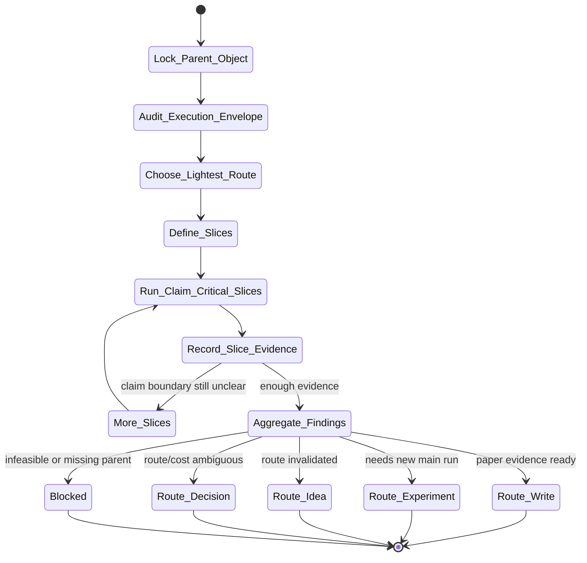

# analysis-campaign Skill Analysis

Source skill: [analysis-campaign](../../../extern/orphan/DeepScientist/src/skills/analysis-campaign/SKILL.md)

Role: stage

Purpose: answer the smallest follow-up evidence question that changes, confirms, weakens, or blocks a parent claim after a main experiment.

## Mermaid UML Workflow

## State Step Meanings

| Step | Meaning |
| --- | --- |
| `Lock_Parent_Object` | Name the parent claim, result, paper gap, or reviewer item being tested. |
| `Audit_Execution_Envelope` | Check compute, memory, time, storage, dependencies, and runtime limits. |
| `Choose_Lightest_Route` | Pick the smallest analysis route that can answer the question. |
| `Define_Slices` | Define concrete slices with fixed conditions, metrics, and stop rules. |
| `Run_Claim_Critical_Slices` | Run the highest-value slices first. |
| `Record_Slice_Evidence` | Store each slice outcome, evidence path, claim update, and comparability verdict. |
| `Aggregate_Findings` | Summarize only decision-relevant findings from recorded slices. |
| Route states | Move to writing, experiment, idea, decision, or blocker based on evidence. |

## Inner Working

The skill starts by binding analysis to a parent object: a main run, selected idea, paper gap, reviewer item, rebuttal item, failure mode, or route decision. It then audits the real execution envelope before planning: available CPU/GPU, memory, wall-clock budget, storage, dependency availability, queue/service constraints, and anything that limits what can run now.

It chooses the smallest valid analysis route. `analysis-lite` is enough for one compact follow-up question. Artifact-backed campaigns are used when lineage, worktree isolation, or replay matters. Writing-facing and review/rebuttal campaigns must map results back to paper, reviewer, or claim rows.

Each slice must record the question, intervention or inspection target, fixed conditions, metric or observable, evidence path, claim update, comparability verdict, and next action. The skill treats null, negative, failed, partial, and contradictory slices as evidence rather than hiding them.

## Durable Outputs

- Slice-level evidence records with status: completed, partial, failed, blocked, infeasible, or superseded.
- Campaign-level interpretation derived from slice evidence.
- Paper write-back fields when slices support a manuscript.
- A next route: continue campaign, `experiment`, `idea`, `write`, `decision`, stop, reset, or blocker.

## Key Constraints

- Do not disguise a new main experiment as an analysis slice.
- Do not widen the campaign once the next route is already clear.
- Do not call a writing-facing slice complete if it is not mapped back to the paper contract.
- Do not treat subjective inspection as objective measurement without rubric, sample, prompt, trace, and caveat.
