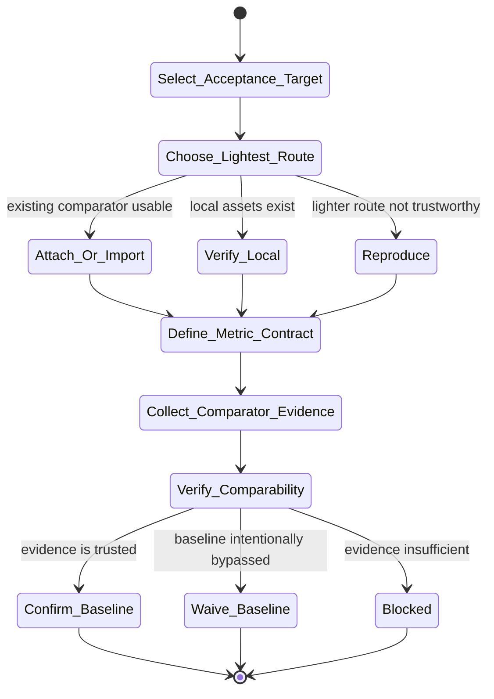

# baseline Skill Analysis

Source skill: [baseline](../../../extern/orphan/DeepScientist/src/skills/baseline/SKILL.md)

Role: stage

Purpose: secure the lightest trustworthy comparator, make the metric contract explicit, then confirm, waive, or block the baseline gate.

## Mermaid UML Workflow

## State Step Meanings

| Step | Meaning |
| --- | --- |
| `Select_Acceptance_Target` | Decide what level of baseline trust is needed now. |
| `Choose_Lightest_Route` | Prefer attach, import, or local verification before full reproduction. |
| `Attach_Or_Import` | Reuse an existing comparator when available. |
| `Verify_Local` | Check local baseline assets and outputs. |
| `Reproduce` | Re-run only when lighter evidence is not trustworthy. |
| `Define_Metric_Contract` | Fix dataset, split, metric ids, directions, evaluator, and caveats. |
| `Collect_Comparator_Evidence` | Gather real files, logs, outputs, or service responses. |
| `Verify_Comparability` | Check the comparator matches the intended contract. |
| Gate states | Confirm, waive, or block the baseline explicitly. |

## Inner Working

The skill is a gatekeeper. It does not merely find or import a baseline; it decides whether later stages can trust the comparator. It prefers low-cost routes first: attach, import, or verify-local-existing. Full reproduction is only warranted when lighter evidence cannot establish trust.

The central object is the metric contract. The accepted comparison contract must make task, dataset, split, evaluation path, metric ids, metric directions, source identity, and known deviations explicit. Later stages should not have to infer which baseline, metric, or caveat matters.

The gate closes only through an explicit artifact action: `artifact.confirm_baseline(...)`, `artifact.waive_baseline(...)`, `artifact.overwrite_baseline(...)` for deliberate refreshes, or a blocker with next-step routing.

## Durable Outputs

- Comparator identity and source.
- Accepted metric contract, normally under the baseline root as `json/metric_contract.json`.
- Evidence paths to real logs, files, service responses, source artifacts, or output records.
- Explicit gate outcome: confirmed, waived, overwritten, or blocked.

## Key Constraints

- Attach/import/publish alone does not open the baseline gate.
- Metrics copied from papers or prose are not enough unless they trace to trustworthy evidence.
- Dataset, split, metric, evaluator, and source deviations must stay visible.
- All terminal work must go through the DeepScientist `bash_exec(...)` contract.
