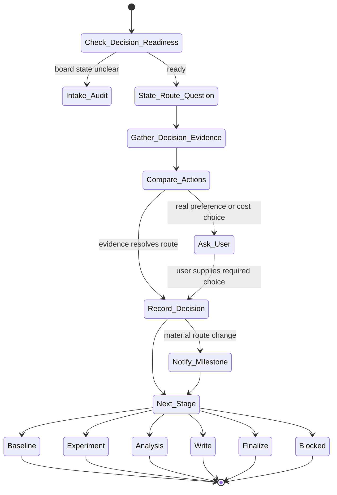

# decision Skill Analysis

Source skill: [decision](../../../extern/orphan/DeepScientist/src/skills/decision/SKILL.md)

Role: stage

Purpose: make one route judgment from durable evidence, record it, and move the quest to the smallest valid next action.

## Mermaid UML Workflow

## State Step Meanings

| Step | Meaning |
| --- | --- |
| `Check_Decision_Readiness` | Decide whether the board is clear enough to judge. |
| `Intake_Audit` | Reconcile state first when evidence or mainline is unclear. |
| `State_Route_Question` | Name the exact decision being made. |
| `Gather_Decision_Evidence` | Collect only evidence that can change the route. |
| `Compare_Actions` | Compare canonical actions and rejected alternatives. |
| `Ask_User` | Request input only for true preference, scope, or cost choices. |
| `Record_Decision` | Store verdict, reason, evidence paths, and next direction. |
| `Notify_Milestone` | Tell the user when the route materially changes. |
| `Next_Stage` | Hand off to the chosen stage or blocker. |

## Inner Working

The skill compresses a messy board into one explicit route question. It checks whether the state is decision-ready, and if the current mainline, decisive result, or stale-route state is unclear, it routes through `intake-audit` rather than guessing.

A valid decision names the strongest support, strongest contradiction, main risk, main cost, what changed, the winning action, and the rejected alternatives. It uses durable evidence, not momentum or optimism.

The final act is a durable decision record with verdict, action, reason, evidence paths, and next stage. A user question is reserved for real preference, scope, cost, or safety choices that local evidence cannot resolve.

## Durable Outputs

- Decision artifact with verdict, action, reason, evidence paths, and next direction.
- Optional milestone interaction when the route materially changes.
- Explicit next stage or blocker.

## Key Constraints

- Do not repeat the same decision without new evidence.
- Do not hide a blocked state behind a vague "continue".
- Do not choose `finalize` for a paper line unless manuscript coverage is truly submission-ready.
- Evidence-gathering shell work must use `bash_exec(...)`; git state should prefer `artifact.git(...)`.
