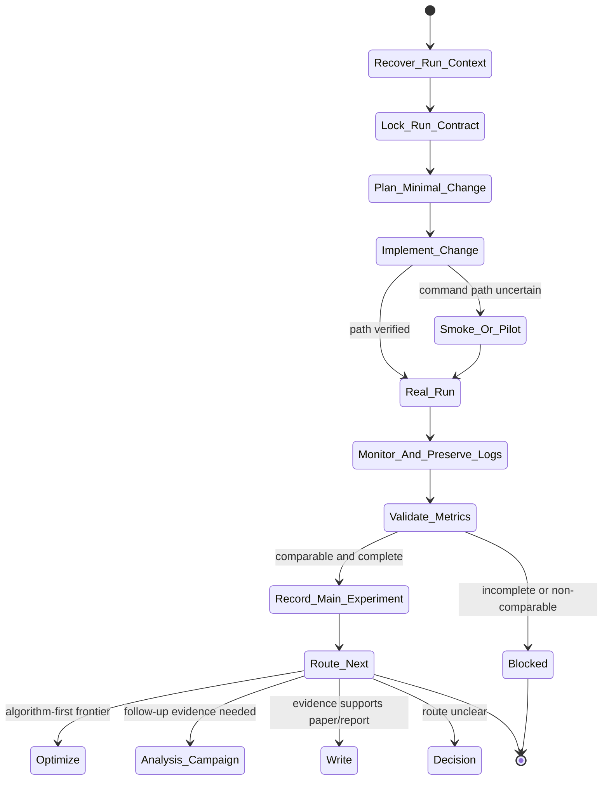

# experiment Skill Analysis

Source skill: [experiment](../../../extern/orphan/DeepScientist/src/skills/experiment/SKILL.md)

Role: stage

Purpose: turn one selected route into one trustworthy measured result, then record and route from the evidence.

## Mermaid UML Workflow

## State Step Meanings

| Step | Meaning |
| --- | --- |
| `Recover_Run_Context` | Read selected idea, baseline, metric contract, and workspace state. |
| `Lock_Run_Contract` | Fix question, dataset, metrics, stop rules, and outputs. |
| `Plan_Minimal_Change` | Map the smallest hypothesis-bound code or config change. |
| `Implement_Change` | Apply the planned change without unrelated cleanup. |
| `Smoke_Or_Pilot` | Verify command path, schema, or evaluator wiring. |
| `Real_Run` | Execute the evidence-bearing run. |
| `Monitor_And_Preserve_Logs` | Keep commands, configs, logs, outputs, and last-good state. |
| `Validate_Metrics` | Check metric completeness and baseline comparability. |
| `Record_Main_Experiment` | Store the measured result durably. |
| `Route_Next` | Choose optimize, analysis, write, decision, or blocker from evidence. |

## Inner Working

The skill binds execution to a selected idea and an accepted or explicitly waived baseline. It first recovers the selected idea, baseline contract, metric keys, dataset/split, current workspace, and expected outputs.

Before changing code, it defines a run contract: research question, baseline reference, stop condition, abandonment condition, output schema, minimum evidence target, and comparability rules. Implementation should be the smallest hypothesis-bound change, not a broad cleanup pass.

The evidence becomes durable only after metric completeness and comparability are checked and `artifact.record_main_experiment(...)` succeeds. Smoke tests and pilots are allowed, but they are not main evidence.

## Durable Outputs

- Run contract and rolling run log.
- Commands, configs, logs, outputs, and metric records.
- `artifact.record_main_experiment(...)` result with `evaluation_summary`, `claim_update`, `baseline_relation`, `failure_mode`, and `next_action`.
- Next route after measured evidence.

## Key Constraints

- Do not silently change dataset, split, metric, evaluator, or baseline recipe.
- Do not claim success before durable outputs exist.
- Do not rerun without a real code, command, environment, evidence, or route change.
- All real execution must use `bash_exec(...)`.
