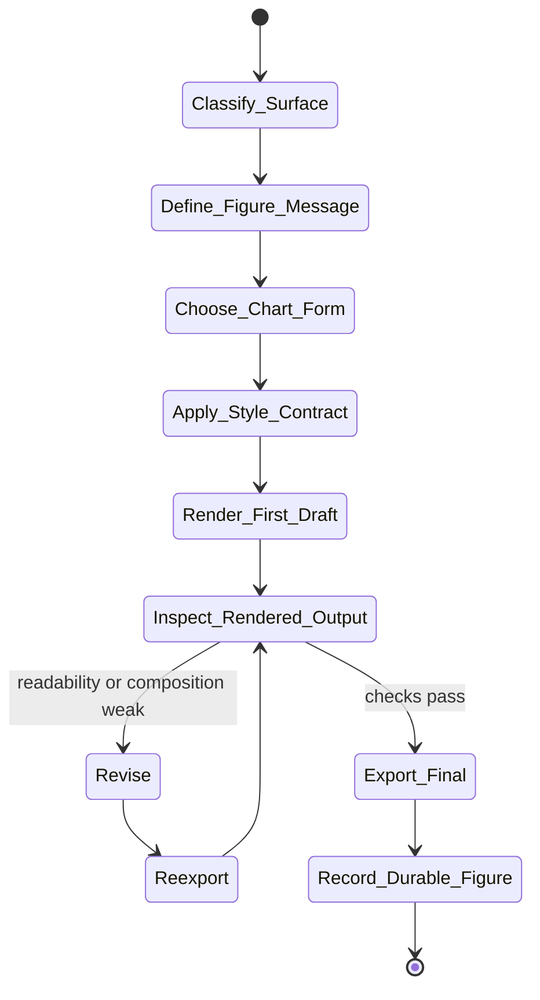

# figure-polish Skill Analysis

Source skill: [figure-polish](../../../extern/orphan/DeepScientist/src/skills/figure-polish/SKILL.md)

Role: companion

Purpose: turn an already meaningful figure into a durable, readable milestone, manuscript, appendix, or review figure through render-inspect-revise.

## Mermaid UML Workflow

## State Step Meanings

| Step | Meaning |
| --- | --- |
| `Classify_Surface` | Decide whether the figure is milestone, paper, appendix, or internal review. |
| `Define_Figure_Message` | State the one comparison or claim the figure must communicate. |
| `Choose_Chart_Form` | Pick the chart type that matches the research question. |
| `Apply_Style_Contract` | Use restrained academic styling and clear visual hierarchy. |
| `Render_First_Draft` | Produce an actual image output. |
| `Inspect_Rendered_Output` | Review the rendered image, not just the code. |
| `Revise` | Fix readability, labels, clutter, or composition problems. |
| `Reexport` | Save the corrected figure. |
| `Export_Final` | Produce the final durable format. |
| `Record_Durable_Figure` | Link the figure to its claim, source, or artifact record. |

## Inner Working

The skill starts by classifying the figure surface: connector milestone, paper main figure, appendix figure, or internal review figure. That surface determines export format and strictness.

The central rule is one dominant message per figure. Chart selection follows the research question, not aesthetic preference. The style contract favors restrained academic design: white background, muted palette, minimal legend, clear hierarchy, and no decorative clutter.

The mandatory operation is render-inspect-revise. The agent must inspect the actual image output, not only the plotting code, before finalizing.

## Durable Outputs

- Final figure exports, usually PNG for milestones and PDF/SVG plus PNG preview for paper-facing figures.
- Source plotting script or figure-generation path.
- Optional artifact or paper evidence update linking the figure to the claim it supports.

## Key Constraints

- Do not treat uninspected renders as final.
- Do not polish disposable debug plots unless requested.
- Do not overload one figure with multiple unrelated claims.
- Do not use bright, glossy, rainbow, or dashboard-like visual style for paper figures.
