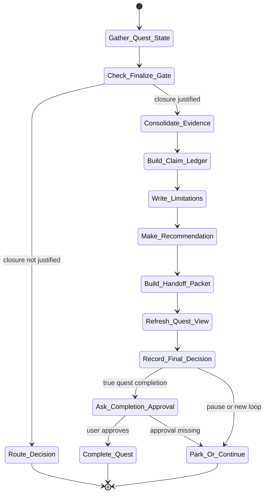

# finalize Skill Analysis

Source skill: [finalize](../../../extern/orphan/DeepScientist/src/skills/finalize/SKILL.md)

Role: stage

Purpose: consolidate final claims, limitations, recommendations, summary state, and graph exports without pretending that every research line succeeded.

## Mermaid UML Workflow

## State Step Meanings

| Step | Meaning |
| --- | --- |
| `Gather_Quest_State` | Collect baseline, run, analysis, writing, review, and blocker state. |
| `Check_Finalize_Gate` | Decide whether closure is actually justified. |
| `Route_Decision` | Send unresolved closure questions back to decision. |
| `Consolidate_Evidence` | Separate supported, partial, failed, and open claims. |
| `Build_Claim_Ledger` | Record final claim status and evidence boundaries. |
| `Write_Limitations` | Make failures, caveats, and remaining risks explicit. |
| `Make_Recommendation` | Choose stop, park, publish, archive, or continue. |
| `Build_Handoff_Packet` | Leave enough context for later resume. |
| `Refresh_Quest_View` | Update summary, status, and graph surfaces. |
| `Record_Final_Decision` | Store the closure decision durably. |
| `Ask_Completion_Approval` | Request explicit user approval before true completion. |
| `Complete_Quest` | Mark the quest complete only after approval. |

## Inner Working

The skill is a closure controller, not automatic quest death. It gathers baseline state, accepted runs, analysis, writing outputs, reviews, blockers, quest documents, and paper bundle manifests when present.

For paper-like deliverables, it checks whether outline, evidence ledger, manuscript coverage, language validation, and submission package status are actually ready. If not, it routes back through `decision`, `write`, `review`, `analysis-campaign`, or another appropriate stage.

A valid finalize pass leaves an honest state: supported claims, partial claims, failures, open risks, final recommendation, reopen conditions, and whether the next edge is stop, park, publish, or start a new loop.

## Durable Outputs

- Refreshed `SUMMARY.md` and `status.md`.
- Final report artifact and final decision artifact.
- Final claim ledger or equivalent claim-status summary.
- Git graph export and compact resume/handoff packet.
- Optional `artifact.complete_quest(...)`, only after explicit user approval.

## Key Constraints

- Do not finalize from chat memory alone.
- Do not finalize a paper line while manuscript coverage or language checks still block submission.
- Do not hide failures or partial support.
- True quest completion requires explicit user approval.
