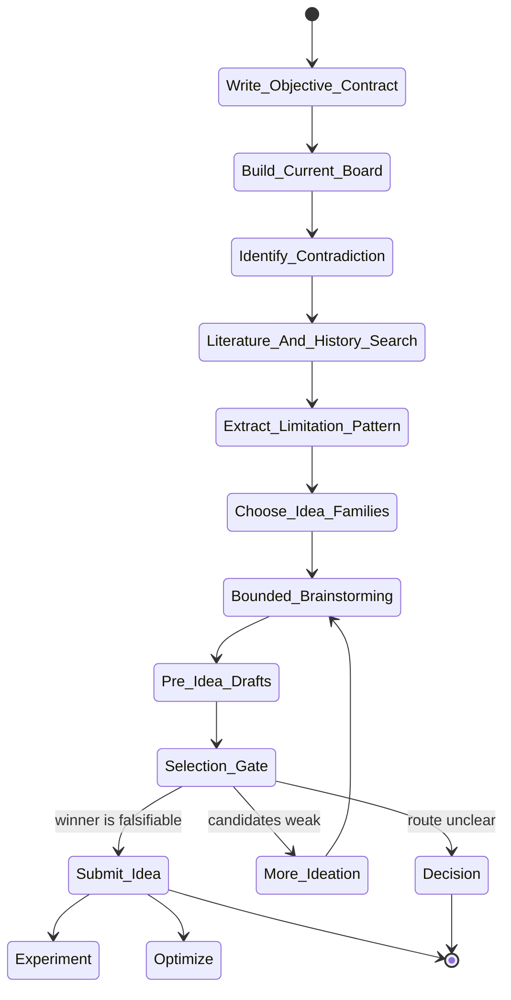

# idea Skill Analysis

Source skill: [idea](../../../extern/orphan/DeepScientist/src/skills/idea/SKILL.md)

Role: stage

Purpose: turn the objective, board state, and bottleneck into a small differentiated frontier, then select the next falsifiable route.

## Mermaid UML Workflow

## State Step Meanings

| Step | Meaning |
| --- | --- |
| `Write_Objective_Contract` | Define target, proxies, false-progress signals, and hard constraints. |
| `Build_Current_Board` | Summarize incumbent, latest result, blocker, and stale routes. |
| `Identify_Contradiction` | Find the bottleneck, anomaly, or gap that should drive ideation. |
| `Literature_And_History_Search` | Check prior work and quest history before serious proposals. |
| `Extract_Limitation_Pattern` | Identify what is saturated, weak, or still promising. |
| `Choose_Idea_Families` | Decide which mechanism, objective, measurement, or infrastructure families to explore. |
| `Bounded_Brainstorming` | Generate a small differentiated slate. |
| `Pre_Idea_Drafts` | Stress-test serious candidates before submission. |
| `Selection_Gate` | Reject weak candidates or select the falsifiable winner. |
| `Submit_Idea` | Record the selected route durably. |
| Route states | Hand off to experiment, optimize, more ideation, or decision. |

## Inner Working

The skill begins with two durable control surfaces: an objective contract and a current-board packet. The objective contract names the real target, trusted proxies, false-progress signals, and hard constraints. The board packet compresses incumbent, decisive result, blocker, and stale routes.

Idea generation is delayed until the skill has identified the important contradiction and reviewed the relevant research history. It separates mechanism-family, objective-family, measurement-family, and infrastructure-family routes before brainstorming.

The core safety device is draft-before-submit. Serious candidates get compact pre-idea drafts that expose hidden assumptions, strongest rejection cases, outside-family alternatives, falsification paths, anti-win conditions, and abandonment criteria. Only a candidate that survives this gate should become a durable selected idea through `artifact.submit_idea(...)`.

## Durable Outputs

- `artifacts/idea/objective_contract.md`.
- `artifacts/idea/current_board_packet.md`.
- Candidate frontier summary and pre-idea drafts.
- Selected idea package with hypothesis, novelty type, risk, falsification experiment, validation plan, and next stage.
- Optional memory notes for durable survey conclusions or rejected-idea lessons.

## Key Constraints

- Do not brainstorm before the objective and false-progress signals are explicit.
- Do not promote decorative tweaks as novelty.
- Do not skip literature/history checks before serious idea selection.
- Do not submit a final idea without a challenge memo or equivalent pre-idea draft.
