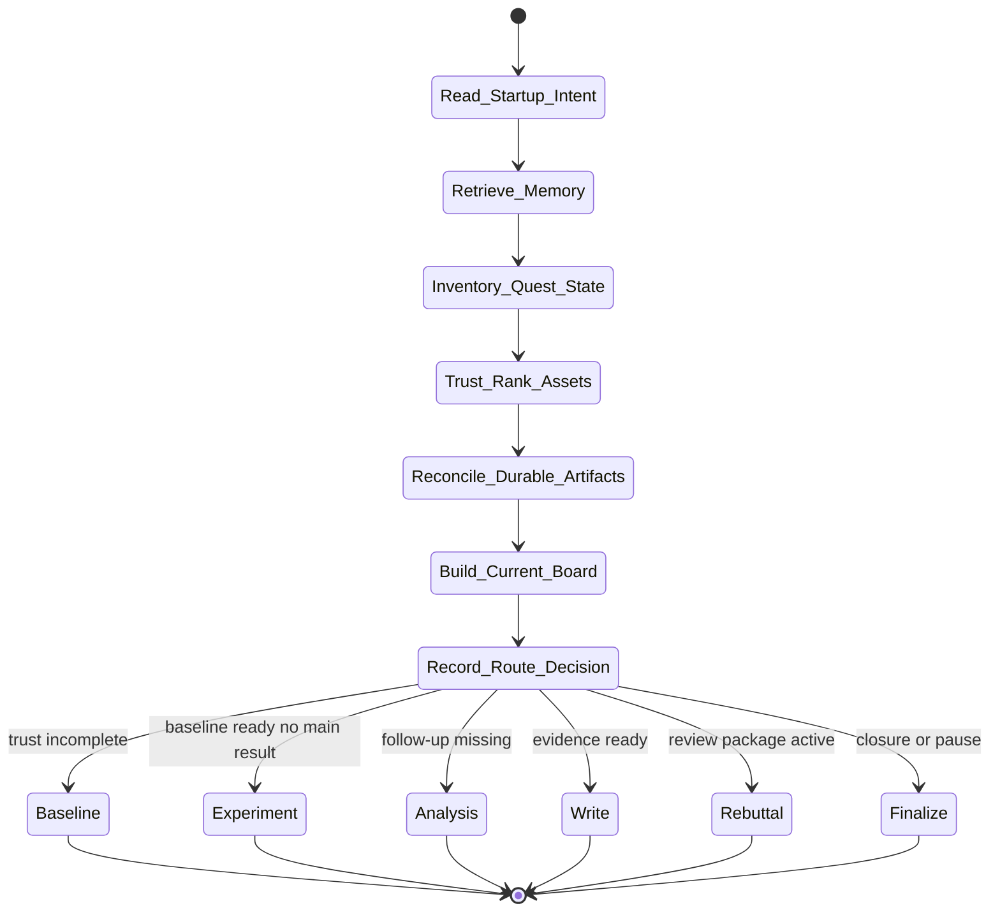

# intake-audit Skill Analysis

Source skill: [intake-audit](../../../extern/orphan/DeepScientist/src/skills/intake-audit/SKILL.md)

Role: companion

Purpose: normalize a non-blank quest by auditing, trust-ranking, and reconciling existing assets before choosing the next anchor.

## Mermaid UML Workflow

## State Step Meanings

| Step | Meaning |
| --- | --- |
| `Read_Startup_Intent` | Read launch contract, latest user message, and current status. |
| `Retrieve_Memory` | Reuse prior route knowledge before filesystem triage. |
| `Inventory_Quest_State` | Locate baselines, runs, analysis, writing, reviews, and git state. |
| `Trust_Rank_Assets` | Decide what is trusted, stale, conflicting, or reference-only. |
| `Reconcile_Durable_Artifacts` | Backfill valid assets into artifact state. |
| `Build_Current_Board` | Create one authoritative board packet for the next skill. |
| `Record_Route_Decision` | Store the post-audit next anchor. |
| Route states | Hand off to baseline, experiment, analysis, write, rebuttal, or finalize. |

## Inner Working

The skill handles quests that already have files, drafts, baselines, runs, reviews, or user-provided state. It reads `startup_contract`, recent user messages, and current status before inspecting the tree, because custom launch modes can change the normal stage order.

It retrieves memory first to avoid re-auditing already-known state. Then it inventories durable surfaces such as `artifacts/`, `baselines/`, `experiments/main/`, `experiments/analysis/`, `paper/`, reviews, and git topology. The goal is not to read everything; it is to locate trust anchors and conflicts.

Reconciliation backfills or links valid assets into the artifact layer: attach and confirm baselines, record accepted main experiments, record analysis slices, select or revise paper outlines, or submit paper bundles when they are genuinely ready.

## Durable Outputs

- `artifacts/intake/state_audit.md`.
- `artifacts/intake/current_board_packet.md`.
- `artifacts/intake/recommended_next_step.md`.
- One decision artifact for the post-audit route.
- Repair or backfill artifact calls when justified.

## Key Constraints

- Do not trust chat recollection over durable state.
- Do not invent a cleaned-up history when evidence is insufficient.
- Do not over-read the whole tree.
- All repo-audit execution must go through `bash_exec(...)`; git inspection should prefer `artifact.git(...)`.
