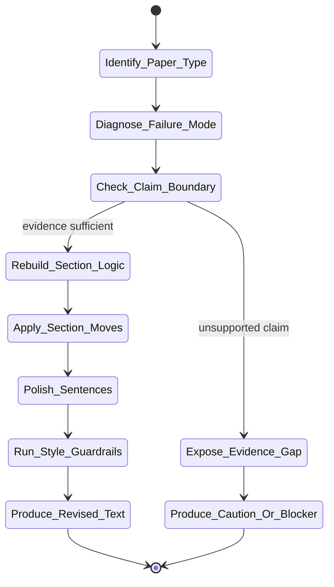

# nature-polishing Skill Analysis

Source skill: [nature-polishing](../../../extern/orphan/DeepScientist/src/skills/nature-polishing/SKILL.md)

Role: companion

Purpose: polish, restructure, or translate academic prose into Nature-leaning English without hiding weak evidence or inventing claims.

## Mermaid UML Workflow

## State Step Meanings

| Step | Meaning |
| --- | --- |
| `Identify_Paper_Type` | Determine which scientific narrative logic applies. |
| `Diagnose_Failure_Mode` | Find whether the problem is argument, section logic, evidence, or wording. |
| `Check_Claim_Boundary` | Confirm what the evidence can and cannot support. |
| `Expose_Evidence_Gap` | Surface unsupported claims instead of polishing them. |
| `Rebuild_Section_Logic` | Fix order, gap, claim, and reader flow. |
| `Apply_Section_Moves` | Use section-specific academic move patterns. |
| `Polish_Sentences` | Improve clarity, hedging, transitions, and concision. |
| `Run_Style_Guardrails` | Check register, mechanics, and manuscript hygiene. |
| `Produce_Revised_Text` | Return polished or restructured prose. |
| `Produce_Caution_Or_Blocker` | Return a warning when evidence is insufficient. |

## Inner Working

The skill edits argument before wording. It first identifies the paper type, because research papers, methods papers, hypothesis-driven work, algorithmic work, and device work need different narrative logic.

It diagnoses the main failure mode: wrong paper-type logic, missing gap, unsupported claim, evidence without interpretation, missing boundary, Results/Discussion mixing, weak title or abstract, or sentence-level clutter.

Only after the evidence boundary is clear does it apply section moves, phrasebank support, hedging, transitions, and sentence-level polish. It preserves DeepScientist paper hygiene: no user/operator/agent provenance, route-control wording, prompt state, worktree details, or local implementation shorthand in manuscript prose.

## Durable Outputs

- Revised manuscript section, paragraph, abstract, title, or translation.
- Optional diagnosis of argument-level defects.
- Missing-evidence or claim-scope warnings when polishing would overstate support.

## Key Constraints

- Do not invent data, mechanisms, novelty, references, or claims.
- Do not use polished language to hide missing support.
- Do not let AI author the core scientific argument from scratch.
- Reconstruct Chinese or rough drafts logically first, then polish prose.
