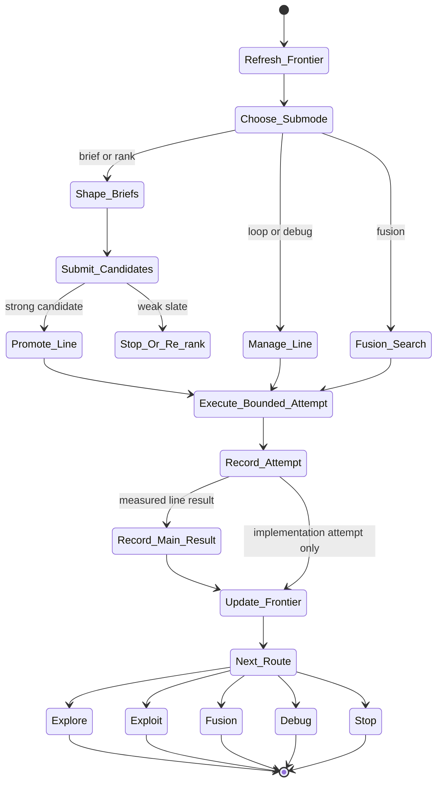

# optimize Skill Analysis

Source skill: [optimize](../../../extern/orphan/DeepScientist/src/skills/optimize/SKILL.md)

Role: stage

Purpose: manage algorithm-first candidate briefs, optimization frontier, branch promotion, and fusion/debug routes without turning every attempt into a new durable idea line.

## Mermaid UML Workflow

## State Step Meanings

| Step | Meaning |
| --- | --- |
| `Refresh_Frontier` | Read current optimization frontier, memory, and quest state. |
| `Choose_Submode` | Select one pass type: brief, rank, seed, loop, fusion, debug, or stop. |
| `Shape_Briefs` | Create or rank branchless candidate briefs. |
| `Manage_Line` | Work within an existing durable optimization line. |
| `Fusion_Search` | Combine promising mechanisms when justified. |
| `Submit_Candidates` | Record candidate briefs without over-promoting them. |
| `Promote_Line` | Turn a strong brief into a durable line. |
| `Execute_Bounded_Attempt` | Run one bounded implementation or experiment attempt. |
| `Record_Attempt` | Store implementation-level attempt results. |
| `Record_Main_Result` | Record measured line results as main experiment evidence. |
| `Update_Frontier` | Revise frontier status and next action. |
| Route states | End in explore, exploit, fusion, debug, or stop. |

## Inner Working

The skill treats optimization as a frontier-management problem. It refreshes `artifact.get_optimization_frontier(...)`, recent memory, and quest state before creating, promoting, or executing anything.

It keeps three object levels separate: candidate brief, durable optimization line, and implementation-level candidate attempt. Candidate briefs are cheap and branchless. Durable lines get `artifact.submit_idea(..., submission_mode='line')` only when expected value, differentiation, and execution path are clear. Implementation attempts inside a line are recorded separately.

Each pass has one primary submode: brief, rank, seed, loop, fusion, debug, or stop. The output is one dominant next route such as explore, exploit, fusion, debug, or stop.

## Durable Outputs

- Refreshed optimization frontier.
- Candidate briefs through `artifact.submit_idea(..., submission_mode='candidate')`.
- Durable lines through `artifact.submit_idea(..., submission_mode='line')`.
- Attempt reports via `artifact.record(... report_type='optimization_candidate' ...)`.
- Measured line results via `artifact.record_main_experiment(...)`.

## Key Constraints

- Do not create a branch/worktree for every micro-attempt.
- Do not promote every plausible brief.
- Do not mix several major route changes in one optimize pass.
- All terminal work must go through `bash_exec(...)`.
