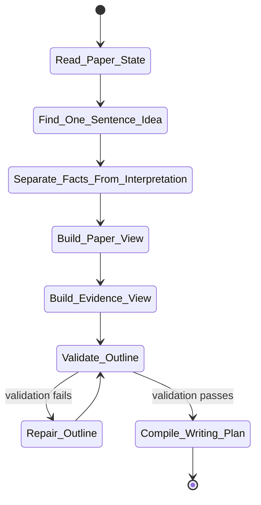

# paper-outline Skill Analysis

Source skill: [paper-outline](../../../extern/orphan/DeepScientist/src/skills/paper-outline/SKILL.md)

Role: companion

Purpose: turn experiment evidence into a paper-native outline with scoped claims, method abstraction, evaluation plan, analysis plan, and evidence boundaries.

## Mermaid UML Workflow

## State Step Meanings

| Step | Meaning |
| --- | --- |
| `Read_Paper_State` | Inspect current outline, paper contract, and evidence surfaces. |
| `Find_One_Sentence_Idea` | State what readers should remember. |
| `Separate_Facts_From_Interpretation` | Distinguish measured evidence from allowed claims. |
| `Build_Paper_View` | Shape the reader-facing thesis, claims, method, and analysis plan. |
| `Build_Evidence_View` | Store runs, paths, metrics, settings, and reproducibility details separately. |
| `Validate_Outline` | Check whether the outline satisfies academic and evidence rules. |
| `Repair_Outline` | Fix missing claims, boundaries, analyses, or evidence mapping. |
| `Compile_Writing_Plan` | Convert a valid outline into section writing jobs. |

## Inner Working

The skill separates two views. `paper_view` is what the paper says to readers: central thesis, story spine, scoped claims, method abstraction, evaluation plan, and analysis plan. `evidence_view` is where exact runs, settings, paths, metrics, and reproducibility details live.

It prevents a paper outline from becoming a run log. Ports, worktrees, commands, route decisions, artifact ids, and local execution details stay out of the paper story unless they belong in appendix-only reproducibility material.

After drafting or repair, the outline is validated with `artifact.validate_academic_outline(detail='full')`. If valid, `artifact.compile_outline_to_writing_plan(detail='full')` converts the outline into section-level writing jobs.

## Durable Outputs

- Candidate, selected, or revised paper outline through `artifact.submit_paper_outline(...)`.
- Validated `paper_view` and `evidence_view`.
- Writing plan derived from the outline.

## Key Constraints

- Do not copy run logs into the manuscript plan.
- Do not treat a section list as a mature outline.
- Each claim needs evidence and falsification boundary.
- Mature empirical outlines should plan enough reviewer-facing analysis unless the scope is explicitly downgraded.
