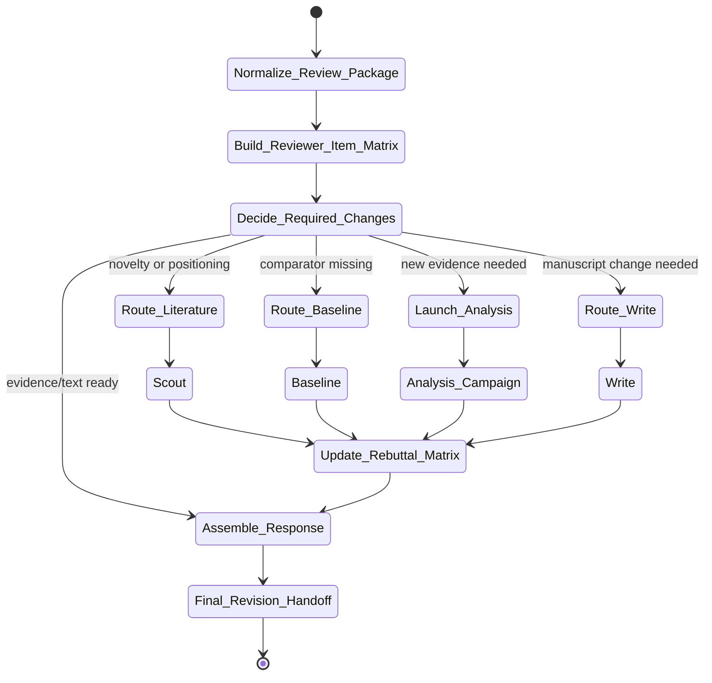

# rebuttal Skill Analysis

Source skill: [rebuttal](../../../extern/orphan/DeepScientist/src/skills/rebuttal/SKILL.md)

Role: companion

Purpose: map reviewer feedback into experiments, manuscript deltas, and a durable rebuttal or revision response.

## Mermaid UML Workflow

## State Step Meanings

| Step | Meaning |
| --- | --- |
| `Normalize_Review_Package` | Convert reviewer material into durable, structured inputs. |
| `Build_Reviewer_Item_Matrix` | Split feedback into stable reviewer item ids. |
| `Decide_Required_Changes` | Classify each issue as text, evidence, experiment, baseline, literature, or limitation. |
| `Route_Literature` | Use scout when novelty or positioning is the real issue. |
| `Route_Baseline` | Use baseline when a comparator gap blocks the response. |
| `Launch_Analysis` | Use analysis-campaign for required new reviewer-linked evidence. |
| `Route_Write` | Use write for manuscript structure, claim, or wording changes. |
| `Update_Rebuttal_Matrix` | Refresh item status after each routed fix. |
| `Assemble_Response` | Draft the point-by-point author response. |
| `Final_Revision_Handoff` | Update response, text deltas, evidence notes, and bundle status. |

## Inner Working

The skill normalizes reviewer pressure into atomic items. Each item gets a stable id, source-faithful wording, class, severity, affected claim, evidence anchor, and route. Vague reviewer paragraphs are split into auditable work items.

It then decides whether each issue needs explanation only, evidence repackaging, new supplementary experiment, claim downgrade, explicit limitation, literature positioning, baseline recovery, or manuscript rewrite.

Experiments are launched only when genuinely needed. Reviewer-linked runs are expressed through the shared `analysis-campaign` protocol, and every slice should answer named reviewer item ids. Manuscript changes route through `write`, with text deltas and evidence basis kept explicit.

## Durable Outputs

- Review matrix.
- `paper/rebuttal/action_plan.md`.
- Reviewer-linked experiment/action TODOs.
- `paper/rebuttal/evidence_update.md`.
- Text deltas and response letter.
- Revised paper bundle when ready.

## Key Constraints

- Do not launch free-floating ablation batches.
- Do not rewrite reviewer meaning when normalizing comments.
- Do not pretend limitations are solved when only reframed.
- Do not finalize while reviewer-critical feasible matrix rows remain unresolved.
