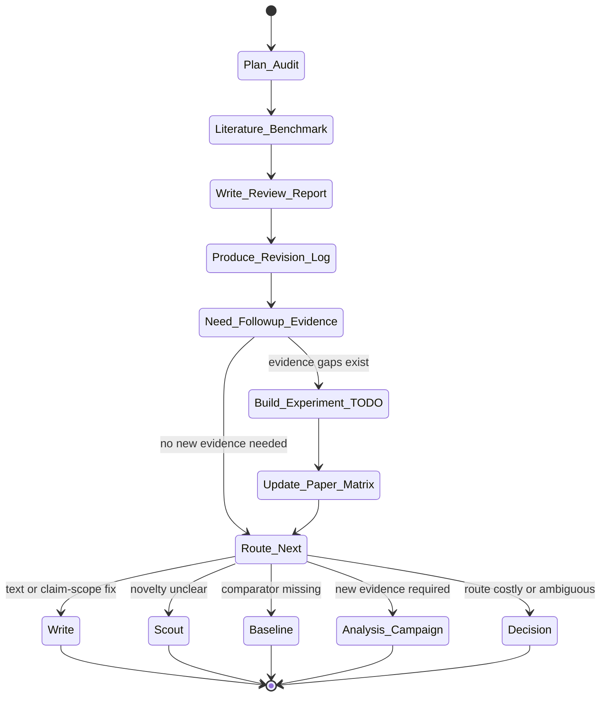

# review Skill Analysis

Source skill: [review](../../../extern/orphan/DeepScientist/src/skills/review/SKILL.md)

Role: companion

Purpose: run an independent skeptical audit of a substantial draft, paper, or paper-like report before finalization, rebuttal, or revision routing.

## Mermaid UML Workflow

## State Step Meanings

| Step | Meaning |
| --- | --- |
| `Plan_Audit` | Define claims, evidence, risks, review scope, and likely route. |
| `Literature_Benchmark` | Compare against nearby strong papers or venue expectations. |
| `Write_Review_Report` | Produce an independent skeptical review. |
| `Produce_Revision_Log` | Convert issues into concrete fixes and blockers. |
| `Need_Followup_Evidence` | Decide whether missing evidence is real. |
| `Build_Experiment_TODO` | Write only concrete evidence TODOs. |
| `Update_Paper_Matrix` | Keep paper-facing experiment planning aligned. |
| `Route_Next` | Choose writing, scout, baseline, analysis, or decision. |
| Route states | Hand off to the stage that can fix the review finding. |

## Inner Working

The skill reviews from evidence, not author optimism. It checks manuscript coverage, current draft, selected outline, claim-evidence map, evaluation summaries, figures, captions, user-provided bundles, and nearby high-quality papers.

Before judging a substantial manuscript, it builds an audit plan: claim set, strongest and weakest evidence, likely rejection reasons, ready experiment/analysis group count, comparator papers, language hygiene risks, and likely next route.

The review report names strengths, weaknesses, key issues, actionable suggestions, storyline advice, experiment inventory, novelty verification, and comparison to strong papers. Serious issues are turned into a revision log and, only if needed, a follow-up experiment TODO list and paper experiment matrix updates.

## Durable Outputs

- `paper/review/review.md`.
- `paper/review/revision_log.md`.
- `paper/review/experiment_todo.md` when evidence is missing.
- `paper/paper_experiment_matrix.md` and `.json` when experiment planning changes.
- Route decision or milestone interaction.

## Key Constraints

- Do not write "no weaknesses" without showing likely rejection routes.
- Do not turn manuscript/submission blockers into fake experiments.
- Do not request new experiments before checking recorded evidence.
- Follow-up experiments should use `analysis-campaign`, not a review-only workflow.
