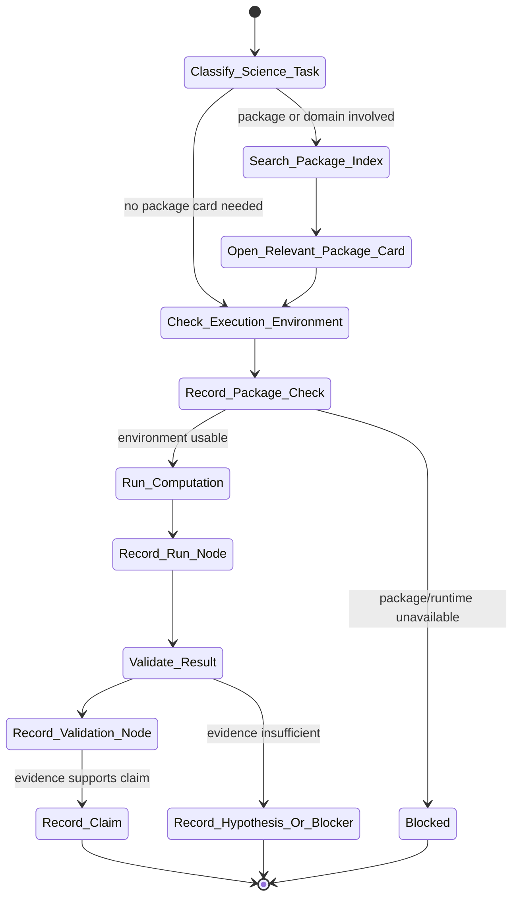

# science Skill Analysis

Source skill: [science](../../../extern/orphan/DeepScientist/src/skills/science/SKILL.md)

Role: companion

Purpose: support scientific computation, package routing, simulation, dataset analysis, validation, and evidence-backed scientific claims through the Science Evidence Graph.

## Mermaid UML Workflow

## State Step Meanings

| Step | Meaning |
| --- | --- |
| `Classify_Science_Task` | Identify package check, computation, analysis, sweep, validation, or claim work. |
| `Search_Package_Index` | Find relevant package/domain cards. |
| `Open_Relevant_Package_Card` | Read only the package card needed for this task. |
| `Check_Execution_Environment` | Verify modules, executables, versions, or HPC access. |
| `Record_Package_Check` | Store package availability or blocker evidence. |
| `Run_Computation` | Execute solver, script, SSH, queue, or analysis commands. |
| `Record_Run_Node` | Record computational run, dataset analysis, or parameter sweep. |
| `Validate_Result` | Check units, convergence, schema, controls, tolerances, or invariants. |
| `Record_Validation_Node` | Store validation evidence. |
| `Record_Claim` | Record only claims supported by evidence nodes. |
| `Record_Hypothesis_Or_Blocker` | Use hypothesis or blocker when support is missing. |

## Inner Working

The skill keeps real execution and evidence graph recording separate. Real imports, solver commands, SSH, SLURM, logs, scripts, and data analysis must run through `bash_exec(...)`. Scientific evidence is recorded with `artifact.science(...)`.

For package-specific work, it searches the package index, opens only relevant package cards, and treats those cards as routing knowledge rather than proof that a solver or module exists. The local environment must still be checked.

Science nodes are append-only logical records. Package checks, computational runs, dataset analyses, parameter sweeps, validation results, and claims should link to concrete input, output, log, and evidence paths. Claims are typed as computed, parsed, digitized, or hypothesis.

## Durable Outputs

- `science.package_check`.
- `science.computational_run`.
- `science.dataset_analysis`.
- `science.parameter_sweep`.
- `science.validation_result`.
- `science.claim`.
- User-visible milestone or blocker through `artifact.interact(...)` when needed.

## Key Constraints

- Do not treat package cards as runtime availability.
- Do not call a result computed unless real execution produced it.
- Do not weaken tolerances or validation just to pass a run.
- Do not submit remote/HPC work without a log and status-reading plan.
