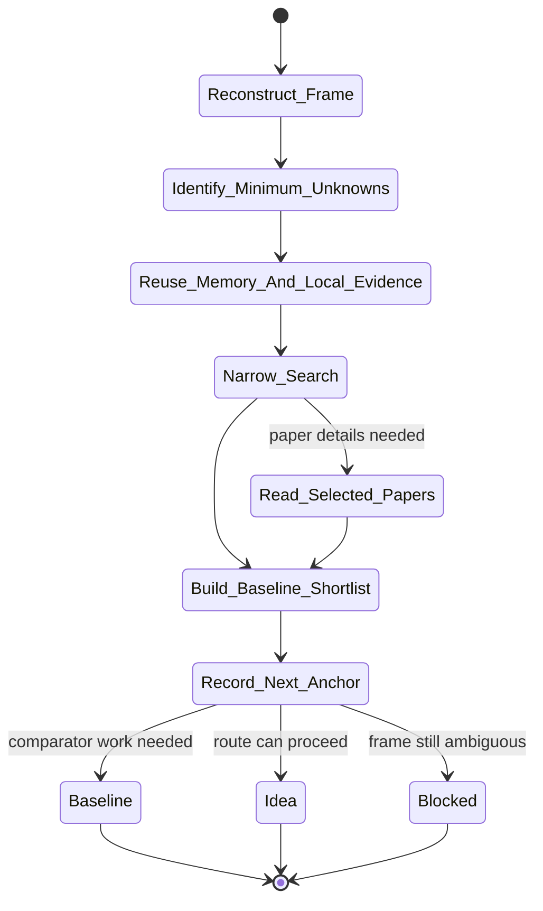

# scout Skill Analysis

Source skill: [scout](../../../extern/orphan/DeepScientist/src/skills/scout/SKILL.md)

Role: stage

Purpose: resolve the minimum framing unknowns needed to choose the next anchor, usually `baseline` or `idea`.

## Mermaid UML Workflow

## State Step Meanings

| Step | Meaning |
| --- | --- |
| `Reconstruct_Frame` | Read current task, metric, baseline state, and blockers. |
| `Identify_Minimum_Unknowns` | Keep only unknowns that affect the next anchor. |
| `Reuse_Memory_And_Local_Evidence` | Check durable notes before new search. |
| `Narrow_Search` | Search only the unresolved paper, repo, or benchmark neighborhood. |
| `Read_Selected_Papers` | Read actual papers only when details matter. |
| `Build_Baseline_Shortlist` | Produce decision-facing comparator directions. |
| `Record_Next_Anchor` | Store whether to move to baseline, idea, or blocker. |
| Route states | Stop scouting once the next anchor is clear. |

## Inner Working

The skill reconstructs the task, metric contract, baseline status, and blockers from durable state before searching. It narrows unknowns to only those that materially affect whether the quest should move to `baseline`, `idea`, or a blocker.

It searches the unresolved neighborhood rather than attempting exhaustive survey. Existing quest/global memory and local evidence come first. Search tools, DeepXiv, web discovery, and `artifact.arxiv(...)` are used only when they can change the next anchor.

The output is a decision-facing frame: evaluation contract, baseline directions, and next anchor. Long paper summaries are a failure mode unless they change the route.

## Durable Outputs

- Explicit task frame.
- Explicit evaluation contract.
- Baseline shortlist or route justification.
- Next anchor or blocker.

## Key Constraints

- Do not let scouting become endless exploration.
- Do not keep searching once the next anchor is clear.
- Do not ask the user ordinary technical questions before checking local evidence.
- Prefer durable quest context and memory before shelling out.
