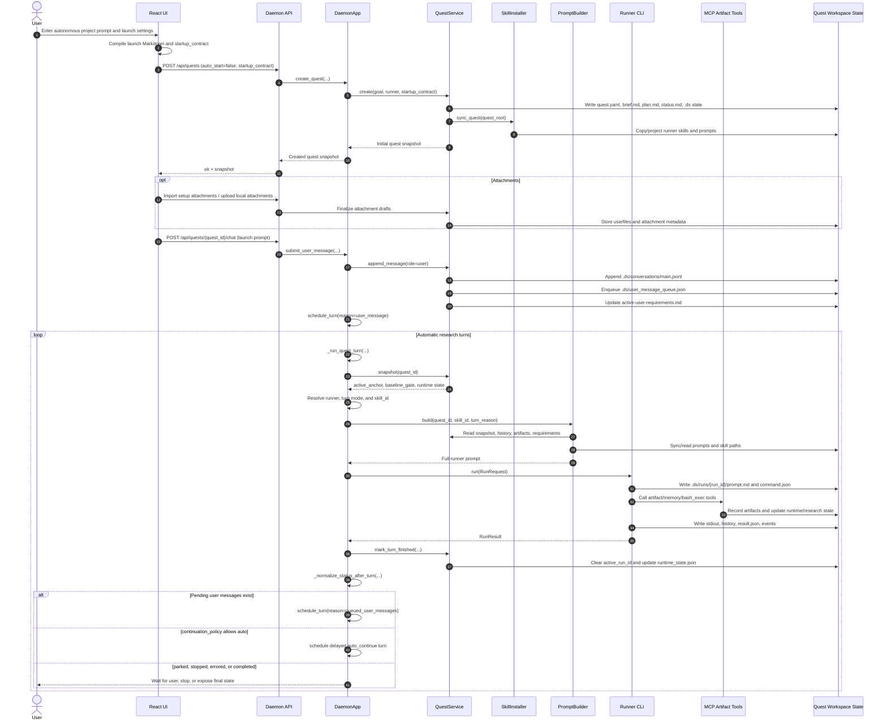

# DeepScientist System Explanation

## Research Skills: Storage and Generation

For `extern/orphan/DeepScientist`, research skills are not generated by the model at runtime. They are source-controlled skill bundles that DeepScientist discovers, then copies or projects into runner-specific locations.

## Source of Truth

The canonical research skills live under:

```text
extern/orphan/DeepScientist/src/skills/<skill_id>/SKILL.md
```

Each skill bundle may also include supporting files such as:

- `references/`
- `scripts/`
- `agents/openai.yaml`
- `agents/claude.md`

The registry discovers skills by scanning:

```text
extern/orphan/DeepScientist/src/skills/*/SKILL.md
```

The relevant discovery logic is in:

```text
extern/orphan/DeepScientist/src/deepscientist/skills/registry.py
```

Key implementation details:

- `_DEFAULT_STAGE_SKILLS` defines the built-in stage skills: `scout`, `baseline`, `idea`, `optimize`, `experiment`, `analysis-campaign`, `write`, `finalize`, and `decision`.
- `_DEFAULT_COMPANION_SKILLS` defines companion skills such as `paper-outline`, `paper-plot`, `figure-polish`, `intake-audit`, `review`, and `rebuttal`.
- `discover_skill_bundles(repo_root)` scans `repo_root / "src" / "skills"`.
- It only accepts directories containing `SKILL.md`.
- It skips dot-prefixed directories.
- It reads frontmatter and classifies each bundle as a stage, companion, or custom skill.

There are 21 `SKILL.md` files under `src/skills`, but one is hidden:

```text
extern/orphan/DeepScientist/src/skills/.alpharxiv-paper-loopup.rootbak/SKILL.md
```

Because the registry skips dot-prefixed directories, DeepScientist effectively discovers 20 active research skill bundles.

## Generated and Synced Locations

DeepScientist uses `SkillInstaller` to sync skills into runner-specific homes.

Implementation file:

```text
extern/orphan/DeepScientist/src/deepscientist/skills/installer.py
```

### Global Runner Installs

`SkillInstaller.sync_global()` creates or updates global skill installs:

```text
~/.codex/skills/deepscientist-<skill_id>/
~/.claude/agents/deepscientist-<skill_id>.md
~/.kimi/skills/deepscientist-<skill_id>/
~/.config/opencode/skills/deepscientist-<skill_id>/
```

### Quest-Local Installs

`SkillInstaller.sync_quest(quest_root)` creates or updates quest-local skill installs:

```text
<quest_root>/.codex/skills/deepscientist-<skill_id>/
<quest_root>/.claude/agents/deepscientist-<skill_id>.md
<quest_root>/.kimi/skills/deepscientist-<skill_id>/
<quest_root>/.opencode/skills/deepscientist-<skill_id>/
```

Quest layout reserves those directories in:

```text
extern/orphan/DeepScientist/src/deepscientist/quest/layout.py
```

Quest creation initializes the quest root, creates the runner directories, and calls `sync_quest()` in:

```text
extern/orphan/DeepScientist/src/deepscientist/quest/service.py
```

## How Skill Generation Works

For Codex, Kimi, and OpenCode, DeepScientist copies the full source skill bundle tree into the target location.

That means the generated directory preserves files such as:

- `SKILL.md`
- `references/*`
- `scripts/*`
- runner-specific metadata files

The copy-and-prune logic lives in `_sync_bundle_tree()` inside:

```text
extern/orphan/DeepScientist/src/deepscientist/skills/installer.py
```

For Claude, DeepScientist generates one Markdown agent file per skill:

```text
deepscientist-<skill_id>.md
```

The Claude projection logic is `_sync_claude_projection()`:

- If `agents/claude.md` exists in the skill bundle, DeepScientist copies it.
- Otherwise, DeepScientist renders a Claude-compatible agent file from `SKILL.md` frontmatter and body.

So the Claude path is a projection, while Codex, Kimi, and OpenCode receive copied bundle trees.

## When Sync Happens

Skill sync happens in three main places.

First, daemon startup creates a `SkillInstaller` and calls `ensure_release_sync()`:

```text
extern/orphan/DeepScientist/src/deepscientist/daemon/app.py
```

The default configuration enables:

```text
skills.sync_global_on_init = true
skills.sync_quest_on_create = true
skills.sync_quest_on_open = true
```

Those defaults are defined in:

```text
extern/orphan/DeepScientist/src/deepscientist/config/models.py
```

Second, quest creation calls `sync_quest(quest_root)` after creating the quest workspace.

Third, prompt building calls `sync_quest_prompts(quest_root)`, which copies DeepScientist prompt files into:

```text
<quest_root>/.codex/prompts/
```

Prompt versions are backed up under:

```text
<quest_root>/.codex/prompt_versions/
```

That prompt sync logic also lives in `SkillInstaller`, while prompt construction is driven by:

```text
extern/orphan/DeepScientist/src/deepscientist/prompts/builder.py
```

## Runtime Runner Overlays

Before a runner executes, DeepScientist also prepares isolated runtime homes.

Claude overlays generated agents into:

```text
<workspace_root>/.ds/claude-home/agents/
```

Kimi overlays generated skills into a per-run runtime home:

```text
<home>/runtime/runners/kimi/<quest_id>/<run_id>/.kimi/skills/
```

OpenCode overlays generated skills into:

```text
<workspace_root>/.ds/opencode-home/.config/opencode/skills/
```

Codex uses the `.codex` skill and prompt overlay model. The compatibility layer lists `skills` and `prompts` as quest overlay directories.

## Automatic Research Pipeline

When a user creates an autonomous project from a prompt, DeepScientist turns that prompt into a durable quest and then drives research through repeated daemon-scheduled runner turns.

The knowledge graph places this flow across these layers:

- React UI and project creation
- Daemon API and daemon runtime
- Core quest state
- Runner backends
- Research skills, prompts, and artifacts



### 1. UI Builds the Launch Payload

The autonomous project UI builds two related payloads:

- a compiled launch Markdown prompt
- a structured `startup_contract`

The `startup_contract` records fields such as:

- `workspace_mode: "autonomous"`
- `decision_policy`
- `launch_mode`
- `research_intensity`
- `need_research_paper`
- baseline source, execution, and acceptance policies
- objectives, constraints, paper URLs, baseline URLs, and custom brief fields

The contract is assembled in:

```text
extern/orphan/DeepScientist/src/ui/src/components/projects/CreateProjectDialog.tsx
```

The launch prompt text is built from the start-research template utilities in:

```text
extern/orphan/DeepScientist/src/ui/src/lib/startResearch.ts
```

The autonomous project page calls `createQuestWithOptions(...)` with `auto_start: false`, imports setup attachments, uploads local attachments, and then posts the compiled launch prompt as the first chat message.

Implementation file:

```text
extern/orphan/DeepScientist/src/ui/src/pages/CreateAutonomousProjectPage.tsx
```

Important implication: project creation alone does not start the real research turn in this flow. The subsequent chat post is the actual execution trigger.

### 2. Daemon Creates the Quest Workspace

The API route is:

```text
POST /api/quests
```

It is registered in:

```text
extern/orphan/DeepScientist/src/deepscientist/daemon/api/router.py
```

The handler parses:

- `goal`
- `title`
- `quest_id`
- connector bindings
- requested baseline reference
- `startup_contract`
- `auto_start`
- optional `initial_message`

Implementation file:

```text
extern/orphan/DeepScientist/src/deepscientist/daemon/api/handlers.py
```

The handler calls `DaemonApp.create_quest(...)`, which resolves the default runner, creates the quest through `QuestService`, attaches requested baselines, and binds connector targets when requested.

Implementation file:

```text
extern/orphan/DeepScientist/src/deepscientist/daemon/app.py
```

`QuestService.create(...)` then writes the durable quest scaffold:

```text
quest.yaml
brief.md
plan.md
status.md
SUMMARY.md
.gitignore
.ds/runtime_state.json
.ds/research_state.json
.ds/user_message_queue.json
.ds/interaction_state.json
.ds/conversations/main.jsonl
```

It also creates the standard quest directories, initializes a git repository, syncs quest-local skills, writes an initial checkpoint, and exports the git graph.

Implementation file:

```text
extern/orphan/DeepScientist/src/deepscientist/quest/service.py
```

The initial autonomous quest state is:

- `status: active`
- `active_anchor: baseline`
- `baseline_gate: pending`
- `continuation_policy: auto`

The initial directory and quest defaults live in:

```text
extern/orphan/DeepScientist/src/deepscientist/quest/layout.py
```

### 3. First Chat Message Queues the First Turn

The API route is:

```text
POST /api/quests/<quest_id>/chat
```

The chat handler stores the user message and calls either:

- `submit_user_message(...)`
- `submit_web_user_message(...)` when attachments are present

`submit_web_user_message(...)` finalizes upload drafts, then delegates to `submit_user_message(...)`.

`submit_user_message(...)` writes the message to:

```text
<quest_root>/.ds/conversations/main.jsonl
```

For user messages it also:

- enqueues the message in `.ds/user_message_queue.json`
- updates `memory/knowledge/active-user-requirements.md`
- updates runtime message counts
- schedules a runner turn

The scheduler is `DaemonApp.schedule_turn(...)`.

### 4. Daemon Starts a Turn Worker

`schedule_turn(...)` starts a daemon thread named like:

```text
deepscientist-turn-<quest_id>
```

The worker runs `_drain_turns(...)`, which repeatedly calls `_run_quest_turn(...)` while there is pending work.

`_run_quest_turn(...)` resolves:

- the active runner
- turn intent
- turn mode
- requested skill
- model
- run id
- active workspace root

For the first autonomous research turn, the skill usually resolves to `baseline` because:

- autonomous quests default to `active_anchor: baseline`
- `baseline_gate` starts as `pending`
- the stage gate forces downstream stages such as `idea`, `experiment`, `analysis-campaign`, `write`, and `finalize` back to `baseline` until the baseline gate opens

This logic is in:

```text
extern/orphan/DeepScientist/src/deepscientist/daemon/app.py
```

### 5. Prompt Builder Produces the Runner Prompt

Before launching the runner process, the daemon builds a fresh prompt with:

```text
PromptBuilder.build(...)
```

Implementation file:

```text
extern/orphan/DeepScientist/src/deepscientist/prompts/builder.py
```

The prompt builder:

- reads the current quest snapshot
- syncs quest prompt files
- chooses `system.md` for autonomous mode or `system_copilot.md` for copilot mode
- injects runtime paths and runner metadata
- injects active skill paths
- includes the turn driver
- includes continuation guard rules
- includes active user requirements
- includes durable quest state
- includes research delivery policy from the startup contract
- includes recent conversation and current attachments
- includes the current user message, unless this is an `auto_continue` turn

The prompt contains the standard stage skill paths, for example:

```text
extern/orphan/DeepScientist/src/skills/baseline/SKILL.md
extern/orphan/DeepScientist/src/skills/idea/SKILL.md
extern/orphan/DeepScientist/src/skills/experiment/SKILL.md
extern/orphan/DeepScientist/src/skills/decision/SKILL.md
```

For `auto_continue` turns, the prompt explicitly says that there is no new user message and that the runner should continue from durable quest state instead of replaying the previous prompt.

### 6. Runner Executes One Discrete Turn

DeepScientist launches a runner subprocess for a single turn.

For generic CLI-style runners, the base execution path is:

```text
extern/orphan/DeepScientist/src/deepscientist/runners/simple_cli.py
```

For Codex, the dedicated adapter is:

```text
extern/orphan/DeepScientist/src/deepscientist/runners/codex.py
```

Codex builds a command shaped like:

```text
codex exec --json --cd <workspace_root> --skip-git-repo-check ... -
```

Claude, Kimi, and OpenCode have their own runner adapters, but the pattern is the same:

- build a prompt from durable state
- prepare runner-specific runtime files and MCP config
- launch a subprocess
- stream JSON or structured output
- translate runner output into DeepScientist events

Each run writes:

```text
<quest_root>/.ds/runs/<run_id>/prompt.md
<quest_root>/.ds/runs/<run_id>/command.json
<quest_root>/.ds/runs/<run_id>/stdout.jsonl
<quest_root>/.ds/runs/<run_id>/stderr.txt
<quest_root>/.ds/runs/<run_id>/result.json
<quest_root>/.ds/<runner>_history/<run_id>/events.jsonl
<quest_root>/.ds/<runner>_history/<run_id>/assistant.md
<quest_root>/.ds/<runner>_history/<run_id>/meta.json
```

It also appends normalized events to:

```text
<quest_root>/.ds/events.jsonl
```

Important implication: automatic mode is not one endless Codex or Claude session. It is a daemon-controlled sequence of discrete runner turns, each with a freshly built prompt and a durable run record.

### 7. Research Advances Through Artifact Tools

The model does not mutate quest state directly. It follows the active research skill and calls MCP artifact tools.

The MCP server exposes the artifact control plane from:

```text
extern/orphan/DeepScientist/src/deepscientist/mcp/server.py
```

The artifact service implements state-changing operations in:

```text
extern/orphan/DeepScientist/src/deepscientist/artifact/service.py
```

Common state-changing tools include:

- `artifact.confirm_baseline(...)`
- `artifact.waive_baseline(...)`
- `artifact.submit_idea(...)`
- `artifact.record_main_experiment(...)`
- `artifact.create_analysis_campaign(...)`
- `artifact.record_analysis_slice(...)`
- `artifact.submit_paper_outline(...)`
- `artifact.submit_paper_bundle(...)`
- `artifact.interact(...)`
- `artifact.complete_quest(...)`

These tools write durable artifacts under paths such as:

```text
artifacts/baselines/
artifacts/ideas/
artifacts/runs/
artifacts/decisions/
artifacts/reports/
artifacts/progress/
artifacts/milestones/
paper/
experiments/main/
experiments/analysis/
memory/
```

They also update core quest state:

```text
quest.yaml
.ds/runtime_state.json
.ds/research_state.json
.ds/interaction_state.json
.ds/cache/artifact_projection.v2.json
```

Key stage transitions:

- Baseline confirmation sets `baseline_gate: confirmed` and moves the anchor to `idea` if a paper is required, otherwise to `optimize`.
- Baseline waiver sets `baseline_gate: waived` and follows the same post-baseline route.
- Idea submission creates a durable idea branch/worktree and moves the active anchor to the next target, usually `experiment`.
- Main experiment recording writes `RUN.md` and `RESULT.json`, compares against the baseline, records a run artifact, syncs paper evidence if needed, and routes back to `decision`.
- Analysis campaigns route through `analysis-campaign`; when complete, they route to `write` if paper work is needed, otherwise to `decision`.
- Paper bundle submission can route to `review`, `finalize`, or a waiting/auto-resume state depending on package type and readiness.

### 8. Daemon Auto-Continues

After a runner turn succeeds, the daemon calls `_normalize_status_after_turn(...)`.

That method:

- marks the active run finished
- clears `active_run_id`
- updates the stage fingerprint
- handles queued user messages first
- checks whether the quest is stopped, paused, completed, or errored
- resolves the continuation policy
- schedules a delayed `auto_continue` turn when policy allows

The continuation policy is usually:

```text
auto
```

If external long-running progress exists, it can become:

```text
when_external_progress
```

If the quest should park, it becomes:

```text
wait_for_user_or_resume
```

For autonomous mode, ordinary wait states can be converted back to automatic continuation unless the reason is explicitly blocking.

### 9. Autonomous Decision Policy

In autonomous mode with `decision_policy: autonomous`, ordinary route decisions should not be handed back to the user.

If a runner calls:

```text
artifact.interact(kind="decision_request", ...)
```

for a normal route choice, the artifact service intercepts it and returns an `autonomous_redirected` result. The instruction to the runner is to decide from local evidence, record the reason, and continue.

The main exception is quest completion. `artifact.complete_quest(...)` requires:

- a prior blocking completion approval request
- an explicit user reply approving completion

So autonomous mode can drive research without user-gated route choices, but it still requires explicit approval before ending the quest.

### 10. Resume and Recovery

Daemon startup can resume recoverable quests. It checks reconciled quests, suppresses repeated crash loops, calls `resume_quest(...)`, and schedules either:

- `queued_user_messages`
- `auto_continue`

This allows long-running autonomous research to survive daemon restarts as long as the durable quest state remains usable.

## Q&A

### Q1. Will DeepScientist generate skills based on the user-given task?

No. In the inspected implementation, DeepScientist does not synthesize new research skills from a user's project prompt.

The skills are source-controlled bundles under:

```text
extern/orphan/DeepScientist/src/skills/<skill_id>/SKILL.md
```

`src/deepscientist/skills/registry.py` defines a fixed default stage list (`scout`, `baseline`, `idea`, `optimize`, `experiment`, `analysis-campaign`, `write`, `finalize`, `decision`) and a fixed default companion list (`paper-outline`, `paper-plot`, `figure-polish`, `intake-audit`, `review`, `rebuttal`). The registry discovers visible `src/skills/*/SKILL.md` directories and classifies each bundle as `stage`, `companion`, or `custom`; it does not call an LLM or write a new `SKILL.md`.

During quest creation, `QuestService.create(...)` calls `SkillInstaller.sync_quest(...)`. That installer copies existing bundles into runner-specific quest folders, such as `.codex/skills`, `.kimi/skills`, `.opencode/skills`, or projects an existing bundle into a Claude agent markdown file under `.claude/agents`. This is a sync/projection step, not task-based skill generation.

At run time, `PromptBuilder` injects paths to the existing standard and companion skills into the runner prompt. The user's task affects the quest goal, startup contract, active anchor, selected existing skill, and generated research artifacts. It does not cause the system to create a new research skill automatically.

Source evidence:

- `src/deepscientist/skills/registry.py:9-28` lists the default stage and companion skills.
- `src/deepscientist/skills/registry.py:79-103` discovers only existing `src/skills/*/SKILL.md` bundles and skips hidden skill directories.
- `src/deepscientist/skills/installer.py:92-147` syncs existing discovered bundles into quest-local runner homes.
- `src/deepscientist/skills/installer.py:400-417` renders a Claude projection from an existing `SKILL.md`.
- `src/deepscientist/skills/installer.py:419-460` copies source trees and prompt trees; it does not generate new skill content from a user task.
- `src/deepscientist/quest/service.py:3073-3075` syncs skills when a quest is created.
- `src/deepscientist/prompts/builder.py:66-71` resolves current skills from the registry.
- `src/deepscientist/prompts/builder.py:1182-1194` injects existing skill paths into the prompt.

### Q2. Where are DeepScientist's builtin skills?

The source-of-truth builtin skills are stored here:

```text
/data/huangzhe/code/isomer-labs/extern/orphan/DeepScientist/src/skills/
```

Each active builtin skill is a subdirectory basename under that root:

| Name | Role | Usage |
| --- | --- | --- |
| [analysis-campaign](../../extern/orphan/DeepScientist/src/skills/analysis-campaign/SKILL.md) | stage | Follow-up runs after a main experiment, including ablations, robustness checks, error analysis, and failure analysis. |
| [baseline](../../extern/orphan/DeepScientist/src/skills/baseline/SKILL.md) | stage | Attach, import, reproduce, repair, verify, compare, or publish a baseline and its metrics. |
| [decision](../../extern/orphan/DeepScientist/src/skills/decision/SKILL.md) | stage | Make explicit go, stop, branch, reuse-baseline, write, finalize, reset, or user-decision transitions with evidence. |
| [experiment](../../extern/orphan/DeepScientist/src/skills/experiment/SKILL.md) | stage | Run a concrete implementation pass or main experiment tied to a selected idea and accepted baseline. |
| [figure-polish](../../extern/orphan/DeepScientist/src/skills/figure-polish/SKILL.md) | companion | Polish milestone charts, paper-facing figures, appendix figures, and final render-inspect-revise passes. |
| [finalize](../../extern/orphan/DeepScientist/src/skills/finalize/SKILL.md) | stage | Consolidate final claims, limitations, recommendations, summary state, and graph exports. |
| [idea](../../extern/orphan/DeepScientist/src/skills/idea/SKILL.md) | stage | Produce concrete hypotheses, limitation analysis, candidate directions, or a selected idea relative to the active baseline. |
| [intake-audit](../../extern/orphan/DeepScientist/src/skills/intake-audit/SKILL.md) | companion | Audit and reconcile existing baselines, results, drafts, or review materials before choosing the next anchor. |
| [nature-data](../../extern/orphan/DeepScientist/src/skills/nature-data/SKILL.md) | companion | Prepare or audit Nature-ready data availability statements, repository plans, dataset citations, and FAIR metadata. |
| [nature-figure](../../extern/orphan/DeepScientist/src/skills/nature-figure/SKILL.md) | companion | Create, revise, audit, or polish submission-grade Nature/high-impact manuscript figures in Python or R. |
| [nature-paper2ppt](../../extern/orphan/DeepScientist/src/skills/nature-paper2ppt/SKILL.md) | companion | Build a Chinese PPTX presentation from a research paper, preprint, PDF, article text, abstract, or reading notes. |
| [nature-polishing](../../extern/orphan/DeepScientist/src/skills/nature-polishing/SKILL.md) | companion | Polish, restructure, or translate academic prose into Nature-leaning English. |
| [optimize](../../extern/orphan/DeepScientist/src/skills/optimize/SKILL.md) | stage | Manage algorithm-first candidate briefs, optimization frontier, branch promotion, or fusion-aware search. |
| [paper-outline](../../extern/orphan/DeepScientist/src/skills/paper-outline/SKILL.md) | companion | Create, revise, validate, or repair a research-paper outline from experiment evidence. |
| [paper-plot](../../extern/orphan/DeepScientist/src/skills/paper-plot/SKILL.md) | companion | Turn structured numeric data or CSV-like measurements into publication-quality figures using bundled templates. |
| [rebuttal](../../extern/orphan/DeepScientist/src/skills/rebuttal/SKILL.md) | companion | Map reviewer feedback into experiments, manuscript deltas, and durable rebuttal or revision responses. |
| [review](../../extern/orphan/DeepScientist/src/skills/review/SKILL.md) | companion | Run an independent skeptical audit of a substantial draft, paper, or paper-like report. |
| [science](../../extern/orphan/DeepScientist/src/skills/science/SKILL.md) | companion | Support natural-science or engineering tasks, scientific software routing, simulation, analysis, validation, and evidence-backed claims. |
| [scout](../../extern/orphan/DeepScientist/src/skills/scout/SKILL.md) | stage | Frame the problem, scout literature, clarify datasets or metrics, and discover baselines before deeper work. |
| [write](../../extern/orphan/DeepScientist/src/skills/write/SKILL.md) | stage | Draft or refine a paper, report, or research summary from existing evidence without inventing unsupported claims. |

There is also a hidden backup-like directory:

```text
/data/huangzhe/code/isomer-labs/extern/orphan/DeepScientist/src/skills/.alpharxiv-paper-loopup.rootbak/SKILL.md
```

The registry skips hidden skill directories, so that hidden path is not an active builtin skill in normal discovery.

Copied or projected runner copies can also exist, but they are not the source of truth:

```text
~/.codex/skills/deepscientist-<skill_id>/
~/.kimi/skills/deepscientist-<skill_id>/
~/.config/opencode/skills/deepscientist-<skill_id>/
~/.claude/agents/deepscientist-<skill_id>.md
<quest_root>/.codex/skills/deepscientist-<skill_id>/
<quest_root>/.kimi/skills/deepscientist-<skill_id>/
<quest_root>/.opencode/skills/deepscientist-<skill_id>/
<quest_root>/.claude/agents/deepscientist-<skill_id>.md
```

Source evidence:

- `src/deepscientist/skills/registry.py:79-87` discovers `src/skills/*/SKILL.md` and skips directories whose names start with `.`.
- `src/deepscientist/skills/installer.py:45-82` syncs discovered skills into global runner homes.
- `src/deepscientist/skills/installer.py:100-137` syncs discovered skills into quest-local runner homes.

## Summary

The research skill pipeline is deterministic:

```text
src/skills/<skill_id>/SKILL.md
  -> registry discovery
  -> SkillInstaller sync
  -> global runner homes
  -> quest-local runner homes
  -> per-run isolated runner overlays
```

DeepScientist does not invent these research skills during a run. It loads the source bundles from `src/skills`, classifies them, copies or projects them into the active runner's expected format, and refreshes those copies during daemon startup, quest creation, quest open, and prompt building.

The automatic research pipeline is also deterministic at the system level:

```text
UI launch prompt + startup_contract
  -> POST /api/quests
  -> quest scaffold and synced skills
  -> POST /chat queues the first prompt
  -> daemon schedules a turn worker
  -> PromptBuilder injects state and active skill
  -> runner subprocess executes one turn
  -> artifact tools mutate durable quest state
  -> daemon schedules auto_continue
  -> repeat until blocked, paused, errored, or explicitly approved complete
```
