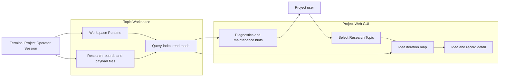
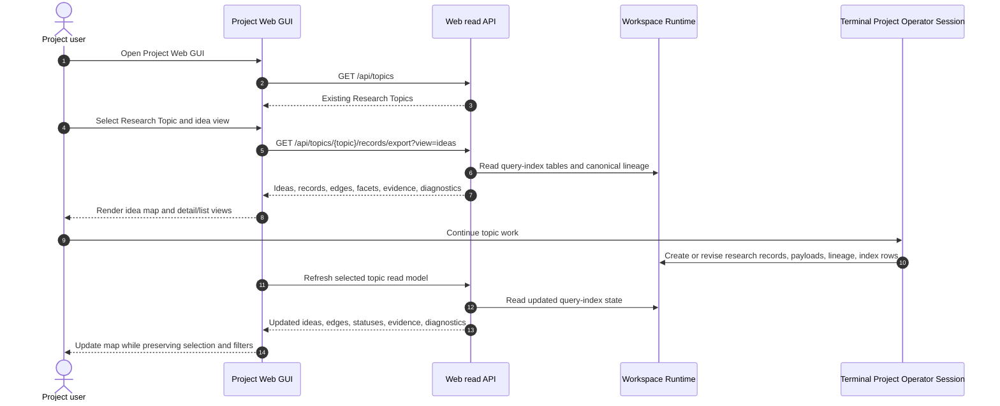

# Use Case 01: Inspect Live Idea Lineage While Continuing Topic Work

## Actor Goal

As a Project user, I want to inspect the idea lineage for an existing Research Topic while I continue topic work from the terminal, so that I can see how new artifacts change the exploration graph without reading raw JSON, generated Markdown, or SQLite rows.

## Use Case

The Research Topic already exists in a Project, and the user starts the local Project Web GUI against that Project root. In a separate terminal, the user acts through a Project Operator Session or topic-local command flow that records new research records into the Topic Workspace. The GUI keeps the selected Research Topic visible, refreshes topic-scoped read models when Workspace Runtime changes, and updates the idea lineage view without mutating research state.

## Supported Actions

### Select Existing Research Topic

The user opens the GUI and chooses the Research Topic whose idea lineage they want to inspect.

- context
  - Actor **has** a Project with an already-created Research Topic and Topic Workspace.
  - System **has** Project discovery, topic listing, topic context, and records export APIs.
- intent
  - Actor **wants** to enter the idea iteration view for one topic without creating or editing the topic.
  - Actor **wonders** "Which proposed ideas exist for this topic, and which one became the active route?"
- action
  - Actor then **asks** the system to select the Research Topic and open the idea iteration view.
- result
  - Actor **gets** a topic-scoped idea map and list backed by query-index ideas, canonical lineage, route decisions, records, claims, metrics, facts, and files.

### Inspect Idea Lineage

The user explores where an idea came from, what alternatives were generated beside it, and what evidence changed its status.

- context
  - Actor **has** visible idea nodes with concise text, status, source record, producer, and timestamps.
  - System **has** topic-scoped export data plus record detail, lineage, siblings, files, render, and facets APIs.
- intent
  - Actor **wants** to understand predecessor, successor, sibling, selected, rejected, deferred, revised, and follow-up relationships.
  - Actor **wonders** "Why did this selected hypothesis beat the other serious candidates, and what experiment or Decision Record changed its status?"
- action
  - Actor then **asks** the system to inspect an idea node, sibling group, lineage path, or linked evidence item.
- result
  - Actor **gets** a detail panel with immediate predecessor and successor links, alternative ideas, decision rationale, related experiment results, findings, claims, metrics, record detail, rendered content, and openability-aware file links.

### Continue Topic Work from Terminal

The user keeps the GUI open while using the terminal to continue research work for the same Topic Workspace.

- context
  - Actor **has** an active terminal in the Project root, Topic Workspace, Topic Actor Workspace, or Agent Workspace, depending on the work being performed.
  - System **has** Workspace Runtime write paths such as `isomer-cli ext research records create`, `revise`, lineage updates, and index refresh performed by the writer.
- intent
  - Actor **wants** to run another ideation, experiment, analysis, or decision step without leaving the GUI context.
  - Actor **wonders** "After this terminal command records a new artifact, where does it appear in the idea lineage?"
- action
  - Actor then **asks** the terminal-side command or agent to create or revise topic-scoped records using the latest Isomer CLI and system-skill conventions.
- result
  - Actor **gets** new or revised lifecycle records, structured payload files, canonical lineage, query-index rows, and diagnostics written by the terminal-side workflow.

### Observe Live GUI Update

The GUI refreshes the idea read model and preserves the user's browsing context when new topic data appears.

- context
  - Actor **has** an idea map open with a selected topic, active filters, and maybe a selected idea or record detail panel.
  - System **has** read-only refresh capability for topic export, runtime counts, records, lineage, siblings, files, facets, and diagnostics.
- intent
  - Actor **wants** the GUI to reflect newly recorded artifacts soon after terminal-side work completes.
  - Actor **wonders** "Did the new candidate branch from the current idea, supersede it, or create an unresolved follow-up?"
- action
  - Actor then **keeps** the GUI open while the system periodically refreshes or explicitly refreshes the selected topic read model.
- result
  - Actor **gets** updated idea nodes, edges, statuses, sibling groups, evidence summaries, counts, and diagnostics while their topic selection, filters, and selected detail remain stable when the selected record still exists.

### Handle Stale or Partial Relationship Data

The GUI reports data gaps instead of repairing or inventing lineage.

- context
  - Actor **has** a topic where a terminal action may have written files directly, skipped query-index refresh, or produced partial relationship metadata.
  - System **has** diagnostics from export, index validation, record detail, file openability, and lineage queries.
- intent
  - Actor **wants** to know whether the map reflects canonical topic data or has maintenance gaps.
  - Actor **wonders** "Is this idea really unconnected, or did the latest artifact miss lineage metadata?"
- action
  - Actor then **asks** the GUI to refresh or inspects diagnostics attached to the idea map, unconnected idea group, or selected record.
- result
  - Actor **gets** visible diagnostics and maintenance hints, while read-only browsing does not trigger rebuild, cleanup, migration, or repair.

## Main Flow

1. The Project user starts the local Project Web GUI for an existing Isomer Project.
2. The GUI discovers Project topics and shows existing Research Topics from the Project Manifest.
3. The user selects a Research Topic that already has a Topic Workspace and Workspace Runtime.
4. The GUI loads the topic-scoped idea read model from record export, canonical lineage, route decisions, facets, claims, metrics, facts, files, and record summaries.
5. The GUI renders a graph and list/table view of proposed ideas, including raw ideas, serious candidates, selected hypotheses, follow-up hypotheses, alternatives, evidence records, and route decisions when the source data provides them.
6. The user selects an idea node and inspects predecessors, successors, sibling alternatives, status, producer, timestamp, evidence summaries, and canonical record detail.
7. In a terminal, the user continues work on the same Research Topic through a Project Operator Session, Topic Actor Workspace, or Agent Workspace.
8. The terminal-side workflow records new or revised research records, payload files, lineage edges, generation groups, route decisions, or evidence items through current Isomer CLI and system-skill conventions.
9. The GUI refreshes the selected topic read model after a polling interval or explicit refresh.
10. The GUI updates the idea map and detail/list views to show new nodes, changed statuses, new edges, new sibling groups, new evidence summaries, and any diagnostics.
11. The user continues switching between terminal work and GUI inspection until the current research path is understandable or needs a maintenance action.

## Alternative And Exception Flows

- If the terminal-side work creates a record through supported Isomer CLI write paths, the GUI update should show the new record without requiring a manual index rebuild.
- If the terminal-side work writes files directly without creating lifecycle records or query-index rows, the GUI keeps existing data, reports stale or missing relationship diagnostics when available, and offers maintenance hints rather than repairing during read-only browsing.
- If a newly selected record is archived, revised, or disappears from the active read model, the GUI keeps the Research Topic selected, clears or marks the detail panel, and points to the nearest available revision or diagnostic when the data provides one.
- If the topic has incomplete relationship metadata, the GUI places affected idea cards in an unconnected or partial-data group and shows diagnostic context.
- If a refresh returns while the user is inspecting a node, the GUI preserves topic selection, filters, layout mode, and detail selection when possible, then annotates the view with any changed counts or diagnostics.
- If the Topic Workspace has a large number of records, the GUI loads the initial map with capped summaries and lazy-loads record detail, rendered content, files, facets, siblings, and lineage on demand.

## Mermaid Flow Diagram

## Mermaid Sequence Diagram

## Durable Outputs

- Terminal-side workflows create or revise lifecycle records, structured research payload files, canonical lineage edges, generation groups, route decisions, evidence items, claims, metrics, and query-index rows.
- The GUI creates no durable research state during read-only inspection; it keeps topic selection, filters, layout mode, and selected detail only in browser memory.
- Diagnostics from export, lineage, siblings, files, facets, runtime, and index validation remain visible to the user as observable maintenance guidance.

## Assumptions And Open Questions

- Assumption: New artifacts should appear in the GUI when they are recorded through supported Isomer CLI or system-skill write paths that also refresh query-index rows.
- Assumption: The first implementation may use polling or explicit refresh rather than file watching or server-sent events, provided the GUI updates soon after terminal-side work completes.
- Assumption: The GUI must not infer lineage from generated Markdown or repair query-index rows during ordinary browsing.
- Open question: What refresh cadence or change token should the GUI use so large topics update promptly without rereading too much data?
- Open question: Should the idea map include evidence and Decision Records as secondary graph nodes by default, or show them only in the selected idea detail panel?
