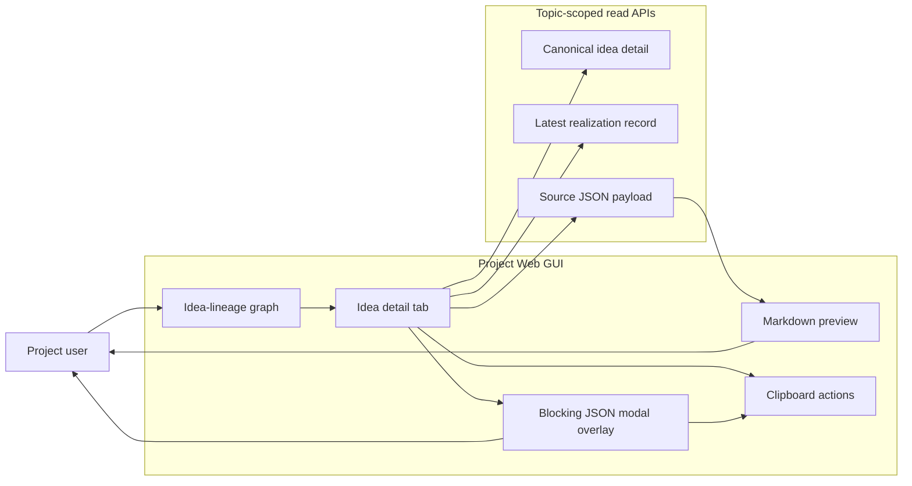
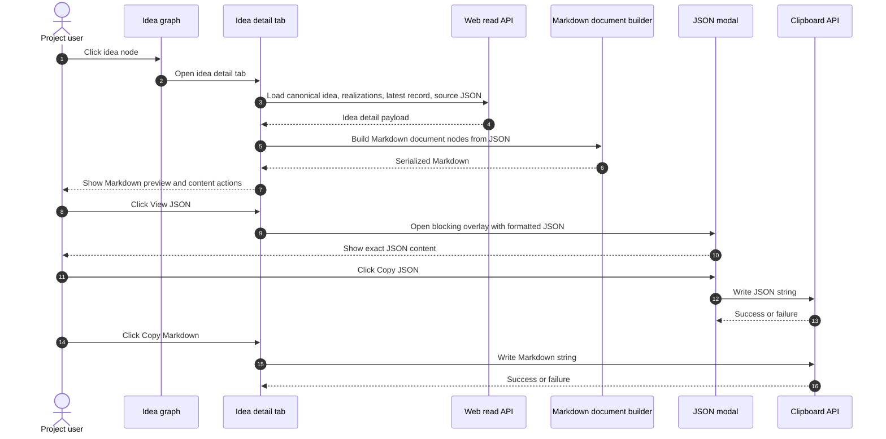

# Use Case 02: Inspect Idea Node Content With Markdown Preview And JSON Modal

## Actor Goal

As a Project user, I want to open one idea node and inspect its content as readable Markdown while retaining access to the exact JSON payload, so that I can understand the idea quickly and still verify or reuse the structured source when needed.

## Use Case

The user has opened the Topic Idea Iteration Map for an existing Research Topic and clicks one primary idea node. The GUI opens an idea detail tab that loads the idea's canonical metadata, latest realization record, related realization history, and source JSON payload when available. The tab dynamically converts the JSON content into Markdown through a structured Markdown document builder and serializer, shows the Markdown preview by default, and provides explicit actions to view raw JSON in a blocking modal overlay, copy the JSON content, or copy the generated Markdown content.

## Supported Actions

### Open Idea Detail Tab

The user opens an idea node from the graph or project explorer and gets a focused detail tab.

- context
  - Actor **has** an idea-lineage graph or semantic Project Explorer with one visible idea node.
  - System **has** canonical Research Idea metadata, realization links, record detail URLs, and source JSON references for the selected idea when available.
- intent
  - Actor **wants** to inspect the selected idea without losing the current graph context.
  - Actor **wonders** "What does this idea actually claim, and which record is the latest readable realization?"
- action
  - Actor then **asks** the system to open the idea node.
- result
  - Actor **gets** a docked idea detail tab with title, status, lineage summary, realization history, default Markdown preview, and actions for JSON viewing and copying.

### Preview JSON As Markdown

The system renders the selected idea's structured JSON into readable Markdown for quick inspection.

- context
  - Actor **has** an open idea detail tab.
  - System **has** a JSON payload or JSON fragment for the idea, plus a structured Markdown document builder that maps nested keys, arrays, primitives, tables, code blocks, and metadata into Markdown nodes before serialization.
- intent
  - Actor **wants** a readable summary that preserves JSON structure without showing a large raw JSON block by default.
  - Actor **wonders** "Can I read the selected hypothesis and evidence fields like a document instead of scanning braces and quoted keys?"
- action
  - Actor then **asks** the system to show the preview, or the preview appears automatically when the detail tab opens.
- result
  - Actor **gets** a Markdown-rendered preview with nested JSON keys represented as headings or sections, scalar values as paragraphs or list items, arrays as lists or tables when appropriate, and complex unrecognized values as collapsible code blocks.

### View Raw JSON In Modal

The user opens the exact JSON content in a blocking modal overlay.

- context
  - Actor **has** an idea detail tab with a Markdown preview and a visible raw JSON action.
  - System **has** the exact JSON object used for the preview, including source metadata and payload fields that may be hidden or summarized in Markdown.
- intent
  - Actor **wants** to verify the original structured payload without navigating away from the detail tab.
  - Actor **wonders** "Did the Markdown preview omit or reshape any field I care about?"
- action
  - Actor then **clicks** the view JSON action.
- result
  - Actor **gets** a modal blocker that darkens the rest of the workbench and shows formatted, syntax-highlighted JSON with close, copy JSON, and keyboard escape behavior; the modal is an in-app overlay, not a browser window.

### Copy JSON Content

The user copies the exact JSON payload for reuse outside the GUI.

- context
  - Actor **has** either the idea detail tab or the JSON modal open.
  - System **has** a normalized JSON string generated from the exact payload object, not from the Markdown preview.
- intent
  - Actor **wants** to paste the raw structured content into a prompt, terminal, issue, notebook, or editor.
  - Actor **wonders** "Can I reuse this exact payload without manually selecting a giant block of text?"
- action
  - Actor then **clicks** the copy JSON action.
- result
  - Actor **gets** the JSON content copied to the clipboard and a small success or failure status that does not close the current tab or modal.

### Copy Markdown Content

The user copies the generated Markdown preview as text.

- context
  - Actor **has** an idea detail tab whose Markdown preview was generated from the current JSON content.
  - System **has** the serialized Markdown string produced by the same structured Markdown document builder used for the preview.
- intent
  - Actor **wants** a readable version of the idea for notes, chat, review, or issue discussion.
  - Actor **wonders** "Can I copy this as a human-readable explanation instead of raw JSON?"
- action
  - Actor then **clicks** the copy Markdown action.
- result
  - Actor **gets** the generated Markdown copied to the clipboard and a small success or failure status while the preview remains visible.

## Main Flow

1. The Project user opens the local Project Web GUI and selects a Research Topic.
2. The GUI shows the topic's idea-lineage graph or semantic project view.
3. The user clicks one idea node.
4. The GUI opens or focuses an idea detail tab for that idea.
5. The detail tab requests canonical idea metadata, realization history, latest realization record detail, and source JSON content through topic-scoped read APIs.
6. The frontend builds a structured Markdown document from the JSON content and serializes it into Markdown without hand-concatenating Markdown syntax in the feature code.
7. The detail tab renders the Markdown preview by default through the normal Markdown viewer stack.
8. The user reads the preview and optionally opens the JSON modal to inspect exact source content.
9. The user optionally copies either the exact JSON content or the generated Markdown content.
10. The user closes the modal or tab and returns to the graph with topic selection, filters, and graph layout preserved.

## Alternative And Exception Flows

- If the idea has no source JSON payload, the detail tab shows canonical idea metadata, realization records, and a diagnostic that raw JSON is unavailable; the view JSON and copy JSON actions are disabled or explain why they cannot run.
- If the JSON is large, the Markdown preview renders a bounded summary first and marks omitted or collapsed sections; the JSON modal still offers the exact formatted JSON with lazy rendering or virtualization if needed.
- If the JSON-to-Markdown conversion hits an unsupported value, the preview includes a safe code-block representation for that subtree and records a non-blocking diagnostic.
- If the clipboard API is unavailable, denied, or fails, copy actions show an error state and keep the content visible for manual selection.
- If the selected idea changes because the topic read model refreshes while the tab is open, the tab preserves the currently opened idea id, shows a changed-data notice when the payload digest changes, and lets the user refresh the preview.
- If the modal is open and the user presses Escape or clicks outside the content area, the modal closes and returns focus to the triggering action in the idea detail tab.

## Mermaid Flow Diagram

## Mermaid Sequence Diagram

## Durable Outputs

- The GUI creates no durable research state during this use case.
- The idea detail tab keeps selected idea id, loaded payload digest, preview status, modal state, and copy status in browser state while the tab is open.
- Clipboard writes are explicit user-side side effects and do not mutate Workspace Runtime, query-index rows, source JSON files, or generated Markdown files.
- Diagnostics about missing JSON, unsupported conversion nodes, stale payload digest, or failed clipboard actions remain visible in the current tab or modal until the user refreshes or closes it.

## Assumptions And Open Questions

- Assumption: The Markdown preview is generated dynamically in the frontend from JSON using a structured Markdown document builder and serializer, while the backend remains responsible for resolving topic-scoped idea and record payload data.
- Assumption: The first version can use generic key-to-heading rendering before adding domain-specific renderers for selected idea, experiment, analysis, decision, and paper artifact schemas.
- Assumption: JSON viewing should use an in-app modal overlay that traps focus, darkens the rest of the workbench, and closes with Escape or a close button.
- Assumption: The generated Markdown shows human-facing idea content first and puts ids, digests, locators, provenance refs, source paths, and other system metadata in a collapsed or visually secondary `Metadata` section.
- Assumption: Scalar arrays render as lists, arrays of objects render as GFM tables only when all rows share the same scalar keys, and mixed or deep arrays render as nested sections or fenced JSON.
- Assumption: The idea detail API returns exact source JSON by default up to a 1 MiB serialized JSON cap; larger payloads return source metadata plus a `source_json_truncated` diagnostic until the user explicitly requests full JSON.
