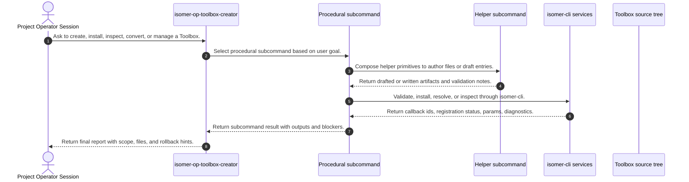
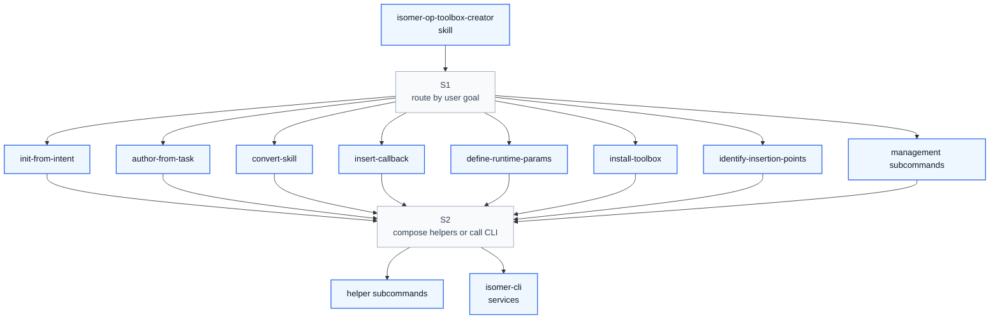

# Isomer Operator Toolbox Creator Design Overview

## Purpose

This note describes a proposed skill, `isomer-op-toolbox-creator`, before it is created. It captures the intended triggering conditions, workflow, subcommands, process model, and file layout so a designer can review the shape of the skill without reading generated skill files.

The key orchestration rule is: the skill exposes low-level Toolbox authoring primitives as helper subcommands, exposes use-case workflows and management operations as procedural subcommands that compose those primitives and call existing `isomer-cli` commands, and always reports durable outputs, blockers, and rollback paths to the Project Operator Session.

## Skill Type

Technique with discipline-enforcing elements. The skill provides concrete, repeatable steps for Toolbox work and also enforces rules agents might rationalize away, such as scope confirmation, supplemental-only callbacks, secret rejection, and `isomer-cli` validation.

## Concepts

- **Toolbox**: A project-local extension package under `skillset/toolboxes/<toolbox-id>/` that can provide User Skill Callback material and optional runtime-param defaults.
- **Toolbox ID**: A stable, lowercase, path-safe identifier used in callback ids, runtime-param ids, and registration rows.
- **Callback Insertion Point**: A catalog-declared attachment point shaped as `<target_skill>/<stage>`, currently supporting `begin` and `end` names.
- **Toolbox-Local Key**: A short key declared inside a Toolbox manifest `[[callbacks]]` entry; the installed callback id becomes `<toolbox_id>:<toolbox-local-key>`.
- **Runtime Param**: A user-owned configuration value with id `<toolbox_id>:<key>` that callback skills query through Project runtime-param services.
- **Runtime Param Bundle**: A TOML file with schema `isomer-toolbox-runtime-params.v1` that declares default param rows and can be imported into a manifest layer.
- **Project Manifest**: The project-wide configuration layer that records Project-scope Toolbox registration and runtime-param imports or explicit values.
- **Topic Workspace Manifest**: The topic-owned configuration layer that records Research Topic, Topic Actor, or Topic Agent scoped runtime-param imports and explicit values.
- **User Skill Callback Registry**: The registry where Toolbox callbacks are installed so that owning system skills can resolve them at `begin` or `end` stages.
- **Procedural Subcommand**: A user-facing workflow that corresponds to a use case or management operation and composes helper subcommands and `isomer-cli` calls.
- **Helper Subcommand**: A low-level Toolbox primitive that procedural subcommands call to author files, draft entries, or inspect local state.

## Subcommand Composition

Procedural subcommands do not duplicate the file-editing logic of helper subcommands. They call helpers in the order required by their workflow.

| Procedural Subcommand | Composed Helpers / External Calls |
| --- | --- |
| `init-from-intent` | `scaffold`, `write-callback-source`, `attach-callback`, `define-runtime-param`, `write-param-bundle`, `validate-toolbox` |
| `author-from-task` | `scaffold`, `draft-callback-entry`, `write-callback-source`, `attach-callback`, `define-runtime-param`, `write-param-bundle`, `validate-toolbox` |
| `convert-skill` | `scaffold`, `write-callback-source`, `attach-callback`, `define-runtime-param`, `write-param-bundle`, `validate-toolbox` |
| `insert-callback` | `write-callback-source`, `attach-callback`, `resolve-callbacks` |
| `define-runtime-params` | `define-runtime-param`, `write-param-bundle`, `import-param-bundle`, `set-param-value`, `resolve-param` |
| `install-toolbox` | `validate-toolbox`, `isomer-cli project toolboxes install`, `resolve-callbacks` |
| `identify-insertion-points` | insertion-point catalog query, `draft-callback-entry` |
| `validate-toolbox` | `isomer-cli project toolboxes validate` |
| `explain-toolbox` | `isomer-cli project toolboxes explain`, `resolve-callbacks`, `resolve-param` |
| `list-toolboxes`, `show-toolbox`, `enable-toolbox`, `disable-toolbox`, `update-toolbox-source`, `uninstall-toolbox` | Direct `isomer-cli` calls |

## Subcommands Design

```yaml
---
name: isomer-op-toolbox-creator
description: Use when a Project Operator Session needs to create, install, inspect, update, or remove a project-local Isomer Toolbox under skillset/toolboxes/<toolbox-id>/, or when the user asks about callback insertion points, Toolbox manifest authoring, runtime params, or Toolbox conversion from an existing skill or intent.
---
```

### Overview

Teach agents to turn reusable instruction ideas into valid project-local Toolboxes by composing low-level authoring primitives into use-case workflows. The skill installs callbacks through `isomer-cli`, manages runtime params across Project Manifest and Topic Workspace Manifest layers, and keeps Toolbox callbacks supplemental to owning system skills, current user requests, evidence Gates, validation, and recording obligations.

### When to Use

Use this skill when:

- A Project Operator Session asks to create a new Toolbox, add a callback, or author Toolbox source material.
- The user wants to install, list, show, explain, enable, disable, update-source, uninstall, or validate a Toolbox.
- The user asks where callback insertion points are, which stages can be targeted, or how callback ids are formed.
- The user wants configurable runtime params for a Toolbox callback skill.
- The user describes a task and asks for a Toolbox callback skill that fits the Toolbox pattern.
- The user wants to convert an existing skill into a Toolbox-owned callback with runtime params and Topic Workspace storage.
- The user supplies a freeform intent prompt or file and asks to scaffold a complete Toolbox.

Do not use this skill to implement a Toolbox marketplace, remote registry, or dependency resolver; to change the Toolbox manifest schema; or to bypass `isomer-cli` validation, secret scanning, or path safety checks.

### Workflow

When this skill is invoked, execute the following steps in order.

1. **Identify the user goal.** Determine whether the request is about insertion points, callback authoring, runtime params, installation, conversion, one-shot scaffolding, or management.
2. **Select the narrowest subcommand.** Route to a procedural subcommand when the goal matches a use case or management operation; route to a helper subcommand only when the user explicitly asks for a low-level primitive.
3. **Collect required context.** Capture `toolbox_id`, target skill, stage, scope, topic, Topic Actor, Topic Agent, source paths, and intent source when needed.
4. **Compose helper subcommands and CLI calls.** Execute the helper sequence documented for the selected procedural subcommand, or run the single helper when invoked directly.
5. **Report durable outputs and blockers.** Summarize created or changed files, installed callback ids, runtime-param values, scope, diagnostics, and rollback hints.

If the user's task does not map cleanly to these steps, use your native planning tool to build a step-by-step plan from the subcommands and constraints in this skill, then execute the plan.

### Helper Subcommands

| Subcommand | Use For | Load |
| --- | --- | --- |
| `scaffold` | Create a Toolbox directory skeleton with manifest and README. | `references/scaffold.md` |
| `draft-callback-entry` | Draft one `[[callbacks]]` manifest entry for a chosen insertion point. | `references/draft-callback-entry.md` |
| `write-callback-source` | Write or update a callback source file such as `<callback-dir>/SKILL.md`. | `references/write-callback-source.md` |
| `attach-callback` | Add a callback entry to the Toolbox manifest. | `references/attach-callback.md` |
| `define-runtime-param` | Declare one `[[runtime_params]]` entry in the Toolbox manifest. | `references/define-runtime-param.md` |
| `write-param-bundle` | Write a default runtime-param bundle TOML file. | `references/write-param-bundle.md` |
| `import-param-bundle` | Register a param bundle import in a manifest layer. | `references/import-param-bundle.md` |
| `set-param-value` | Set one explicit runtime-param value at Project or Topic scope. | `references/set-param-value.md` |
| `resolve-param` | Show the effective value of one runtime param. | `references/resolve-param.md` |
| `resolve-callbacks` | Show effective callbacks for a scope and insertion point. | `references/resolve-callbacks.md` |

### Procedural Subcommands

| Subcommand | Use For | Load |
| --- | --- | --- |
| `init-from-intent` | Scaffold a complete Toolbox from a freeform prompt or intent file. | `references/init-from-intent.md` |
| `author-from-task` | Author a Toolbox from a plain-language task description. | `references/author-from-task.md` |
| `convert-skill` | Convert an existing skill into a Toolbox callback with runtime params and storage mapping. | `references/convert-skill.md` |
| `insert-callback` | Insert one Toolbox callback at a chosen insertion point. | `references/insert-callback.md` |
| `define-runtime-params` | Design, import, set, and verify runtime params for Toolbox callback skills. | `references/define-runtime-params.md` |
| `install-toolbox` | Install an existing Toolbox directory at Project or Topic Workspace scope. | `references/install-toolbox.md` |
| `identify-insertion-points` | List and explain available callback insertion points for a Toolbox purpose. | `references/identify-insertion-points.md` |
| `validate-toolbox` | Validate a Toolbox directory before installation. | `references/validate-toolbox.md` |
| `list-toolboxes` | List installed Toolboxes. | `references/list-toolboxes.md` |
| `show-toolbox` | Show details of one Toolbox registration. | `references/show-toolbox.md` |
| `explain-toolbox` | Explain effective Toolbox state for a selected scope. | `references/explain-toolbox.md` |
| `enable-toolbox` | Enable a Toolbox registration. | `references/enable-toolbox.md` |
| `disable-toolbox` | Disable a Toolbox registration. | `references/disable-toolbox.md` |
| `update-toolbox-source` | Update the source path of a Toolbox registration. | `references/update-toolbox-source.md` |
| `uninstall-toolbox` | Remove a Toolbox registration. | `references/uninstall-toolbox.md` |

### Misc Subcommands

| Subcommand | Use For | Load |
| --- | --- | --- |
| `help` | Explain this skill and list public subcommands. | This entrypoint |

### Common Mistakes

- Treating a Toolbox as a packaged system skill. Fix by keeping it a project-local callback bundle and using runtime params for specialization.
- Guessing Project-wide scope when the user named a topic. Fix by confirming scope explicitly and warning before Project-wide installation.
- Installing callbacks at Topic Agent scope. Fix by explaining that callback registries currently support Project and Research Topic scope; use runtime params for Topic Agent behavior.
- Drafting callback instructions that override system instructions, current user requests, evidence Gates, validation, or recording obligations. Fix by rewriting the guidance as supplemental framing or checking.
- Storing credentials, API keys, or private benchmark data in manifests, callback bodies, README files, or runtime-param bundles. Fix by rejecting secret-like values and recommending a secret-safe path.
- Using absolute paths or paths outside the Toolbox directory for callback sources or runtime-param bundles. Fix by requiring paths relative to the declaring manifest.
- Duplicating file-editing logic inside every procedural subcommand. Fix by calling helper subcommands and reusing their validation rules.
- Skipping `isomer-cli` validation before installation. Fix by running or proposing the canonical validate command and reporting diagnostics.

## High Level Process



## Skill Call Graph



| ID | Caller | Route | Callee | Calling condition |
| --- | --- | --- | --- | --- |
| S1 | `isomer-op-toolbox-creator` | `select-procedural-subcommand` | One of seven use-case subcommands or management subcommands | The user goal matches a procedural workflow. |
| S1 | `isomer-op-toolbox-creator` | `select-helper-subcommand` | One of ten helper subcommands | The user explicitly asks for a low-level primitive. |
| S2 | Procedural subcommand | `compose-primitives` | Helper subcommands | The workflow needs to author files, draft entries, or inspect local state. |
| S2 | Procedural subcommand | `call-cli` | `isomer-cli` services | The workflow needs validation, registration, resolution, or management. |

## Formal Skill Process

```python
@skill(
    name="isomer-op-toolbox-creator",
    description="Route Project Operator Session requests to the right Toolbox procedural or helper subcommand, compose low-level primitives, and report durable outputs.",
)
def run_isomer_op_toolbox_creator(user_request: str, target: Path | None = None) -> StageResult:
    # Entry point purpose: choose the narrowest Toolbox workflow, gather context,
    # optionally mutate Project-local Toolbox source or registration, and report.
    # Example input: user_request="create a Toolbox that makes review agents check for real-hardware evidence"
    # Example output: StageResult(status="ready", evidence=["skillset/toolboxes/evidence-quality/", "validation passed"])

    route = agent_select(
        [
            "init-from-intent",
            "author-from-task",
            "convert-skill",
            "insert-callback",
            "define-runtime-params",
            "install-toolbox",
            "identify-insertion-points",
            "validate-toolbox",
            "list-toolboxes",
            "show-toolbox",
            "explain-toolbox",
            "enable-toolbox",
            "disable-toolbox",
            "update-toolbox-source",
            "uninstall-toolbox",
            "scaffold",
            "draft-callback-entry",
            "write-callback-source",
            "attach-callback",
            "define-runtime-param",
            "write-param-bundle",
            "import-param-bundle",
            "set-param-value",
            "resolve-param",
            "resolve-callbacks",
        ],
        criterion="prefer a procedural subcommand when the goal matches a use case or management operation; choose a helper only when the user explicitly asks for a low-level primitive",
        context={"user_request": user_request, "target": target},
    )

    context_stage = agent_do(
        "Collect the context needed by the selected subcommand: toolbox_id, target skill, stage, scope, topic, source paths, or intent.",
        context={"route": route, "target": target},
        returns=StageResult,
    )
    if context_stage.status in {"blocked", "failed"}:
        # Condition matched when required context is missing or ambiguous.
        return context_stage

    if route in {
        "init-from-intent",
        "author-from-task",
        "convert-skill",
        "insert-callback",
        "define-runtime-params",
    }:
        # Condition matched when the user wants an authoring workflow.
        authoring_stage = agent_invoke(
            route,
            task="Execute the authoring workflow by composing helper subcommands and returning the resulting artifacts and validation status.",
            context={"context_stage": context_stage},
            returns=StageResult,
            params={
                "expect": ["written_files", "drafted_entries", "validation_notes"],
                "must_not_call": ["install-without-user-approval"],
            },
        )
        if authoring_stage.status in {"blocked", "failed"}:
            return authoring_stage

        install_prompt = agent_check(
            "The user has approved installation or explicitly asked for it in the same request.",
            context={"authoring_stage": authoring_stage, "user_request": user_request},
        )
        if install_prompt:
            install_stage = agent_invoke(
                "install-toolbox",
                task="Install the Toolbox authored by the previous workflow at the selected scope.",
                context={"authoring_stage": authoring_stage},
                returns=StageResult,
                params={
                    "expect": ["callback_ids", "registration_scope", "runtime_param_import_status", "diagnostics"],
                    "must_not_call": ["direct-manifest-edit"],
                },
            )
            if install_stage.status in {"blocked", "failed"}:
                return install_stage

            return agent_do(
                "Summarize authored files, installation status, effective callbacks, and rollback hints.",
                context={"authoring_stage": authoring_stage, "install_stage": install_stage},
                returns=StageResult,
            )

        return agent_do(
            "Summarize authored files and validation status, and tell the user how to install when ready.",
            context={"authoring_stage": authoring_stage},
            returns=StageResult,
        )

    if route == "install-toolbox":
        # Condition matched when the user points to an existing Toolbox directory and asks to install it.
        return agent_invoke(
            route,
            task="Validate the directory, install it through isomer-cli at the selected scope, and resolve effective behavior.",
            context={"context_stage": context_stage},
            returns=StageResult,
            params={
                "expect": ["callback_ids", "registration_scope", "diagnostics", "effective_state"],
                "must_not_call": ["direct-manifest-edit"],
            },
        )

    if route == "identify-insertion-points":
        # Condition matched when the user only needs discovery and manifest-entry drafting.
        return agent_invoke(
            route,
            task="Query the Project-visible insertion-point catalog, filter by purpose, and optionally draft callback entries.",
            context={"context_stage": context_stage},
            returns=StageResult,
            params={
                "expect": ["insertion_point_ids", "drafted_entries", "diagnostics"],
            },
        )

    if route in {
        "validate-toolbox",
        "list-toolboxes",
        "show-toolbox",
        "explain-toolbox",
        "enable-toolbox",
        "disable-toolbox",
        "update-toolbox-source",
        "uninstall-toolbox",
    }:
        # Condition matched when the user wants management or inspection operations.
        return agent_invoke(
            route,
            task="Run the corresponding isomer-cli command and summarize the result for the selected scope.",
            context={"context_stage": context_stage},
            returns=StageResult,
            params={
                "expect": ["cli_output", "scope", "diagnostics"],
                "must_not_call": ["direct-manifest-edit"],
            },
        )

    # route is one of the helper subcommands.
    return agent_invoke(
        route,
        task="Execute the low-level primitive requested by the user and return the resulting artifact or inspection.",
        context={"context_stage": context_stage},
        returns=StageResult,
        params={
            "expect": ["artifact_path", "drafted_content", "validation_notes"],
        },
    )
```

## Skill Process Explanation

The formal process is easier to read if each stage is understood as a handoff of responsibility, not just a sequence of calls. `isomer-op-toolbox-creator` stays responsible for routing, scope confirmation, and final reporting.

- **Route selection.** The skill first decides whether the user needs a procedural workflow or a low-level helper. This boundary matters because it determines whether the skill composes multiple primitives or performs a single operation.
- **Context collection.** The skill gathers only the context the selected subcommand needs, such as `toolbox_id`, insertion point, scope, or intent source. Blockers here are usually missing scope or ambiguous topic names.
- **Authoring composition.** For use-case workflows, the skill delegates to the procedural subcommand, which in turn calls helper subcommands to scaffold directories, draft callback entries, write callback source, attach callbacks, define runtime params, write param bundles, and validate. This reuse prevents duplicate file-editing logic.
- **Installation boundary.** After authoring, the skill asks for explicit installation approval unless the user already approved it. Installation always goes through `isomer-cli`; the skill never edits Project Manifest or Topic Workspace Manifest directly.
- **Management and inspection.** Management subcommands map directly to `isomer-cli` commands. Inspection subcommands may compose helper resolution primitives with CLI output.
- **Final reporting.** The skill summarizes files, installed callback ids, effective state, and rollback hints.

## Evidence Handoffs

| Producing skill or stage | Evidence | Consuming stage |
| --- | --- | --- |
| `identify-insertion-points` | Candidate insertion-point ids and drafted `[[callbacks]]` entries | `insert-callback`, `author-from-task`, `init-from-intent` |
| `draft-callback-entry` | Manifest-ready callback entry with `target_skill`, `stage`, and source fields | `attach-callback` |
| `write-callback-source` | Written callback source file path and content | `attach-callback`, `validate-toolbox` |
| `attach-callback` | Updated `manifest.toml` with new `[[callbacks]]` row | `validate-toolbox`, `install-toolbox` |
| `define-runtime-param` | Declared `[[runtime_params]]` row | `write-param-bundle`, `set-param-value`, `validate-toolbox` |
| `write-param-bundle` | Default bundle file path and content | `import-param-bundle`, `validate-toolbox` |
| `import-param-bundle` / `set-param-value` | Manifest-layer mutation plan | `isomer-cli` runtime-param commands |
| `resolve-param` / `resolve-callbacks` | Effective values and gating state | Final user-facing report |
| `validate-toolbox` | Validation report and diagnostics | `install-toolbox`, final report |
| `isomer-cli` services | Callback ids, registration scope, import status, diagnostics | Effective behavior inspection and final report |

## Example Prompt And Expected AI Response

> **Warning:** The user/AI chat content below is for example purposes only. Implementations should learn its style, intent, and semantics rather than hardcoding the example content.

These examples show only the visible user prompt and the AI response content that should be returned to the user. Do not include hidden reasoning, chain-of-thought, scratchpad notes, private tool-selection deliberation, or thinking process in the AI response unless the user explicitly asks the skill to document that process.

### Event 001 - Initialize a Toolbox from Intent

> Time: `<example-time>` · Session: `Project Operator Session`

User Prompt:

> Use $isomer-op-toolbox-creator to initialize a Toolbox that makes DeepSci review agents reject any claim that lacks real-hardware evidence. I want it strict by default but let topics relax it to proxy-inference if they document the limitation.

AI:

> I will initialize a Toolbox from your intent by composing helper subcommands: scaffold the directory, write the callback source, attach the callback entry, define the runtime param, write the default bundle, and validate.
>
> Procedural subcommand: `init-from-intent`<br/>
> Helpers composed: `scaffold`, `write-callback-source`, `attach-callback`, `define-runtime-param`, `write-param-bundle`, `validate-toolbox`
>
> Proposed design:
>
> | Field | Value |
> | --- | --- |
> | `toolbox_id` | `evidence-quality` |
> | `primary_insertion_point` | `isomer-deepsci-review/begin` |
> | `secondary_insertion_point` | `isomer-deepsci-review/end` |
> | `runtime_param` | `evidence-quality:evidence/mode` |
> | `value_type` | `enum` |
> | `allowed_values` | `strict`, `relaxed` |
> | `default` | `strict` |
> | `scope_recommendation` | Research Topic first, Project-wide only after explicit confirmation |
>
> Files written:
>
> ```text
> skillset/toolboxes/evidence-quality/
>   manifest.toml
>   README.md
>   review-evidence-check/SKILL.md
>   defaults/evidence-mode.toml
> ```
>
> Validation passed. I have not installed anything. Say "install it for topic <name>" when you want to make it effective.

### Event 002 - Convert an Existing Skill

> Time: `<example-time>` · Session: `Project Operator Session`

User Prompt:

> Use $isomer-op-toolbox-creator to convert `extern/orphan/bench-evidence-skill` into a Toolbox. It currently tells experiment agents to save `evidence.md` and has a hard-coded strict mode. Make it configurable and use Isomer storage.

AI:

> I will convert this as a Toolbox-owned callback skill. Because the source is outside the Toolbox directory, I will copy it into `skillset/toolboxes/bench-evidence/bench-evidence-check/` before changing it.
>
> Procedural subcommand: `convert-skill`<br/>
> Helpers composed: `scaffold`, `write-callback-source`, `attach-callback`, `define-runtime-param`, `write-param-bundle`, `validate-toolbox`
>
> Conversion plan:
>
> | Area | Conversion |
> | --- | --- |
> | `toolbox_id` | `bench-evidence` |
> | `callback_source` | `bench-evidence-check/SKILL.md` |
> | `insertion_point` | `isomer-deepsci-experiment/begin` |
> | `decision_variable` | hard-coded strict mode -> `bench-evidence:evidence/mode` |
> | `value_type` | enum: `strict`, `relaxed` |
> | `default` | `strict` |
> | `output_artifact` | `evidence.md` -> `topic.records.artifacts` under an evidence subdirectory |
> | `storage_rule` | resolve the semantic label before naming a concrete path |
>
> The converted callback will ask the owning experiment agent to query the effective runtime param, branch on the selected mode, and place durable evidence output through the resolved Topic Workspace records surface. It will not write into `.isomer-labs/`, `state.sqlite`, or ad hoc project-root paths.

### Event 003 - Use a Low-Level Helper Directly

> Time: `<example-time>` · Session: `Project Operator Session`

User Prompt:

> Use $isomer-op-toolbox-creator to draft a callback entry for Toolbox `gpu-evidence-quality` at insertion point `isomer-deepsci-experiment/begin` with source type `skill_dir`.

AI:

> Helper subcommand: `draft-callback-entry`<br/>
> This produces only a manifest entry draft; it does not write files or install anything.
>
> ```toml
> [[callbacks]]
> key = "evidence-quality/experiment/begin"
> target_skill = "isomer-deepsci-experiment"
> stage = "begin"
> source_type = "skill_dir"
> skill_dir = "evidence-quality"
> description = "Shape evidence-quality expectations before GPU experiment work starts."
> ```

## Open Questions

- The skill name is proposed as `isomer-op-toolbox-creator`; confirm whether this should instead be `isomer-op-toolbox-mgr` or `isomer-dev-toolbox-creator` before creating the skill files.
- Confirm whether management subcommands should each be a separate procedural subcommand or grouped under a single `manage-toolbox` subcommand with an action argument.
- Confirm whether helper subcommands such as `install` and `uninstall` should also be exposed directly, or whether `install-toolbox` and `uninstall-toolbox` procedural subcommands are sufficient.
- Confirm whether the first version should also support developers maintaining Isomer's own Toolbox schema and CLI implementation, or remain operator-facing only.
- Confirm which validation command should be the canonical final check for a newly created Toolbox: a future `project toolboxes install --dry-run`, `project toolboxes validate`, direct manifest loading through tests, or another command.
- Confirm whether runtime-param bundle authoring should remain a first-class workflow in this skill, or become a short advanced section until more Toolboxes use it.
