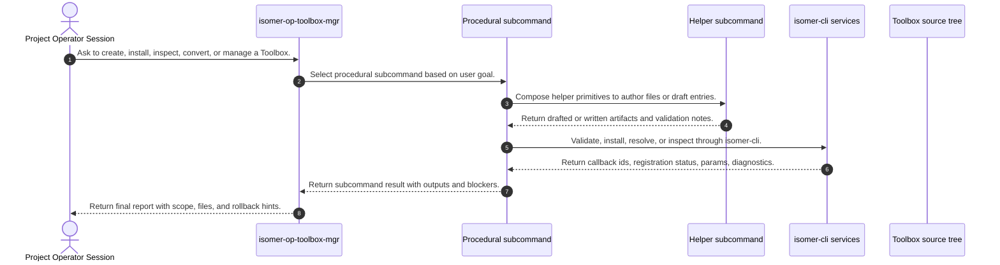
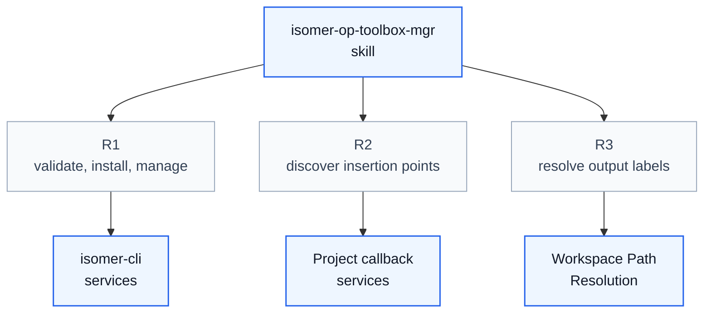

# Isomer Operator Toolbox Manager Design Overview

## Purpose

This note describes a proposed skill, `isomer-op-toolbox-mgr`, before it is created. It captures the intended user workflow, subcommands, process model, and user-facing contracts so a designer can review the skill's UX without reading generated skill files.

The key orchestration rule is: the skill exposes low-level Toolbox authoring primitives as helper subcommands, exposes use-case workflows and management operations as procedural subcommands that compose those primitives and call existing `isomer-cli` commands, and always reports durable outputs, blockers, and rollback paths to the Project Operator Session.

## Concepts

This section defines the small vocabulary needed to read the Toolbox Manager Skill workflow and examples. It favors user-facing terms that the skill should expose in plans, reports, and validation notes.

- **Toolbox**: A project-local extension package under `skillset/toolboxes/<toolbox-id>/` that can provide User Skill Callback material and optional runtime-param defaults.
- **Toolbox ID**: A stable, lowercase, path-safe identifier used in callback ids, runtime-param ids, and registration rows.
- **Callback Insertion Point**: A catalog-declared attachment point shaped as `<skill>/<point-inside-skill>`, such as `isomer-deepsci-experiment/begin`. Manifest entries decompose that id into `target_skill` and `stage`.
- **Toolbox-Local Key**: A short key declared inside a Toolbox manifest `[[callbacks]]` entry; the installed callback id becomes `<toolbox_id>:<toolbox-local-key>`.
- **Runtime Param**: A user-owned configuration value with id `<toolbox_id>:<key>` that callback skills query through Project runtime-param services.
- **Toolbox Scope**: The breadth where a Toolbox registration, callback record, or runtime-param value applies. Project scope affects all matching contexts; topic scope applies through a Topic Workspace and may specialize runtime params by Research Topic, Topic Actor, or Topic Agent.

## Core Workflow

When this skill is invoked, execute the following steps in order.

1. **Identify the user goal.** Determine whether the request is about insertion points, callback authoring, runtime params, installation, conversion, one-shot scaffolding, or management.
2. **Select the narrowest subcommand.** Route to a procedural subcommand when the goal matches a use case or management operation; route to a helper subcommand only when the user explicitly asks for a low-level primitive.
3. **Collect required context.** Capture `toolbox_id`, target skill, stage, scope, topic, Topic Actor, Topic Agent, source paths, and intent source when needed.
4. **Compose helper subcommands and CLI calls.** Execute the helper sequence documented for the selected procedural subcommand, or run the single helper when invoked directly.
5. **Report durable outputs and blockers.** Summarize created or changed files, installed callback ids, runtime-param values, scope, diagnostics, and rollback hints.

If the user's task does not map cleanly to these steps, use your native planning tool to build a step-by-step plan from the subcommands and constraints in this skill, then execute the plan.

## Subcommands Design

This section lists the public workflows and low-level primitives the skill can route to. Procedural subcommands represent user-facing tasks; helper subcommands represent reusable authoring or inspection steps.

### Helper Subcommands

Helper subcommands are grouped Toolbox primitives. Procedural subcommands call them to author files, edit manifest declarations, manage runtime-param rows, or inspect local state. Each helper owns one Toolbox surface and can also be invoked directly when the user asks for that lower-level work.

| Subcommand | Use For | Load |
| --- | --- | --- |
| `author-toolbox-source` | Create or update Toolbox source files, including the directory skeleton, README, callback `SKILL.md` files, prompt files, and default bundle files. | `references/author-toolbox-source.md` |
| `edit-callback-declarations` | Draft, add, update, or remove Toolbox manifest `[[callbacks]]` entries for selected insertion points. | `references/edit-callback-declarations.md` |
| `edit-runtime-params` | Declare runtime params, write default bundles, register imports, set or unset explicit scoped values, and explain effective param values. | `references/edit-runtime-params.md` |
| `inspect-effective-state` | Inspect effective callbacks, runtime params, Toolbox registration status, gating, and diagnostics for a selected scope. | `references/inspect-effective-state.md` |

### Procedural Subcommands

Procedural subcommands are user-facing workflows that match use cases or management operations. They compose helper subcommands and `isomer-cli` calls in the order required by the workflow. Agents should route ordinary Toolbox requests to a procedural subcommand rather than exposing helper primitives by default.

| Subcommand | Use For | Load |
| --- | --- | --- |
| `author-toolbox` | Initialize or author a complete Toolbox from freeform intent, an intent file, or a plain-language task description. | `references/author-toolbox.md` |
| `convert-skill` | Convert an existing skill into a Toolbox callback with runtime params and storage mapping. | `references/convert-skill.md` |
| `insert-callback` | Insert one Toolbox callback at a chosen insertion point. | `references/insert-callback.md` |
| `define-runtime-params` | Design, import, set, and verify runtime params for Toolbox callback skills. | `references/define-runtime-params.md` |
| `manage-toolbox` | Validate, install, list, show, explain, enable, disable, update source, or uninstall Toolbox registrations through `isomer-cli`. | `references/manage-toolbox.md` |
| `identify-insertion-points` | List and explain available callback insertion points for a Toolbox purpose. | `references/identify-insertion-points.md` |

### Misc Subcommands

Misc subcommands provide meta support for the skill itself. They are not part of the Toolbox domain workflow, but they help the user discover how to use the skill.

| Subcommand | Use For | Load |
| --- | --- | --- |
| `help` | Explain this skill and list public subcommands. | This entrypoint |

## Core Workflow Diagram

This diagram shows the normal handoff from user request to subcommand routing, helper composition, CLI validation or mutation, and final reporting. It emphasizes that `isomer-op-toolbox-mgr` coordinates the work while `isomer-cli` remains authoritative for Project mutations.



## Calls To External Skills

This section identifies the project services the skill depends on instead of reimplementing them. These calls cover authoritative CLI mutations, callback insertion-point discovery, and storage-label resolution during conversion workflows.



| ID | Caller | Route | Callee | Calling condition |
| --- | --- | --- | --- | --- |
| R1 | `isomer-op-toolbox-mgr` | `call-isomer-cli` | `isomer-cli` services | The workflow needs Toolbox validation, installation, registration, runtime-param operations, or management. |
| R2 | `isomer-op-toolbox-mgr` | `query-insertion-points` | Project callback services | The user asks to identify callback insertion points. |
| R3 | `isomer-op-toolbox-mgr` | `resolve-storage-labels` | Workspace Path Resolution | `convert-skill` maps output artifacts to Topic Workspace semantic labels. |

## Example Prompt And Expected AI Response

> **Warning:** The user/AI chat content below is for example purposes only. Implementations should learn its style, intent, and semantics rather than hardcoding the example content.

These examples show only the visible user prompt and the AI response content that should be returned to the user. Do not include hidden reasoning, chain-of-thought, scratchpad notes, private tool-selection deliberation, or thinking process in the AI response unless the user explicitly asks the skill to document that process.

### Event 001 - Initialize a Toolbox from Intent

> Time: `<example-time>` · Session: `Project Operator Session`

User Prompt:

> Use $isomer-op-entrypoint use toolbox to initialize a Toolbox that makes DeepSci review agents reject any claim that lacks real-hardware evidence. I want it strict by default but let topics relax it to proxy-inference if they document the limitation.

AI:

> I will initialize a Toolbox from your intent by composing helper subcommands: author the Toolbox source, edit callback declarations, edit runtime params, and inspect effective state after validation.
>
> Procedural subcommand: `author-toolbox`<br/>
> Helpers composed: `author-toolbox-source`, `edit-callback-declarations`, `edit-runtime-params`, `inspect-effective-state`
>
> Proposed design:
>
> | Field | Value |
> | --- | --- |
> | `toolbox_id` | `evidence-quality` |
> | `primary_insertion_point` | `isomer-deepsci-review/begin` |
> | `secondary_insertion_point` | `isomer-deepsci-review/end` |
> | `runtime_param` | `evidence-quality:evidence/mode` |
> | `value_type` | `enum` |
> | `allowed_values` | `strict`, `relaxed` |
> | `default` | `strict` |
> | `scope_recommendation` | Research Topic first, Project-wide only after explicit confirmation |
>
> Files written:
>
> ```text
> skillset/toolboxes/evidence-quality/
>   manifest.toml
>   README.md
>   review-evidence-check/SKILL.md
>   defaults/evidence-mode.toml
> ```
>
> Validation passed. I have not installed anything. Say "install it for topic <name>" when you want to make it effective.

### Event 002 - Convert an Existing Skill

> Time: `<example-time>` · Session: `Project Operator Session`

User Prompt:

> Use $isomer-op-entrypoint use toolbox to convert `extern/orphan/bench-evidence-skill` into a Toolbox. It currently tells experiment agents to save `evidence.md` and has a hard-coded strict mode. Make it configurable and use Isomer storage.

AI:

> I will convert this as a Toolbox-owned callback skill. Because the source is outside the Toolbox directory, I will copy it into `skillset/toolboxes/bench-evidence/bench-evidence-check/` before changing it.
>
> Procedural subcommand: `convert-skill`<br/>
> Helpers composed: `author-toolbox-source`, `edit-callback-declarations`, `edit-runtime-params`, `inspect-effective-state`
>
> Conversion plan:
>
> | Area | Conversion |
> | --- | --- |
> | `toolbox_id` | `bench-evidence` |
> | `callback_source` | `bench-evidence-check/SKILL.md` |
> | `insertion_point` | `isomer-deepsci-experiment/begin` |
> | `decision_variable` | hard-coded strict mode -> `bench-evidence:evidence/mode` |
> | `value_type` | enum: `strict`, `relaxed` |
> | `default` | `strict` |
> | `output_artifact` | `evidence.md` -> `topic.records.artifacts` under an evidence subdirectory |
> | `storage_rule` | resolve the semantic label before naming a concrete path |
>
> The converted callback will ask the owning experiment agent to query the effective runtime param, branch on the selected mode, and place durable evidence output through the resolved Topic Workspace records surface. It will not write into `.isomer-labs/`, `state.sqlite`, or ad hoc project-root paths.

### Event 003 - Use a Low-Level Helper Directly

> Time: `<example-time>` · Session: `Project Operator Session`

User Prompt:

> Use $isomer-op-entrypoint use toolbox to edit callback declarations for Toolbox `gpu-evidence-quality` by drafting an entry at insertion point `isomer-deepsci-experiment/begin` with source type `skill_dir`.

AI:

> Helper subcommand: `edit-callback-declarations`<br/>
> This produces only a manifest entry draft; it does not write files or install anything.
>
> ```toml
> [[callbacks]]
> key = "evidence-quality/experiment/begin"
> target_skill = "isomer-deepsci-experiment"
> stage = "begin"
> source_type = "skill_dir"
> skill_dir = "evidence-quality"
> description = "Shape evidence-quality expectations before GPU experiment work starts."
> ```

## Open Questions

- The packaged operator skill name is resolved as `isomer-op-toolbox-mgr`; do not create `isomer-op-toolbox-creator` as an active alias.
- Confirm whether `manage-toolbox` should stay one procedural subcommand with action arguments, or split high-risk actions such as install and uninstall back into separate public workflows later.
- Confirm whether the first version should also support developers maintaining Isomer's own Toolbox schema and CLI implementation, or remain operator-facing only.
- Confirm which validation command should be the canonical final check for a newly created Toolbox: a future `project toolboxes install --dry-run`, `project toolboxes validate`, direct manifest loading through tests, or another command.
- Confirm whether runtime-param bundle authoring should remain a first-class workflow in this skill, or become a short advanced section until more Toolboxes use it.
