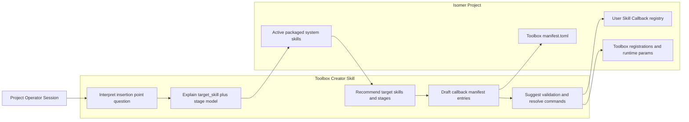
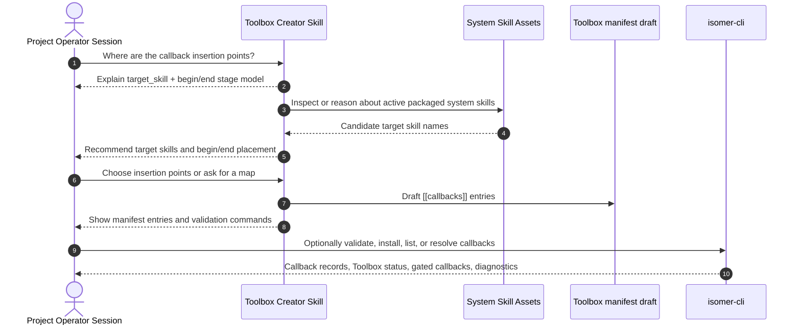

# Use Case 01: Identify Toolbox Callback Insertion Points

## Actor Goal

As a Project Operator Session, I want to ask the Toolbox Creator Skill where a Toolbox can insert callback guidance, so that I can choose valid target skills, callback stages, and scopes before writing or installing Toolbox manifest entries.

## Use Case

The user invokes the Toolbox Creator Skill with a question such as "where are the callback insertion points?" The skill interprets "callback insertion points" as User Skill Callback attachment points: a packaged system skill name plus a supported callback stage, currently `begin` or `end`, with Project or Research Topic scope selected at installation time. The skill answers by explaining the insertion-point model, showing how to discover active packaged system skills, mapping the user's Toolbox purpose to likely target skills and stages, and warning that the answer is advisory until validated by `isomer-cli`.

## Supported Actions

### Explain Insertion Point Model

The user asks what callback insertion points mean in Toolbox authoring.

- context
  - Actor **has** a Toolbox idea or an existing Toolbox source tree and wants to decide where its callback material should attach.
  - System **has** canonical Toolbox language, User Skill Callback rules, and knowledge that Toolbox manifest callback entries use `target_skill`, `stage`, `source_type`, and a toolbox-local `key`.
- intent
  - Actor **wants** a precise explanation of what can receive Toolbox callback guidance.
  - Actor **wonders** "Can a Toolbox hook into any step, or only into named system skills and begin/end stages?"
- action
  - Actor then **asks** the skill to explain callback insertion points for Toolboxes.
- result
  - Actor **gets** a concise model: each insertion point is a valid active packaged system skill plus `begin` or `end`, installed callback ids are `<toolbox_id>:<toolbox-local-key>`, and callback guidance remains supplemental to the owning skill.

### Discover Candidate Target Skills

The user asks which system skills can be targeted by a Toolbox.

- context
  - Actor **has** a Project checkout with packaged system skills and may have a topic or workflow family in mind.
  - System **has** local skill assets, system skill names, and CLI validation that rejects unknown or inactive target skills.
- intent
  - Actor **wants** to list or narrow candidate target skills before writing `[[callbacks]]` entries.
  - Actor **wonders** "For this Toolbox, should I target scout, analysis, experiment, review, write, finalize, or something else?"
- action
  - Actor then **asks** the skill to inspect or explain available target skills for the intended Toolbox behavior.
- result
  - Actor **gets** a candidate target list grouped by workflow role, with each candidate expressed as a `target_skill` value and a note about why `begin`, `end`, or both may be appropriate.

### Recommend Stage Placement

The user asks whether a callback belongs at `begin` or `end`.

- context
  - Actor **has** a specific guidance concern, such as source selection, model-shape expectations, evidence checking, writing style, closure gates, or local command posture.
  - System **has** the rule that begin callbacks shape work before the owning workflow step, while end callbacks check or constrain tentative outputs before handoff or response.
- intent
  - Actor **wants** to place guidance where it helps without overriding the owning system skill.
  - Actor **wonders** "Should this reminder run before the agent starts, or after it drafts output?"
- action
  - Actor then **asks** the skill to recommend callback stages for the guidance concern.
- result
  - Actor **gets** stage guidance: use `begin` for framing, source search, planning, and setup posture; use `end` for validation, evidence checks, claim limits, output completeness, and final safety review.

### Draft Manifest Callback Entries

The user asks the skill to turn insertion-point advice into manifest-ready entries.

- context
  - Actor **has** selected a `toolbox_id`, one or more target skills, desired stages, and source material type such as `skill_dir`, `prompt_file`, or `prompt`.
  - System **has** the Toolbox manifest schema and callback key rules.
- intent
  - Actor **wants** a concrete callback map they can paste into or generate inside `manifest.toml`.
  - Actor **wonders** "What should the `key`, `target_skill`, `stage`, `source_type`, and source field look like?"
- action
  - Actor then **asks** the skill to draft callback entries for the chosen insertion points.
- result
  - Actor **gets** manifest-ready `[[callbacks]]` entry drafts with stable toolbox-local keys, valid target skills, valid stages, one matching source field per entry, and notes about validation commands.

### Check Existing Installed Callback Behavior

The user asks how chosen insertion points will behave after installation.

- context
  - Actor **has** an installed or planned Toolbox and a selected Project or Research Topic context.
  - System **has** `project skill-callbacks list`, `show`, `resolve`, and `validate` commands, plus effective Toolbox status gating.
- intent
  - Actor **wants** to know which callbacks are visible, gated, disabled, or missing registration for a selected context.
  - Actor **wonders** "If I install this Toolbox for one topic, what callbacks will resolve for this skill and stage?"
- action
  - Actor then **asks** the skill to inspect existing callback insertion behavior or propose commands to inspect it.
- result
  - Actor **gets** the relevant `isomer-cli project skill-callbacks` commands, expected fields to read in JSON output, and a summary of effective callbacks, `toolbox_id` metadata, `toolbox_key` values, `toolbox_statuses`, and `gated_callback_ids`.

## Main Flow

1. The user invokes the Toolbox Creator Skill from a Project Operator Session.
2. The user asks where callback insertion points are for a new or existing Toolbox.
3. The skill maps the user's phrase "callback insertion points" to User Skill Callback attachment points: `target_skill` plus `stage`, with installation scope handled by `isomer-cli`.
4. The skill explains that valid stages are `begin` and `end`, and that callbacks installed from a Toolbox are supplemental instruction material for the owning system skill.
5. The skill asks for or infers the Toolbox purpose, intended workflow family, target Research Topic if relevant, and whether the user wants framing guidance, output checking, or both.
6. The skill lists candidate active packaged system skills that match the purpose and explains the likely `begin` and `end` placement for each candidate.
7. The user chooses one or more insertion points or asks the skill for a recommended map.
8. The skill drafts candidate `[[callbacks]]` manifest entries with toolbox-local keys, `target_skill`, `stage`, `source_type`, and source fields.
9. The skill explains how to validate or inspect the insertion points with `project skill-callbacks install --toolbox-dir`, `project skill-callbacks resolve`, `project skill-callbacks list`, and `project skill-callbacks validate`.
10. The user leaves the interaction with a callback target map, manifest-entry draft, and validation or inspection commands, without any mutation unless the user explicitly asks the agent to install or edit files.

## Alternative And Exception Flows

- If the user asks about "hooks" or "insertion points" without a Toolbox purpose, the skill first explains the general model and then asks for the intended behavior before recommending target skills.
- If the user names a target skill that is not active or packaged, the skill warns that manifest validation will reject it and suggests discovering active system skills before drafting entries.
- If the user wants guidance to run before and after the same owning workflow, the skill recommends separate callback entries with distinct toolbox-local keys and `begin` or `end` stages.
- If the requested behavior would override system instructions, current user intent, evidence Gates, validation, or recording obligations, the skill classifies it as out of bounds and suggests a supplemental framing or checking callback instead.
- If the user asks for topic-agent-specific insertion behavior, the skill explains that callback insertion points remain `target_skill` plus `stage`; topic-agent specialization is managed through Toolbox registration scope and runtime params rather than a different callback target.
- If a planned callback source path points outside the Toolbox directory or lacks `SKILL.md` for `skill_dir`, the skill flags the source before proposing installation.
- If the user asks to inspect installed behavior and no matching Toolbox registration exists, the skill explains that Toolbox-installed callbacks with missing registration are gated with diagnostics.

## Mermaid Flow Diagram



## Mermaid Sequence Diagram



## Durable Outputs

- A proposed callback insertion-point map expressed as target system skills and stages.
- Optional `[[callbacks]]` manifest-entry drafts for `manifest.toml`.
- Optional notes about chosen scope, validation commands, and inspection commands.
- No durable Project Manifest, Topic Workspace Manifest, callback registry, or Toolbox source changes unless the user separately asks the agent to edit or install.

## Example Prompt And Expected AI Response

### Event 001 - Ask Where a Toolbox Can Insert Callback Guidance

> Time: `<example-time>` · Session: `Project Operator Session`

User Prompt:

> Use $toolbox-creator-skill to tell me where the callback insertion points are for a Toolbox that teaches GPU experiment agents to check evidence quality.

AI:

> Callback insertion points are User Skill Callback targets: a packaged system skill plus a callback stage.
>
> Field Value
> `interpreted_goal` Identify valid Toolbox callback insertion points
> `insertion_point_shape` `target_skill` + `stage`
> `supported_stages` `begin`, `end`
> `likely_targets` `isomer-deepsci-experiment`, `isomer-deepsci-analysis`, `isomer-deepsci-review`
> `scope_note` Scope is chosen when installing or registering the Toolbox, not inside the insertion point itself
> `mutation` none
>
> Recommended map
>
> | Guidance concern | Target skill | Stage | Why |
> | --- | --- | --- | --- |
> | Plan evidence collection before an experiment starts | `isomer-deepsci-experiment` | `begin` | Shapes experiment setup before work hardens |
> | Check evidence quality after experiment output exists | `isomer-deepsci-experiment` | `end` | Validates tentative output before handoff |
> | Review whether claims match evidence classes | `isomer-deepsci-review` | `begin` | Gives the reviewer the evidence checklist before review |
>
> Manifest sketch
>
> ```toml
> [[callbacks]]
> key = "evidence-quality/experiment/begin"
> target_skill = "isomer-deepsci-experiment"
> stage = "begin"
> source_type = "skill_dir"
> skill_dir = "evidence-quality"
> ```
>
> Next action
>
> Create or inspect the Toolbox manifest, then validate the target skills with `isomer-cli project skill-callbacks install --toolbox-dir <path>` when you are ready to install.

### Event 002 - Ask for Manifest-Ready Callback Entries

> Time: `<example-time>` · Session: `Project Operator Session`

User Prompt:

> Good. Draft the callback entries for a Toolbox named `gpu-evidence-quality` with one begin reminder before experiments and one end check after experiment output exists.

AI:

> I will draft only the Toolbox manifest callback entries. This does not install or mutate the Project.
>
> ```toml
> [[callbacks]]
> key = "evidence-quality/experiment/begin"
> target_skill = "isomer-deepsci-experiment"
> stage = "begin"
> source_type = "skill_dir"
> skill_dir = "evidence-quality"
> description = "Shape evidence-quality expectations before GPU experiment work starts."
>
> [[callbacks]]
> key = "evidence-quality/experiment/end"
> target_skill = "isomer-deepsci-experiment"
> stage = "end"
> source_type = "skill_dir"
> skill_dir = "evidence-quality"
> description = "Check experiment outputs for evidence class, missing measurements, and claim limits before handoff."
> ```
>
> Expected source tree:
>
> ```text
> skillset/toolboxes/gpu-evidence-quality/
>   manifest.toml
>   evidence-quality/
>     SKILL.md
> ```
>
> Validation path:
>
> 1. Confirm `evidence-quality/SKILL.md` exists.
> 2. Confirm `manifest.toml` uses `schema_version = "isomer-toolbox.v1"`, `kind = "toolbox-callback-bundle"`, and `toolbox_id = "gpu-evidence-quality"`.
> 3. Install or validate with `isomer-cli project skill-callbacks install --toolbox-dir skillset/toolboxes/gpu-evidence-quality` when you explicitly want to write callback records.

## Assumptions And Open Questions

- Assumption: The user's phrase "callback insertion points" maps to User Skill Callback target system skills and stages rather than a new extension-point schema.
- Assumption: The skill can inspect or explain active packaged system skill names from local project assets or existing validation behavior before drafting entries.
- Assumption: The first version should recommend insertion points but avoid installing callbacks unless the user explicitly asks for mutation.
- Open question: Should the skill include a canonical command for listing active packaged system skill names, or should it rely on manifest validation and local asset inspection?
- Open question: Should insertion-point recommendations be generated from a maintained target-skill taxonomy, from examples like `gpu-analytical-modeling`, or from lightweight heuristics in the skill body?
