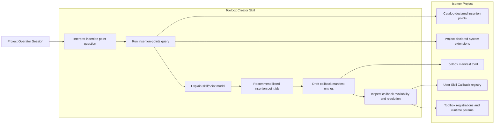
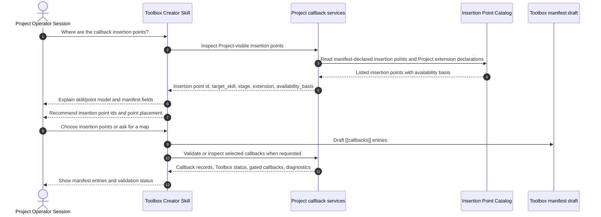

# Use Case 01: Identify Toolbox Callback Insertion Points

## Actor Goal

As a Project Operator Session, I want to ask the Toolbox Creator Skill where a Toolbox can insert callback guidance, so that I can choose valid callback insertion point ids, source material, and scopes before writing or installing Toolbox manifest entries.

## Use Case

The user invokes the Toolbox Creator Skill with a question such as "where are the callback insertion points?" The skill interprets "callback insertion points" as User Skill Callback attachment points declared by the packaged system-skill catalog. The user-facing shape is `<skill>/<point-inside-skill>`, such as `isomer-deepsci-experiment/begin`; the current manifest fields decompose that id into `target_skill` and `stage`. The skill answers by inspecting the Project-visible insertion-point catalog, explaining the insertion-point model, mapping the user's Toolbox purpose to listed insertion point ids, and warning when optional extension points are catalog-known but not Project-declared as installed.

## Supported Actions

### Explain Insertion Point Model

The user asks what callback insertion points mean in Toolbox authoring.

- context
  - Actor **has** a Toolbox idea or an existing Toolbox source tree and wants to decide where its callback material should attach.
  - System **has** canonical Toolbox language, User Skill Callback rules, a catalog-backed callback insertion-point query surface, and knowledge that Toolbox manifest callback entries use `target_skill`, `stage`, `source_type`, and a toolbox-local `key`.
- intent
  - Actor **wants** a precise explanation of what can receive Toolbox callback guidance.
  - Actor **wonders** "Can a Toolbox hook into any step, or only into named insertion points like `isomer-deepsci-experiment/begin`?"
- action
  - Actor then **asks** the skill to explain callback insertion points for Toolboxes.
- result
  - Actor **gets** a concise model: each insertion point is a catalog-declared `<skill>/<point-inside-skill>` id, currently with `begin` and `end` as the supported point names; manifest entries store the same choice in `target_skill` and `stage`, installed callback ids are `<toolbox_id>:<toolbox-local-key>`, and callback guidance remains supplemental to the owning skill.

### Discover Candidate Insertion Points

The user asks which callback insertion points can be targeted by a Toolbox.

- context
  - Actor **has** a Project checkout with packaged system skills and may have a topic or workflow family in mind.
  - System **has** a Project-visible insertion-point catalog, Project-declared operator system extensions, and validation that rejects undeclared insertion points.
- intent
  - Actor **wants** to list or narrow candidate insertion point ids before writing `[[callbacks]]` entries.
  - Actor **wonders** "For this Toolbox, should I target `isomer-deepsci-experiment/begin`, `isomer-deepsci-review/end`, or something else?"
- action
  - Actor then **asks** the skill to inspect or explain available insertion points for the intended Toolbox behavior.
- result
  - Actor **gets** a short candidate insertion-point list from the insertion-point query, grouped by workflow role when useful. If the catalog contains too many rows for the user's purpose, the skill shows only the relevant rows and uses `...` to indicate omitted entries.

### Recommend Point Placement

The user asks whether a callback belongs at a `begin` or `end` point inside the target skill.

- context
  - Actor **has** a specific guidance concern, such as source selection, model-shape expectations, evidence checking, writing style, closure gates, or local execution posture.
  - System **has** the rule that begin callbacks shape work before the owning workflow step, while end callbacks check or constrain tentative outputs before handoff or response.
- intent
  - Actor **wants** to place guidance at the right point inside the owning system skill without overriding it.
  - Actor **wonders** "Should this reminder run before the agent starts, or after it drafts output?"
- action
  - Actor then **asks** the skill to recommend callback insertion points for the guidance concern.
- result
  - Actor **gets** point guidance: use `<skill>/begin` for framing, source search, planning, and setup posture; use `<skill>/end` for validation, evidence checks, claim limits, output completeness, and final safety review.

### Draft Manifest Callback Entries

The user asks the skill to turn insertion-point advice into manifest-ready entries.

- context
  - Actor **has** selected a `toolbox_id`, one or more insertion point ids, and source material type such as `skill_dir`, `prompt_file`, or `prompt`.
  - System **has** the Toolbox manifest schema and callback key rules.
- intent
  - Actor **wants** a concrete callback map the skill can place in `manifest.toml` when asked.
  - Actor **wonders** "For `isomer-deepsci-experiment/begin`, what should the `key`, `target_skill`, `stage`, `source_type`, and source field look like?"
- action
  - Actor then **asks** the skill to draft callback entries for the chosen insertion points.
- result
  - Actor **gets** manifest-ready `[[callbacks]]` entry drafts with stable toolbox-local keys, valid insertion point ids decomposed into `target_skill` and `stage`, one matching source field per entry, and a short validation status.

### Check Existing Installed Callback Behavior

The user asks how chosen insertion points will behave after installation.

- context
  - Actor **has** an installed or planned Toolbox and a selected Project or Research Topic context.
  - System **has** effective callback listing, inspection, resolution, validation, and Toolbox status gating.
- intent
  - Actor **wants** to know which callbacks are visible, gated, disabled, or missing registration for a selected context.
  - Actor **wonders** "If I install this Toolbox for one topic, what callbacks will resolve for this skill and stage?"
- action
  - Actor then **asks** the skill to inspect existing callback insertion behavior.
- result
  - Actor **gets** a summary of effective callbacks, `toolbox_id` metadata, `toolbox_key` values, `toolbox_statuses`, `gated_callback_ids`, and any missing or disabled callback records.

## Main Flow

1. The user invokes the Toolbox Creator Skill from a Project Operator Session.
2. The user asks where callback insertion points are for a new or existing Toolbox.
3. The skill maps the user's phrase "callback insertion points" to User Skill Callback attachment points shaped as `<skill>/<point-inside-skill>`, with installation scope handled by Project callback registration.
4. The skill explains that the current point names are `begin` and `end`, and that callbacks installed from a Toolbox are supplemental instruction material for the owning skill.
5. The skill inspects the Project-visible insertion-point catalog to list callback insertion points meaningful to the current Project.
6. If the user is asking about a known optional system extension that is not Project-declared, the skill explains that the user can either remember the extension for the Project or request explicit catalog-only extension discovery.
7. The skill asks for or infers the Toolbox purpose, intended workflow family, target Research Topic if relevant, and whether the user wants framing guidance, output checking, or both.
8. The skill filters the listed insertion points to candidates that match the purpose, shows a short list when there are too many catalog rows, and explains likely ids such as `isomer-deepsci-experiment/begin` and `isomer-deepsci-experiment/end`.
9. The user chooses one or more insertion points or asks the skill for a recommended map.
10. The skill drafts candidate `[[callbacks]]` manifest entries with toolbox-local keys, `target_skill`, `stage`, `source_type`, and source fields.
11. If the user asks the skill to continue, the skill validates the selected callback targets and reports whether each target is available, catalog-only, or missing.
12. The user leaves the interaction with a callback target map and, when requested, a manifest-entry draft, without any mutation unless the user explicitly asks the agent to remember an extension, install callbacks, or edit files.

## Alternative And Exception Flows

- If the user asks about "hooks" or "insertion points" without a Toolbox purpose, the skill first runs or recommends the insertion-point query, explains the general model, and then asks for the intended behavior before recommending insertion point ids.
- If the user names an insertion point id whose skill and point do not appear in the Project-visible insertion-point catalog, the skill warns that manifest validation will reject it and suggests explicit catalog extension discovery if the user meant an optional extension.
- If the user expects optional extension points such as `deepsci` to appear by default but they do not, the skill explains that optional extensions must be Project-declared with `project system-extensions remember <extension-id>` or queried explicitly with `--extension <extension-id>`.
- If the user wants guidance to run before and after the same owning workflow, the skill recommends separate callback entries with distinct toolbox-local keys for `<skill>/begin` and `<skill>/end`.
- If the requested behavior would override system instructions, current user intent, evidence Gates, validation, or recording obligations, the skill classifies it as out of bounds and suggests a supplemental framing or checking callback instead.
- If the user asks for topic-agent-specific insertion behavior, the skill explains that callback insertion points remain `<skill>/<point-inside-skill>`; topic-agent specialization is managed through Toolbox registration scope and runtime params rather than a different callback target.
- If a planned callback source path points outside the Toolbox directory or lacks `SKILL.md` for `skill_dir`, the skill flags the source before proposing installation.
- If the user asks to inspect installed behavior and no matching Toolbox registration exists, the skill explains that Toolbox-installed callbacks with missing registration are gated with diagnostics.

## Mermaid Flow Diagram



## Mermaid Sequence Diagram



## Durable Outputs

- A proposed callback insertion-point map expressed as listed `<skill>/<point-inside-skill>` ids.
- Optional `[[callbacks]]` manifest-entry drafts for `manifest.toml`.
- Optional notes about chosen scope, validation status, and effective callback behavior.
- No durable Project Manifest, Topic Workspace Manifest, callback registry, or Toolbox source changes unless the user separately asks the agent to edit or install.

## Example Prompt And Expected Visible AI Response

These examples show only the visible user prompt and the AI response content that should be returned to the user. Do not include hidden reasoning, chain-of-thought, scratchpad notes, private tool-selection deliberation, or thinking process in the AI response unless the user explicitly asks the skill to document that process.

### Event 001 - Ask Where a Toolbox Can Insert Callback Guidance

> Time: `<example-time>` · Session: `Project Operator Session`

User Prompt:

> Use $toolbox-creator-skill to tell me where the callback insertion points are for a Toolbox that teaches GPU experiment agents to check evidence quality.

AI (visible response):

> Callback insertion points are User Skill Callback targets shaped as `<skill>/<point-inside-skill>`, for example `isomer-deepsci-experiment/begin`.
>
> I checked the Project-visible insertion-point catalog for the DeepSci extension.
>
> The catalog rows include fields such as `id`, `target_skill`, `stage`, `stage_label`, `skill_path`, `extension_id`, `availability_basis`, and `installation_verified`. The returned insertion point ids use the current format `<target_skill>/<stage>`.
>
> DeepSci exposes more callback insertion points than you need here, so I am showing only the closest matches. Use `begin` when the Toolbox should shape the skill's first domain action after entry checks; use `end` when it should validate the skill's tentative outputs before response, handoff, or completion. Because this lookup used explicit DeepSci extension discovery, the rows are catalog-known but not filesystem-verified for this Project operator, so `availability_basis` is `catalog_requested_not_verified` and `installation_verified` is `false`.
>
> | Skill | Insertion Points Available | Use When |
> | --- | --- | --- |
> | `isomer-deepsci-experiment` | `begin`, `end` | Use `begin` to shape run contracts, setup, budgets, or evidence-quality requirements before implementation or compute starts; use `end` to check results, artifacts, and experiment route decisions. |
> | `isomer-deepsci-review` | `begin`, `end` | Use `begin` to impose skeptical audit criteria before claim and evidence review; use `end` to check review findings, rejection risks, and revision or finalization routes. |
> | `isomer-deepsci-analysis` | `end` | Use after follow-up analysis to check campaign summaries, limitation records, and route decisions that interpret experiment evidence. |
> | `isomer-deepsci-science` | `begin`, `end` | Use `begin` to add package, HPC, validity, units, or claim-type rules before scientific execution; use `end` to verify run records and safe claim classification. |
> | ... | ... | ... |
>
> For your evidence-quality Toolbox, I would prioritize `isomer-deepsci-experiment/begin` for setup guidance, `isomer-deepsci-experiment/end` for output checks, and `isomer-deepsci-review/begin` for review-time evidence criteria.

### Event 002 - Ask for Manifest-Ready Callback Entries

> Time: `<example-time>` · Session: `Project Operator Session`

User Prompt:

> Good. Draft the callback entries for a Toolbox named `gpu-evidence-quality` with one begin reminder before experiments and one end check after experiment output exists.

AI (visible response):

> I will draft only the Toolbox manifest callback entries. This does not install or mutate the Project.
>
> ```toml
> [[callbacks]]
> key = "evidence-quality/experiment/begin"
> target_skill = "isomer-deepsci-experiment"
> stage = "begin"
> source_type = "skill_dir"
> skill_dir = "evidence-quality"
> description = "Shape evidence-quality expectations before GPU experiment work starts."
>
> [[callbacks]]
> key = "evidence-quality/experiment/end"
> target_skill = "isomer-deepsci-experiment"
> stage = "end"
> source_type = "skill_dir"
> skill_dir = "evidence-quality"
> description = "Check experiment outputs for evidence class, missing measurements, and claim limits before handoff."
> ```
>
> Expected source tree:
>
> ```text
> skillset/toolboxes/gpu-evidence-quality/
>   manifest.toml
>   evidence-quality/
>     SKILL.md
> ```
>
> Validation notes:
>
> 1. Confirm `evidence-quality/SKILL.md` exists.
> 2. Confirm `manifest.toml` uses `schema_version = "isomer-toolbox.v1"`, `kind = "toolbox-callback-bundle"`, and `toolbox_id = "gpu-evidence-quality"`.
> 3. Confirm the selected insertion points are available for the current Project or clearly marked as catalog-only extension points.
> 4. Do not install or mutate callback records unless the user explicitly asks for that action.

## Assumptions And Open Questions

- Assumption: The user's phrase "callback insertion points" maps to User Skill Callback `<skill>/<point-inside-skill>` ids rather than a new extension-point schema.
- Assumption: The skill can inspect the Project-visible insertion-point catalog before drafting entries.
- Assumption: The first version should recommend insertion points but avoid installing callbacks unless the user explicitly asks for mutation.
- Open question: Should insertion-point recommendations be generated from a maintained target-skill taxonomy, from examples like `gpu-analytical-modeling`, or from lightweight heuristics in the skill body after querying the catalog?
