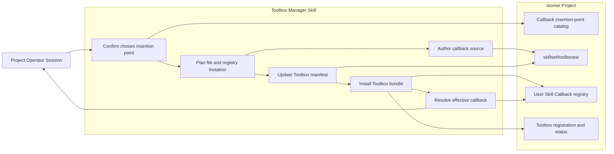
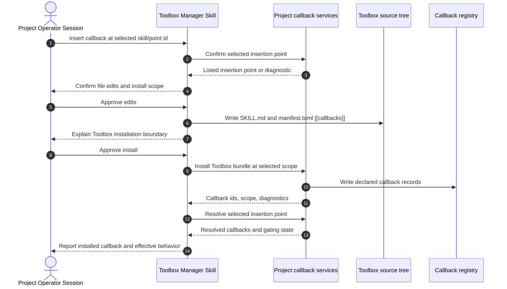

# Use Case 02: Insert Toolbox Callback at Chosen Insertion Point

## Actor Goal

As a Project Operator Session, I want to ask the Toolbox Manager Skill to insert callback guidance into one chosen callback insertion point, so that a valid Toolbox callback is authored, installed at the intended scope, and visible through effective callback inspection.

## Use Case

The user has chosen a catalog-listed callback insertion point, such as `isomer-deepsci-experiment/begin`, and asks the Toolbox Manager Skill to insert Toolbox guidance there. The skill treats the user-facing insertion point as `<skill>/<point-inside-skill>`, decomposes it into `target_skill` and `stage` fields for the current Toolbox manifest, creates or updates the Toolbox source tree and `manifest.toml`, installs the Toolbox bundle through the high-level Toolbox install path when requested, and verifies that the callback resolves for the selected Project or Research Topic scope. The skill makes mutation explicit before writing files or installation records and keeps the callback supplemental to the owning system skill.

## Supported Actions

### Confirm Chosen Insertion Point

The user asks to use one insertion point from a previously listed set.

- context
  - Actor **has** selected an insertion point id such as `isomer-deepsci-experiment/begin`, usually from a previously listed insertion-point catalog.
  - System **has** catalog-backed insertion-point validation and can inspect candidate insertion points.
- intent
  - Actor **wants** to avoid writing a Toolbox callback that validation will reject.
  - Actor **wonders** "Can I safely attach this Toolbox guidance to `isomer-deepsci-experiment/begin`?"
- action
  - Actor then **asks** the skill to confirm the chosen insertion point before authoring the callback.
- result
  - Actor **gets** confirmation that the insertion point id is listed, including its `target_skill` and `stage` manifest fields, or a diagnostic explaining which extension or scope query is needed before insertion can proceed.

### Author Callback Source

The user asks the skill to create the callback material that will run at the chosen insertion point.

- context
  - Actor **has** a Toolbox purpose, a selected insertion point, and either new guidance text or a request for the skill to draft guidance.
  - System **has** the canonical Toolbox source layout under `skillset/toolboxes/<toolbox-id>/` and the rule that `skill_dir` sources must contain `SKILL.md`.
- intent
  - Actor **wants** callback material that is concrete, scoped, and safe to load as supplemental instruction.
  - Actor **wonders** "What should the callback skill say so it helps the owning workflow without overriding it?"
- action
  - Actor then **asks** the skill to write or update the Toolbox callback source.
- result
  - Actor **gets** a proposed or written callback source such as `skillset/toolboxes/<toolbox-id>/<callback-dir>/SKILL.md`, with instructions framed as begin-stage setup guidance or end-stage checking guidance.

### Update Toolbox Manifest Entry

The user asks the skill to connect the callback source to the chosen insertion point.

- context
  - Actor **has** a Toolbox directory and a callback source path inside that directory.
  - System **has** the Toolbox manifest schema requiring `schema_version = "isomer-toolbox.v1"`, `kind = "toolbox-callback-bundle"`, `toolbox_id`, and `[[callbacks]]` entries with toolbox-local keys.
- intent
  - Actor **wants** the manifest to contain exactly the callback entry needed for the selected insertion point id.
  - Actor **wonders** "For `isomer-deepsci-experiment/begin`, which `key`, `target_skill`, `stage`, and source field should this callback use?"
- action
  - Actor then **asks** the skill to add or revise the `[[callbacks]]` entry in `manifest.toml`.
- result
  - Actor **gets** a manifest entry with a stable toolbox-local `key`, the chosen insertion point decomposed into `target_skill` and `stage`, one valid `source_type`, and a source path that stays inside the Toolbox directory.

### Install Toolbox Bundle

The user asks the skill to make the callback effective for a Project or Research Topic.

- context
  - Actor **has** reviewed the callback source and manifest entry and has selected Project or Research Topic scope.
  - System **has** high-level Toolbox installation that can register the Toolbox, install declared callbacks at Project or Research Topic scope, and replace same-identity records when the user confirms replacement.
- intent
  - Actor **wants** the Toolbox callback to become visible through the installed Toolbox at the intended scope.
  - Actor **wonders** "Will this install the Toolbox now, and where will the callback apply?"
- action
  - Actor then **explicitly asks** the skill to install the Toolbox bundle.
- result
  - Actor **gets** the mutation boundary, callback ids using `<toolbox_id>:<toolbox-local-key>`, Toolbox registration scope, runtime-param default import status when applicable, and any installation diagnostics.

### Verify Effective Callback Behavior

The user asks the skill to confirm that the inserted callback will be used.

- context
  - Actor **has** an installed Toolbox callback and a selected context such as a Research Topic.
  - System **has** effective callback resolution, listing, inspection, and validation.
- intent
  - Actor **wants** proof that the callback resolves for the chosen insertion point id.
  - Actor **wonders** "When the owning system skill starts, will it see this Toolbox callback?"
- action
  - Actor then **asks** the skill to inspect effective callback behavior after installation.
- result
  - Actor **gets** a resolved callback view for the chosen insertion point, including whether the callback is active, gated by Toolbox status, missing registration, disabled, or shadowed by a scope decision.

## Main Flow

1. The user invokes the Toolbox Manager Skill from a Project Operator Session.
2. The user names a chosen insertion point id, such as `isomer-deepsci-experiment/begin`, and asks the skill to insert Toolbox callback guidance there.
3. The skill asks for or infers the `toolbox_id`, callback purpose, callback source style, intended scope, and target Research Topic when scope is `research_topic`.
4. The skill decomposes the insertion point id into `<target-skill>` and `<point>`, then confirms that the chosen point is available in the relevant catalog view, including explicit extension discovery when the user is working with a catalog-known optional extension that is not Project-declared.
5. The skill proposes the filesystem mutation: create or update `skillset/toolboxes/<toolbox-id>/manifest.toml`, create or update the callback source path, and keep all source files inside the Toolbox directory.
6. After the user confirms file edits, the skill writes or updates the callback source, usually a `skill_dir` containing `SKILL.md`.
7. The skill writes or updates the matching `[[callbacks]]` entry with a stable toolbox-local `key`, `target_skill`, `stage`, and the selected source field.
8. The skill checks the source path and manifest fields before installing, including schema version, kind, duplicate keys, unsupported point names in the `stage` field, and missing `SKILL.md`.
9. The skill summarizes the Toolbox installation mutation and asks for explicit permission if the user has not already asked for installation.
10. The skill installs the Toolbox bundle at the selected scope, using the selected Research Topic when installing at Research Topic scope.
11. The skill verifies effective behavior for the selected insertion point and scope.
12. The user leaves the interaction with written Toolbox source, installed callback records if requested, a resolved callback view, and a clear rollback or adjustment path when needed.

## Alternative And Exception Flows

- If the chosen insertion point id is not listed, the skill stops before file edits or installation and explains whether the user likely needs explicit extension discovery or a Project-declared extension.
- If the user has not selected a scope, the skill recommends `research_topic` for topic-specific behavior and warns before Project-scope installation because Project-scope callbacks affect every matching context.
- If the user wants the same guidance at both `<skill>/begin` and `<skill>/end`, the skill creates two callback entries with distinct toolbox-local keys rather than one entry with multiple point names.
- If the Toolbox manifest already has a callback with the same `key`, the skill updates it only when the user confirms the replacement; otherwise it proposes a new stable key.
- If the callback source path would leave the Toolbox directory, the skill refuses that path and asks for an in-Toolbox source path.
- If the callback instruction would override system instructions, current user intent, evidence Gates, validation, or recording obligations, the skill rewrites it as supplemental framing or checking guidance before insertion.
- If installation fails because same callback ids already exist from another Toolbox source, the skill explains the conflict and offers replacement only after the user confirms that replacement is intended.
- If effective callback inspection shows a gated callback, the skill explains the missing or disabled Toolbox registration and the relevant status to inspect or change.
- If the user asks for Topic Agent specialization, the skill keeps the insertion point unchanged and uses runtime params for the Topic Agent-specific behavior. It does not install callbacks at Topic Agent scope because callback registries currently support Project and Research Topic scope.

## Mermaid Flow Diagram



## Mermaid Sequence Diagram



## Durable Outputs

- A Toolbox source directory under `skillset/toolboxes/<toolbox-id>/`.
- A callback source file or skill directory, commonly `<callback-dir>/SKILL.md`.
- A `manifest.toml` `[[callbacks]]` entry with the chosen insertion point decomposed into `target_skill` and `stage`.
- Optional User Skill Callback records written during Toolbox installation.
- Optional Toolbox registration or status metadata written during installation.
- A resolved callback inspection result for the selected scope and insertion point id.

## Example Prompt And Expected Visible AI Response

> **Warning:** The user/AI chat content below is for example purposes only. Implementations should learn its style, intent, and semantics rather than hardcoding the example content.

These examples show only the visible user prompt and the AI response content that should be returned to the user. Do not include hidden reasoning, chain-of-thought, scratchpad notes, private tool-selection deliberation, or thinking process in the AI response unless the user explicitly asks the skill to document that process.

### Event 001 - Insert One Begin Callback

> Time: `<example-time>` · Session: `Project Operator Session`

User Prompt:

> Use $isomer-op-entrypoint use toolbox to insert a callback into `isomer-deepsci-experiment/begin`. The Toolbox is `gpu-evidence-quality`, and for topic `cuda-kernel-study` it should remind experiment agents to classify evidence before they run benchmarks.

AI (visible response):

> I will treat this as a Toolbox callback insertion, not a new system skill.
>
> I will first confirm that `isomer-deepsci-experiment/begin` is an available DeepSci insertion point, then prepare the Toolbox source and manifest entry.
>
> Planned file edits
>
> | Field | Value |
> | --- | --- |
> | `toolbox_dir` | `skillset/toolboxes/gpu-evidence-quality` |
> | `callback_source` | `evidence-quality/SKILL.md` |
> | `manifest_entry` | `[[callbacks]]` |
> | `insertion_point` | `isomer-deepsci-experiment/begin` |
> | `target_skill` | `isomer-deepsci-experiment` |
> | `stage` | `begin` |
> | `scope` | `research_topic` |
> | `topic` | `cuda-kernel-study` |
>
> Manifest entry
>
> ```toml
> [[callbacks]]
> key = "evidence-quality/experiment/begin"
> target_skill = "isomer-deepsci-experiment"
> stage = "begin"
> source_type = "skill_dir"
> skill_dir = "evidence-quality"
> description = "Ask experiment agents to classify evidence quality before benchmark work starts."
> ```
>
> Callback source shape
>
> ```markdown
> # Evidence Quality Experiment Begin Callback
>
> Before benchmark work starts, classify planned evidence as measured, inferred, assumed, or missing. Keep this guidance supplemental to the owning experiment skill and the current user request.
> ```
>
> I would not install yet unless you ask me to install the Toolbox. Installation would register this callback only for the `cuda-kernel-study` Research Topic.

### Event 002 - Install and Verify the Callback

> Time: `<example-time>` · Session: `Project Operator Session`

User Prompt:

> Looks good. Write it, install it for `cuda-kernel-study`, and show me that it resolves.

AI (visible response):

> I will mutate the Project now: write the Toolbox files, install the Toolbox at Research Topic scope, then resolve the selected insertion point.
>
> Expected report
>
> | Field | Value |
> | --- | --- |
> | `mutated_files` | `manifest.toml`, `evidence-quality/SKILL.md` |
> | `installed_callback_id` | `gpu-evidence-quality:evidence-quality/experiment/begin` |
> | `scope` | `research_topic` |
> | `topic` | `cuda-kernel-study` |
> | `resolved_insertion_point` | `isomer-deepsci-experiment/begin` |
> | `effective_state` | active, unless Toolbox registration is disabled or diagnostics report gating |
> | `rollback_hint` | disable or uninstall the Toolbox registration for this scope, or revise the Toolbox manifest and replace the installed records when replacement is intended |

## Assumptions And Open Questions

- Assumption: The chosen insertion point was discovered through `UC-01` or reconfirmed in the insertion-point catalog before mutation.
- Assumption: The skill may write Toolbox source files when the user explicitly asks it to insert or write the callback.
- Assumption: Research Topic scope is the safer default when the user names a topic or topic-local behavior.
- Assumption: High-level Toolbox installation is the canonical write path when the callback is part of a Toolbox directory; lower-level callback primitives remain for loose or repair work.
- Open question: Should the skill require a separate confirmation for file edits and registry installation, or is one explicit "write and install" prompt enough?
- Open question: Should rollback guidance point first to Toolbox status management or manifest revision plus callback-record replacement?
