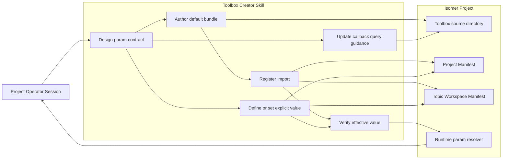
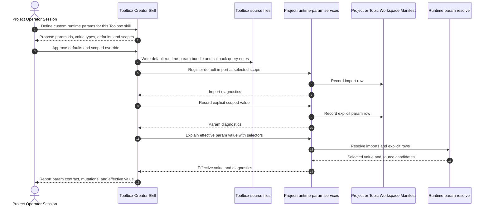

# Use Case 03: Define Custom Runtime Params for Toolbox Skills

## Actor Goal

As a Project Operator Session, I want to ask the Toolbox Creator Skill to define custom runtime params for a Toolbox's callback skills, so that those skills can query Project and Research Topic settings and adapt their guidance without hard-coding every behavior into the callback source.

## Use Case

The user has a Toolbox whose callback skills need user-configurable behavior, such as evidence strictness, benchmark retry count, preferred output style, or whether to require a checklist. The Toolbox Creator Skill helps the user choose stable runtime param ids, declare the Toolbox's `[[runtime_params]]` and `[[runtime_param_bundles]]` contract, write optional default runtime-param bundle TOML files, add Project or Research Topic imports, set explicit scoped overrides, and explain the effective value. The skill treats runtime params as user-authored configuration in Project Manifest or Topic Workspace Manifest layers, not as secret storage and not as a different callback insertion point.

## Supported Actions

### Design Runtime Param Contract

The user asks which runtime params a Toolbox skill should expose.

- context
  - Actor **has** a Toolbox purpose and one or more callback skills that need configurable behavior.
  - System **has** the runtime param id rule `<toolbox_id>:<key>`, supported value types, enum allowed-value validation, and the rule that runtime params are queryable by callback skills through Project runtime-param services.
- intent
  - Actor **wants** a small stable contract that callback skills can depend on.
  - Actor **wonders** "Should this be a boolean flag, an enum mode, a number, or just text?"
- action
  - Actor then **asks** the skill to design runtime param names, types, defaults, and descriptions.
- result
  - Actor **gets** a proposed param contract with ids such as `gpu-evidence-quality:evidence/mode`, value types, allowed enum values when relevant, default values, and guidance for how callback skills should branch on effective values.

### Author Default Runtime Param Bundle

The user asks for shared defaults without setting every value manually in the manifest.

- context
  - Actor **has** a Toolbox source directory and wants reusable defaults that can be imported into Project Manifest or Topic Workspace Manifest configuration.
  - System **has** Toolbox manifest `[[runtime_params]]` definitions, Toolbox manifest `[[runtime_param_bundles]]` declarations, and runtime param import files with `schema_version = "isomer-toolbox-runtime-params.v1"` plus repeated `[[toolbox_runtime_params]]` rows.
- intent
  - Actor **wants** defaults that can be imported and then selectively overridden.
  - Actor **wonders** "Can I import a TOML file as defaults and only set the exceptions?"
- action
  - Actor then **asks** the skill to create or update a default runtime-param bundle file.
- result
  - Actor **gets** Toolbox manifest declarations plus a TOML bundle containing complete default param rows, no secrets, stable keys, valid value types, and comments or README notes explaining which callback skills consume each param.

### Register Runtime Param Import

The user asks the skill to make a default bundle visible from the selected configuration layer.

- context
  - Actor **has** a default bundle path relative to the manifest file that will declare the import.
  - System **has** runtime-param import registration for Project scope, Research Topic scope, Topic Actor scope, and Topic Agent scope.
- intent
  - Actor **wants** imported defaults to participate in effective param resolution.
  - Actor **wonders** "Should this default bundle apply project-wide, to one Research Topic, or to one Topic Agent?"
- action
  - Actor then **asks** the skill to add the runtime param import for the intended scope.
- result
  - Actor **gets** the manifest layer that will record the import, the relative-path rule, selected scope, selectors, and import diagnostics.

### Define or Override Explicit Runtime Param

The user asks to set one runtime param directly.

- context
  - Actor **has** a param id and a desired value, possibly to override imported defaults for one Research Topic, Topic Actor, or Topic Agent.
  - System **has** runtime-param definition and explicit-value writes, scoped selectors, and validation that topic-scope overrides must match broader definition metadata unless they provide complete metadata.
- intent
  - Actor **wants** one explicit value to win over imported defaults at the selected scope.
  - Actor **wonders** "For topic `cuda-kernel-study`, can the experiment Topic Agent use relaxed mode while the Project default stays strict?"
- action
  - Actor then **asks** the skill to define or set the runtime param at the selected scope.
- result
  - Actor **gets** a clear statement of which manifest layer and selector will be mutated, the selected value, and any validation diagnostics.

### Verify Effective Runtime Param

The user asks what value a Toolbox callback skill will actually see.

- context
  - Actor **has** Project defaults, optional imports, and one or more scoped overrides.
  - System **has** effective resolution order: Project Manifest imports, Project Manifest explicit params, Topic Workspace Manifest imports, then Topic Workspace Manifest explicit params.
- intent
  - Actor **wants** to know the selected value and why it wins.
  - Actor **wonders** "When this callback runs for Topic Agent `experimenter`, which mode does it use?"
- action
  - Actor then **asks** the skill to get or explain the effective runtime param value.
- result
  - Actor **gets** an effective-value explanation showing the selected value, source layer, scope, Topic Actor or Topic Agent selector when present, and any diagnostics.

## Main Flow

1. The user invokes the Toolbox Creator Skill from a Project Operator Session.
2. The user says a Toolbox callback skill needs configurable behavior and asks to define custom runtime params.
3. The skill identifies the Toolbox id, consuming callback skill directory or prompt file, desired behavior knobs, default values, allowed value types, and any Research Topic, Topic Actor, or Topic Agent specialization.
4. The skill proposes a runtime param contract using `<toolbox_id>:<key>` ids, where keys are path-like within the Toolbox such as `evidence/mode` or `benchmark/retry-count`.
5. The skill explains that Project-scope params live in the Project Manifest layer, while topic-scope params and imports live in the Topic Workspace Manifest and may specialize by Research Topic, Topic Actor, or Topic Agent.
6. The skill explains effective resolution order: Project Manifest imports, Project Manifest explicit params, Topic Workspace Manifest imports, then Topic Workspace Manifest explicit params.
7. The skill drafts or updates Toolbox manifest `[[runtime_params]]` declarations for each param key, value type, default, allowed values, and description.
8. If the user wants reusable defaults, the skill drafts a default runtime-param bundle TOML with `schema_version = "isomer-toolbox-runtime-params.v1"` and `[[toolbox_runtime_params]]` rows, then declares it in Toolbox manifest `[[runtime_param_bundles]]` with a path relative to the Toolbox directory.
9. If the user asks to register the bundle, the skill records the import in the selected manifest layer with a path relative to that manifest and the required topic, actor, or agent selector.
10. If the user asks to define or override individual params, the skill records a new complete definition or explicit value at the selected scope.
11. The skill updates the Toolbox callback source guidance so the callback skill knows which param id to query and how to branch on the effective value.
12. The skill verifies or explains the effective value for the selected Project, Research Topic, Topic Actor, or Topic Agent context.
13. The user leaves the interaction with a param contract, optional default bundle file, optional manifest-layer mutations, and effective-value output that a Toolbox skill can rely on.

## Alternative And Exception Flows

- If the user proposes a param id without `<toolbox_id>:<key>`, the skill rewrites it into canonical param id form before drafting configuration.
- If the requested value may contain credentials, API keys, passwords, private benchmark data, or other secret-like material, the skill refuses to store it as a runtime param and recommends a secret-safe configuration path outside Toolbox runtime params.
- If the user asks for Project-scope specialization by Topic Actor or Topic Agent, the skill explains that Project scope has no Project actor or agent specialization; Topic Actor and Topic Agent selectors belong to topic-owned configuration.
- If the user wants imported defaults and explicit overrides, the skill explains that explicit rows at the same or narrower layer win over imported rows according to the documented resolution order.
- If an enum param lacks allowed values, the skill requires explicit allowed values before writing a definition or default bundle row.
- If a topic-scope override changes `value_type` from the broader definition, the skill warns that validation rejects mismatched types and keeps the override type aligned.
- If an import path is absolute or points outside the intended manifest-relative location, the skill rewrites the plan to use a relative path from the manifest file that declares the import.
- If multiple rows define the same active Toolbox param at the same scope and selector, the skill flags the duplicate and asks whether to unset, replace, or keep only one row.
- If the user only wants to see what a callback skill would read, the skill performs read-only inspection and avoids mutation.

## Mermaid Flow Diagram



## Mermaid Sequence Diagram



## Durable Outputs

- A runtime param contract with ids shaped as `<toolbox_id>:<key>`.
- Optional Toolbox manifest `[[runtime_params]]` and `[[runtime_param_bundles]]` declarations.
- Optional default runtime-param bundle TOML files inside the Toolbox source material or at a manifest-relative import path.
- Optional Project Manifest import or explicit param rows.
- Optional Topic Workspace Manifest import or explicit param rows with Research Topic, Topic Actor, or Topic Agent selectors.
- Callback skill guidance that names which param ids to query and how to branch on values.
- Effective-value or validation output.

## Example Prompt And Expected Visible AI Response

These examples show only the visible user prompt and the AI response content that should be returned to the user. Do not include hidden reasoning, chain-of-thought, scratchpad notes, private tool-selection deliberation, or thinking process in the AI response unless the user explicitly asks the skill to document that process.

### Event 001 - Define Runtime Param Defaults

> Time: `<example-time>` · Session: `Project Operator Session`

User Prompt:

> Use $toolbox-creator-skill to define runtime params for Toolbox `gpu-evidence-quality`. Its experiment callback should use `evidence/mode`, with allowed values `strict` and `relaxed`, defaulting to `strict`.

AI (visible response):

> I will define a Toolbox runtime param contract, not a callback insertion point.
>
> | Field | Value |
> | --- | --- |
> | `toolbox_id` | `gpu-evidence-quality` |
> | `param_id` | `gpu-evidence-quality:evidence/mode` |
> | `value_type` | `enum` |
> | `allowed_values` | `strict`, `relaxed` |
> | `default_value` | `strict` |
> | `consumer` | `evidence-quality/SKILL.md` |
> | `secret_safe` | yes, this is behavior configuration rather than credential material |
>
> Toolbox manifest sketch:
>
> ```toml
> [[runtime_params]]
> key = "evidence/mode"
> value_type = "enum"
> default = "strict"
> allowed_values = ["strict", "relaxed"]
> description = "Controls how strictly the evidence-quality callback checks experiment evidence."
>
> [[runtime_param_bundles]]
> name = "strict-defaults"
> path = "params/strict-defaults.toml"
> ```
>
> Default bundle sketch at `skillset/toolboxes/gpu-evidence-quality/params/strict-defaults.toml`:
>
> ```toml
> schema_version = "isomer-toolbox-runtime-params.v1"
>
> [[toolbox_runtime_params]]
> toolbox_id = "gpu-evidence-quality"
> key = "evidence/mode"
> value = "strict"
> value_type = "enum"
> allowed_values = ["strict", "relaxed"]
> scope = "project"
> description = "Controls how strictly the evidence-quality callback checks experiment evidence."
> ```
>
> Callback skill note:
>
> ```markdown
> Before applying evidence-quality guidance, read the effective value of `gpu-evidence-quality:evidence/mode`. Use `strict` to require complete measured evidence and `relaxed` to allow softer reminders when the Topic Agent has a narrower exploratory role.
> ```
>
> If you want this bundle registered as the Project default, I would add a Project Manifest import that points to the default bundle with a path relative to the Project Manifest file.

### Event 002 - Override Runtime Param for One Topic Agent

> Time: `<example-time>` · Session: `Project Operator Session`

User Prompt:

> For topic `cuda-kernel-study`, set that mode to `relaxed` only for Topic Agent `experimenter`, and show what value the callback will see.

AI (visible response):

> I will write one Topic Workspace Manifest explicit override for the Topic Agent selector, then explain the effective value.
>
> Expected report:
>
> | Field | Value |
> | --- | --- |
> | `mutated_layer` | Topic Workspace Manifest |
> | `scope` | `topic_agent` |
> | `topic` | `cuda-kernel-study` |
> | `topic_agent` | `experimenter` |
> | `selected_value` | `relaxed` |
> | `why_selected` | Topic Workspace explicit row wins over Project Manifest imported default |
> | `callback_behavior` | The Toolbox skill may use relaxed evidence checking for this Topic Agent while other contexts keep the Project default |

## Assumptions And Open Questions

- Assumption: Runtime params are read by Toolbox callback skills through Project runtime-param services; they are not automatically injected into callback source text.
- Assumption: Runtime param ids use `<toolbox_id>:<key>`, Toolbox manifest definitions use bare `key`, and imports record a Toolbox id plus a manifest-relative path.
- Assumption: Imported runtime param bundle paths are relative to the manifest file that declares the import.
- Assumption: Project-scope runtime params are Project-wide, while Topic Actor and Topic Agent specialization belongs to Topic Workspace Manifest configuration.
- Open question: Should the Toolbox Creator Skill always add callback-source query notes when it defines params, or only when the user names a consuming callback skill?
- Open question: Should default runtime-param bundles live under the Toolbox source directory by convention, or near the manifest layer that imports them?
