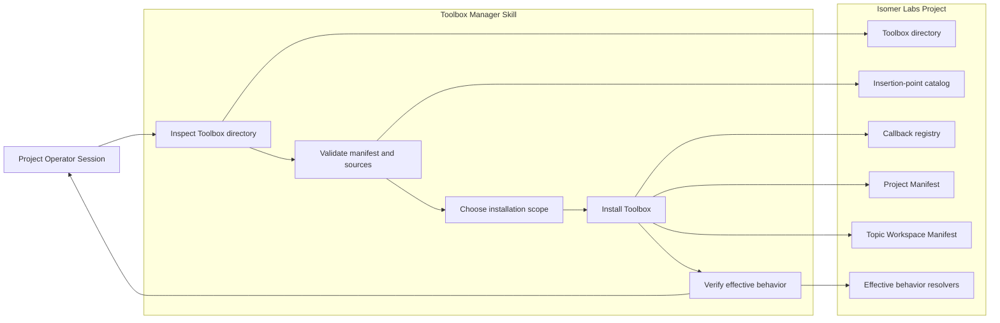
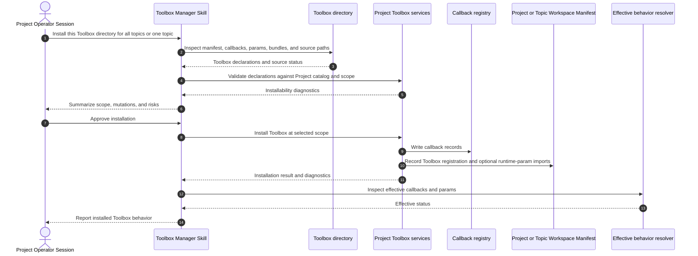

# Use Case 04: Install Toolbox Directory

## Actor Goal

As a Project Operator Session, I want to point the Toolbox Manager Skill at a directory that already contains Toolbox material, so that the skill can install it into the current Isomer Labs Project for all topics or into one selected Topic Workspace without making me handle the registry details.

## Use Case

The user has an existing Toolbox directory, usually containing `manifest.toml`, callback source material, optional runtime-param bundle files, and supporting docs. The user asks the Toolbox Manager Skill to install that Toolbox into the current Project. The skill inspects the Toolbox directory, validates the manifest and source paths, explains whether installation will affect all topics or one Topic Workspace, asks whether declared runtime-param defaults should be imported, asks for explicit mutation approval when needed, installs the Toolbox through the high-level Toolbox install path, and reports what will change and what the installed Toolbox will do.

## Supported Actions

### Inspect Toolbox Directory

The user points to a directory and asks whether it can be installed.

- context
  - Actor **has** a local directory that is intended to be a Toolbox source directory.
  - System **has** the Toolbox manifest schema, callback source rules, runtime-param bundle rules, and Project-visible insertion-point catalog.
- intent
  - Actor **wants** to know whether the directory is a valid Toolbox before mutating the Project.
  - Actor **wonders** "Is this directory installable as a Toolbox here?"
- action
  - Actor then **asks** the skill to inspect the directory.
- result
  - Actor **gets** a concise installability report covering `toolbox_id`, manifest kind, declared callbacks, declared runtime params, bundle files, source-path safety, missing files, duplicate keys, and insertion-point availability.

### Choose Installation Scope

The user decides whether the Toolbox should apply Project-wide or only to one Topic Workspace.

- context
  - Actor **has** an installable Toolbox and either wants all topics covered or names one Research Topic or Topic Workspace.
  - System **has** Project-scope installation for all matching topics and Topic Workspace-scope installation for one selected topic context.
- intent
  - Actor **wants** the Toolbox to apply at the right breadth.
  - Actor **wonders** "Should this affect every topic, or just `cuda-kernel-study`?"
- action
  - Actor then **asks** the skill to install for all topics or for one selected topic.
- result
  - Actor **gets** a scope summary: Project-wide installation affects every matching topic in the current Project, while Topic Workspace installation affects only the selected topic unless narrower Toolbox runtime params specialize behavior.

### Install Toolbox

The user explicitly asks the skill to install the Toolbox.

- context
  - Actor **has** reviewed the Toolbox directory, selected scope, and understood the mutation boundary.
  - System **has** high-level Toolbox installation, Toolbox registration, callback registry writes, optional runtime-param import registration, and effective callback validation.
- intent
  - Actor **wants** the Toolbox's declared callbacks to become effective in the selected scope, and may also want declared runtime-param default bundles imported.
  - Actor **wonders** "After installation, will this Toolbox actually be active where I asked?"
- action
  - Actor then **explicitly asks** the skill to install the Toolbox.
- result
  - Actor **gets** installed callback ids, Toolbox registration status, runtime-param import status when applicable, any skipped declarations, and diagnostics for conflicts, gated callbacks, disabled Toolbox status, or unavailable insertion points.

### Verify Installed Behavior

The user asks what the installed Toolbox will affect.

- context
  - Actor **has** an installed Toolbox at Project or Topic Workspace scope.
  - System **has** effective callback resolution, runtime-param resolution, Toolbox status, and diagnostics.
- intent
  - Actor **wants** confidence that the Toolbox will be seen by the owning system skills.
  - Actor **wonders** "Which callbacks and params are active now?"
- action
  - Actor then **asks** the skill to inspect installed behavior.
- result
  - Actor **gets** a high-level effective-status report listing active callbacks by insertion point, gated or disabled callbacks, selected runtime-param values when relevant, and the scope that made each result visible.

## Main Flow

1. The user invokes the Toolbox Manager Skill from a Project Operator Session.
2. The user points to a Toolbox directory and asks to install it into the current Isomer Labs Project for all topics or into a given Topic Workspace.
3. The skill normalizes the directory path and checks that it contains a Toolbox `manifest.toml`.
4. The skill reads the manifest and summarizes `toolbox_id`, `kind`, declared callbacks, runtime-param definitions, runtime-param bundles, and source paths.
5. The skill validates that callback source paths stay inside the Toolbox directory, `skill_dir` sources contain `SKILL.md`, callback keys are stable and unique, and declared insertion points are available or clearly catalog-only.
6. The skill validates runtime-param defaults and imports for value type, allowed values, relative paths, duplicate active keys, and secret-safety concerns, then asks whether default bundles should be imported during installation.
7. The skill asks for or confirms the intended installation scope: Project-wide for all topics, or one selected Topic Workspace.
8. The skill explains the mutation boundary: callback registry records and Toolbox registration or status metadata will be written, runtime-param import rows are written only when defaults are explicitly enabled, and Toolbox source files are not rewritten unless validation requires a user-approved fix.
9. After explicit approval, the skill installs the Toolbox at the selected scope.
10. The skill verifies effective behavior for the installed callbacks and runtime params in the selected Project or Topic Workspace context.
11. The user leaves the interaction with an installation report, effective status, and any suggested fixes for missing files, unavailable insertion points, scope mismatch, or gated Toolbox status.

## Alternative And Exception Flows

- If the directory has no Toolbox manifest, the skill stops before mutation and explains the minimum files needed for installation.
- If the manifest `toolbox_id` conflicts with an already installed Toolbox, the skill reports the existing registration and asks whether the user wants to replace, keep both by changing identity, or stop.
- If the user says "install for all topics" and the Toolbox contains topic-specific assumptions, the skill warns that Project-wide installation affects every matching topic and suggests Topic Workspace scope when the behavior is experimental or narrow.
- If the user names a Topic Workspace that does not exist or is ambiguous, the skill stops before mutation and asks for a valid topic selection.
- If a declared insertion point is catalog-only for an optional extension, the skill reports that status and asks whether the user wants to proceed with extension-aware installation or first remember the extension for the Project.
- If a callback source path escapes the Toolbox directory, the skill refuses to install that callback until the source is moved inside the Toolbox directory.
- If runtime-param imports include absolute paths, missing bundle files, duplicate active keys, or secret-like values, the skill refuses or skips those rows and reports the reason.
- If the user chooses Topic Actor or Topic Agent scope for a Toolbox that declares callbacks, the skill reports that callback installation currently supports Project and Topic Workspace scope and asks the user to choose one of those scopes.
- If effective callback inspection shows gating after installation, the skill reports the gated state and the Toolbox registration status that caused it.

## Mermaid Flow Diagram

## Mermaid Sequence Diagram

## Durable Outputs

- Optional Project-wide Toolbox registration that applies to all matching topics in the current Project.
- Optional Topic Workspace Toolbox registration that applies only to the selected Research Topic.
- User Skill Callback records declared by the Toolbox manifest.
- Optional Project Manifest or Topic Workspace Manifest runtime-param imports declared by the Toolbox when the user enables default import installation.
- Effective behavior report covering active callbacks, gated callbacks, unavailable insertion points, selected runtime-param values, and installation diagnostics.
- No Toolbox source rewrite unless the user separately approves a fix.

## Example Prompt And Expected Visible AI Response

> **Warning:** The user/AI chat content below is for example purposes only. Implementations should learn its style, intent, and semantics rather than hardcoding the example content.

These examples show only the visible user prompt and the AI response content that should be returned to the user. Do not include hidden reasoning, chain-of-thought, scratchpad notes, private tool-selection deliberation, or thinking process in the AI response unless the user explicitly asks the skill to document that process.

### Event 001 - Install Toolbox for All Topics

> Time: `<example-time>` · Session: `Project Operator Session`

User Prompt:

> Use $isomer-op-toolbox-mgr to install `skillset/toolboxes/gpu-evidence-quality` into the current Isomer Labs Project for all topics.

AI (visible response):

> I will treat this as Toolbox installation from an existing directory. Because you asked for all topics, the intended scope is Project-wide.
>
> Installability summary:
>
> | Field | Value |
> | --- | --- |
> | `toolbox_dir` | `skillset/toolboxes/gpu-evidence-quality` |
> | `toolbox_id` | `gpu-evidence-quality` |
> | `scope` | Project-wide, all matching topics |
> | `declared_callbacks` | `isomer-deepsci-experiment/begin`, `isomer-deepsci-experiment/end` |
> | `runtime_param_defaults` | `gpu-evidence-quality:evidence/mode = strict` |
> | `source_status` | installable, source paths stay inside the Toolbox directory |
> | `mutation` | callback records, Toolbox registration, and Project-level runtime-param import only if the default bundle is enabled |
>
> I will not rewrite Toolbox source files unless validation finds a fix that you approve. If you approve installation, this Toolbox will shape every matching experiment workflow in the current Project.

### Event 002 - Install Toolbox for One Topic Workspace

> Time: `<example-time>` · Session: `Project Operator Session`

User Prompt:

> Install that same Toolbox only for Topic Workspace `cuda-kernel-study`.

AI (visible response):

> I will install the Toolbox only for `cuda-kernel-study`. Other Topic Workspaces will not see these callbacks from this installation.
>
> Expected installed behavior:
>
> | Field | Value |
> | --- | --- |
> | `toolbox_id` | `gpu-evidence-quality` |
> | `scope` | Topic Workspace |
> | `topic` | `cuda-kernel-study` |
> | `active_callbacks` | `isomer-deepsci-experiment/begin`, `isomer-deepsci-experiment/end` |
> | `effective_runtime_param` | `gpu-evidence-quality:evidence/mode = strict`, unless a narrower Topic Actor or Topic Agent override exists |
> | `gating_risk` | none expected after registration; report diagnostics if Toolbox status disables the callbacks |
>
> After installation, I would report whether each declared callback is active, gated, or skipped, and why.

## Assumptions And Open Questions

- Assumption: The Toolbox directory contains a canonical `manifest.toml` and all referenced callback source material or runtime-param bundles.
- Assumption: "For all topics" maps to Project-wide installation in the current Isomer Labs Project.
- Assumption: A named Topic Workspace maps to Topic Workspace-scope installation for that Research Topic only.
- Assumption: Installation can register callback records and explicitly enabled runtime-param imports without rewriting Toolbox source files.
- Open question: Should installation copy external Toolbox directories into `skillset/toolboxes/<toolbox-id>/`, or should it allow registration from an external path after validation?
- Open question: Should Project-wide installation require a stronger confirmation when the Toolbox declares callbacks for broad system skills such as `isomer-deepsci-shared` or `isomer-deepsci-workspace-mgr`?
