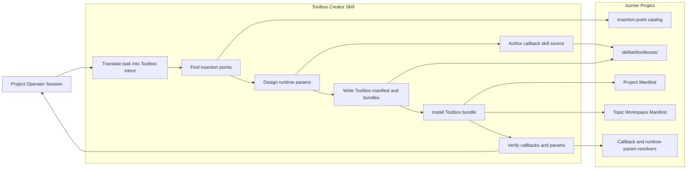
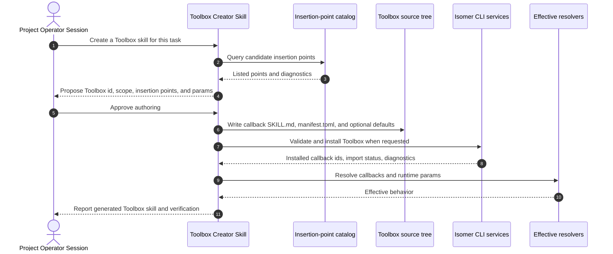

# Use Case 05: Author Toolbox Skill from Task Description

## Actor Goal

As a Project Operator Session, I want to describe a task in ordinary language and have the Toolbox Creator Skill write a Toolbox callback skill that fits the Toolbox pattern, so that the resulting Toolbox uses valid insertion points, runtime params, manifest entries, installation scope, and effective-behavior verification.

## Use Case

The user describes a behavior they want agents to perform, such as "make experiment agents classify evidence quality before benchmarking" or "make review agents reject claims without real hardware measurements." The Toolbox Creator Skill translates that task into a project-local Toolbox design. It finds suitable callback insertion points, decides whether the behavior needs configurable runtime params, authors callback skill source that instructs the owning agent how to query effective runtime-param values through `isomer-cli`, writes or updates the Toolbox manifest and optional default param bundles, installs the Toolbox when requested, and verifies that the callback and params resolve in the selected Project or Research Topic context.

## Supported Actions

### Translate Task into Toolbox Intent

The user describes the desired behavior without naming Toolbox files or callback insertion points.

- context
  - Actor **has** a task description, target workflow, or pain point but may not know which system skill should receive callback guidance.
  - System **has** canonical Toolbox language, callback insertion-point discovery, Toolbox manifest rules, runtime-param configuration, and Project or Research Topic scope selection.
- intent
  - Actor **wants** the agent to turn an ordinary task request into a Toolbox-shaped plan.
  - Actor **wonders** "Can this become a reusable Toolbox skill instead of a one-off note?"
- action
  - Actor then **asks** the skill to create a Toolbox skill for the described task.
- result
  - Actor **gets** a Toolbox intent summary with proposed `toolbox_id`, callback purpose, target workflow family, candidate insertion points, likely source files, optional runtime params, and scope recommendation.

### Discover and Choose Insertion Points

The user wants the new Toolbox skill to attach to the right owner workflow.

- context
  - Actor **has** a Toolbox intent and a rough target such as experiments, analysis, review, writing, or decision.
  - System **has** a catalog-backed callback insertion-point query and validation that rejects undeclared `<skill>/<point-inside-skill>` ids.
- intent
  - Actor **wants** the generated callback skill to run where it can influence the task at the right moment.
  - Actor **wonders** "Should this run at `begin`, `end`, or both?"
- action
  - Actor then **asks** the skill to find or choose insertion points.
- result
  - Actor **gets** a concise insertion-point map, such as `isomer-deepsci-experiment/begin` for setup guidance and `isomer-deepsci-review/end` for output checking, with short reasons tied to the task.

### Design Runtime Param Contract

The task needs configurable behavior instead of hard-coded callback text.

- context
  - Actor **has** behavior that may vary by Project, Research Topic, Topic Actor, or Topic Agent, such as strictness mode, required evidence class, retry count, output style, or checklist enforcement.
  - System **has** Toolbox runtime param definitions, default bundles, manifest-layer imports, explicit overrides, and effective resolution order.
- intent
  - Actor **wants** callback source that can branch on user-owned configuration.
  - Actor **wonders** "Can this Toolbox skill use a Project default but let one topic override it?"
- action
  - Actor then **asks** the skill to design runtime params for the generated Toolbox skill.
- result
  - Actor **gets** runtime param ids shaped as `<toolbox_id>:<key>`, value types, allowed enum values when needed, default values, and callback-source guidance that says when to query each param and how to branch on the selected value.

### Author Toolbox Callback Skill Source

The user asks the skill to write the actual callback material.

- context
  - Actor **has** selected insertion points and a runtime-param contract or has accepted that no params are needed.
  - System **has** the canonical Toolbox source layout under `skillset/toolboxes/<toolbox-id>/`, source-type rules, and the rule that `skill_dir` sources contain `SKILL.md`.
- intent
  - Actor **wants** the generated callback skill to be usable, scoped, and safe as supplemental instruction.
  - Actor **wonders** "What should the Toolbox skill tell the owning agent to do?"
- action
  - Actor then **asks** the skill to author the callback skill source.
- result
  - Actor **gets** a proposed or written `SKILL.md` that states its insertion-point role, keeps instructions supplemental to the owning system skill, queries runtime params through Isomer CLI when needed, branches on effective values, and reports conflicts or missing params without overriding higher-priority instructions.

### Write Manifest and Runtime Param Files

The user asks the skill to make the Toolbox source tree installable.

- context
  - Actor **has** callback source files and optional runtime-param defaults.
  - System **has** Toolbox manifest `[[callbacks]]`, `[[runtime_params]]`, and `[[runtime_param_bundles]]` declarations plus import-file schema rules.
- intent
  - Actor **wants** the files to validate as a Toolbox.
  - Actor **wonders** "What has to go in `manifest.toml`, and where do defaults live?"
- action
  - Actor then **asks** the skill to write or revise Toolbox files.
- result
  - Actor **gets** a `manifest.toml` with stable `toolbox_id`, callback entries for selected insertion points, runtime-param declarations when needed, optional default bundle declarations, and source paths that stay inside the Toolbox directory.

### Install and Verify Generated Toolbox

The user asks the skill to make the generated Toolbox effective.

- context
  - Actor **has** reviewed generated files and selected Project or Research Topic scope.
  - System **has** high-level Toolbox installation, runtime-param default import opt-in, callback resolution, runtime-param resolution, and Toolbox status gating.
- intent
  - Actor **wants** confidence that the generated Toolbox skill will be seen by the owning system skills.
  - Actor **wonders** "After installation, will the callback run and will it read the intended params?"
- action
  - Actor then **explicitly asks** the skill to install and verify the Toolbox.
- result
  - Actor **gets** installed callback ids, Toolbox registration status, runtime-param import status, skipped defaults if defaults were not enabled, effective callback resolution for selected insertion points, effective runtime-param values, and diagnostics.

## Main Flow

1. The user invokes the Toolbox Creator Skill from a Project Operator Session.
2. The user describes a task or behavior without needing to know the Toolbox schema.
3. The skill names the intended reusable behavior, proposes a stable `toolbox_id`, and explains whether the behavior belongs in one callback skill or several callback sources.
4. The skill discovers Project-visible callback insertion points and maps the task to a short list of `<skill>/<point-inside-skill>` ids.
5. The skill asks for or infers scope: Project-wide when the task is a stable project default, Research Topic when the behavior is topic-specific, and runtime-param specialization when Topic Actor or Topic Agent behavior differs.
6. The skill decides whether the behavior needs runtime params. If yes, it designs param ids, value types, defaults, allowed values, and branch behavior.
7. The skill drafts the callback source, usually a `skill_dir` with `SKILL.md`, and frames any CLI lookup as "query effective runtime params, then branch on selected values."
8. The skill writes or proposes the Toolbox source tree: `manifest.toml`, callback source directory, README notes, and optional runtime-param default bundle.
9. The skill validates insertion points, source paths, runtime-param declarations, default bundle paths, duplicate keys, old schema fields, and secret-like material.
10. The user approves installation scope and whether default runtime-param bundles should be imported.
11. The skill installs the Toolbox through the high-level Toolbox install path and uses runtime-param primitives only for explicit lower-level param work.
12. The skill verifies callback resolution and runtime-param effective values for the selected Project or Research Topic context.
13. The user leaves the interaction with a generated Toolbox skill, install status, verification output, and clear next actions for tuning params or changing scope.

## Alternative And Exception Flows

- If the task is too broad for one callback skill, the skill splits it into several callback sources with distinct toolbox-local keys and insertion points.
- If no relevant insertion point is visible, the skill reports the missing catalog entry, suggests explicit extension discovery or Project extension declaration, and stops before writing installable callback entries.
- If the task asks the callback to override system instructions, developer instructions, the owning system skill, evidence Gates, validation, or current user intent, the skill rewrites it as supplemental framing, checking, or reporting guidance.
- If the user wants Topic Agent-specific behavior, the skill uses runtime params for specialization and avoids installing callbacks at Topic Agent scope because callback registries currently support Project and Research Topic scope.
- If the task requires secrets, credentials, private benchmark datasets, or large source documents, the skill keeps those values out of manifests, callback bodies, README files, and runtime-param bundles.
- If the user wants defaults but not mutation, the skill writes the default bundle and manifest declaration but leaves import installation skipped until the user explicitly enables it.
- If installation reports same `toolbox_id` from a different source, the skill explains the source conflict and asks whether replacement is intended before using replacement behavior.
- If effective verification shows gated callbacks, the skill explains the Toolbox status or missing registration and suggests enable, reinstall, or scope correction.
- If the user only wants a draft, the skill stops after source and manifest proposals and does not install anything.

## Mermaid Flow Diagram

## Mermaid Sequence Diagram

## Durable Outputs

- A task-to-Toolbox design summary with chosen `toolbox_id`, scope recommendation, insertion points, runtime params, and source layout.
- A Toolbox callback skill source directory, commonly `skillset/toolboxes/<toolbox-id>/<callback-dir>/SKILL.md`.
- A `manifest.toml` with `[[callbacks]]`, optional `[[runtime_params]]`, and optional `[[runtime_param_bundles]]`.
- Optional default runtime-param bundle TOML files with `schema_version = "isomer-toolbox-runtime-params.v1"`.
- Optional installed Toolbox registration, callback records, and runtime-param import rows when the user approves mutation.
- Verification output covering installed callback ids, gated callbacks, selected runtime-param values, skipped defaults, and diagnostics.

## Example Prompt And Expected Visible AI Response

> **Warning:** The user/AI chat content below is for example purposes only. Implementations should learn its style, intent, and semantics rather than hardcoding the example content.

These examples show only the visible user prompt and the AI response content that should be returned to the user. Do not include hidden reasoning, chain-of-thought, scratchpad notes, private tool-selection deliberation, or thinking process in the AI response unless the user explicitly asks the skill to document that process.

### Event 001 - Draft a Toolbox Skill from a Task

> Time: `<example-time>` · Session: `Project Operator Session`

User Prompt:

> Use $toolbox-creator-skill to create a Toolbox skill for this task: before DeepSci experiment agents run benchmarks, they should classify the evidence plan as real measurement, proxy measurement, inference, or assumption. I want this to be strict by default, but one topic should be able to relax it.

AI (visible response):

> I will treat this as a Toolbox callback skill, not a new packaged system skill.
>
> Proposed Toolbox design:
>
> | Field | Value |
> | --- | --- |
> | `toolbox_id` | `evidence-quality` |
> | `callback_source` | `experiment-evidence-plan/SKILL.md` |
> | `primary_insertion_point` | `isomer-deepsci-experiment/begin` |
> | `runtime_param` | `evidence-quality:evidence/mode` |
> | `value_type` | `enum` |
> | `allowed_values` | `strict`, `relaxed` |
> | `default` | `strict` |
> | `scope_recommendation` | install at Research Topic scope first |
>
> The callback skill would query the effective `evidence-quality:evidence/mode` value before it gives guidance. In `strict` mode it should require real measurement or clearly label proxy evidence before benchmarks proceed. In `relaxed` mode it can permit proxy measurements when the callback asks the agent to record the limitation.
>
> If you approve, I would draft the Toolbox source files and manifest entry, then install only after you ask me to mutate the Project.

### Event 002 - Write, Install, and Verify

> Time: `<example-time>` · Session: `Project Operator Session`

User Prompt:

> Good. Write it under `skillset/toolboxes/evidence-quality`, install it for topic `cuda-kernel-study`, import the default params, and show me what resolves.

AI (visible response):

> I will write the Toolbox files, install the Toolbox at Research Topic scope for `cuda-kernel-study`, import the default runtime-param bundle, and verify both callback and param resolution.
>
> Expected report:
>
> | Field | Value |
> | --- | --- |
> | `toolbox_dir` | `skillset/toolboxes/evidence-quality` |
> | `installed_callback_id` | `evidence-quality:experiment-evidence-plan/begin` |
> | `resolved_insertion_point` | `isomer-deepsci-experiment/begin` |
> | `runtime_param_import_status` | installed |
> | `effective_param` | `evidence-quality:evidence/mode = strict` |
> | `scope` | Research Topic `cuda-kernel-study` |
> | `gating` | none unless Toolbox status or diagnostics report otherwise |

## Assumptions And Open Questions

- Assumption: The user's "task" describes supplemental behavior suitable for a Toolbox callback skill, not a new packaged system skill or executable tool.
- Assumption: Runtime params are queried by callback guidance through Isomer CLI or the equivalent Project runtime-param service; they are not automatically injected into callback text.
- Assumption: Research Topic installation is the safe default when the task names one research context or one experimental workflow.
- Assumption: Project-wide installation requires explicit confirmation because it affects all matching contexts.
- Open question: Should the generated callback source include concrete CLI command examples for querying params, or should it refer to the runtime-param service abstractly until the final skill packaging is chosen?
- Open question: Should the skill scaffold a README for every generated Toolbox, or only when the user asks for durable documentation?
